# Merge MVP backlog

This backlog splits the Merge MVP work left after the in-flight sign-in branch into 60 tasks. Each task is sized for one Claude Code session and one PR. Owner-only decisions and operations are listed separately. To assign a task, paste its **Agent prompt** into a fresh Claude Code session; each prompt is self-contained and names its branch. Start a task only when everything under its **Depends on** has merged to main. That list includes the zone-order edges, so it's the only start gate. For build and research tasks, every owner decision the card names (D-NN) must read **Decided** in the table below. Design tasks may settle theirs with the owner while brainstorming, before they build. Tasks in the same wave share no serialized conflict zone (this was checked mechanically), so they can run in parallel. Where two tasks touch a parallel-safe zone, they follow that zone's merge rule in [Conflict zones](#conflict-zones). The owner commits this file to main as `docs/mvp-backlog.md` (O-00), and every prompt reads decisions from there. Repo state was checked read-only on 2026-10-08: the sign-in branch `claude/first-ride-carpool-504811` is at `7fba72c` (plan Tasks 1–3 done, with hosted-schema types generated), local `main` is at `5ef0db4`, and `origin/main` is at `dc5e650` (M-01's research doc).

## How agents work these tasks

Every agent prompt repeats these rules, so each prompt works on its own:

- **Branch and PR.** Work in your own git worktree, on the branch the prompt names, cut from the latest `origin/main`. One task is one PR to main, titled with its task ID first ("M-27: …"). Stage files by path, and change only the files the prompt lists. Before starting, check with `git log origin/main` that the prompt's prerequisites have merged.
- **Process.** *Build* tasks follow an existing approved spec, or the prompt itself. *Design-then-build* tasks run the superpowers **brainstorming** skill, write a spec to `docs/superpowers/specs/YYYY-MM-DD-<slug>-design.md`, and stop for the owner's approval. They then write a plan with **writing-plans** at `docs/superpowers/plans/YYYY-MM-DD-<branch name after the slash>.md` (unique per task), and implement it with **subagent-driven-development** and **TDD**. *Research* tasks write one decision doc in `docs/research/` and change no code.
- **Checks.** Code PRs must pass `npm run typecheck` and `npm test` (node:test via tsx). Tested logic lives in pure modules that don't import react-native, expo or `src/lib/supabase.ts`. DB tests run **only in CI**: this machine has no container runtime, so push the branch and read the GitHub Actions `database` job. Check UI on the Expo web build (`npm run web`) and attach screenshots.
- **Secrets.** Agents never handle secrets. The owner runs `supabase login`, `link` and `db push`, and handles dashboard settings, Edge Function deploys and secrets, EAS credentials, store accounts and API keys. The owner also creates `apps/mobile/.env` in an agent's worktree for connected-mode checks; agents never create, edit or print it. In connected-mode tests, the owner types the emailed code.
- **Migrations.** Each DB task has a planned number (see [Migration numbers](#migration-numbers)), and the number becomes final at merge: on the last rebase, a PR renames its own file to one above the highest number on main if needed. CI fails a PR whose new migration isn't above every number on main. 0003 stays First Ride's. Commit the regenerated `database.types.ts` from your branch's CI artifact, never by hand.
- **Prototype mode.** The app must keep running with an empty `apps/mobile/.env`, on mock data with no sign-in. Simulator controls are labeled "Prototype". Once a feature is wired to Supabase, its simulators render only in prototype mode.
- **Decisions.** Owner decisions live in the table below, and only a row whose Status reads **Decided** counts. A suggested default isn't a decision until the owner marks the row. Build tasks stop and ask when they need an open decision. Design tasks may settle one with the owner while brainstorming, then ask the owner to mark the row. `[bracketed]` values in the UI are open decisions, so never invent them.
- **Privacy invariants.** Exact origin, destination and pickup points never reach another client. Before a ride is confirmed, others see only first name and last initial, role, approximate (~0.5 mi) areas, ride preferences and verification flags. The UI never shows who said "no", or tells "no" apart from "not answered". Blocked pairs and suspended members never appear to each other.

## Owner decisions and ops

Only the owner can do these. Agents stop and ask when they reach one. Decisions are D-NN and operational steps are O-NN. **Status** is the only field agents treat as binding. When the owner decides, they change Status to "Decided YYYY-MM-DD" and replace the suggested default with the decided text.

| ID | Decision or action | Status | Blocks | Suggested default |
| --- | --- | --- | --- | --- |
| D-01 | **Ride-completion rule.** How a confirmed ride becomes `completed` or `cancelled`, whether a no-show counts, which participant actions exist, and when the post-ride prompt appears. It has to work without live tracking. | Open. A relayed "ride mode" variant (R1) is pending confirmation. | M-37, and through it M-44, M-45, M-47, M-49, M-55a and the rest of the critical path | The ride auto-completes 2 hours after `pickup_time` unless it was cancelled, with status computed when it's read (no cron). Either rider can mark "This ride didn't happen" within 24 hours, which cancels the ride and discards its feedback. The post-ride prompt appears once the ride is completed. If the owner picks R1 instead, these cards change: M-14 and M-22 (expo-location config), M-29 (joins the app-config zone after M-31), M-37 (pickup and arrival columns, real-device check on a dev build from M-14), M-43 and M-47 (a "Picked up" button), M-11 and O-10 (location-use and foreground-service declarations). |
| D-02 | **Request timing and limits.** The driver's reply cutoff, when pending requests expire, the cancellation cutoff, what a late cancel or "Can't drive" means, the invitation rate limits, and how many confirmed rides a person can hold per date. | Open. A relayed proposal (R2) matches the default and adds two rules. | M-27, M-32, M-35, M-37, M-47, M-54a | Drivers reply by 8 PM the evening before, and pending requests expire then. Riders cancel by 9 PM the evening before. Later cancels are allowed and recorded privately, with no penalty in the pilot. Limits: 10 requests sent per day, 5 pending at once, 1 pending per recipient. At most one confirmed ride per person per date; confirming withdraws that person's other pending invitations for the date, which the other people see as "No longer available". All cutoffs use America/Los_Angeles. |
| D-03 | **Trust metrics** on Match detail and driver request: which stats show, how each is computed, and the minimum sample. | Open | M-49, M-54a | Show completed rides given and taken (rides marked "didn't happen" don't count) and "Member since" (month). Drop the on-time rate, which has no data source without tracking. Show "New to Merge" at zero rides. |
| D-04 | **Cargo limits.** What "medium foldable scooter" means (folded size and weight), what drivers declare about trunk space, and how approval works. | Open | M-18, M-21, M-35, M-43, M-54a | These numbers are placeholders to confirm. One scooter per passenger, folded within 120 × 50 × 60 cm and 20 kg (44 lb). The driver declares whether the trunk fits one, and approves each request at confirmation. |
| D-05 | **Women-only preference.** Whether it ships in the pilot. If it does: who may set it, how it's attested and stored, and the legal review it needs. | Open | M-18, M-26, M-34, M-54a | Hide the chip for the pilot and store no gender data. Revisit after D-12. |
| D-06 | **Verification and vetting.** What the pilot checks, for which role, the badge wording, what's displayed, and **whether vetting gates anything**: may an unvetted person appear in discovery as a driver, or confirm a ride as one? M-02 provides input. | Open. A relayed proposal (R3) matches the default. | M-26, M-32, M-49, M-54a, M-56 | No ID vendor. The owner vets each driver (license and insurance, seen in person or on video) and sets `profiles.vetted_at` (service role only, M-56). Gate: an unvetted person can't appear as a driver in discovery or confirm a ride as the driver. Badge: "License & insurance checked by Merge". The earlier draft's wording, "Vetted by the Merge pilot team", reads like a safety guarantee. Hide the ID, work email and vehicle rows. |
| D-07 | **Safety report handling and member removal.** Who reads reports, how quickly, what leads to removal, the removal steps, and what reporters are told. | Open | M-24, M-53, M-56 | The owner checks reports daily (dashboard plus a safety@ alias) and replies within 24 hours. Reporters first see "In immediate danger? Call 911." Removal: set `profiles.suspended_at`. Its trigger (M-56, M-32) hides the person everywhere, withdraws their pending invitations, cancels their future rides (the other rider sees only "Ride cancelled"), and ends their Crews. Then ban the user in Supabase Auth so they can't sign in again. A ban alone isn't enough: the app's existing session keeps working until it expires. |
| D-08 | **Map, geocoding and routing provider**, chosen after reading M-01. The owner creates the keys. | Open. Recorded but unconfirmed: `docs/research/2026-10-08-m01-map-provider.md` on main (`dc5e650`) says the owner chose this outcome. Mark Decided to confirm it. | M-22, M-26 (detour method), M-29, M-33 | The recorded outcome: MapLibre (`@maplibre/maplibre-react-native` on native, `maplibre-gl` in `BayMap.web.tsx` on web) with Stadia Maps tiles only. No geocoding provider: people place a pin and name the area. No routing provider: detour is the doc's geometric estimate, built in M-26, with real routing (M-33) left for later. Attribution on every map. |
| D-09 | **Lockfile policy.** Commit `package-lock.json` and switch CI to `npm ci`. This reverses the in-flight plan's "don't commit it" rule; the lockfile is untracked today. | Open (relayed as decided, R4) | M-03, and every PR that adds a dependency | Commit it and use `npm ci`. M-03 makes the change after O-01; the sign-in branch leaves the lockfile untracked. |
| D-10 | **App identity.** Store name, iOS bundle ID and Android package (permanent after the first upload), publisher (individual or organization), iPhone only. Today `app.json` has no `ios.bundleIdentifier` and has `supportsTablet: true`. | Open | M-14 (final values; placeholders are fine until the first store build), O-06, O-08 | Keep "Merge" until a listing is needed. Use reverse-DNS IDs on a domain the owner controls. Individual account for the pilot. iPhone only. |
| D-11 | **Pilot access and distribution.** Cohort size, who can sign in, how builds reach testers, and whether the sign-in error may reveal that an email isn't enrolled. | Open (relayed as decided, R4) | M-12, M-41, M-53, O-05, O-10 | Up to 100 testers. Sign-ups off, and the owner adds each tester in Supabase. TestFlight external testing on iOS, Play internal testing on Android. The invite-only error ("This email isn't on the Merge pilot list yet") is acceptable for a closed pilot, even though it tells anyone whether an email is enrolled. |
| D-12 | **Legal, insurance, regulatory, HOV and age review**, with counsel. Covers: staying a free carpool outside California TNC rules, the insurance position, Terms disclaimers, minimum age, HOV copy, privacy and accessibility obligations, and whether a recorded Terms acceptance is required. | Open | M-40, M-46, M-54a, pilot start | 18+. No payment between riders. The Terms say Merge doesn't provide transportation. HOV copy never promises eligibility or time savings. No stored acceptance record unless counsel asks for one (App Store 5.1.1(i) needs only the in-app links). |
| D-13 | **Pilot coordination and notifications.** Whether to ship in-app ride messages, and whether to ship push notifications and for which events. | Open. A relayed proposal (R5) adds message pushes. | M-38, M-39, M-45, M-50 | Ship ride-scoped text messages after confirmation. Ship push for: new request, confirmed, cancelled or can't drive, Crew proposal, and the post-ride prompt. Never send a push for a decline, an expiry or any other "no". |
| D-14 | **Discovery default.** The prototype defaults "Show me in discovery" to on (`state/commute.tsx:37`). The DB defaults `discovery_opt_in` to false (`0001_initial.sql:8`), and docs/mvp.md requires opt-in. | Open. A relayed proposal (R6) adds an onboarding screen. | M-18, M-26, M-34 | Off until the person turns it on, in both modes. |
| D-15 | **Account-deletion data policy.** Whether to cascade or anonymize the rides, feedback, connections, Crews and messages a deleted person shared with someone else, and how long safety reports are kept. | Open | M-17a (and through it nearly all DB work), M-17b, M-40 | Delete everything the person owns. Keep shared rides for the other rider, shown as "Former member". End open Crews. Keep safety reports for 12 months with the user reference cleared. |
| D-16 | **Request negotiation and how requests end.** "Suggest a change" (counter-proposals), the passenger-chosen exact spot ("Move"), driver-initiated invites, and what a requester sees when a request is declined. | Open. A relayed proposal (R7) adds a server check. | M-27, M-32, M-35, M-36, M-43, M-54a | Keep driver invites: the passenger accepts, then the driver confirms the seat and sets the spot. Cut "Suggest a change" and "Move" for the pilot: a request carries the pickup area and time, and the driver sets the exact spot and a note when confirming. A declined request looks the same as an expired one ("No longer available"). |
| D-17 | **Error reporting.** Add Sentry (a new data processor), or rely on tester reports. | Open | M-31 | Add Sentry with PII scrubbing and no session replay. |
| D-18 | **Security disclosure channel.** CONTRIBUTING.md:11 says "contact the maintainers privately" but names no channel. | Open (relayed as decided, R4) | M-03 | Turn on GitHub private vulnerability reporting (an owner repo setting). |
| D-19 | **Contact sharing** between riders. New, from a relayed proposal (R8). | Open (proposal only) | M-55a, M-55b | No default from this backlog. The relayed proposal is a mutual opt-in exchange of phone and/or email after a confirmed ride (24 h window) or a Ride Again connection, revoked by a block, connection loss or deletion (details in M-55a). Without a yes, M-55a and M-55b stay unscheduled. |
| D-20 | **Confirm the pilot cuts.** The list under [Proposed cuts (D-20)](#proposed-cuts-d-20): some come from docs/mvp.md, and others were the drafter's own calls, such as the navigator, the custom font, staging, EAS Update and Keychain session storage. | Open | M-54a (`docs/ui.md` "Not built yet"), and any task that would build a cut item | Confirm each cut as listed, with its reason. |
| D-21 | **First Ride spec amendment.** M-20 keeps First Ride state in a new `state/firstRide.tsx`, not in `state/commute.tsx` as the approved spec says (line 128), so the onboarding work can own `commute.tsx`. | Open | M-20 | Approve the amendment. M-20 edits that one spec bullet. |
| O-00 | **Publish this backlog.** Commit it to main as `docs/mvp-backlog.md` and keep the Status column current. In GitHub branch protection for main, require the CI checks and "Require branches to be up to date before merging", so the migration-order check always runs against the latest main. | n/a | Every task (prompts read decisions from that file) | n/a |
| O-01 | Finish the in-flight sign-in plan and merge `claude/first-ride-carpool-504811` to main. The plan's owner checkpoints are: CLI login and link, approving the 0001/0002 push, dashboard email settings, and typing the code during end-to-end testing. Also check that a brand-new address gets a code, not a link. If a link arrives, paste `{{ .Token }}` into the hosted "Confirm signup" template during this dashboard step. O-01 doesn't wait for M-12, which later commits a matching `supabase/templates/confirmation.html`. | Plan Tasks 1–3 done (`7fba72c`); Tasks 4–9 to go | All of Wave 1 onward (see the early-start note in [Waves](#waves)) | n/a |
| O-02 | **Hosted push gate**, after each DB PR merges. Review `supabase migration list` and `supabase db push --dry-run`, approve, push, run the Security Advisor, and note the result on the PR. Main's migrations are always in ascending merge order (M-03's check), so pushing main as-is keeps the hosted order equal to CI's. Never use `--include-all`: if the dry run lists a version below the hosted maximum, stop and investigate. | n/a | Connected-mode checks of every DB-backed task | Push in batches when a wiring task needs it. |
| O-03 | Register a domain, set up support@, privacy@, safety@ and security@ mailboxes, and host static pages (for example GitHub Pages). | n/a | O-04, M-40, M-53, O-10 | n/a |
| O-04 | **Custom SMTP** (a pilot blocker). Choose a provider, set up SPF, DKIM and DMARC, enter the SMTP settings, raise the auth email rate limit (the config default is `email_sent = 2` per hour), paste in M-12's templates, and test delivery to Gmail, iCloud and a work address. | n/a | Pilot start; connected-mode checks from M-17b onward, unless O-14 is done | Resend or Postmark. |
| O-05 | **Supabase production settings.** Pro plan with a spend cap (daily backups, no pausing), sign-ups off per D-11 (after the owner's and test accounts exist), Site URL, OTP rate limits, MFA on the account, anonymous and phone sign-in off. | n/a | M-41 testing, pilot start | n/a |
| O-06 | **Accounts with 2FA.** Apple Developer Program, Google Play Console, Expo, and the App Store Connect and Play app records with the D-10 IDs. Turn on 2FA for Supabase, GitHub, the registrar and SMTP too. | n/a | O-07, O-08, O-10 | Start Apple enrollment early, because it can take days to weeks. |
| O-07 | Run `eas init` (an agent can commit the resulting `app.json` diff). Set the EAS environment variables (`EXPO_PUBLIC_SUPABASE_*`, the map display key, Sentry DSN), set up signing credentials, make the first builds, and run `eas submit`. | n/a | Device checks for M-22, M-38, O-12 | Back up the Android upload keystore. |
| O-08 | **Keys and credentials:** the map display key (D-08), a geocoding key only if D-08 adopts one, a routing secret only if M-33 is scheduled, an APNs key and an FCM v1 service account (via EAS), a Sentry project (D-17), and an Expo push access token. | n/a | M-22 (real tiles), M-31, M-33, M-38, M-45 | Restrict every key to the app IDs. |
| O-09 | **Deploy Edge Functions and secrets** (delete-account, review-sign-in, notify, and compute-detour only if M-33 runs). Enable a cron schedule if M-37 needs one, Realtime on messages if M-39 needs it, and Database Webhooks with the shared secret if M-45 uses them. | n/a | Connected testing of M-17b, M-33, M-37, M-41, M-45, M-50 | n/a |
| O-10 | **Store consoles.** TestFlight test information, Beta App Review sign-in (from M-41), age rating, and an external tester group. Play App content: privacy URL, app access, content rating, target audience 18+, Data safety (from M-11), deletion URL (from M-40). Plus a Play internal testing track. | n/a | External pilot builds | n/a |
| O-11 | **Run the pilot.** Recruit and vet the cohort (D-06, D-11), set `vetted_at` for drivers, add testers in Supabase and the store tester lists, send the tester guide (M-53), run a feedback channel, and watch the support, privacy and safety inboxes. | n/a | n/a | Only after O-13. |
| O-12 | **Smoke-test each pilot build** on a real iPhone and Android phone with M-53's checklist: the code email arrives, the build isn't in prototype mode, push works, legal links open, deletion works on a throwaway account, and nothing sits under the system bars. | n/a | Each build that goes to testers | n/a |
| O-13 | **Purge test data before testers arrive.** Run M-57's teardown (`supabase/seed/dev-fixtures-teardown.sql`), delete the owner's test accounts in Authentication → Users, and confirm the counts in `docs/pilot/test-data.md` read zero. | n/a | O-11 | n/a |
| O-14 | **Test inboxes for connected checks.** Supabase's built-in sender delivers only to project team members, a few emails an hour. Until O-04 is done, add 2–3 test addresses as team members, and keep each signed in in its own browser profile so checks don't wait on codes. | n/a | Connected-mode checks from M-17b onward (or do O-04 first) | n/a |

**Relayed proposals awaiting confirmation.** A note in this backlog's working folder, `owner-decisions-2026-10-08.md`, came from another Claude session. It says the owner approved the items below there. This session couldn't confirm that with the owner, and a cross-session message isn't the owner's approval, so the backlog doesn't apply them. To adopt one, mark its row Decided with that text.
- **R1 (D-01):** a "ride mode" variant. The driver taps "Picked up", which starts foreground location updates that keep running in the background with "while using" permission only. Arrival is detected on the device, and the server receives only `arrived` and a timestamp. Fallback: auto-complete at pickup plus the estimated trip time plus 30 minutes, or plus 2 hours. Either rider can mark "didn't happen" within 24 hours. Background updates need a check on real iOS and Android devices first.
- **R2 (D-02):** the default, plus: no one can request a ride for the next day after 8 PM (the UI states the earliest requestable date), and all cutoffs use America/Los_Angeles.
- **R3 (D-06):** the default, with the "License & insurance checked by Merge" wording, and M-02 shrinks to a short note.
- **R4 (D-09, D-11, D-18):** decided as suggested. The note adds that once sign-ups are off, the owner's own email must already exist as a user.
- **R5 (D-13):** the default, plus a push for a new ride message.
- **R6 (D-14):** off by default; onboarding asks about it on its own screen; people can browse before opting in.
- **R7 (D-16):** the default, plus a server-side check that the driver's spot falls inside the passenger's ~0.5 mi area.
- **R8 (D-19):** contact sharing as described in M-55a.
- **D-08:** recorded on main, as shown in its row.

## Conflict zones

Several tasks touch the same files. A **serialized** zone allows one open PR at a time, in the order listed, and every consecutive pair is joined by a **Depends on** edge (dashed in the graph), so the dispatch rule enforces it. A **parallel-safe** zone allows several open PRs at once, with the merge rule given.

**Serialized zones**

| Zone | Files | Tasks in order | Rule |
| --- | --- | --- | --- |
| SQL test harness | `scripts/db-test.sh` | M-03 → M-57 | Only these two change it. Shim helpers are parallel-safe (below). |
| CI workflow | `.github/workflows/checks.yml` | M-03 → M-17b (Deno steps) → M-54a (placeholder step) | One PR at a time. M-40 adds its own workflow file. |
| App config | `apps/mobile/app.json`, `apps/mobile/eas.json` | M-14 → M-22 → M-31 → M-38, then O-07's projectId commit (if R1 is adopted, M-29 joins after M-31) | One PR at a time. |
| App root providers | `App()` in `App.tsx` | M-10 → M-20 → M-31 → M-38 | One PR at a time. |
| Launch gate and auth | `AuthGate` and `Router` in `App.tsx`, `src/lib/authRules.ts`, `src/state/auth.tsx`, `src/lib/supabase.ts` | M-12 → M-17b → M-25 → M-38 → M-41 → M-46 | One PR at a time. M-46 enters only on its recorded-acceptance path, but it's ordered last either way. |
| Commute state | `src/state/commute.tsx` | M-21 → M-29 → M-34 | One at a time. M-15 doesn't touch it. |
| First Ride state | `src/state/firstRide.tsx` (created by M-20) | M-20 → M-28 → M-44 → M-48 | One at a time. |
| Screen files | `src/screens/*` | See the [screen lock table](#screen-lock-table) | At most one open PR per screen file. New screens go in new files. |
| Shared components | `Screen.tsx`, `TabBar.tsx`, `AccountSheet.tsx`, the map component, other components | `Screen.tsx`: M-10 → M-51. `TabBar.tsx`: M-10 → M-23 → M-30 → M-36 → M-51. `AccountSheet.tsx`: M-10 → M-17b → M-51. `BayMap.tsx` / `map/`: M-22 → M-51. Every other component: its creator → M-51 | One open PR per file. New components go in new files. M-51 starts after every UI task. |
| Mock data | `src/data/mock.ts` | M-13 → M-22 → M-54a | One at a time. Other tasks add their own mock files, such as `data/mockTrips.ts`. |
| Product docs | `README.md`, `docs/mvp.md`, `docs/ui.md` | README: M-09 → M-53. `docs/mvp.md` and `docs/ui.md`: M-09 → M-54a | One PR at a time per file. New docs go under `docs/pilot/`, `docs/privacy/` or `docs/research/`. |
| Privacy inventory | `docs/privacy/data-inventory.md` | M-11 → M-31 (processor row) → M-55a (if scheduled) | One at a time. |
| Seed files | `supabase/seed/*` | M-57 → M-41 | One at a time. These files must never be under `supabase/migrations/`. |
| Data-layer feature files | `src/lib/data/rides.ts`, `matches.ts`, `inbox.ts` | `rides.ts`: M-43 → M-47. `matches.ts`: M-42 → M-49. `inbox.ts`: M-36 → M-49 | One at a time per file. |
| First Ride spec | `docs/superpowers/specs/2026-10-08-first-ride-design.md` | M-20 (one bullet, per D-21) | No other task edits approved specs. |

**Parallel-safe zones**

| Zone | Files | Rule on a rebase conflict |
| --- | --- | --- |
| Migrations | `supabase/migrations/*` | Each PR adds only its own file. On your last rebase, if main has a migration numbered at or above yours, rename yours to one above the highest on main. CI (M-03) fails anything else. No migration merges before M-04's `0003`. Before `create or replace` on an existing function, copy its latest definition from the highest-numbered migration that defines it. |
| Generated types | `apps/mobile/src/lib/database.types.ts` | Never merge by hand. After rebasing, download the `database-types` artifact from your branch's latest CI run and commit it. |
| Account-deletion tests | `supabase/tests/account_deletion_<slug>_test.sql` | One file per task, each with its own fixture, so there's nothing to merge. M-17a owns `account_deletion_test.sql`. |
| Test-shim helpers | `scripts/db-test/auth-shim.sql` | Append-only; keep both sides. A migration must never depend on a shim-only object. |
| Route registry | the `Route` union in `src/navigation.tsx`; the `renderRoute` switch and the import block in `App.tsx` | Append at the end and keep both sides. M-10 moves the union's closing `;` onto its own line first, so appends never collide on the last member. Only the task named here changes an existing route's params: M-28 (`request` gets `kind`), M-35 (`request` gets optional `rideDate`, including its `renderRoute` case), M-34 (`commute` and `preferences` get `mode`, including their cases). Route adders: M-20, M-21, M-23, M-24, M-28, M-30, M-50. |
| Dependencies | root `package.json`, `apps/mobile/package.json`, `package-lock.json` | Keep both dependency (or script) lines in a `package.json`. For the lockfile, take main's and re-run `npm install`; never hand-merge it. Adders: M-03 (creates the lockfile; M-10 merges after it), M-10, M-14, M-15, M-19 (only if it adds a library), M-22, M-29 (only if D-08 adopts geocoding), M-31, M-38. |
| Data-layer index | `src/lib/data/` index and shared type files (created by M-19) | Append-only; keep both sides. Each wiring task adds its own `lib/data/<feature>.ts`. |
| CLI config functions | `[functions.<name>]` sections at the end of `supabase/config.toml` | Append-only; keep both. M-12 is the only task that edits other sections (the email templates). Appenders: M-17b, M-33, M-41, M-45. |
| Edge Functions | `supabase/functions/<name>/` | One directory per task. The owner deploys and sets secrets (O-09). |
| Theme tokens | `src/theme.ts` | Any task may append a new token (keep both sides). Only M-51 changes an existing token's value. |

### Migration numbers

`0001` and `0002` exist, and `0003` is reserved for First Ride (auth spec, line 44). The numbers below are planned in dependency order, with decision-gated and conditional migrations at the end of the band so they don't hold anything up. They're a guide: the final number is set at merge time by the rule above, so a late migration never blocks an earlier-ready one. "If needed" means no file at all when the design needs no SQL.

| Planned | File | Task | Gated by |
| --- | --- | --- | --- |
| 0003 | `0003_first_ride.sql` (fixed) | M-04 | none |
| 0004 | `0004_vehicles_commutes_rls.sql` | M-05 | none (merges after M-04) |
| 0005 | `0005_member_status.sql` | M-56 | D-06, D-07 |
| 0006 | `0006_account_deletion.sql` | M-17a | D-15 |
| 0007 | `0007_blocks_reports.sql` | M-06 | none |
| 0008 | `0008_commute_details.sql` | M-18 | D-04, D-05, D-14 |
| 0009 | `0009_profile_cards.sql` | M-16 | none |
| 0010 | `0010_matching.sql` | M-26 | D-05, D-06, D-08, D-14 |
| 0011 | `0011_invitations.sql` | M-27 | D-02, D-16 |
| 0012 | `0012_booking.sql` | M-32 | D-02, D-06, D-16 |
| 0013 | `0013_push_tokens.sql` | M-38 | D-13 |
| 0014 | `0014_messages.sql` | M-39 | D-13 |
| 0015 | `0015_review_cohort.sql` (if needed) | M-41 | D-11 |
| 0016 | `0016_terms_acceptance.sql` (only if D-12 requires a record) | M-46 | D-12 |
| 0017 | `0017_ride_lifecycle.sql` | M-37 | D-01 |
| 0018 | `0018_notification_triggers.sql` (if needed) | M-45 | D-13 |
| 0019 | `0019_trust_signals.sql` | M-49 | D-03, D-06 |
| 0020 | `0020_detour_cache.sql` (only if D-08 picks a routing API) | M-33 | D-08 |
| 0021 | `0021_contact_sharing.sql` (only if D-19 is yes) | M-55a | D-19 |
| 0022 | `0022_security_fixes.sql` (always last) | M-52 | every migration above |

Dev fixtures (M-57) are not migrations. They live in `supabase/seed/` and are never pushed.

### Screen lock table

At most one open PR per screen. Each arrow is also a **Depends on** edge.

| Screen file | Tasks in order |
| --- | --- |
| `WelcomeScreen.tsx` | M-10 → M-13 → M-54a → M-54b |
| `CommuteScreen.tsx` | M-15 → M-22 → M-29 → M-34 → M-54a → M-54b |
| `PreferencesScreen.tsx` | M-21 → M-34 → M-54a → M-54b |
| `DiscoverScreen.tsx` | M-10 → M-22 → M-42 → M-54a → M-54b |
| `MatchDetailScreen.tsx` | M-10 → M-24 → M-28 → M-35 → M-42 → M-49 → (M-55b) → M-54a → M-54b |
| `RequestRideScreen.tsx` | M-13 → M-28 → M-35 → M-54a → M-54b |
| `BookedScreen.tsx` | M-10 → M-13 → M-20 → M-43 → M-47 → M-50 → M-54a → M-54b |
| `DriverRequestsScreen.tsx` | M-10 → M-13 → M-23 → M-36 → M-47 → M-50 → M-54a → M-54b |
| `DriverRequestScreen.tsx` | M-13 → M-24 → M-36 → M-49 → M-54a → M-54b |
| `DriverConfirmScreen.tsx` | M-13 → M-43 → M-54a → M-54b |
| `VehicleScreen.tsx` (new) | M-21 → M-34 → M-54a → M-54b |
| `TripsScreen.tsx` (new) | M-23 → M-35 → M-47 → M-54a → M-54b |
| `ProfileScreen.tsx` (new) | M-30 → M-34 → M-46 → M-54a → M-54b |
| `PostRideScreen.tsx`, `PostRideThanksScreen.tsx` (new) | M-20 → M-44 → M-54a → M-54b |
| `RideAgainScreen.tsx` (new) | M-28 → M-44 → (M-55b) → M-54a → M-54b |
| `CrewSetupScreen.tsx`, `CrewScreen.tsx` (new) | M-28 → M-48 → M-54a → M-54b |
| `ReportScreen.tsx`, `BlockedPeopleScreen.tsx` (new) | M-24 → M-54a → M-54b |
| `ConfigErrorScreen.tsx` (new) | M-25 → M-54a → M-54b |
| `SignInScreen.tsx` (in flight) | M-46 → M-54a → M-54b |
| `TermsUpdateScreen.tsx` (new, only if D-12 requires a record) | M-46 → M-54a → M-54b |
| `MessagesScreen.tsx` (new) | M-50 → M-54a → M-54b |
| Other in-flight screens (`VerifyCode`, `ProfileName`, `Loading`) | M-54a → M-54b |

Tasks in parentheses are conditional. When one is scheduled, the next task in the chain waits for it.

## Waves

A wave is the dependency depth: a task sits one wave after the latest task it depends on. Every task in a wave can run in parallel with the others in that wave. They share no serialized zone, which was checked mechanically from the dependency lists and zone memberships. DB tasks in one wave each add a migration, and the merge-time numbering rule keeps them apart.

**Wave 0: in flight, plus research** (2 tasks): M-01, M-02. Wave 0 is the in-flight sign-in plan, `docs/superpowers/plans/2026-10-08-supabase-auth.md` (spec `2026-10-08-supabase-auth-design.md`): 0002 and the DB test harness, the CLI and generated types, `authRules` and `npm test`, `AuthProvider`, the sign-in screens, the launch gate, `AccountSheet`, docs, and Expo web. Tasks 1–3 are done on `claude/first-ride-carpool-504811` (`7fba72c`). Tasks 4–9 remain, then O-01 merges it. Main doesn't have 0002, the harness, the auth spec or plan, or the First Ride spec yet. **M-01** is done (on `origin/main`). **M-02** can run now, because it reads only files already on main. Owner, now: O-00; settle D-09, D-11 and D-18 (Wave 1 needs them); confirm or change D-08; start O-03 and O-06.

**Wave 1: foundations** (8 tasks): M-03, M-04, M-05, M-07, M-08, M-10, M-11, M-12. All in parallel. **Early start:** tasks here that touch none of the in-flight files (M-04, M-05, M-07, M-08, M-11) may branch from the sign-in branch tip before O-01, if the owner adds a line to the prompt allowing it. After O-01 they rebase with `git rebase --onto origin/main <their base commit>`, and they open PRs only after that. M-07 and M-08 are already in progress this way; M-04, M-05 and M-11 have worktrees. M-03, M-10 and M-12 touch in-flight files and must wait for O-01. M-10 merges after M-03 (lockfile), and M-05 merges after M-04 (0003). Owner: decide D-15 (M-17a) and D-06/D-07 (M-56) during this wave.

**Wave 2** (7 tasks): M-09, M-13, M-14, M-15, M-17a, M-19, M-56. All in parallel. M-17a and M-56 both add migrations; the merge-time numbering rule keeps them apart. Owner: decide D-04, D-05 and D-14 (M-18), and confirm D-08 (M-22).

**Wave 3** (7 tasks): M-06, M-17b, M-18, M-20, M-22, M-23, M-40. All in parallel. M-20 and M-23 append routes (parallel-safe). Owner: decide D-02 and D-16 (M-27), D-07 copy (M-24) and D-17 (M-31).

**Wave 4** (6 tasks): M-16, M-21, M-24, M-25, M-26, M-31. All in parallel. M-21 and M-24 append routes.

**Wave 5** (5 tasks): M-27, M-28, M-29, M-30, M-33 (conditional). All in parallel. M-33 runs only if D-08 picks a routing API.

**Wave 6** (4 tasks): M-32, M-34, M-35, M-38. All in parallel. Connected-mode wiring starts. The owner keeps O-02 current, and needs O-14 (or O-04) for sign-ins. Owner: settle D-13 with M-38 while it brainstorms, and decide D-01 before Wave 7.

**Wave 7** (4 tasks): M-36, M-37, M-39, M-57. All in parallel. M-37 brainstorms D-01 with the owner and builds nothing until that row reads Decided.

**Wave 8** (6 tasks): M-41, M-42, M-43, M-44, M-45, M-55a (conditional). All in parallel. M-55a runs only if D-19 is yes.

**Wave 9** (5 tasks): M-46, M-47, M-48, M-49, M-53. All in parallel.

**Wave 10** (3 tasks): M-50, M-52, M-55b (conditional). All in parallel. M-55b runs only if D-19 is yes, and M-52 waits for it and for M-33 if they're scheduled.

**Wave 11** (2 tasks): M-51, M-54a. M-51 (components and theme) and M-54a (screens, mock data, docs) touch different files, so they run in parallel. Owner: D-03, D-12 and D-20 must be Decided for M-54a.

**Wave 12** (1 task): M-54b. M-54b runs alone, because it touches every screen. Then come the pilot gates: O-13, O-10, O-11 and O-12.

**Critical path (Waves 1–12, no slack):** O-01 → M-04 → M-17a (**D-15**) → M-06 and M-18 (**D-04, D-05, D-14**) → M-16 and M-26 (**D-06, D-08**) → M-27 (**D-02, D-16**) → M-32 → M-37 (**D-01**) → M-44 → M-47 → M-50 (**D-13**) → M-51 → M-54b.
- D-01 gates M-37 and everything after it on this path: M-44, M-45, M-47, M-48, M-49, M-50, M-51, M-52, M-53, M-54a, M-54b and M-55a. Nothing before Wave 7 waits for it.
- D-15 gates M-17a, which every DB task from Wave 3 on depends on.
- D-08 also gates the map chain M-22 → M-29 → M-34 → M-42 → M-49. That chain has three waves of slack: M-22 can start as late as Wave 6 without delaying the pilot.
- Decisions that gate the most tasks downstream:
  - D-15: 37 tasks.
  - D-09 and D-18: 32, through M-03.
  - D-07: 30, through M-56.
  - D-04, D-05 and D-14: 29, through M-18.
  - D-06 and D-08: 28.
  - D-02 and D-16: 23.
  - D-21: 20, through M-20.
  Settle them in that order. D-01 gates fewer tasks (12), but it sits on the critical path by Wave 7.

## Dependency graph

Arrows point from a task to the tasks that need it. Solid arrows are artifact dependencies. Dashed arrows are zone-order edges, which keep two PRs off the same file, links to conditional tasks, or labeled merge-order constraints. Edges implied by a longer path are omitted. Owner decisions are listed on each card instead of in the graph. Dashed boxes are conditional tasks.

```mermaid
flowchart TD
  O01["O-01 sign-in branch merged"]
  subgraph wave0["Wave 0"]
    M01["M-01 Map/routing research (done)"]
    M02["M-02 Verification research"]
  end
  subgraph wave1["Wave 1"]
    M03["M-03 CI guardrails"]
    M04["M-04 First Ride DB"]
    M05["M-05 Vehicles/commutes RLS"]
    M07["M-07 resolveConnection"]
    M08["M-08 Date helpers"]
    M10["M-10 Safe areas"]
    M11["M-11 Data inventory"]
    M12["M-12 Sign-in readiness"]
  end
  subgraph wave2["Wave 2"]
    M09["M-09 Product docs"]
    M13["M-13 FR one-date UI"]
    M14["M-14 EAS + app config"]
    M15["M-15 Time picker"]
    M17a["M-17a Deletion policy DB"]
    M19["M-19 Data layer"]
    M56["M-56 Member status + public name"]
  end
  subgraph wave3["Wave 3"]
    M06["M-06 Blocks/reports DB"]
    M17b["M-17b Delete-account fn + UI"]
    M18["M-18 Commute privacy DB"]
    M20["M-20 FR post-ride UI"]
    M22["M-22 Real map"]
    M23["M-23 Trips tab"]
    M40["M-40 Legal pages"]
  end
  subgraph wave4["Wave 4"]
    M16["M-16 Profile cards DB"]
    M21["M-21 Vehicle form"]
    M24["M-24 Block/report UI"]
    M25["M-25 Release mode guard"]
    M26["M-26 Matching DB"]
    M31["M-31 Error boundary"]
  end
  subgraph wave5["Wave 5"]
    M27["M-27 Invitations DB"]
    M28["M-28 FR Ride Again/Crew UI"]
    M29["M-29 Area picker"]
    M30["M-30 Profile screen"]
    M33["M-33 Routed detour (cond.)"]
  end
  subgraph wave6["Wave 6"]
    M32["M-32 Booking DB"]
    M34["M-34 Wire onboarding"]
    M35["M-35 Wire requests"]
    M38["M-38 Push tokens"]
  end
  subgraph wave7["Wave 7"]
    M36["M-36 Wire inbox"]
    M37["M-37 Ride lifecycle DB"]
    M39["M-39 Messages DB"]
    M57["M-57 Dev fixtures"]
  end
  subgraph wave8["Wave 8"]
    M41["M-41 Review sign-in"]
    M42["M-42 Wire Discover"]
    M43["M-43 Wire confirm/Booked"]
    M44["M-44 Wire feedback/Ride Again"]
    M45["M-45 Push sender"]
    M55a["M-55a Contact sharing DB (cond.)"]
  end
  subgraph wave9["Wave 9"]
    M46["M-46 Consent + links"]
    M47["M-47 Wire upcoming/cancel"]
    M48["M-48 Wire Crew"]
    M49["M-49 Trust signals"]
    M53["M-53 Runbook + tester guide"]
  end
  subgraph wave10["Wave 10"]
    M50["M-50 Messages UI"]
    M52["M-52 Security audit DB"]
    M55b["M-55b Contact sharing UI (cond.)"]
  end
  subgraph wave11["Wave 11"]
    M51["M-51 A11y audit + components"]
    M54a["M-54a Content gate"]
  end
  subgraph wave12["Wave 12"]
    M54b["M-54b Screen a11y fixes"]
  end
  PILOT["Closed pilot: O-13, O-10, O-11, O-12"]
  M01 --> M22
  M02 --> M49
  M03 --> M09
  M03 --> M14
  M03 -.-> M17b
  M03 --> M19
  M03 --> M57
  M04 --> M17a
  M04 --> M56
  M05 --> M18
  M06 --> M16
  M06 --> M24
  M06 --> M26
  M07 --> M20
  M08 --> M13
  M08 --> M15
  M08 --> M27
  M09 -.-> M53
  M09 -.-> M54a
  M10 -.-> M13
  M10 -.-> M17b
  M11 --> M18
  M11 --> M31
  M11 --> M40
  M12 -.-> M17b
  M13 --> M20
  M13 -.-> M22
  M13 --> M23
  M13 -.-> M24
  M14 --> M22
  M14 --> M25
  M15 -.-> M22
  M16 --> M27
  M17a --> M06
  M17a --> M17b
  M17a --> M18
  M17a --> M40
  M17b -.-> M25
  M17b --> M30
  M17b --> M33
  M18 --> M21
  M18 --> M26
  M19 --> M24
  M20 --> M28
  M20 -.-> M31
  M20 -.-> M43
  M21 -.-> M29
  M21 --> M30
  M22 --> M29
  M22 -.-> M31
  M23 -.-> M30
  M23 --> M35
  M24 -.-> M28
  M24 --> M30
  M25 -.-> M38
  M26 --> M27
  M26 --> M33
  M27 --> M32
  M27 --> M35
  M27 --> M38
  M28 --> M35
  M29 --> M34
  M30 --> M34
  M30 -.-> M36
  M31 -.-> M38
  M31 -.-> M55a
  M32 --> M36
  M32 --> M37
  M32 --> M39
  M32 --> M57
  M33 -.-> M52
  M34 --> M42
  M34 -.-> M46
  M35 --> M42
  M35 --> M44
  M36 --> M43
  M36 --> M49
  M37 --> M44
  M37 --> M45
  M37 --> M55a
  M38 -.-> M41
  M38 --> M45
  M39 --> M45
  M39 --> M50
  M40 --> M46
  M40 --> M53
  M41 -.-> M46
  M41 -.-> M49
  M41 --> M53
  M42 --> M49
  M43 --> M47
  M44 --> M47
  M44 --> M48
  M44 --> M49
  M45 --> M52
  M45 --> M53
  M46 -.-> M51
  M46 --> M52
  M46 -.-> M54a
  M47 --> M50
  M48 -.-> M51
  M48 -.-> M54a
  M49 -.-> M51
  M49 --> M52
  M49 --> M54a
  M49 -.-> M55b
  M50 --> M51
  M50 -.-> M54a
  M51 --> M54b
  M52 --> PILOT
  M53 --> PILOT
  M54a --> M54b
  M54b --> PILOT
  M55a -.-> M52
  M55a --> M55b
  M55b -.-> M51
  M55b -.-> M54a
  M56 --> M16
  M56 --> M26
  M56 --> M30
  M57 --> M41
  M57 --> M42
  M57 --> M44
  O01 --> M03
  O01 --> M04
  O01 --> M05
  O01 --> M07
  O01 --> M08
  O01 --> M10
  O01 --> M11
  O01 --> M12
  M04 -.->|merge order| M05
  M03 -.->|merge order| M10
  classDef cond stroke-dasharray: 5 5
  class M33,M55a,M55b cond
```



## Tasks

### Wave 0

### M-01 · Research map, geocoding and routing providers

- **Status:** Done. It landed on main as `dc5e650` (`docs/research/2026-10-08-m01-map-provider.md`). Don't dispatch it again. The doc also records a D-08 outcome (tiles only, no geocoding or routing provider, a geometric detour estimate); the owner confirms it in the D-08 row.
- **Wave:** 0
- **Kind:** research
- **Size:** M
- **Depends on:** nothing
- **Blocks:** M-22; D-08 (input)
- **Conflict zones:** none (one new file)
- **Touches:** `docs/research/2026-10-08-m01-map-provider.md`
- **Source:** `README.md:22` ("Routing API (to be selected)"); `docs/ui.md` "Not built yet" (real map); `docs/mvp.md` Matching rules (5-minute detour including pickup and drop-off); `apps/mobile/src/components/BayMap.tsx:5`
- **Done when:** the doc compares at least two map SDKs and at least four routing approaches on the listed criteria, and gives one recommendation per question (map SDK, geocoding, detour method), with a pilot-scale cost estimate, the keys the owner must create, the Expo build impact (Expo Go or a dev build), and the Expo web story. No code changes. (Met by `dc5e650`.)

**Agent prompt** (kept for the record)

```text
Project: Merge (github.com/ethanterrero/merge) is an open-source commuter carpooling app for East Bay to San Francisco trips over the Bay Bridge, piloting in Alameda. Stack: Expo SDK 54, React Native 0.81 and TypeScript (strict) in apps/mobile (npm workspaces). Backend: hosted Supabase (Postgres, PostGIS, RLS), with SQL migrations in supabase/migrations. With an empty apps/mobile/.env the app is a click-through prototype on mock data (src/data/mock.ts). With Supabase values set, it requires a 6-digit email-code sign-in ("connected mode"). Product scope is in docs/mvp.md. The task backlog and the owner's decisions are in docs/mvp-backlog.md. Out of scope for v0.1: payments, tips, live tracking, automatic multi-stop grouping, AI matching, HOV-time guarantees, and automatic recurring ride generation.

Task M-01: research map, geocoding and routing providers.

Prerequisites: none.

Goal: recommend (1) a map SDK for the app, (2) a geocoding or place-search option for picking an approximate pickup and drop-off area, and (3) a way to compute, on the server, how many minutes a driver adds to pick up and drop off a passenger. The pilot rule is a detour of 5 minutes or less, counting both pickup and drop-off. The owner decides; you recommend.

Read first:
- README.md, docs/mvp.md, docs/ui.md
- apps/mobile/src/components/BayMap.tsx (today's stylized stand-in), apps/mobile/src/screens/DiscoverScreen.tsx, apps/mobile/src/screens/CommuteScreen.tsx
- apps/mobile/app.json, apps/mobile/package.json
- supabase/migrations/0001_initial.sql (commutes store exact origin and destination as geography points)

Decisions already made:
- Exact home and work points never reach other clients. Discovery shows generalized ~0.5 mi circles, never exact pins.
- Matching and detour math run server-side, in Postgres or a Supabase Edge Function.
- No live tracking in v0.1. Agents never handle keys; the owner creates them.
- Agents preview the UI through the Expo web build, so web support (or a graceful fallback) matters. react-native-maps has no web support.

Compare:
- Map SDKs: react-native-maps (Apple/Google), @rnmapbox/maps, and a web-capable option for the Expo web build (for example maplibre-gl, or the Mapbox or Google JS SDKs).
- Routing: Mapbox Directions/Matrix, Google Routes API, HERE, self-hosted OSRM or Valhalla, and a PostGIS-only approximation for the pilot.
- Criteria: Expo SDK 54 support (config plugin, Expo Go vs development build); Expo web support; geocoding and search; traffic-aware weekday-morning Bay Bridge times; terms of service on caching results and on mixing map and routing vendors; cost at pilot scale (up to 100 users, one commute each, a few hundred candidate pairs); key handling (display keys ship in the app and need restrictions, the routing key stays a function secret); privacy (what location data the vendor receives and keeps).

Out of scope: writing code, creating accounts or keys, and making the choice for the owner.

Files you may change: docs/research/2026-10-08-m01-map-provider.md only.

Done when the doc has: a summary recommendation for each of the three questions; a comparison table; the detour method (added minutes for origin→pickup→drop-off→destination vs origin→destination); a caching plan that stays within the terms of service; the owner's to-do list (accounts, keys, restrictions); and open questions.

Process: research only, with no code changes. Write one decision doc. Cite sources with links and access dates, compare the options in a table, and end with one recommendation per question and the questions the owner must answer.

Ground rules:
- Create your own git worktree on the branch named below, cut from the latest origin/main. Stage files by path. This task is one PR, titled with the task ID first (for example "M-27: Invitations lifecycle").
- Check the prerequisites above with `git log origin/main --oneline` (PR titles start with the task ID). If one hasn't merged, stop and tell the owner.
- Never handle secrets. Don't run supabase login, link or db push, and don't change Supabase dashboard settings. Never put a service-role key, API key or token in the app or the repo, and never create, edit or print apps/mobile/.env. When a step needs the project owner, stop and ask.
- Owner decisions (D-NN) live in docs/mvp-backlog.md, section "Owner decisions and ops". Only a row whose Status reads "Decided" is a decision. A suggested default is not one, and a default quoted in this prompt is context only: if the row says something else, the row wins. In a build task, stop and ask if a decision you need isn't Decided. In a design task, you may settle it with the owner during brainstorming: record it in your spec and ask the owner to mark the row Decided. UI values in [brackets] are open decisions, so never invent them.
- Privacy invariants: exact origin, destination and pickup points never reach another client. Before a ride is confirmed, others see only first name and last initial, role, approximate (~0.5 mi) areas, ride preferences and verification flags. The UI never reveals who said "no", and never tells "no" apart from "not answered". Blocked pairs and suspended members never appear to each other.
- Before you open a PR that changes code, `npm run typecheck` and `npm test` must pass. The PR description says what changed, how you tested it, and the privacy and safety impact.

Verify: the doc renders on GitHub, has the table and one recommendation per question, and no file outside docs/research/ changed.

Branch: research/m01-map-provider
When done, open a PR to main and stop. The owner records the choice as decision D-08.
```

### M-02 · Research verification and vetting options for the pilot

- **Status:** Not started. A relayed note suggests the owner may shrink it to a short note under D-06; check the D-06 row before dispatching.
- **Wave:** 0
- **Kind:** research
- **Size:** S
- **Depends on:** nothing; everything it reads is on main
- **Blocks:** M-49; D-06 (input)
- **Conflict zones:** none
- **Touches:** `docs/research/2026-10-verification.md`
- **Source:** `docs/mvp.md:26` (review driver verification); `docs/ui.md` (trust signals: ID, work email, vehicle verification); `apps/mobile/src/screens/MatchDetailScreen.tsx:62-64`; `apps/mobile/src/screens/DriverRequestScreen.tsx:43-44`; `apps/mobile/src/data/mock.ts:36` (`verified: true` is mock-only)
- **Done when:** the doc compares manual owner vetting, work-email verification, and at least two ID or driver's-license vendors on cost, data retention, React Native/Expo support, and what each badge can truthfully claim. It ends with one pilot recommendation.

**Agent prompt**

```text
Project: Merge (github.com/ethanterrero/merge) is an open-source commuter carpooling app for East Bay to San Francisco trips over the Bay Bridge, piloting in Alameda. Stack: Expo SDK 54, React Native 0.81 and TypeScript (strict) in apps/mobile (npm workspaces). Backend: hosted Supabase (Postgres, PostGIS, RLS), with SQL migrations in supabase/migrations. With an empty apps/mobile/.env the app is a click-through prototype on mock data (src/data/mock.ts). With Supabase values set, it requires a 6-digit email-code sign-in ("connected mode"). Product scope is in docs/mvp.md. The task backlog and the owner's decisions are in docs/mvp-backlog.md. Out of scope for v0.1: payments, tips, live tracking, automatic multi-stop grouping, AI matching, HOV-time guarantees, and automatic recurring ride generation.

Task M-02: research verification and vetting options for the pilot.

Prerequisites: none.

Goal: give the owner what they need to decide what the closed pilot verifies, and what each badge in the app may truthfully say. Today Match detail always shows "Government ID verified", "Work email verified · [employer domain]" and "Vehicle and license verified", but nothing backs those claims.

Read first:
- docs/mvp.md (Privacy and safety), docs/ui.md (trust signals)
- apps/mobile/src/screens/MatchDetailScreen.tsx, apps/mobile/src/screens/DriverRequestScreen.tsx, apps/mobile/src/data/mock.ts
- supabase/migrations/0001_initial.sql (profiles has no verification fields)

Decisions already made:
- Employer details are opt-in and appear only after a ride is confirmed. A work-email check can therefore show only "Work email verified" before confirmation, never the domain.
- Merge stores minimal flags, never document images.
- The pilot is free, small (up to 100 testers) and closed.

Compare: (1) manual vetting by the owner (license and insurance checked in person or on video, then a flag set in the dashboard); (2) work-email verification by emailed code; (3) at least two ID or driver's-license vendors (for example Persona, Stripe Identity, Veriff, or an MVR check). Criteria: per-check cost, what data the vendor keeps and for how long, Expo/React Native integration (web flow or SDK), the webhook model for a Supabase Edge Function, what the badge can honestly claim, and the burden on testers. Also cover whether a check should gate anything (for example, whether an unvetted person may appear in discovery as a driver or confirm a ride as one), because decision D-06 asks that.

Out of scope: code, accounts, and choosing for the owner.

Files you may change: docs/research/2026-10-verification.md only.

Process: research only, with no code changes. Write one decision doc. Cite sources with links and access dates, compare the options in a table, and end with one recommendation per question and the questions the owner must answer.

Ground rules:
- Create your own git worktree on the branch named below, cut from the latest origin/main. Stage files by path. This task is one PR, titled with the task ID first (for example "M-27: Invitations lifecycle").
- Check the prerequisites above with `git log origin/main --oneline` (PR titles start with the task ID). If one hasn't merged, stop and tell the owner.
- Never handle secrets. Don't run supabase login, link or db push, and don't change Supabase dashboard settings. Never put a service-role key, API key or token in the app or the repo, and never create, edit or print apps/mobile/.env. When a step needs the project owner, stop and ask.
- Owner decisions (D-NN) live in docs/mvp-backlog.md, section "Owner decisions and ops". Only a row whose Status reads "Decided" is a decision. A suggested default is not one, and a default quoted in this prompt is context only: if the row says something else, the row wins. In a build task, stop and ask if a decision you need isn't Decided. In a design task, you may settle it with the owner during brainstorming: record it in your spec and ask the owner to mark the row Decided. UI values in [brackets] are open decisions, so never invent them.
- Privacy invariants: exact origin, destination and pickup points never reach another client. Before a ride is confirmed, others see only first name and last initial, role, approximate (~0.5 mi) areas, ride preferences and verification flags. The UI never reveals who said "no", and never tells "no" apart from "not answered". Blocked pairs and suspended members never appear to each other.
- Before you open a PR that changes code, `npm run typecheck` and `npm test` must pass. The PR description says what changed, how you tested it, and the privacy and safety impact.

Verify: the doc renders, has the comparison table and one recommendation, and nothing outside docs/research/ changed.

Branch: research/m-02-verification
When done, open a PR to main and stop. The owner records the decision as D-06.
```

### Wave 1

### M-03 · CI guardrails: lockfile, ESLint, types from migrations, migration order, contributor docs

- **Wave:** 1
- **Kind:** build
- **Size:** M
- **Depends on:** O-01 (the sign-in branch merged to main); decisions: D-09, D-18
- **Blocks:** M-09, M-14, M-17b, M-19, M-57; the merge of M-10
- **Conflict zones:** CI workflow (first holder); SQL test harness (`db-test.sh`, first holder); dependencies and lockfile
- **Touches:** `package-lock.json`, `package.json`, `apps/mobile/package.json`, `apps/mobile/eslint.config.js`, `.github/workflows/checks.yml`, `scripts/db-test.sh` (or new `scripts/db-types.sh`), `scripts/check-migration-order.sh` (new), `CONTRIBUTING.md`, `.github/pull_request_template.md`, `SECURITY.md`
- **Source:** plan `2026-10-08-supabase-auth.md` Global Constraints ("Do not commit package-lock.json"; the lockfile is untracked on the sign-in branch today); `.github/workflows/checks.yml:13` (`npm install`); `apps/mobile/src/screens/DiscoverScreen.tsx:63` (an `eslint-disable` comment with no ESLint installed); `CONTRIBUTING.md:3, :11`; `.github/pull_request_template.md` (lists typecheck only); auth spec line 50 (generated types); this backlog's migration rule (Conflict zones)
- **Done when:**
  - The lockfile is committed and CI uses `npm ci` (per D-09).
  - `npm run lint` runs `expo lint`, with eslint-config-expo and react-hooks rules, in a CI job that passes on main without editing any file under `apps/mobile/src`.
  - The CI `database` job generates `database.types.ts` from the migrations and uploads it as the `database-types` artifact before it compares (`if: always()`), then fails when the committed file differs.
  - A CI step fails a pull request that adds a migration whose number isn't above every migration on the base branch, or that renames or edits a migration already on main.
  - CONTRIBUTING and the PR template list typecheck, test, lint, CI-only db:test, the artifact flow for types, the migration-number rule, and the privacy checklist.
  - SECURITY.md exists per D-18.

**Agent prompt**

```text
Project: Merge (github.com/ethanterrero/merge) is an open-source commuter carpooling app for East Bay to San Francisco trips over the Bay Bridge, piloting in Alameda. Stack: Expo SDK 54, React Native 0.81 and TypeScript (strict) in apps/mobile (npm workspaces). Backend: hosted Supabase (Postgres, PostGIS, RLS), with SQL migrations in supabase/migrations. With an empty apps/mobile/.env the app is a click-through prototype on mock data (src/data/mock.ts). With Supabase values set, it requires a 6-digit email-code sign-in ("connected mode"). Product scope is in docs/mvp.md. The task backlog and the owner's decisions are in docs/mvp-backlog.md. Out of scope for v0.1: payments, tips, live tracking, automatic multi-stop grouping, AI matching, HOV-time guarantees, and automatic recurring ride generation.

Task M-03: CI guardrails, so many agents can work in parallel safely.

Prerequisites (must be on main before you start): the sign-in branch claude/first-ride-carpool-504811 (owner step O-01). Owner decisions that must read Decided before you start: D-09, D-18.

Goal:
1. Commit the npm lockfile and switch CI to `npm ci`, so every worktree, CI run and EAS build resolves the same dependency tree. The sign-in branch deliberately left package-lock.json untracked; this task reverses that once the owner agrees (D-09).
2. Add ESLint (`npx expo lint`, eslint-config-expo with react-hooks rules) and a CI lint job.
3. Make CI generate apps/mobile/src/lib/database.types.ts from supabase/migrations, so DB PRs can update the types without access to the hosted project.
4. Add a migration-order check: on pull requests, fail if a newly added file in supabase/migrations/ has a number at or below the highest number on the base branch, or if a migration that exists on the base branch was renamed, edited or deleted. This keeps main's order equal to the order the owner pushes to the hosted project.
5. Update CONTRIBUTING.md and the PR template for the current checks.
6. Add SECURITY.md.

Read first:
- package.json, apps/mobile/package.json, .github/workflows/checks.yml, scripts/db-test.sh, scripts/db-test/auth-shim.sql
- CONTRIBUTING.md, .github/pull_request_template.md, README.md (Getting started and Checks sections)
- docs/superpowers/plans/2026-10-08-supabase-auth.md, the Global Constraints section
- docs/mvp-backlog.md, section "Conflict zones" (the migration rule your check enforces)
- apps/mobile/src/screens/DiscoverScreen.tsx:63 (an existing eslint-disable comment)

Owner decisions this needs:
- Lockfile policy (D-09). Suggested default: commit it and use `npm ci`. If the row isn't Decided, stop and ask.
- Security disclosure channel (D-18). Suggested default: GitHub private vulnerability reporting. The owner turns on that repo setting; you write SECURITY.md pointing to it, and link it from CONTRIBUTING.md.

Details:
- ESLint: don't edit any file under apps/mobile/src. If existing code breaks a rule, set that rule to "warn" and list it in the PR. Other agents are editing those files.
- Types: generate them in the CI `database` job after the migrations apply, for example `npx supabase gen types typescript --db-url <throwaway db url> --schema public`. If the CLI can't reach the throwaway container, publish its port or share a docker network, and document what worked. Upload the file as the artifact `database-types` with `if: always()`, before the step that compares it with the committed file, so a failing run still publishes it. Commit the CI-generated file as the canonical version. If it differs from the hosted-generated one only in metadata, say so in CONTRIBUTING.
- Migration order: a small shell script (scripts/check-migration-order.sh) run in the existing checks workflow on pull_request, comparing against `origin/${{ github.base_ref }}` (fetch it with enough depth). Print a message that tells the author to rename their file to one above the highest number on main.
- In CONTRIBUTING.md, document how a DB PR updates types (push, then `gh run download <run-id> -n database-types` from the branch's latest run, then commit and push again) and the migration-number rule. Keep `npm run db:types` (hosted) as the way to check the live schema only.
- Don't touch README.md. The product-docs task (M-09) updates its types line after you merge.

Out of scope: Prettier or any mass reformat (it would conflict with every open branch); a component test runner; changing app code.

Files you may change: package-lock.json, package.json, apps/mobile/package.json, apps/mobile/eslint.config.js, .github/workflows/checks.yml, scripts/db-test.sh (or a new scripts/db-types.sh), scripts/check-migration-order.sh (new), CONTRIBUTING.md, .github/pull_request_template.md, SECURITY.md.

Process: this prompt sets the scope. Write a short plan with writing-plans. Keep it in the PR description if it's under a page; otherwise write docs/superpowers/plans/YYYY-MM-DD-<branch name after the slash>.md, which is always allowed. Then implement it, using test-driven-development for any logic.

Ground rules:
- Create your own git worktree on the branch named below, cut from the latest origin/main. Stage files by path. This task is one PR, titled with the task ID first (for example "M-27: Invitations lifecycle").
- Check the prerequisites above with `git log origin/main --oneline` (PR titles start with the task ID). If one hasn't merged, stop and tell the owner.
- Never handle secrets. Don't run supabase login, link or db push, and don't change Supabase dashboard settings. Never put a service-role key, API key or token in the app or the repo, and never create, edit or print apps/mobile/.env. When a step needs the project owner, stop and ask.
- Owner decisions (D-NN) live in docs/mvp-backlog.md, section "Owner decisions and ops". Only a row whose Status reads "Decided" is a decision. A suggested default is not one, and a default quoted in this prompt is context only: if the row says something else, the row wins. In a build task, stop and ask if a decision you need isn't Decided. In a design task, you may settle it with the owner during brainstorming: record it in your spec and ask the owner to mark the row Decided. UI values in [brackets] are open decisions, so never invent them.
- Privacy invariants: exact origin, destination and pickup points never reach another client. Before a ride is confirmed, others see only first name and last initial, role, approximate (~0.5 mi) areas, ride preferences and verification flags. The UI never reveals who said "no", and never tells "no" apart from "not answered". Blocked pairs and suspended members never appear to each other.
- Before you open a PR that changes code, `npm run typecheck` and `npm test` must pass. The PR description says what changed, how you tested it, and the privacy and safety impact.

Verify: `npm ci && npm run typecheck && npm test && npm run lint` pass locally. Push the branch and confirm both CI jobs pass and that the `database-types` artifact appears. On scratch commits, then drop them: (1) add a nullable column to a table in a new migration and confirm the database job fails with a types diff while the artifact still uploads; (2) add a migration numbered below main's highest and confirm the order check fails.

Branch: chore/m-03-ci-guardrails
When done, open a PR to main and stop.
```

### M-04 · First Ride: migration 0003 and SQL tests

- **Status:** A worktree for `feat/m-04-first-ride-db` already exists (cut from `bf9a141`, no commits as of 2026-10-08). Ask the owner whether it's active before dispatching again. After O-01 it rebases with `git rebase --onto origin/main bf9a141`.
- **Wave:** 1
- **Kind:** build (from the approved First Ride spec)
- **Size:** L
- **Depends on:** O-01 (the sign-in branch merged to main); owner: before merging, the owner confirms the hosted `invitations` table is empty
- **Blocks:** M-06, M-16, M-17a, M-27, M-52, M-55a, M-56; the merge of M-05
- **Conflict zones:** migrations (planned 0003, fixed)
- **Touches:** `supabase/migrations/0003_first_ride.sql`, `supabase/tests/first_ride_test.sql`, `docs/superpowers/plans/YYYY-MM-DD-m-04-first-ride-db.md`, and `apps/mobile/src/lib/database.types.ts` (from the CI artifact, once M-03 has merged)
- **Source:** `docs/superpowers/specs/2026-10-08-first-ride-design.md`: §Data model (lines 31–101) and §Testing items 1–8 (lines 141–149); auth spec line 44 (0003 reserved) and line 112 (harness reuse)
- **Done when:** the CI `database` job passes with `first_ride_test.sql` covering all eight spec assertions, and the plan doc is committed.

**Agent prompt**

```text
Project: Merge (github.com/ethanterrero/merge) is an open-source commuter carpooling app for East Bay to San Francisco trips over the Bay Bridge, piloting in Alameda. Stack: Expo SDK 54, React Native 0.81 and TypeScript (strict) in apps/mobile (npm workspaces). Backend: hosted Supabase (Postgres, PostGIS, RLS), with SQL migrations in supabase/migrations. With an empty apps/mobile/.env the app is a click-through prototype on mock data (src/data/mock.ts). With Supabase values set, it requires a 6-digit email-code sign-in ("connected mode"). Product scope is in docs/mvp.md. The task backlog and the owner's decisions are in docs/mvp-backlog.md. Out of scope for v0.1: payments, tips, live tracking, automatic multi-stop grouping, AI matching, HOV-time guarantees, and automatic recurring ride generation.

Task M-04: First Ride database model, migration 0003, with SQL tests.

Prerequisites (must be on main before you start): the sign-in branch claude/first-ride-carpool-504811 (owner step O-01).

Goal: implement the data model in docs/superpowers/specs/2026-10-08-first-ride-design.md, section "Data model" (lines 31–101), as supabase/migrations/0003_first_ride.sql. Add supabase/tests/first_ride_test.sql with the eight assertions in that spec's Testing section (lines 141–149).

Read first:
- docs/superpowers/specs/2026-10-08-first-ride-design.md (all of it)
- docs/superpowers/specs/2026-10-08-supabase-auth-design.md (Migrations and Testing sections)
- supabase/migrations/0001_initial.sql, supabase/migrations/0002_profiles_rls.sql
- scripts/db-test.sh, scripts/db-test/auth-shim.sql, supabase/tests/profiles_test.sql

Decisions already made (from the spec):
- invitations gets `ride_date date not null` and `crew_id uuid null references commute_crews(id)`. Create commute_crews before altering invitations.
- New tables: rides, ride_feedback, connections, commute_crews, with the spec's checks. A partial unique index allows one open Crew (proposed, active or paused) per pair.
- RLS: participants can select their own rides, and ride writes stay default-deny (the booking API comes later). ride_feedback is select/insert/update by its author only, and only for a completed ride the author was on. Members can select connections and crews. Clients get no insert, update or delete on connections; revoke those grants explicitly, because the shim and Supabase grant them by default.
- resolve_connection(a, b) is security definer, called from an after insert or update trigger on ride_feedback, implementing rules 1–4.
- The RPCs propose_crew, respond_to_crew and set_crew_status are security definer, with exactly the allowed transitions in the spec.

Open decision (don't implement it): how a ride becomes "completed" (D-01). Tests set ride status as admin with tests.as_admin().

Watch out for:
- `ride_date not null` on an existing table fails if the hosted invitations table has rows. Before merging, ask the owner to confirm the hosted invitations table is empty (no pilot users yet), or plan a backfill.
- Leave on-delete behavior as the spec says. The account-deletion policy task (M-17a) fixes cascades next.

Out of scope: app changes, the booking API (ride writes), the completion rule, notifications, account deletion.

Files you may change: supabase/migrations/0003_first_ride.sql, supabase/tests/first_ride_test.sql, docs/superpowers/plans/YYYY-MM-DD-m-04-first-ride-db.md, apps/mobile/src/lib/database.types.ts (CI artifact only), and scripts/db-test/auth-shim.sql (append-only, only if a test helper is really missing).

Your migration: supabase/migrations/0003_first_ride.sql. The auth spec reserves 0003 for First Ride, so this number is fixed and no other migration merges before yours.

Process: the design is already approved. Use writing-plans to write docs/superpowers/plans/YYYY-MM-DD-<branch name after the slash>.md (for example 2026-10-12-m-20-first-ride-post-ride.md). That file is always in your allowed files. Then implement it with subagent-driven-development and test-driven-development. Write the tests before the migration.

Ground rules:
- Create your own git worktree on the branch named below, cut from the latest origin/main. Stage files by path. This task is one PR, titled with the task ID first (for example "M-27: Invitations lifecycle").
- Check the prerequisites above with `git log origin/main --oneline` (PR titles start with the task ID). If one hasn't merged, stop and tell the owner.
- Never handle secrets. Don't run supabase login, link or db push, and don't change Supabase dashboard settings. Never put a service-role key, API key or token in the app or the repo, and never create, edit or print apps/mobile/.env. When a step needs the project owner, stop and ask.
- Owner decisions (D-NN) live in docs/mvp-backlog.md, section "Owner decisions and ops". Only a row whose Status reads "Decided" is a decision. A suggested default is not one, and a default quoted in this prompt is context only: if the row says something else, the row wins. In a build task, stop and ask if a decision you need isn't Decided. In a design task, you may settle it with the owner during brainstorming: record it in your spec and ask the owner to mark the row Decided. UI values in [brackets] are open decisions, so never invent them.
- Privacy invariants: exact origin, destination and pickup points never reach another client. Before a ride is confirmed, others see only first name and last initial, role, approximate (~0.5 mi) areas, ride preferences and verification flags. The UI never reveals who said "no", and never tells "no" apart from "not answered". Blocked pairs and suspended members never appear to each other.
- Before you open a PR that changes code, `npm run typecheck` and `npm test` must pass. The PR description says what changed, how you tested it, and the privacy and safety impact.

Database rules:
- `npm run db:test` needs Docker, and this machine has none. Push your branch and use the CI `database` job as your test run. Iterate until it passes.
- Tests are plain SQL files named supabase/tests/*_test.sql. Each runs in its own psql session and transaction, and uses DO blocks that `raise exception` on failure. Switch identity with tests.as_user(uuid), tests.as_anon() and tests.as_admin(), defined in scripts/db-test/auth-shim.sql. Follow the style of supabase/tests/profiles_test.sql. Shim helpers are append-only (keep both sides on a conflict).
- Like Supabase, the test shim grants anon and authenticated all table privileges and function execute by default, and RLS does the limiting. Revoke explicitly wherever clients must have no access. Never make a migration depend on an object that exists only in the shim. The shim's auth.users has only id and email.
- For `security definer` functions: `set search_path = ''`, schema-qualify every name, check `auth.uid()`, and `revoke execute ... from public, anon`. Grant execute to authenticated only where clients call the function.
- Migration file: supabase/migrations/NNNN_<slug>.sql, using the planned number below. The number becomes final at merge: on your last rebase onto origin/main, if main already has a migration numbered at or above yours, rename your file to one above the highest on main and say so in the PR. CI (from M-03) fails a PR whose new migration isn't numbered above every migration on main. Never rename another task's file. 0003 belongs to First Ride (M-04), and no other migration merges before it.
- Refer to other migrations by slug (for example `*_booking.sql`), because numbers can shift.
- Before `create or replace` on an existing function, copy its latest definition from the highest-numbered migration on main that defines it (grep supabase/migrations), and keep every earlier task's tests passing.
- Generated types: after you push, download the `database-types` artifact from your branch's latest CI run (`gh run download <run-id> -n database-types`), commit apps/mobile/src/lib/database.types.ts from it, and push again. The types check fails until you do. After every rebase, download it again. Never edit that file by hand. Until M-03 has merged there is no artifact: leave the file alone and say so in the PR.
- The owner pushes merged migrations to the hosted project. You don't.

Verify: the CI `database` job shows "PASS first_ride_test.sql" and "PASS profiles_test.sql". typecheck and test pass.

Branch: feat/m-04-first-ride-db
When done, open a PR to main and stop.
```

### M-05 · Owner-only RLS for vehicles and commutes

- **Status:** A worktree for `feat/m-05-vehicles-commutes-rls` already exists (cut from `bf9a141`, no commits as of 2026-10-08). Ask the owner whether it's active before dispatching again. After O-01 it rebases with `git rebase --onto origin/main bf9a141`.
- **Wave:** 1
- **Kind:** build
- **Size:** S
- **Depends on:** O-01 (the sign-in branch merged to main); merges after M-04 (may develop in parallel)
- **Blocks:** M-18, M-52
- **Conflict zones:** migrations (planned 0004; merges after M-04, which owns 0003)
- **Touches:** `supabase/migrations/0004_vehicles_commutes_rls.sql`, `supabase/tests/vehicles_commutes_test.sql`
- **Source:** `supabase/migrations/0001_initial.sql:12-37` (tables), `:35` (`commutes.vehicle_id` references any vehicle), `:51-52` (RLS on, no policies)
- **Done when:** owners can select, insert, update and delete their own vehicles and commutes; other users and anon see zero rows and can't write; a commute can't reference another user's vehicle; CI passes.

**Agent prompt**

```text
Project: Merge (github.com/ethanterrero/merge) is an open-source commuter carpooling app for East Bay to San Francisco trips over the Bay Bridge, piloting in Alameda. Stack: Expo SDK 54, React Native 0.81 and TypeScript (strict) in apps/mobile (npm workspaces). Backend: hosted Supabase (Postgres, PostGIS, RLS), with SQL migrations in supabase/migrations. With an empty apps/mobile/.env the app is a click-through prototype on mock data (src/data/mock.ts). With Supabase values set, it requires a 6-digit email-code sign-in ("connected mode"). Product scope is in docs/mvp.md. The task backlog and the owner's decisions are in docs/mvp-backlog.md. Out of scope for v0.1: payments, tips, live tracking, automatic multi-stop grouping, AI matching, HOV-time guarantees, and automatic recurring ride generation.

Task M-05: owner-only RLS for vehicles and commutes (migration 0004).

Prerequisites (must be on main before you start): the sign-in branch claude/first-ride-carpool-504811 (owner step O-01). You may start before M-04 merges, but merge after it.

Goal: vehicles and commutes have RLS enabled with no policies (default deny), so the app can't save anything yet. Add policies so each signed-in person can select, insert, update and delete only their own rows (owner_id = auth.uid()), for the authenticated role. Also enforce that commutes.vehicle_id, when set, refers to a vehicle the same person owns: today the foreign key alone lets someone attach another user's vehicle.

Read first:
- supabase/migrations/0001_initial.sql, supabase/migrations/0002_profiles_rls.sql (copy its policy style)
- supabase/tests/profiles_test.sql, scripts/db-test/auth-shim.sql

Decisions already made:
- Discovery never reads commutes directly. It goes through a security definer matching function, built in a later task. So no cross-user select policy.
- Don't add columns. The commute privacy design task (M-18) adds them.

Out of scope: new columns, app changes, matching.

Files you may change: supabase/migrations/0004_vehicles_commutes_rls.sql, supabase/tests/vehicles_commutes_test.sql, apps/mobile/src/lib/database.types.ts (CI artifact only).

Tests must cover: the owner's CRUD works; another user gets zero rows on select and zero affected rows on update and delete; insert with someone else's owner_id fails; a commute pointing at another user's vehicle fails; anon reads nothing.

Your migration: supabase/migrations/0004_vehicles_commutes_rls.sql (planned number 0004). You may develop in parallel with M-04, but merge only after M-04 has merged, because 0003 belongs to First Ride.

Process: this prompt sets the scope. Write a short plan with writing-plans. Keep it in the PR description if it's under a page; otherwise write docs/superpowers/plans/YYYY-MM-DD-<branch name after the slash>.md, which is always allowed. Then implement it, using test-driven-development for any logic.

Ground rules:
- Create your own git worktree on the branch named below, cut from the latest origin/main. Stage files by path. This task is one PR, titled with the task ID first (for example "M-27: Invitations lifecycle").
- Check the prerequisites above with `git log origin/main --oneline` (PR titles start with the task ID). If one hasn't merged, stop and tell the owner.
- Never handle secrets. Don't run supabase login, link or db push, and don't change Supabase dashboard settings. Never put a service-role key, API key or token in the app or the repo, and never create, edit or print apps/mobile/.env. When a step needs the project owner, stop and ask.
- Owner decisions (D-NN) live in docs/mvp-backlog.md, section "Owner decisions and ops". Only a row whose Status reads "Decided" is a decision. A suggested default is not one, and a default quoted in this prompt is context only: if the row says something else, the row wins. In a build task, stop and ask if a decision you need isn't Decided. In a design task, you may settle it with the owner during brainstorming: record it in your spec and ask the owner to mark the row Decided. UI values in [brackets] are open decisions, so never invent them.
- Privacy invariants: exact origin, destination and pickup points never reach another client. Before a ride is confirmed, others see only first name and last initial, role, approximate (~0.5 mi) areas, ride preferences and verification flags. The UI never reveals who said "no", and never tells "no" apart from "not answered". Blocked pairs and suspended members never appear to each other.
- Before you open a PR that changes code, `npm run typecheck` and `npm test` must pass. The PR description says what changed, how you tested it, and the privacy and safety impact.

Database rules:
- `npm run db:test` needs Docker, and this machine has none. Push your branch and use the CI `database` job as your test run. Iterate until it passes.
- Tests are plain SQL files named supabase/tests/*_test.sql. Each runs in its own psql session and transaction, and uses DO blocks that `raise exception` on failure. Switch identity with tests.as_user(uuid), tests.as_anon() and tests.as_admin(), defined in scripts/db-test/auth-shim.sql. Follow the style of supabase/tests/profiles_test.sql. Shim helpers are append-only (keep both sides on a conflict).
- Like Supabase, the test shim grants anon and authenticated all table privileges and function execute by default, and RLS does the limiting. Revoke explicitly wherever clients must have no access. Never make a migration depend on an object that exists only in the shim. The shim's auth.users has only id and email.
- For `security definer` functions: `set search_path = ''`, schema-qualify every name, check `auth.uid()`, and `revoke execute ... from public, anon`. Grant execute to authenticated only where clients call the function.
- Migration file: supabase/migrations/NNNN_<slug>.sql, using the planned number below. The number becomes final at merge: on your last rebase onto origin/main, if main already has a migration numbered at or above yours, rename your file to one above the highest on main and say so in the PR. CI (from M-03) fails a PR whose new migration isn't numbered above every migration on main. Never rename another task's file. 0003 belongs to First Ride (M-04), and no other migration merges before it.
- Refer to other migrations by slug (for example `*_booking.sql`), because numbers can shift.
- Before `create or replace` on an existing function, copy its latest definition from the highest-numbered migration on main that defines it (grep supabase/migrations), and keep every earlier task's tests passing.
- Generated types: after you push, download the `database-types` artifact from your branch's latest CI run (`gh run download <run-id> -n database-types`), commit apps/mobile/src/lib/database.types.ts from it, and push again. The types check fails until you do. After every rebase, download it again. Never edit that file by hand. Until M-03 has merged there is no artifact: leave the file alone and say so in the PR.
- The owner pushes merged migrations to the hosted project. You don't.

Verify: the CI `database` job passes.

Branch: feat/m-05-vehicles-commutes-rls
When done, open a PR to main and stop.
```

### M-07 · First Ride: pure resolveConnection rules

- **Status:** In progress. Branch `feat/m-07-connection-rules` has one commit (`09fcf95`) cut from `bf9a141` on the sign-in branch. After O-01 it rebases with `git rebase --onto origin/main bf9a141` and opens its PR. Don't dispatch it again.
- **Wave:** 1
- **Kind:** build
- **Size:** S
- **Depends on:** O-01 (the sign-in branch merged to main)
- **Blocks:** M-20
- **Conflict zones:** none (new files)
- **Touches:** `apps/mobile/src/state/connection.ts`, `apps/mobile/src/state/connection.test.ts`
- **Source:** First Ride spec §State (line 129), §connections rules 1–4 (lines 76–81)
- **Done when:** `resolveConnection(mine, theirs)` returns `none | ride_again | ride_again_crew_eligible`, matching the SQL rules. Tests cover every combination, including missing answers, and `npm test` passes.

**Agent prompt**

```text
Project: Merge (github.com/ethanterrero/merge) is an open-source commuter carpooling app for East Bay to San Francisco trips over the Bay Bridge, piloting in Alameda. Stack: Expo SDK 54, React Native 0.81 and TypeScript (strict) in apps/mobile (npm workspaces). Backend: hosted Supabase (Postgres, PostGIS, RLS), with SQL migrations in supabase/migrations. With an empty apps/mobile/.env the app is a click-through prototype on mock data (src/data/mock.ts). With Supabase values set, it requires a 6-digit email-code sign-in ("connected mode"). Product scope is in docs/mvp.md. The task backlog and the owner's decisions are in docs/mvp-backlog.md. Out of scope for v0.1: payments, tips, live tracking, automatic multi-stop grouping, AI matching, HOV-time guarantees, and automatic recurring ride generation.

Task M-07: the pure First Ride connection rules, with unit tests.

Prerequisites (must be on main before you start): the sign-in branch claude/first-ride-carpool-504811 (owner step O-01).

Goal: add apps/mobile/src/state/connection.ts with the pure functions below, mirroring the SQL rules in docs/superpowers/specs/2026-10-08-first-ride-design.md (connections rules 1–4, lines 76–81; State, line 129):
- `type RideAgainAnswer = 'yes' | 'individual' | 'no'`
- `resolveConnection(mine: RideAgainAnswer | null, theirs: RideAgainAnswer | null): 'none' | 'ride_again' | 'ride_again_crew_eligible'`. yes + yes gives crew eligible. Any mix of yes and individual gives ride_again. Any no, or any missing answer, gives none.
- `crewStatusAfter(outcome, current)` for rules 3–4: if the outcome is none, a proposed, active or paused Crew becomes ended. If the outcome is ride_again (not crew eligible), a proposed Crew becomes not_started, and an active or paused one stays as is.

Read first: the First Ride spec; apps/mobile/src/lib/authRules.ts and authRules.test.ts (existing pure-module and test style); apps/mobile/package.json (the `test` script).

Decisions already made: "said no" and "not answered" must give the same result. The module is pure TypeScript with no React Native imports, so it runs under Node.

Out of scope: screens, state providers, SQL.

Files you may change: apps/mobile/src/state/connection.ts, apps/mobile/src/state/connection.test.ts.

Process: this prompt sets the scope. Write a short plan with writing-plans. Keep it in the PR description if it's under a page; otherwise write docs/superpowers/plans/YYYY-MM-DD-<branch name after the slash>.md, which is always allowed. Then implement it, using test-driven-development for any logic. Write the tests first, covering all 16 (mine, theirs) combinations including null.

Ground rules:
- Create your own git worktree on the branch named below, cut from the latest origin/main. Stage files by path. This task is one PR, titled with the task ID first (for example "M-27: Invitations lifecycle").
- Check the prerequisites above with `git log origin/main --oneline` (PR titles start with the task ID). If one hasn't merged, stop and tell the owner.
- Never handle secrets. Don't run supabase login, link or db push, and don't change Supabase dashboard settings. Never put a service-role key, API key or token in the app or the repo, and never create, edit or print apps/mobile/.env. When a step needs the project owner, stop and ask.
- Owner decisions (D-NN) live in docs/mvp-backlog.md, section "Owner decisions and ops". Only a row whose Status reads "Decided" is a decision. A suggested default is not one, and a default quoted in this prompt is context only: if the row says something else, the row wins. In a build task, stop and ask if a decision you need isn't Decided. In a design task, you may settle it with the owner during brainstorming: record it in your spec and ask the owner to mark the row Decided. UI values in [brackets] are open decisions, so never invent them.
- Privacy invariants: exact origin, destination and pickup points never reach another client. Before a ride is confirmed, others see only first name and last initial, role, approximate (~0.5 mi) areas, ride preferences and verification flags. The UI never reveals who said "no", and never tells "no" apart from "not answered". Blocked pairs and suspended members never appear to each other.
- Before you open a PR that changes code, `npm run typecheck` and `npm test` must pass. The PR description says what changed, how you tested it, and the privacy and safety impact.

Verify: `npm test` shows the new tests passing, and typecheck passes.

Branch: feat/m-07-connection-rules
When done, open a PR to main and stop.
```

### M-08 · Date, time and weekday helpers

- **Status:** In progress. Branch `feat/m-08-date-helpers` has one commit (`9c627c3`, "add pure date, time and request-cutoff helpers") cut from `bf9a141`. After O-01 it rebases with `git rebase --onto origin/main bf9a141` and opens its PR. Don't dispatch it again.
- **Wave:** 1
- **Kind:** build
- **Size:** S
- **Depends on:** O-01 (the sign-in branch merged to main)
- **Blocks:** M-13, M-15, M-27, M-35
- **Conflict zones:** none (new files)
- **Touches:** `apps/mobile/src/lib/dates.ts`, `apps/mobile/src/lib/dates.test.ts`
- **Source:** `state/commute.tsx:31` (`'7:45 AM'` string); `0001_initial.sql:30-32` (`time`, `timezone`, `integer[]` weekdays); First Ride spec line 90 (ISO weekdays 1–5); `MatchDetailScreen.tsx:96` (only exactly four days format as "Mon–Thu"); hard-coded dates at `DiscoverScreen.tsx:95` and `RequestRideScreen.tsx:50`
- **Done when:** pure helpers cover weekday mapping, day-range text, 12h ↔ Postgres time, departure windows, next ride dates, "Mon, Oct 12" formatting, and request cutoffs (values pending D-02). Tests include the DST changes on 2026-11-01 and 2027-03-14.

**Agent prompt**

```text
Project: Merge (github.com/ethanterrero/merge) is an open-source commuter carpooling app for East Bay to San Francisco trips over the Bay Bridge, piloting in Alameda. Stack: Expo SDK 54, React Native 0.81 and TypeScript (strict) in apps/mobile (npm workspaces). Backend: hosted Supabase (Postgres, PostGIS, RLS), with SQL migrations in supabase/migrations. With an empty apps/mobile/.env the app is a click-through prototype on mock data (src/data/mock.ts). With Supabase values set, it requires a 6-digit email-code sign-in ("connected mode"). Product scope is in docs/mvp.md. The task backlog and the owner's decisions are in docs/mvp-backlog.md. Out of scope for v0.1: payments, tips, live tracking, automatic multi-stop grouping, AI matching, HOV-time guarantees, and automatic recurring ride generation.

Task M-08: pure date, time and weekday helpers, with unit tests.

Prerequisites (must be on main before you start): the sign-in branch claude/first-ride-carpool-504811 (owner step O-01).

Goal: one tested module, apps/mobile/src/lib/dates.ts, that later screens and data code share instead of hard-coding dates. It needs:
- Weekday mapping: 'Mon'..'Fri' (the type in src/data/mock.ts) to and from ISO numbers 1–5 (the DB uses integer[]).
- formatDays(days): 'Mon–Thu' for a contiguous run, 'Mon, Wed, Thu' otherwise, 'Tue only' for one day.
- parseTime('7:45 AM') ↔ '07:45:00' (Postgres time), and formatTime back to '7:45 AM'.
- departureWindow(time, flexMinutes): '7:30–8:00'.
- nextRideDates(weekdays, fromDate, count): ride dates as 'YYYY-MM-DD' strings.
- formatRideDate('2026-10-12'): 'Mon, Oct 12'.
- Request-cutoff helpers, for example earliestRequestDate(today, nowMinutesLA, cutoff) and isPastCutoff(...), with the cutoff times passed in or kept as named constants. Their values come from decision D-02; until that row is Decided, mark the constants "pending D-02".

Read first: apps/mobile/src/state/commute.tsx, apps/mobile/src/data/mock.ts, supabase/migrations/0001_initial.sql (commutes), docs/superpowers/specs/2026-10-08-first-ride-design.md (commute_crews.weekdays), apps/mobile/src/lib/authRules.ts (pure-module style).

Decisions already made:
- Commutes are in America/Los_Angeles.
- Treat ride dates as calendar-date strings and do day arithmetic on date-only values in UTC. Take "today" as a parameter, so functions stay pure and don't depend on Intl time-zone support in the React Native runtime.

Out of scope: changing any screen or state file (later tasks adopt the helpers), and adding date libraries.

Files you may change: apps/mobile/src/lib/dates.ts, apps/mobile/src/lib/dates.test.ts.

Process: this prompt sets the scope. Write a short plan with writing-plans. Keep it in the PR description if it's under a page; otherwise write docs/superpowers/plans/YYYY-MM-DD-<branch name after the slash>.md, which is always allowed. Then implement it, using test-driven-development for any logic. Write the tests first, including the DST changes on 2026-11-01 and 2027-03-14 and a run that crosses a month end.

Ground rules:
- Create your own git worktree on the branch named below, cut from the latest origin/main. Stage files by path. This task is one PR, titled with the task ID first (for example "M-27: Invitations lifecycle").
- Check the prerequisites above with `git log origin/main --oneline` (PR titles start with the task ID). If one hasn't merged, stop and tell the owner.
- Never handle secrets. Don't run supabase login, link or db push, and don't change Supabase dashboard settings. Never put a service-role key, API key or token in the app or the repo, and never create, edit or print apps/mobile/.env. When a step needs the project owner, stop and ask.
- Owner decisions (D-NN) live in docs/mvp-backlog.md, section "Owner decisions and ops". Only a row whose Status reads "Decided" is a decision. A suggested default is not one, and a default quoted in this prompt is context only: if the row says something else, the row wins. In a build task, stop and ask if a decision you need isn't Decided. In a design task, you may settle it with the owner during brainstorming: record it in your spec and ask the owner to mark the row Decided. UI values in [brackets] are open decisions, so never invent them.
- Privacy invariants: exact origin, destination and pickup points never reach another client. Before a ride is confirmed, others see only first name and last initial, role, approximate (~0.5 mi) areas, ride preferences and verification flags. The UI never reveals who said "no", and never tells "no" apart from "not answered". Blocked pairs and suspended members never appear to each other.
- Before you open a PR that changes code, `npm run typecheck` and `npm test` must pass. The PR description says what changed, how you tested it, and the privacy and safety impact.

Verify: `npm test` and typecheck pass.

Branch: feat/m-08-date-helpers
When done, open a PR to main and stop.
```

### M-10 · Safe areas and Android edge-to-edge

- **Wave:** 1
- **Kind:** build
- **Size:** M
- **Depends on:** O-01 (the sign-in branch merged to main); merges after M-03 (may develop in parallel)
- **Blocks:** M-13, M-17b, M-20, M-22, M-23, M-24, M-51, M-54a
- **Conflict zones:** shared components (`Screen.tsx`, `TabBar.tsx`, `AccountSheet.tsx`); App root providers; route registry (one formatting line); screens Welcome, MatchDetail, Booked, DriverRequests, Discover; dependencies
- **Touches:** `apps/mobile/App.tsx`, `src/navigation.tsx` (the Route union's terminating `;` only), `src/components/Screen.tsx`, `src/components/TabBar.tsx`, `src/components/AccountSheet.tsx`, `src/screens/WelcomeScreen.tsx`, `MatchDetailScreen.tsx`, `BookedScreen.tsx`, `DriverRequestsScreen.tsx`, `DiscoverScreen.tsx`, `apps/mobile/package.json`
- **Source:** React Native's `SafeAreaView` plus a `StatusBar.currentHeight` offset is used at `Screen.tsx:2,8`, `TabBar.tsx:2,19`, `WelcomeScreen.tsx:2,36`, `MatchDetailScreen.tsx:2,26`, `BookedScreen.tsx:2,24`, `DriverRequestsScreen.tsx:2,29` and `DiscoverScreen.tsx:7,26`. That `SafeAreaView` is iOS-only and deprecated in RN 0.81, and Expo SDK 54 makes Android edge-to-edge mandatory.
- **Done when:** `react-native-safe-area-context` is installed, `SafeAreaProvider` sits at the root, no `SafeAreaView` import from `react-native` and no `StatusBar.currentHeight` offset remains, and pinned footers and the tab bar pad the bottom inset. The web build looks unchanged. The Route union's closing `;` sits on its own line, so later PRs that append routes don't conflict on the last member.

**Agent prompt**

```text
Project: Merge (github.com/ethanterrero/merge) is an open-source commuter carpooling app for East Bay to San Francisco trips over the Bay Bridge, piloting in Alameda. Stack: Expo SDK 54, React Native 0.81 and TypeScript (strict) in apps/mobile (npm workspaces). Backend: hosted Supabase (Postgres, PostGIS, RLS), with SQL migrations in supabase/migrations. With an empty apps/mobile/.env the app is a click-through prototype on mock data (src/data/mock.ts). With Supabase values set, it requires a 6-digit email-code sign-in ("connected mode"). Product scope is in docs/mvp.md. The task backlog and the owner's decisions are in docs/mvp-backlog.md. Out of scope for v0.1: payments, tips, live tracking, automatic multi-stop grouping, AI matching, HOV-time guarantees, and automatic recurring ride generation.

Task M-10: correct safe areas on iOS and Android (Expo SDK 54 makes Android edge-to-edge mandatory).

Prerequisites (must be on main before you start): the sign-in branch claude/first-ride-carpool-504811 (owner step O-01). You may start before M-03 merges, but merge after it.

Goal: every screen uses React Native's built-in SafeAreaView, which only works on iOS and is deprecated in RN 0.81, plus a manual StatusBar.currentHeight top offset on Android. Pinned footers (components/Screen.tsx) and the TabBar have no bottom inset, so on Android they can sit under the gesture or navigation bar. Move to react-native-safe-area-context: a SafeAreaProvider at the app root, and insets (useSafeAreaInsets, or that library's SafeAreaView with explicit edges) wherever the screens and components handle top or bottom space today.

Read first: apps/mobile/App.tsx, src/components/Screen.tsx, src/components/TabBar.tsx, src/components/AccountSheet.tsx, and the screens Welcome, MatchDetail, Booked, DriverRequests and Discover (each imports SafeAreaView from 'react-native').

Decisions already made: keep the look on the web build and on iOS the same. Keep the in-flight KeyboardAvoidingView behavior in Screen.tsx.

One extra line: in apps/mobile/src/navigation.tsx, move the `;` that ends the Route union onto its own line, so each member line is `| { ... }` with no terminator. Later tasks append routes in parallel, and with the `;` on the last member, a "keep both sides" merge leaves a dangling `;` mid-union.

Coordination: you're the only open PR allowed to edit these files right now, so keep the diff mechanical. You may develop alongside the CI guardrails task (M-03), but merge after it, because it commits the lockfile: rebase, re-run `npm install`, and commit the refreshed lockfile.

Out of scope: React Navigation or Expo Router, visual redesign, any other screen.

Files you may change: apps/mobile/App.tsx (the App() providers only), src/navigation.tsx (the union terminator only), src/components/Screen.tsx, src/components/TabBar.tsx, src/components/AccountSheet.tsx, src/screens/WelcomeScreen.tsx, MatchDetailScreen.tsx, BookedScreen.tsx, DriverRequestsScreen.tsx, DiscoverScreen.tsx, apps/mobile/package.json, package-lock.json.

Process: this prompt sets the scope. Write a short plan with writing-plans. Keep it in the PR description if it's under a page; otherwise write docs/superpowers/plans/YYYY-MM-DD-<branch name after the slash>.md, which is always allowed. Then implement it, using test-driven-development for any logic.

Ground rules:
- Create your own git worktree on the branch named below, cut from the latest origin/main. Stage files by path. This task is one PR, titled with the task ID first (for example "M-27: Invitations lifecycle").
- Check the prerequisites above with `git log origin/main --oneline` (PR titles start with the task ID). If one hasn't merged, stop and tell the owner.
- Never handle secrets. Don't run supabase login, link or db push, and don't change Supabase dashboard settings. Never put a service-role key, API key or token in the app or the repo, and never create, edit or print apps/mobile/.env. When a step needs the project owner, stop and ask.
- Owner decisions (D-NN) live in docs/mvp-backlog.md, section "Owner decisions and ops". Only a row whose Status reads "Decided" is a decision. A suggested default is not one, and a default quoted in this prompt is context only: if the row says something else, the row wins. In a build task, stop and ask if a decision you need isn't Decided. In a design task, you may settle it with the owner during brainstorming: record it in your spec and ask the owner to mark the row Decided. UI values in [brackets] are open decisions, so never invent them.
- Privacy invariants: exact origin, destination and pickup points never reach another client. Before a ride is confirmed, others see only first name and last initial, role, approximate (~0.5 mi) areas, ride preferences and verification flags. The UI never reveals who said "no", and never tells "no" apart from "not answered". Blocked pairs and suspended members never appear to each other.
- Before you open a PR that changes code, `npm run typecheck` and `npm test` must pass. The PR description says what changed, how you tested it, and the privacy and safety impact.

App rules:
- The app keeps working with an empty apps/mobile/.env (prototype mode). Controls that simulate the other person are labeled "Prototype". Once a feature is wired to Supabase, its simulators render only when useAuth().status is 'prototype'.
- Take every color, spacing, radius and type value from apps/mobile/src/theme.ts. No hard-coded hexes in screens. You may append a new token to theme.ts (keep both sides on a rebase conflict). Changing an existing token's value belongs to the accessibility task (M-51).
- Routes: append new members at the end of the Route union in apps/mobile/src/navigation.tsx, new cases at the end of the renderRoute switch in apps/mobile/App.tsx, and new screen imports at the end of App.tsx's import block. On a rebase conflict in those three places, keep both sides. Change an existing route's params only where this prompt says so.
- Change only the files listed here. Other open PRs own the other screens. If you really need another file, stop and ask the owner.
- Put logic you unit-test in pure modules with no react-native, expo or src/lib/supabase.ts imports, because `npm test` runs under Node. Inject anything platform-specific, the way src/lib/authRules.ts does.
- Add packages with `npx expo install <pkg>` from apps/mobile. On a conflict in a package.json, keep both dependency lines. On a package-lock.json conflict, take main's lockfile and re-run `npm install`.
- Check the UI on the Expo web build (`npm run web`). Click through every changed path, check the console for errors, and put screenshots in the PR.
- Connected mode needs apps/mobile/.env in your worktree: ask the owner to create it there. The owner signs in and types the emailed code; you never do. Use the owner's labeled test accounts and the dev fixtures (docs/pilot/test-data.md, once M-57 has merged), never a real tester's account.

Verify: typecheck. Run `grep -rn "SafeAreaView\|currentHeight" apps/mobile/src apps/mobile/App.tsx` and check every hit: none may import SafeAreaView from 'react-native' (imports span several lines, so read each file's import block), and no currentHeight offset may remain. Take before and after web screenshots of Welcome, Discover, Match detail, Booked and the Trips tab. If the iOS Simulator is available, check a notched device. Ask the owner to check one Android device or emulator, and note the result in the PR.

Branch: fix/m-10-safe-areas
When done, open a PR to main and stop.
```

### M-11 · Data inventory and processor map

- **Status:** A worktree for `docs/m-11-data-inventory` already exists (cut from `bf9a141`, no commits as of 2026-10-08). Ask the owner whether it's active before dispatching again.
- **Wave:** 1
- **Kind:** build (docs)
- **Size:** S
- **Depends on:** O-01 (the sign-in branch merged to main)
- **Blocks:** M-18, M-31, M-40; D-12 (input), O-10 (store privacy forms)
- **Conflict zones:** none (new file)
- **Touches:** `docs/privacy/data-inventory.md`
- **Source:** `0001_initial.sql`, `0002_profiles_rls.sql`, First Ride spec §Data model; `README.md:58-60`; `docs/mvp.md:22-26`
- **Done when:** every data element (current and planned) has its purpose, storage, visibility, retention and deletion effect. Processors are listed with their regions, and draft Apple App Privacy and Play Data safety answers are included.

**Agent prompt**

```text
Project: Merge (github.com/ethanterrero/merge) is an open-source commuter carpooling app for East Bay to San Francisco trips over the Bay Bridge, piloting in Alameda. Stack: Expo SDK 54, React Native 0.81 and TypeScript (strict) in apps/mobile (npm workspaces). Backend: hosted Supabase (Postgres, PostGIS, RLS), with SQL migrations in supabase/migrations. With an empty apps/mobile/.env the app is a click-through prototype on mock data (src/data/mock.ts). With Supabase values set, it requires a 6-digit email-code sign-in ("connected mode"). Product scope is in docs/mvp.md. The task backlog and the owner's decisions are in docs/mvp-backlog.md. Out of scope for v0.1: payments, tips, live tracking, automatic multi-stop grouping, AI matching, HOV-time guarantees, and automatic recurring ride generation.

Task M-11: write the data inventory and processor map.

Prerequisites (must be on main before you start): the sign-in branch claude/first-ride-carpool-504811 (owner step O-01).

Goal: create docs/privacy/data-inventory.md, the source for the privacy policy, the App Store privacy labels, the Google Play Data safety form, and the account-deletion policy.
- For every data element Merge collects or stores, record: purpose; where it's stored; who can see it (the person only, the matched rider after confirmation, or Merge staff); retention; and what account deletion does to it.
- Elements: email; display name; role; exact commute origin and destination points; schedule (days, departure, flexibility); vehicle details including plate; invitations and rides; ride feedback; connections and Commute Crews; blocks and safety reports; member status flags (suspended, vetted); and planned items (push tokens, ride messages, crash diagnostics if Sentry is adopted, and shared contact details if D-19 is adopted). Also Supabase request logs and IP addresses, and the session token the app stores on the device.
- List each processor and its region: Supabase (ask the owner for the project region), the SMTP provider (TBD), Expo push, APNs and FCM, Sentry (TBD), and the map tile vendor (Stadia Maps if D-08 is confirmed as recorded in docs/research/2026-10-08-m01-map-provider.md).
- Add draft answers for Apple App Privacy and Play Data safety, and an end-of-pilot data deletion plan.

Read first: supabase/migrations/*.sql; docs/superpowers/specs/2026-10-08-first-ride-design.md (Data model); docs/superpowers/specs/2026-10-08-supabase-auth-design.md; README.md (Safety and privacy); docs/mvp.md (Privacy and safety).

Decisions already made: exact coordinates are never public; discovery is opt-in; richer profile fields (photo, bio, employer, interests) are deferred, so list them as "not collected".

Out of scope: legal text (a later task drafts the policy pages) and code.

Files you may change: docs/privacy/data-inventory.md only.

Process: this prompt sets the scope. Write a short plan with writing-plans. Keep it in the PR description if it's under a page; otherwise write docs/superpowers/plans/YYYY-MM-DD-<branch name after the slash>.md, which is always allowed. Then implement it, using test-driven-development for any logic.

Ground rules:
- Create your own git worktree on the branch named below, cut from the latest origin/main. Stage files by path. This task is one PR, titled with the task ID first (for example "M-27: Invitations lifecycle").
- Check the prerequisites above with `git log origin/main --oneline` (PR titles start with the task ID). If one hasn't merged, stop and tell the owner.
- Never handle secrets. Don't run supabase login, link or db push, and don't change Supabase dashboard settings. Never put a service-role key, API key or token in the app or the repo, and never create, edit or print apps/mobile/.env. When a step needs the project owner, stop and ask.
- Owner decisions (D-NN) live in docs/mvp-backlog.md, section "Owner decisions and ops". Only a row whose Status reads "Decided" is a decision. A suggested default is not one, and a default quoted in this prompt is context only: if the row says something else, the row wins. In a build task, stop and ask if a decision you need isn't Decided. In a design task, you may settle it with the owner during brainstorming: record it in your spec and ask the owner to mark the row Decided. UI values in [brackets] are open decisions, so never invent them.
- Privacy invariants: exact origin, destination and pickup points never reach another client. Before a ride is confirmed, others see only first name and last initial, role, approximate (~0.5 mi) areas, ride preferences and verification flags. The UI never reveals who said "no", and never tells "no" apart from "not answered". Blocked pairs and suspended members never appear to each other.
- Before you open a PR that changes code, `npm run typecheck` and `npm test` must pass. The PR description says what changed, how you tested it, and the privacy and safety impact.

Verify: every table and column in supabase/migrations appears in the inventory, and every planned element is marked "planned".

Branch: docs/m-11-data-inventory
When done, open a PR to main and stop.
```

### M-12 · Pilot sign-in readiness: code email templates and invited-only errors

- **Wave:** 1
- **Kind:** build
- **Size:** S
- **Depends on:** O-01 (the sign-in branch merged to main); decisions: D-11; owner: the owner pastes the templates and triggers the invite-only error once
- **Blocks:** M-17b, M-25, M-41; O-04 (templates to paste in)
- **Conflict zones:** launch gate and auth (`authRules.ts`); CLI config (`config.toml`)
- **Touches:** `supabase/templates/confirmation.html`, `supabase/templates/magic_link.html`, `supabase/config.toml`, `apps/mobile/src/lib/authRules.ts`, `apps/mobile/src/lib/authRules.test.ts`, `docs/pilot/sign-in.md`
- **Source:** plan Task 2 Step 6 (edits only the Magic Link template); auth spec line 34, lines 98–107 (errors table); `supabase/config.toml:247-250` (template example)
- **Done when:** both templates carry `{{ .Token }}` and no link, and `config.toml` references them. The invited-only error maps to friendly copy with unit tests. `docs/pilot/sign-in.md` covers the owner's steps.

**Agent prompt**

```text
Project: Merge (github.com/ethanterrero/merge) is an open-source commuter carpooling app for East Bay to San Francisco trips over the Bay Bridge, piloting in Alameda. Stack: Expo SDK 54, React Native 0.81 and TypeScript (strict) in apps/mobile (npm workspaces). Backend: hosted Supabase (Postgres, PostGIS, RLS), with SQL migrations in supabase/migrations. With an empty apps/mobile/.env the app is a click-through prototype on mock data (src/data/mock.ts). With Supabase values set, it requires a 6-digit email-code sign-in ("connected mode"). Product scope is in docs/mvp.md. The task backlog and the owner's decisions are in docs/mvp-backlog.md. Out of scope for v0.1: payments, tips, live tracking, automatic multi-stop grouping, AI matching, HOV-time guarantees, and automatic recurring ride generation.

Task M-12: make email-code sign-in ready for a closed pilot.

Prerequisites (must be on main before you start): the sign-in branch claude/first-ride-carpool-504811 (owner step O-01). Owner decisions that must read Decided before you start: D-11.

Goal:
1. Code email templates. The in-flight plan puts {{ .Token }} only in the Magic Link template. With "Confirm email" on and shouldCreateUser: true, Supabase is reported to send first-time addresses the "Confirm signup" template instead (see github.com/orgs/supabase/discussions/28947), which would give new testers a link the app can't handle. Write branded HTML templates for both, supabase/templates/confirmation.html and supabase/templates/magic_link.html. Each shows the 6-digit {{ .Token }}, the 10-minute expiry, and "If you didn't ask for this, ignore it", with no {{ .ConfirmationURL }} link. Reference both from supabase/config.toml ([auth.email.template.confirmation] and [auth.email.template.magic_link], with a subject and content_path). Hosted templates aren't deployed by db push, so document the paste step for the owner. If the owner already pasted {{ .Token }} into the hosted Confirm signup template while finishing the sign-in branch (O-01), make your committed template match what's live, and say so in the PR.
2. Invited-only errors. For a closed pilot the owner turns sign-ups off and adds each tester. signInWithOtp for an unknown email then returns an error. Ask the owner to trigger it once on the hosted project, or confirm it from Supabase docs, and record the exact status and code. Map it in apps/mobile/src/lib/authRules.ts (sendCodeErrorMessage) to: "This email isn't on the Merge pilot list yet. Ask your pilot contact to add you." Keep every other message in the auth spec's Errors table unchanged.
3. docs/pilot/sign-in.md for the owner: paste both templates into the dashboard; turn off "Allow new users to sign up"; add a tester through Authentication → Users → Add user with auto-confirm (not "Invite", which emails a link); verify with a fresh address that a code arrives, not a link.

Read first: docs/superpowers/specs/2026-10-08-supabase-auth-design.md; docs/superpowers/plans/2026-10-08-supabase-auth.md (Task 2 Step 6, Task 3); apps/mobile/src/lib/authRules.ts and authRules.test.ts; supabase/config.toml ([auth.email] section).

Owner decision this needs: closed-pilot access (D-11). Suggested default: sign-ups off and the owner adds testers. D-11 also covers the trade-off that this message tells anyone whether an email is enrolled in the pilot; use the invite-only copy only if the D-11 row accepts that, and otherwise keep the generic "Couldn't send the code" message. The new error copy needs the owner's approval in PR review.

Out of scope: SMTP setup (owner), auth hooks, an allowlist table, and screen changes (SignInScreen already shows whatever sendCodeErrorMessage returns).

Files you may change: supabase/templates/confirmation.html, supabase/templates/magic_link.html, supabase/config.toml, apps/mobile/src/lib/authRules.ts, apps/mobile/src/lib/authRules.test.ts, docs/pilot/sign-in.md.

Process: this prompt sets the scope. Write a short plan with writing-plans. Keep it in the PR description if it's under a page; otherwise write docs/superpowers/plans/YYYY-MM-DD-<branch name after the slash>.md, which is always allowed. Then implement it, using test-driven-development for any logic.

Ground rules:
- Create your own git worktree on the branch named below, cut from the latest origin/main. Stage files by path. This task is one PR, titled with the task ID first (for example "M-27: Invitations lifecycle").
- Check the prerequisites above with `git log origin/main --oneline` (PR titles start with the task ID). If one hasn't merged, stop and tell the owner.
- Never handle secrets. Don't run supabase login, link or db push, and don't change Supabase dashboard settings. Never put a service-role key, API key or token in the app or the repo, and never create, edit or print apps/mobile/.env. When a step needs the project owner, stop and ask.
- Owner decisions (D-NN) live in docs/mvp-backlog.md, section "Owner decisions and ops". Only a row whose Status reads "Decided" is a decision. A suggested default is not one, and a default quoted in this prompt is context only: if the row says something else, the row wins. In a build task, stop and ask if a decision you need isn't Decided. In a design task, you may settle it with the owner during brainstorming: record it in your spec and ask the owner to mark the row Decided. UI values in [brackets] are open decisions, so never invent them.
- Privacy invariants: exact origin, destination and pickup points never reach another client. Before a ride is confirmed, others see only first name and last initial, role, approximate (~0.5 mi) areas, ride preferences and verification flags. The UI never reveals who said "no", and never tells "no" apart from "not answered". Blocked pairs and suspended members never appear to each other.
- Before you open a PR that changes code, `npm run typecheck` and `npm test` must pass. The PR description says what changed, how you tested it, and the privacy and safety impact.

Verify: `npm test` (new authRules cases) and typecheck. Ask the owner to send one code to a fresh address after pasting the templates, and record the result in the PR.

Branch: feat/m-12-pilot-sign-in
When done, open a PR to main and stop.
```

### Wave 2

### M-09 · Product docs: First Ride and pilot acceptance criteria

- **Wave:** 2
- **Kind:** build
- **Size:** S
- **Depends on:** M-03
- **Blocks:** M-53, M-54a
- **Conflict zones:** product docs
- **Touches:** `README.md`, `docs/mvp.md`, `docs/ui.md`
- **Source:** First Ride spec §Docs (lines 132–136); in-flight README "After changing the schema, run `npm run db:types`" (plan line 1616), which contradicts M-03's CI-artifact types; `README.md:5` ("coordinate recurring rides"); `docs/mvp.md:28-29` (Out of scope), `:31-34` (acceptance criteria cover only the first milestone)
- **Done when:** the docs carry the First Ride spec's §Docs edits word for word; `docs/mvp.md` has a "Pilot acceptance criteria (draft)" section for the owner to approve in review; and README's types line and Checks section point to CONTRIBUTING's CI-artifact flow instead of `npm run db:types`.

**Agent prompt**

```text
Project: Merge (github.com/ethanterrero/merge) is an open-source commuter carpooling app for East Bay to San Francisco trips over the Bay Bridge, piloting in Alameda. Stack: Expo SDK 54, React Native 0.81 and TypeScript (strict) in apps/mobile (npm workspaces). Backend: hosted Supabase (Postgres, PostGIS, RLS), with SQL migrations in supabase/migrations. With an empty apps/mobile/.env the app is a click-through prototype on mock data (src/data/mock.ts). With Supabase values set, it requires a 6-digit email-code sign-in ("connected mode"). Product scope is in docs/mvp.md. The task backlog and the owner's decisions are in docs/mvp-backlog.md. Out of scope for v0.1: payments, tips, live tracking, automatic multi-stop grouping, AI matching, HOV-time guarantees, and automatic recurring ride generation.

Task M-09: update the product docs for First Ride and draft the pilot acceptance criteria.

Prerequisites (must be on main before you start): M-03 (CI guardrails).

Goal:
1. Apply the docs changes in docs/superpowers/specs/2026-10-08-first-ride-design.md, section "Docs" (lines 132–136), to docs/mvp.md, docs/ui.md and README.md. These cover the journey step 4 wording, post-ride feedback and the mutual Ride Again steps, the commitment-levels table, the safeguards as product rules, "automatic recurring ride generation" under Out of scope, the UI flow updates, the "never reveal who said no" rule, the README feature list and roadmap.
2. Fix README's database-types guidance. The sign-in work tells contributors to run `npm run db:types` (hosted) after changing the schema, but CI now generates the canonical file and fails when the committed one differs (task M-03). Point README's types line and its Checks section at CONTRIBUTING.md's artifact flow, and keep `npm run db:types` only as a way to check the live schema.
3. Add a "Pilot acceptance criteria (draft)" section to docs/mvp.md, for the owner to approve in PR review. Today's acceptance criteria cover only the first milestone (Expo starter, README, no secrets).

Draft criteria along these lines:
- In connected mode, a tester can sign in, save a commute, discover approximate matches, send or receive a First Ride request, get it accepted and confirmed (seat and cargo), see pickup details only after confirmation, cancel, give private post-ride feedback, and reach Ride Again.
- Every [bracketed] value in the UI is decided or removed.
- Pilot blockers are cleared: custom SMTP, in-app account deletion, the legal, insurance and regulatory review, and a store-review sign-in path.
- Block and report work.
- No unbacked trust claims.

Read first: README.md, docs/mvp.md, docs/ui.md (each includes the in-flight sign-in edits); docs/superpowers/specs/2026-10-08-first-ride-design.md; CONTRIBUTING.md (the types and checks sections from M-03).

Decisions already made: as written in the First Ride spec. Keep the in-flight "Pilot blockers" section in docs/mvp.md, and add to it rather than rewriting.

Out of scope: any code, and any spec file.

Files you may change: README.md, docs/mvp.md, docs/ui.md.

Process: this prompt sets the scope. Write a short plan with writing-plans. Keep it in the PR description if it's under a page; otherwise write docs/superpowers/plans/YYYY-MM-DD-<branch name after the slash>.md, which is always allowed. Then implement it, using test-driven-development for any logic.

Ground rules:
- Create your own git worktree on the branch named below, cut from the latest origin/main. Stage files by path. This task is one PR, titled with the task ID first (for example "M-27: Invitations lifecycle").
- Check the prerequisites above with `git log origin/main --oneline` (PR titles start with the task ID). If one hasn't merged, stop and tell the owner.
- Never handle secrets. Don't run supabase login, link or db push, and don't change Supabase dashboard settings. Never put a service-role key, API key or token in the app or the repo, and never create, edit or print apps/mobile/.env. When a step needs the project owner, stop and ask.
- Owner decisions (D-NN) live in docs/mvp-backlog.md, section "Owner decisions and ops". Only a row whose Status reads "Decided" is a decision. A suggested default is not one, and a default quoted in this prompt is context only: if the row says something else, the row wins. In a build task, stop and ask if a decision you need isn't Decided. In a design task, you may settle it with the owner during brainstorming: record it in your spec and ask the owner to mark the row Decided. UI values in [brackets] are open decisions, so never invent them.
- Privacy invariants: exact origin, destination and pickup points never reach another client. Before a ride is confirmed, others see only first name and last initial, role, approximate (~0.5 mi) areas, ride preferences and verification flags. The UI never reveals who said "no", and never tells "no" apart from "not answered". Blocked pairs and suspended members never appear to each other.
- Before you open a PR that changes code, `npm run typecheck` and `npm test` must pass. The PR description says what changed, how you tested it, and the privacy and safety impact.

Verify: read the rendered Markdown on GitHub, check that every bullet in the spec's Docs section is reflected, and check that README and CONTRIBUTING give the same types instructions.

Branch: docs/m-09-first-ride-docs
When done, open a PR to main and stop.
```

### M-13 · First Ride: one-date requests in existing screens

- **Wave:** 2
- **Kind:** build (from the approved First Ride spec)
- **Size:** M
- **Depends on:** M-08; zone order: M-10
- **Blocks:** M-20, M-22, M-23, M-24, M-28, M-43, M-51, M-54a
- **Conflict zones:** screens Welcome, Request, Booked, DriverRequests, DriverRequest, DriverConfirm; mock data
- **Touches:** `src/screens/WelcomeScreen.tsx`, `RequestRideScreen.tsx`, `BookedScreen.tsx`, `DriverRequestsScreen.tsx`, `DriverRequestScreen.tsx`, `DriverConfirmScreen.tsx`, `src/data/mock.ts`
- **Source:** First Ride spec §Changed screens (lines 107–112) and §Principle (lines 7–11); `WelcomeScreen.tsx:19` ("The same ride, every week"); `RequestRideScreen.tsx:54` ("Repeat Mon–Thu"); `BookedScreen.tsx:36, 45-46`; `mock.ts:102, :119` (`days`)
- **Done when:** every copy and behavior change in the spec's "Changed screens" list is in, except "Simulate ride completed" (that belongs to M-20). Mock `RideRequest.days` becomes `rideDate` plus `kind`. A web walkthrough has screenshots.

**Agent prompt**

```text
Project: Merge (github.com/ethanterrero/merge) is an open-source commuter carpooling app for East Bay to San Francisco trips over the Bay Bridge, piloting in Alameda. Stack: Expo SDK 54, React Native 0.81 and TypeScript (strict) in apps/mobile (npm workspaces). Backend: hosted Supabase (Postgres, PostGIS, RLS), with SQL migrations in supabase/migrations. With an empty apps/mobile/.env the app is a click-through prototype on mock data (src/data/mock.ts). With Supabase values set, it requires a 6-digit email-code sign-in ("connected mode"). Product scope is in docs/mvp.md. The task backlog and the owner's decisions are in docs/mvp-backlog.md. Out of scope for v0.1: payments, tips, live tracking, automatic multi-stop grouping, AI matching, HOV-time guarantees, and automatic recurring ride generation.

Task M-13: First Ride, one-date requests in the existing prototype screens (mock data only).

Prerequisites (must be on main before you start): M-08 (Date helpers); M-10 (Safe areas).

Goal: apply the "Changed screens" section of docs/superpowers/specs/2026-10-08-first-ride-design.md (lines 107–112), with the exact copy:
- Welcome: replace "The same ride, every week" with "Start with one ride", body "Find someone going your way. Try one ride. Keep commuting together only if you both want to."
- Request a ride: title "Request a First Ride with {first}". Remove the "Repeat Mon–Thu" toggle. Show one date with a "First Ride" badge. Add a final "What happens next" line: "This is one ride. No recurring commitment."
- Booked: "First Ride booked with {first}" over "Mon, Oct 12". Remove "Skip one day". "Cancel ride" cancels only this ride (update its accessibility hint).
- Driver requests, request and confirm: show "Mon, Oct 12 · First Ride" instead of "Mon–Thu".
- Mock RideRequest.days becomes rideDate ('YYYY-MM-DD') plus kind ('first_ride' | 'ride_again' | 'crew').

Read first: the First Ride spec; the screens listed below; src/data/mock.ts; apps/mobile/src/lib/dates.ts (use formatRideDate from it).

Decisions already made: every new match starts with one ride, and recurring carpools need a separate mutual decision. No Supabase calls in this task.

Out of scope: the "Simulate ride completed" button, the Post-ride, Ride Again and Crew screens (other tasks), the seats-open math, and wiring to Supabase.

Files you may change: src/screens/WelcomeScreen.tsx, RequestRideScreen.tsx, BookedScreen.tsx, DriverRequestsScreen.tsx, DriverRequestScreen.tsx, DriverConfirmScreen.tsx, src/data/mock.ts.

Process: the design is already approved. Use writing-plans to write docs/superpowers/plans/YYYY-MM-DD-<branch name after the slash>.md (for example 2026-10-12-m-20-first-ride-post-ride.md). That file is always in your allowed files. Then implement it with subagent-driven-development and test-driven-development.

Ground rules:
- Create your own git worktree on the branch named below, cut from the latest origin/main. Stage files by path. This task is one PR, titled with the task ID first (for example "M-27: Invitations lifecycle").
- Check the prerequisites above with `git log origin/main --oneline` (PR titles start with the task ID). If one hasn't merged, stop and tell the owner.
- Never handle secrets. Don't run supabase login, link or db push, and don't change Supabase dashboard settings. Never put a service-role key, API key or token in the app or the repo, and never create, edit or print apps/mobile/.env. When a step needs the project owner, stop and ask.
- Owner decisions (D-NN) live in docs/mvp-backlog.md, section "Owner decisions and ops". Only a row whose Status reads "Decided" is a decision. A suggested default is not one, and a default quoted in this prompt is context only: if the row says something else, the row wins. In a build task, stop and ask if a decision you need isn't Decided. In a design task, you may settle it with the owner during brainstorming: record it in your spec and ask the owner to mark the row Decided. UI values in [brackets] are open decisions, so never invent them.
- Privacy invariants: exact origin, destination and pickup points never reach another client. Before a ride is confirmed, others see only first name and last initial, role, approximate (~0.5 mi) areas, ride preferences and verification flags. The UI never reveals who said "no", and never tells "no" apart from "not answered". Blocked pairs and suspended members never appear to each other.
- Before you open a PR that changes code, `npm run typecheck` and `npm test` must pass. The PR description says what changed, how you tested it, and the privacy and safety impact.

App rules:
- The app keeps working with an empty apps/mobile/.env (prototype mode). Controls that simulate the other person are labeled "Prototype". Once a feature is wired to Supabase, its simulators render only when useAuth().status is 'prototype'.
- Take every color, spacing, radius and type value from apps/mobile/src/theme.ts. No hard-coded hexes in screens. You may append a new token to theme.ts (keep both sides on a rebase conflict). Changing an existing token's value belongs to the accessibility task (M-51).
- Routes: append new members at the end of the Route union in apps/mobile/src/navigation.tsx, new cases at the end of the renderRoute switch in apps/mobile/App.tsx, and new screen imports at the end of App.tsx's import block. On a rebase conflict in those three places, keep both sides. Change an existing route's params only where this prompt says so.
- Change only the files listed here. Other open PRs own the other screens. If you really need another file, stop and ask the owner.
- Put logic you unit-test in pure modules with no react-native, expo or src/lib/supabase.ts imports, because `npm test` runs under Node. Inject anything platform-specific, the way src/lib/authRules.ts does.
- Add packages with `npx expo install <pkg>` from apps/mobile. On a conflict in a package.json, keep both dependency lines. On a package-lock.json conflict, take main's lockfile and re-run `npm install`.
- Check the UI on the Expo web build (`npm run web`). Click through every changed path, check the console for errors, and put screenshots in the PR.
- Connected mode needs apps/mobile/.env in your worktree: ask the owner to create it there. The owner signs in and types the emailed code; you never do. Use the owner's labeled test accounts and the dev fixtures (docs/pilot/test-data.md, once M-57 has merged), never a real tester's account.

Verify: typecheck. On the web build in prototype mode, walk Welcome → … → Request → Booked and the driver path Trips → request → confirm, and screenshot each changed screen.

Branch: feat/m-13-first-ride-one-date
When done, open a PR to main and stop.
```

### M-14 · EAS build profiles, release app config, icon and splash

- **Wave:** 2
- **Kind:** build
- **Size:** M
- **Depends on:** M-03; owner: D-10 for the final IDs; clearly marked placeholders are fine until the first store build
- **Blocks:** M-22, M-25, M-31, M-38, M-53; O-07
- **Conflict zones:** app config; dependencies
- **Touches:** `apps/mobile/eas.json`, `apps/mobile/app.json`, `apps/mobile/package.json`, `apps/mobile/assets/`, `.gitignore`, `docs/pilot/builds.md`
- **Source:** `apps/mobile/app.json` (no `ios.bundleIdentifier`, `supportsTablet: true`, `userInterfaceStyle: "automatic"`, no icon or splash, no assets directory); `apps/mobile/src/theme.ts` (light palette only); `README.md:54` (closed pilot)
- **Done when:** `eas.json` has development, preview and production profiles, each setting `EXPO_PUBLIC_APP_ENV`. `expo-dev-client` is installed. `app.json` has IDs, `supportsTablet: false`, `usesNonExemptEncryption: false`, `userInterfaceStyle: "light"`, icon, adaptive icon and splash. `npx expo config --type public` succeeds.

**Agent prompt**

```text
Project: Merge (github.com/ethanterrero/merge) is an open-source commuter carpooling app for East Bay to San Francisco trips over the Bay Bridge, piloting in Alameda. Stack: Expo SDK 54, React Native 0.81 and TypeScript (strict) in apps/mobile (npm workspaces). Backend: hosted Supabase (Postgres, PostGIS, RLS), with SQL migrations in supabase/migrations. With an empty apps/mobile/.env the app is a click-through prototype on mock data (src/data/mock.ts). With Supabase values set, it requires a 6-digit email-code sign-in ("connected mode"). Product scope is in docs/mvp.md. The task backlog and the owner's decisions are in docs/mvp-backlog.md. Out of scope for v0.1: payments, tips, live tracking, automatic multi-stop grouping, AI matching, HOV-time guarantees, and automatic recurring ride generation.

Task M-14: EAS build profiles and release-ready app config, including an app icon and splash.

Prerequisites (must be on main before you start): M-03 (CI guardrails).

Goal:
- Add apps/mobile/eas.json with three profiles:
  - development: developmentClient true, internal distribution. Native maps and push need a dev build.
  - preview: internal distribution.
  - production: store builds, with cli.appVersionSource "remote" and autoIncrement.
- Each profile sets env EXPO_PUBLIC_APP_ENV = development | preview | production. A later task uses it to stop release builds from falling back to prototype mode.
- Install expo-dev-client.
- In apps/mobile/app.json:
  - ios.bundleIdentifier and android.package from the owner's decision (D-10). If it isn't made yet, use clearly marked placeholders and say so in the PR.
  - ios.supportsTablet false.
  - ios.config.usesNonExemptEncryption false (HTTPS only).
  - userInterfaceStyle "light" (theme.ts has no dark palette).
  - android.blockedPermissions for permissions the app doesn't use.
  - icon, android.adaptiveIcon (foreground, background, monochrome), and a splash via the expo-splash-screen plugin.
- Add ios/ and android/ to .gitignore (continuous native generation).
- Write docs/pilot/builds.md: the owner runs `eas init` and `eas build`, and EAS environment variables hold EXPO_PUBLIC_SUPABASE_URL and EXPO_PUBLIC_SUPABASE_ANON_KEY.

Artwork: a simple placeholder mark from the theme palette (the peach logo tile with the git-merge glyph, as on the loading screen), independent of the working name. Write an SVG source, generate the PNGs with a small script (for example via npx sharp-cli), and commit both. The owner approves the art.

Read first: apps/mobile/app.json, apps/mobile/package.json, apps/mobile/src/theme.ts, apps/mobile/src/screens/LoadingScreen.tsx, .gitignore, README.md.

Out of scope: running eas init, eas build or eas submit (owner), credentials, store listings, push config, maps config.

Files you may change: apps/mobile/eas.json, apps/mobile/app.json, apps/mobile/package.json, package-lock.json, apps/mobile/assets/*, .gitignore, docs/pilot/builds.md.

Process: this prompt sets the scope. Write a short plan with writing-plans. Keep it in the PR description if it's under a page; otherwise write docs/superpowers/plans/YYYY-MM-DD-<branch name after the slash>.md, which is always allowed. Then implement it, using test-driven-development for any logic.

Ground rules:
- Create your own git worktree on the branch named below, cut from the latest origin/main. Stage files by path. This task is one PR, titled with the task ID first (for example "M-27: Invitations lifecycle").
- Check the prerequisites above with `git log origin/main --oneline` (PR titles start with the task ID). If one hasn't merged, stop and tell the owner.
- Never handle secrets. Don't run supabase login, link or db push, and don't change Supabase dashboard settings. Never put a service-role key, API key or token in the app or the repo, and never create, edit or print apps/mobile/.env. When a step needs the project owner, stop and ask.
- Owner decisions (D-NN) live in docs/mvp-backlog.md, section "Owner decisions and ops". Only a row whose Status reads "Decided" is a decision. A suggested default is not one, and a default quoted in this prompt is context only: if the row says something else, the row wins. In a build task, stop and ask if a decision you need isn't Decided. In a design task, you may settle it with the owner during brainstorming: record it in your spec and ask the owner to mark the row Decided. UI values in [brackets] are open decisions, so never invent them.
- Privacy invariants: exact origin, destination and pickup points never reach another client. Before a ride is confirmed, others see only first name and last initial, role, approximate (~0.5 mi) areas, ride preferences and verification flags. The UI never reveals who said "no", and never tells "no" apart from "not answered". Blocked pairs and suspended members never appear to each other.
- Before you open a PR that changes code, `npm run typecheck` and `npm test` must pass. The PR description says what changed, how you tested it, and the privacy and safety impact.

App rules:
- The app keeps working with an empty apps/mobile/.env (prototype mode). Controls that simulate the other person are labeled "Prototype". Once a feature is wired to Supabase, its simulators render only when useAuth().status is 'prototype'.
- Take every color, spacing, radius and type value from apps/mobile/src/theme.ts. No hard-coded hexes in screens. You may append a new token to theme.ts (keep both sides on a rebase conflict). Changing an existing token's value belongs to the accessibility task (M-51).
- Routes: append new members at the end of the Route union in apps/mobile/src/navigation.tsx, new cases at the end of the renderRoute switch in apps/mobile/App.tsx, and new screen imports at the end of App.tsx's import block. On a rebase conflict in those three places, keep both sides. Change an existing route's params only where this prompt says so.
- Change only the files listed here. Other open PRs own the other screens. If you really need another file, stop and ask the owner.
- Put logic you unit-test in pure modules with no react-native, expo or src/lib/supabase.ts imports, because `npm test` runs under Node. Inject anything platform-specific, the way src/lib/authRules.ts does.
- Add packages with `npx expo install <pkg>` from apps/mobile. On a conflict in a package.json, keep both dependency lines. On a package-lock.json conflict, take main's lockfile and re-run `npm install`.
- Check the UI on the Expo web build (`npm run web`). Click through every changed path, check the console for errors, and put screenshots in the PR.
- Connected mode needs apps/mobile/.env in your worktree: ask the owner to create it there. The owner signs in and types the emailed code; you never do. Use the owner's labeled test accounts and the dev fixtures (docs/pilot/test-data.md, once M-57 has merged), never a real tester's account.

Verify: `npx expo config --type public` (from apps/mobile) prints the new fields; `npx expo-doctor` passes, or each warning is explained in the PR; typecheck; the web build still starts.

Branch: chore/m-14-eas-config
When done, open a PR to main and stop.
```

### M-15 · Departure time picker

- **Wave:** 2
- **Kind:** build
- **Size:** S
- **Depends on:** M-08
- **Blocks:** M-22, M-34, M-51, M-54a
- **Conflict zones:** screen Commute; dependencies
- **Touches:** `src/screens/CommuteScreen.tsx`, `src/components/TimeField.tsx`, `apps/mobile/package.json`
- **Source:** `CommuteScreen.tsx:67` (`accessibilityHint="Opens a time picker"` with no `onPress`); `state/commute.tsx:13` (`departure: string`); `docs/ui.md` "Not built yet"
- **Done when:** tapping "Leave around" opens a picker (native picker on iOS and Android, a list fallback on web) that writes the formatted time into `commute.departure`, without changing the `CommuteDraft` type.

**Agent prompt**

```text
Project: Merge (github.com/ethanterrero/merge) is an open-source commuter carpooling app for East Bay to San Francisco trips over the Bay Bridge, piloting in Alameda. Stack: Expo SDK 54, React Native 0.81 and TypeScript (strict) in apps/mobile (npm workspaces). Backend: hosted Supabase (Postgres, PostGIS, RLS), with SQL migrations in supabase/migrations. With an empty apps/mobile/.env the app is a click-through prototype on mock data (src/data/mock.ts). With Supabase values set, it requires a 6-digit email-code sign-in ("connected mode"). Product scope is in docs/mvp.md. The task backlog and the owner's decisions are in docs/mvp-backlog.md. Out of scope for v0.1: payments, tips, live tracking, automatic multi-stop grouping, AI matching, HOV-time guarantees, and automatic recurring ride generation.

Task M-15: departure time picker on "Where and when".

Prerequisites (must be on main before you start): M-08 (Date helpers).

Goal: the "Leave around" tile in apps/mobile/src/screens/CommuteScreen.tsx has the hint "Opens a time picker" but no onPress. Add a TimeField component that opens:
- a time picker on iOS and Android (@react-native-community/datetimepicker, installed with npx expo install);
- a simple list of 5-minute slots on the web build (agents preview on web, which has no native picker).
Write the result into commute.departure as the same display string format ('7:45 AM'), using formatTime and parseTime from apps/mobile/src/lib/dates.ts.

Read first: apps/mobile/src/screens/CommuteScreen.tsx, apps/mobile/src/state/commute.tsx, apps/mobile/src/lib/dates.ts, apps/mobile/src/components/primitives.tsx, apps/mobile/src/theme.ts.

Decisions already made: keep the existing ±flex tile. Pick a sensible morning range for the slots and state it in the PR.

Coordination: don't change the CommuteDraft type in state/commute.tsx. A later wiring task owns that file and will switch departure to a structured time.

Out of scope: area pickers, saving to Supabase.

Files you may change: src/screens/CommuteScreen.tsx, src/components/TimeField.tsx (new), apps/mobile/package.json, package-lock.json.

Process: this prompt sets the scope. Write a short plan with writing-plans. Keep it in the PR description if it's under a page; otherwise write docs/superpowers/plans/YYYY-MM-DD-<branch name after the slash>.md, which is always allowed. Then implement it, using test-driven-development for any logic.

Ground rules:
- Create your own git worktree on the branch named below, cut from the latest origin/main. Stage files by path. This task is one PR, titled with the task ID first (for example "M-27: Invitations lifecycle").
- Check the prerequisites above with `git log origin/main --oneline` (PR titles start with the task ID). If one hasn't merged, stop and tell the owner.
- Never handle secrets. Don't run supabase login, link or db push, and don't change Supabase dashboard settings. Never put a service-role key, API key or token in the app or the repo, and never create, edit or print apps/mobile/.env. When a step needs the project owner, stop and ask.
- Owner decisions (D-NN) live in docs/mvp-backlog.md, section "Owner decisions and ops". Only a row whose Status reads "Decided" is a decision. A suggested default is not one, and a default quoted in this prompt is context only: if the row says something else, the row wins. In a build task, stop and ask if a decision you need isn't Decided. In a design task, you may settle it with the owner during brainstorming: record it in your spec and ask the owner to mark the row Decided. UI values in [brackets] are open decisions, so never invent them.
- Privacy invariants: exact origin, destination and pickup points never reach another client. Before a ride is confirmed, others see only first name and last initial, role, approximate (~0.5 mi) areas, ride preferences and verification flags. The UI never reveals who said "no", and never tells "no" apart from "not answered". Blocked pairs and suspended members never appear to each other.
- Before you open a PR that changes code, `npm run typecheck` and `npm test` must pass. The PR description says what changed, how you tested it, and the privacy and safety impact.

App rules:
- The app keeps working with an empty apps/mobile/.env (prototype mode). Controls that simulate the other person are labeled "Prototype". Once a feature is wired to Supabase, its simulators render only when useAuth().status is 'prototype'.
- Take every color, spacing, radius and type value from apps/mobile/src/theme.ts. No hard-coded hexes in screens. You may append a new token to theme.ts (keep both sides on a rebase conflict). Changing an existing token's value belongs to the accessibility task (M-51).
- Routes: append new members at the end of the Route union in apps/mobile/src/navigation.tsx, new cases at the end of the renderRoute switch in apps/mobile/App.tsx, and new screen imports at the end of App.tsx's import block. On a rebase conflict in those three places, keep both sides. Change an existing route's params only where this prompt says so.
- Change only the files listed here. Other open PRs own the other screens. If you really need another file, stop and ask the owner.
- Put logic you unit-test in pure modules with no react-native, expo or src/lib/supabase.ts imports, because `npm test` runs under Node. Inject anything platform-specific, the way src/lib/authRules.ts does.
- Add packages with `npx expo install <pkg>` from apps/mobile. On a conflict in a package.json, keep both dependency lines. On a package-lock.json conflict, take main's lockfile and re-run `npm install`.
- Check the UI on the Expo web build (`npm run web`). Click through every changed path, check the console for errors, and put screenshots in the PR.
- Connected mode needs apps/mobile/.env in your worktree: ask the owner to create it there. The owner signs in and types the emailed code; you never do. Use the owner's labeled test accounts and the dev fixtures (docs/pilot/test-data.md, once M-57 has merged), never a real tester's account.

Verify: typecheck. On the web build, pick a time, then go to Discover and see it in the header. Use the iOS Simulator if available; otherwise ask the owner to try it on a device.

Branch: feat/m-15-time-picker
When done, open a PR to main and stop.
```

### M-17a · Account deletion: data policy, schema fixes, tests

- **Wave:** 2
- **Kind:** design-then-build
- **Size:** M
- **Depends on:** M-04; decisions: D-15
- **Blocks:** M-06, M-17b, M-18, M-26, M-27, M-32, M-38, M-39, M-40, M-52, M-55a
- **Conflict zones:** migrations (planned 0006)
- **Touches:** `docs/superpowers/specs/YYYY-MM-DD-account-deletion-design.md`, `supabase/migrations/0006_account_deletion.sql`, `supabase/tests/account_deletion_test.sql`
- **Source:** auth spec lines 134 and 142 (a pilot blocker, out of auth scope); plan line 1667 (App Store guideline 5.1.1(v)); `0001_initial.sql:41-43` (`invitations` foreign keys with no `on delete`); `0002_profiles_rls.sql:2` (deletion via the `auth.users` cascade)
- **Done when:** the spec, with a "Deletion policy" section every later table must follow, is approved. CI proves that deleting a user who has a profile, vehicle, commute, invitations both ways, a ride, feedback, a connection and an open Crew succeeds from `auth.users`, and leaves the other person's history as D-15 says. Later tasks can follow the policy without reading this task's code.

**Agent prompt**

```text
Project: Merge (github.com/ethanterrero/merge) is an open-source commuter carpooling app for East Bay to San Francisco trips over the Bay Bridge, piloting in Alameda. Stack: Expo SDK 54, React Native 0.81 and TypeScript (strict) in apps/mobile (npm workspaces). Backend: hosted Supabase (Postgres, PostGIS, RLS), with SQL migrations in supabase/migrations. With an empty apps/mobile/.env the app is a click-through prototype on mock data (src/data/mock.ts). With Supabase values set, it requires a 6-digit email-code sign-in ("connected mode"). Product scope is in docs/mvp.md. The task backlog and the owner's decisions are in docs/mvp-backlog.md. Out of scope for v0.1: payments, tips, live tracking, automatic multi-stop grouping, AI matching, HOV-time guarantees, and automatic recurring ride generation.

Task M-17a: the account-deletion data policy and the schema fixes it needs. This is the data half of in-app account deletion, a pilot blocker under App Store guideline 5.1.1(v). M-17b adds the Edge Function and the app entry point on top of it.

Prerequisites (must be on main before you start): M-04 (First Ride DB). Owner decisions this task needs (settle any that are still Open with the owner while brainstorming, before you build): D-15.

Goal: deleting a user from auth.users must succeed and leave other people's history in the agreed state.
- Fix the schema. invitations.sender_id, recipient_id and commute_id have no on-delete action (0001_initial.sql:41-43), so the cascade from auth.users fails for anyone who has sent or received an invitation. Decide per table, including the First Ride tables (rides, ride_feedback, connections, commute_crews), whether to cascade, set null, or anonymize.
- Write a "Deletion policy" section in the spec that every later migration follows: for each kind of data (owned by one person, shared between two, safety-relevant), the on-delete behavior and what the other person sees ("Former member"). Later tasks cover their own tables in their own test files named supabase/tests/account_deletion_<slug>_test.sql; say so in the policy. Blocks and safety reports arrive in the next task (M-06), which follows your policy.
- Add supabase/tests/account_deletion_test.sql with a fixture user who has a profile, vehicle, commute, invitations both ways, a ride, feedback, a connection and an open Crew.

Read first: every file in supabase/migrations/; docs/superpowers/specs/2026-10-08-supabase-auth-design.md; docs/superpowers/specs/2026-10-08-first-ride-design.md; docs/privacy/data-inventory.md (if on main).

Owner decision this needs (D-15), settled during brainstorming. Suggested default: delete everything the person owns; keep shared rides for the other rider with the deleted person shown as "Former member" (set null); end open Crews; keep safety reports for 12 months with the user reference cleared.

Out of scope: the Edge Function and app UI (M-17b), a web deletion-request page (M-40), deleting data held by third-party processors, admin tools.

Files you may change: the spec (slug account-deletion), supabase/migrations/0006_account_deletion.sql, supabase/tests/account_deletion_test.sql, apps/mobile/src/lib/database.types.ts (CI artifact only).

Your migration: supabase/migrations/0006_account_deletion.sql (planned number 0006; final number per the Database rules).

Process: run the superpowers brainstorming skill to settle the design with the owner. Write the spec to docs/superpowers/specs/YYYY-MM-DD-<slug>-design.md (the slug is named in this prompt), then stop for the owner's approval. After approval, use writing-plans to write docs/superpowers/plans/YYYY-MM-DD-<branch name after the slash>.md (for example 2026-10-12-m-27-invitations.md), and implement it with subagent-driven-development and test-driven-development. Spec, plan and code ship in one PR unless the owner asks to see the spec first. Your spec and plan files are always in your allowed files.

Ground rules:
- Create your own git worktree on the branch named below, cut from the latest origin/main. Stage files by path. This task is one PR, titled with the task ID first (for example "M-27: Invitations lifecycle").
- Check the prerequisites above with `git log origin/main --oneline` (PR titles start with the task ID). If one hasn't merged, stop and tell the owner.
- Never handle secrets. Don't run supabase login, link or db push, and don't change Supabase dashboard settings. Never put a service-role key, API key or token in the app or the repo, and never create, edit or print apps/mobile/.env. When a step needs the project owner, stop and ask.
- Owner decisions (D-NN) live in docs/mvp-backlog.md, section "Owner decisions and ops". Only a row whose Status reads "Decided" is a decision. A suggested default is not one, and a default quoted in this prompt is context only: if the row says something else, the row wins. In a build task, stop and ask if a decision you need isn't Decided. In a design task, you may settle it with the owner during brainstorming: record it in your spec and ask the owner to mark the row Decided. UI values in [brackets] are open decisions, so never invent them.
- Privacy invariants: exact origin, destination and pickup points never reach another client. Before a ride is confirmed, others see only first name and last initial, role, approximate (~0.5 mi) areas, ride preferences and verification flags. The UI never reveals who said "no", and never tells "no" apart from "not answered". Blocked pairs and suspended members never appear to each other.
- Before you open a PR that changes code, `npm run typecheck` and `npm test` must pass. The PR description says what changed, how you tested it, and the privacy and safety impact.

Database rules:
- `npm run db:test` needs Docker, and this machine has none. Push your branch and use the CI `database` job as your test run. Iterate until it passes.
- Tests are plain SQL files named supabase/tests/*_test.sql. Each runs in its own psql session and transaction, and uses DO blocks that `raise exception` on failure. Switch identity with tests.as_user(uuid), tests.as_anon() and tests.as_admin(), defined in scripts/db-test/auth-shim.sql. Follow the style of supabase/tests/profiles_test.sql. Shim helpers are append-only (keep both sides on a conflict).
- Like Supabase, the test shim grants anon and authenticated all table privileges and function execute by default, and RLS does the limiting. Revoke explicitly wherever clients must have no access. Never make a migration depend on an object that exists only in the shim. The shim's auth.users has only id and email.
- For `security definer` functions: `set search_path = ''`, schema-qualify every name, check `auth.uid()`, and `revoke execute ... from public, anon`. Grant execute to authenticated only where clients call the function.
- Migration file: supabase/migrations/NNNN_<slug>.sql, using the planned number below. The number becomes final at merge: on your last rebase onto origin/main, if main already has a migration numbered at or above yours, rename your file to one above the highest on main and say so in the PR. CI (from M-03) fails a PR whose new migration isn't numbered above every migration on main. Never rename another task's file. 0003 belongs to First Ride (M-04), and no other migration merges before it.
- Refer to other migrations by slug (for example `*_booking.sql`), because numbers can shift.
- Before `create or replace` on an existing function, copy its latest definition from the highest-numbered migration on main that defines it (grep supabase/migrations), and keep every earlier task's tests passing.
- Generated types: after you push, download the `database-types` artifact from your branch's latest CI run (`gh run download <run-id> -n database-types`), commit apps/mobile/src/lib/database.types.ts from it, and push again. The types check fails until you do. After every rebase, download it again. Never edit that file by hand. Until M-03 has merged there is no artifact: leave the file alone and say so in the PR.
- The owner pushes merged migrations to the hosted project. You don't.

Verify: the CI `database` job passes with account_deletion_test.sql: deleting the fixture user from auth.users succeeds, and the other user's rows match the policy.

Branch: feat/m-17a-account-deletion-policy
When done, open a PR to main and stop.
```

### M-19 · Typed data layer with mock and Supabase backends

- **Wave:** 2
- **Kind:** design-then-build
- **Size:** M
- **Depends on:** M-03
- **Blocks:** M-24, M-34, M-35, M-36, M-42, M-43, M-50, M-55b
- **Conflict zones:** data layer (creates it); dependencies (only if it adds a library)
- **Touches:** `docs/superpowers/specs/YYYY-MM-DD-data-layer-design.md`, `apps/mobile/src/lib/data/` (index, types, mock and Supabase backends, tests)
- **Source:** `mock.ts:1-3` ("Replace with server-side matching results once the Supabase API exists"); `mock.ts:95, :145` (unknown ids silently fall back to the first item); auth spec lines 58–63 (two modes); `docs/ui.md:3`
- **Done when:** one documented pattern exists for per-feature data modules: async calls, loading, error and empty states, and mode selection by auth status. The mock backend returns `null` for unknown ids. There's a sample module with tests. No screen is changed.

**Agent prompt**

```text
Project: Merge (github.com/ethanterrero/merge) is an open-source commuter carpooling app for East Bay to San Francisco trips over the Bay Bridge, piloting in Alameda. Stack: Expo SDK 54, React Native 0.81 and TypeScript (strict) in apps/mobile (npm workspaces). Backend: hosted Supabase (Postgres, PostGIS, RLS), with SQL migrations in supabase/migrations. With an empty apps/mobile/.env the app is a click-through prototype on mock data (src/data/mock.ts). With Supabase values set, it requires a 6-digit email-code sign-in ("connected mode"). Product scope is in docs/mvp.md. The task backlog and the owner's decisions are in docs/mvp-backlog.md. Out of scope for v0.1: payments, tips, live tracking, automatic multi-stop grouping, AI matching, HOV-time guarantees, and automatic recurring ride generation.

Task M-19: one small typed data layer that every wiring task uses.

Prerequisites (must be on main before you start): M-03 (CI guardrails).

Goal: every screen imports MATCHES, REQUESTS, findMatch and findRequest from src/data/mock.ts. findMatch and findRequest silently return the first item for an unknown id, which would hide missing data. Design a small pattern before ten wiring tasks each invent their own:
- per-feature modules at apps/mobile/src/lib/data/<feature>.ts, exposing typed async functions and hooks that report loading, error and empty states;
- a mock backend (wrapping today's mock data, returning null for unknown ids) and a Supabase backend (typed with Database from src/lib/database.types.ts), chosen by useAuth().status;
- shared index and type files that later tasks append to.
- testable parts in pure modules: mode selection, row ↔ UI mappers and the mock backend must not import react-native, expo or src/lib/supabase.ts (that file pulls in react-native-url-polyfill, expo-sqlite/localStorage and react-native's AppState, none of which load under Node, where `npm test` runs). Inject the Supabase backend, the way src/lib/authRules.ts keeps its rules pure. Write this rule into the spec so every later wiring task follows it.

Decide during brainstorming whether plain hooks are enough or a library such as TanStack Query earns its place (it would be a new dependency).

Read first: apps/mobile/src/data/mock.ts; apps/mobile/src/state/auth.tsx; apps/mobile/src/state/commute.tsx; apps/mobile/src/lib/supabase.ts; apps/mobile/src/lib/database.types.ts; docs/superpowers/specs/2026-10-08-supabase-auth-design.md (Two modes); a few screens (DiscoverScreen, DriverRequestsScreen) to see how data is used.

Decisions already made: prototype mode (no .env) must keep today's behavior, and the in-flight spec requires it. Clients call RPCs and tables only through RLS-protected paths, and never with a service role.

Out of scope: editing any screen. Each later wiring task moves its own screens onto the layer.

Files you may change: the spec (slug data-layer), apps/mobile/src/lib/data/** (new), apps/mobile/package.json and package-lock.json (only if you add a library).

Process: run the superpowers brainstorming skill to settle the design with the owner. Write the spec to docs/superpowers/specs/YYYY-MM-DD-<slug>-design.md (the slug is named in this prompt), then stop for the owner's approval. After approval, use writing-plans to write docs/superpowers/plans/YYYY-MM-DD-<branch name after the slash>.md (for example 2026-10-12-m-27-invitations.md), and implement it with subagent-driven-development and test-driven-development. Spec, plan and code ship in one PR unless the owner asks to see the spec first. Your spec and plan files are always in your allowed files. Include one sample module, for example profile, with node:test tests for mode selection and the not-found behavior that run under `npm test` without importing supabase.ts.

Ground rules:
- Create your own git worktree on the branch named below, cut from the latest origin/main. Stage files by path. This task is one PR, titled with the task ID first (for example "M-27: Invitations lifecycle").
- Check the prerequisites above with `git log origin/main --oneline` (PR titles start with the task ID). If one hasn't merged, stop and tell the owner.
- Never handle secrets. Don't run supabase login, link or db push, and don't change Supabase dashboard settings. Never put a service-role key, API key or token in the app or the repo, and never create, edit or print apps/mobile/.env. When a step needs the project owner, stop and ask.
- Owner decisions (D-NN) live in docs/mvp-backlog.md, section "Owner decisions and ops". Only a row whose Status reads "Decided" is a decision. A suggested default is not one, and a default quoted in this prompt is context only: if the row says something else, the row wins. In a build task, stop and ask if a decision you need isn't Decided. In a design task, you may settle it with the owner during brainstorming: record it in your spec and ask the owner to mark the row Decided. UI values in [brackets] are open decisions, so never invent them.
- Privacy invariants: exact origin, destination and pickup points never reach another client. Before a ride is confirmed, others see only first name and last initial, role, approximate (~0.5 mi) areas, ride preferences and verification flags. The UI never reveals who said "no", and never tells "no" apart from "not answered". Blocked pairs and suspended members never appear to each other.
- Before you open a PR that changes code, `npm run typecheck` and `npm test` must pass. The PR description says what changed, how you tested it, and the privacy and safety impact.

App rules:
- The app keeps working with an empty apps/mobile/.env (prototype mode). Controls that simulate the other person are labeled "Prototype". Once a feature is wired to Supabase, its simulators render only when useAuth().status is 'prototype'.
- Take every color, spacing, radius and type value from apps/mobile/src/theme.ts. No hard-coded hexes in screens. You may append a new token to theme.ts (keep both sides on a rebase conflict). Changing an existing token's value belongs to the accessibility task (M-51).
- Routes: append new members at the end of the Route union in apps/mobile/src/navigation.tsx, new cases at the end of the renderRoute switch in apps/mobile/App.tsx, and new screen imports at the end of App.tsx's import block. On a rebase conflict in those three places, keep both sides. Change an existing route's params only where this prompt says so.
- Change only the files listed here. Other open PRs own the other screens. If you really need another file, stop and ask the owner.
- Put logic you unit-test in pure modules with no react-native, expo or src/lib/supabase.ts imports, because `npm test` runs under Node. Inject anything platform-specific, the way src/lib/authRules.ts does.
- Add packages with `npx expo install <pkg>` from apps/mobile. On a conflict in a package.json, keep both dependency lines. On a package-lock.json conflict, take main's lockfile and re-run `npm install`.
- Check the UI on the Expo web build (`npm run web`). Click through every changed path, check the console for errors, and put screenshots in the PR.
- Connected mode needs apps/mobile/.env in your worktree: ask the owner to create it there. The owner signs in and types the emailed code; you never do. Use the owner's labeled test accounts and the dev fixtures (docs/pilot/test-data.md, once M-57 has merged), never a real tester's account.

Verify: `npm test` (new tests) and typecheck pass, and the web build still runs in prototype mode.

Branch: feat/m-19-data-layer
When done, open a PR to main and stop.
```

### M-56 · Member status flags and the public-name helper

- **Wave:** 2
- **Kind:** design-then-build
- **Size:** M
- **Depends on:** M-04; decisions: D-06, D-07
- **Blocks:** M-16, M-26, M-27, M-30, M-32, M-39, M-49, M-52, M-53, M-55a
- **Conflict zones:** migrations (planned 0005)
- **Touches:** `docs/superpowers/specs/YYYY-MM-DD-member-status-design.md`, `supabase/migrations/0005_member_status.sql`, `supabase/tests/member_status_test.sql`
- **Source:** `0002_profiles_rls.sql:6` (display_name has only a 2–40 length check); auth spec line 83 ("First name and last initial, like Priya S." is only a hint); `PreferencesScreen.tsx:86`; D-07 (removal is the only enforcement, and a Supabase Auth ban alone stops only new sign-ins; the app's existing session can still read); D-06 (a vetting flag set only by the owner); `scripts/db-test/auth-shim.sql:20-23` (the shim's `auth.users` has only `id` and `email`, so `banned_until` can't be tested in CI); `docs/mvp.md:24-26`
- **Done when:** the spec is approved. `profiles.suspended_at` and `profiles.vetted_at` exist, and only the service role can write them (tests prove clients can't, even on their own row). `public.is_active(uid)` and `public.is_vetted(uid)` exist for later tasks. `public.public_name(display_name)` returns the first word plus the last word's initial (`'Priya Sharma'` → `'Priya S.'`), and the spec says every path that shows a name to someone else uses it. Setting `suspended_at` withdraws the member's pending invitations and ends their open Crews; future rides are cancelled too (M-32 records them as safety cancellations). CI passes.

**Agent prompt**

```text
Project: Merge (github.com/ethanterrero/merge) is an open-source commuter carpooling app for East Bay to San Francisco trips over the Bay Bridge, piloting in Alameda. Stack: Expo SDK 54, React Native 0.81 and TypeScript (strict) in apps/mobile (npm workspaces). Backend: hosted Supabase (Postgres, PostGIS, RLS), with SQL migrations in supabase/migrations. With an empty apps/mobile/.env the app is a click-through prototype on mock data (src/data/mock.ts). With Supabase values set, it requires a 6-digit email-code sign-in ("connected mode"). Product scope is in docs/mvp.md. The task backlog and the owner's decisions are in docs/mvp-backlog.md. Out of scope for v0.1: payments, tips, live tracking, automatic multi-stop grouping, AI matching, HOV-time guarantees, and automatic recurring ride generation.

Task M-56: member status flags, so the owner can remove someone from the pilot and mark drivers as vetted, plus the one server-side rule for how a name is shown to others.

Prerequisites (must be on main before you start): M-04 (First Ride DB). Owner decisions this task needs (settle any that are still Open with the owner while brainstorming, before you build): D-06, D-07.

Goal: today the only way to remove a tester is a ban in Supabase Auth, which only stops new sign-ins. Nothing else in the database knows about it, so a banned person's commute would still match, their card would still show, and their pending invitations and rides would still stand. The test shim has no banned_until column, so the database needs its own flag. Design and build:
- profiles.suspended_at timestamptz null and profiles.vetted_at timestamptz null. Only the service role (the owner, in the dashboard or SQL editor) can set them. Clients can't write either column, not even on their own row; the existing profile policies from 0002 allow owners to update their row, so restrict these columns (for example with column privileges or a trigger that rejects changes from non-service roles).
- public.is_active(uid uuid) returns boolean (true when not suspended) and public.is_vetted(uid uuid) returns boolean. Both are security definer, stable, and callable by later security definer functions. Later tasks call is_active wherever two people meet: profile cards, matching, invitations, booking and messages. Matching and booking call is_vetted if the owner's vetting decision (D-06) gates driving.
- public.public_name(display_name text) returns text: the first word plus the initial of the last word and a period ('Priya Sharma' → 'Priya S.', 'Priya' → 'Priya', extra spaces trimmed). profiles.display_name is free text (2–40 characters), so without this a tester who types "Priya Sharma" would show their full surname to everyone they request. Profile cards (M-16), matching (M-26) and every later path that shows a name to someone else use it; the Profile screen (M-30) mirrors it in a client preview. Settle in brainstorming whether to also enforce the format at save time; the suggested default is to derive it server-side only.
- An after update trigger on profiles: when suspended_at goes from null to a value, withdraw (cancel) the member's pending invitations in both directions, end their open Crews, and cancel their future confirmed rides (status cancelled; the other rider sees only "Ride cancelled"). The booking task (M-32) later adds a cancel reason and records these as safety cancellations; leave a comment saying so. Clearing suspended_at restores nothing.

Read first: docs/mvp.md (Privacy and safety); docs/superpowers/specs/2026-10-08-first-ride-design.md (rides, connections, commute_crews); docs/superpowers/specs/2026-10-08-supabase-auth-design.md; every file in supabase/migrations/; supabase/tests/profiles_test.sql; scripts/db-test/auth-shim.sql.

Owner decisions this needs:
- D-07, safety handling and removal. Suggested default: removal means setting suspended_at and then banning in Auth.
- D-06, vetting and whether it gates driving. You build only the flag and the helper; the gate is applied by matching and booking.

Questions for brainstorming: whether a suspended person's own app should show a neutral "Your pilot access is paused" state (suggested: not in the pilot; the owner contacts them directly; record the choice in the spec); whether suspension also hides them from people they already rode with (suggested: yes, everywhere).

Out of scope: app UI, Auth bans (the owner does them), moderation tools, blocks (M-06).

Files you may change: the spec (slug member-status), supabase/migrations/0005_member_status.sql, supabase/tests/member_status_test.sql, apps/mobile/src/lib/database.types.ts (CI artifact only).

Your migration: supabase/migrations/0005_member_status.sql (planned number 0005; final number per the Database rules).

Process: run the superpowers brainstorming skill to settle the design with the owner. Write the spec to docs/superpowers/specs/YYYY-MM-DD-<slug>-design.md (the slug is named in this prompt), then stop for the owner's approval. After approval, use writing-plans to write docs/superpowers/plans/YYYY-MM-DD-<branch name after the slash>.md (for example 2026-10-12-m-27-invitations.md), and implement it with subagent-driven-development and test-driven-development. Spec, plan and code ship in one PR unless the owner asks to see the spec first. Your spec and plan files are always in your allowed files.

Ground rules:
- Create your own git worktree on the branch named below, cut from the latest origin/main. Stage files by path. This task is one PR, titled with the task ID first (for example "M-27: Invitations lifecycle").
- Check the prerequisites above with `git log origin/main --oneline` (PR titles start with the task ID). If one hasn't merged, stop and tell the owner.
- Never handle secrets. Don't run supabase login, link or db push, and don't change Supabase dashboard settings. Never put a service-role key, API key or token in the app or the repo, and never create, edit or print apps/mobile/.env. When a step needs the project owner, stop and ask.
- Owner decisions (D-NN) live in docs/mvp-backlog.md, section "Owner decisions and ops". Only a row whose Status reads "Decided" is a decision. A suggested default is not one, and a default quoted in this prompt is context only: if the row says something else, the row wins. In a build task, stop and ask if a decision you need isn't Decided. In a design task, you may settle it with the owner during brainstorming: record it in your spec and ask the owner to mark the row Decided. UI values in [brackets] are open decisions, so never invent them.
- Privacy invariants: exact origin, destination and pickup points never reach another client. Before a ride is confirmed, others see only first name and last initial, role, approximate (~0.5 mi) areas, ride preferences and verification flags. The UI never reveals who said "no", and never tells "no" apart from "not answered". Blocked pairs and suspended members never appear to each other.
- Before you open a PR that changes code, `npm run typecheck` and `npm test` must pass. The PR description says what changed, how you tested it, and the privacy and safety impact.

Database rules:
- `npm run db:test` needs Docker, and this machine has none. Push your branch and use the CI `database` job as your test run. Iterate until it passes.
- Tests are plain SQL files named supabase/tests/*_test.sql. Each runs in its own psql session and transaction, and uses DO blocks that `raise exception` on failure. Switch identity with tests.as_user(uuid), tests.as_anon() and tests.as_admin(), defined in scripts/db-test/auth-shim.sql. Follow the style of supabase/tests/profiles_test.sql. Shim helpers are append-only (keep both sides on a conflict).
- Like Supabase, the test shim grants anon and authenticated all table privileges and function execute by default, and RLS does the limiting. Revoke explicitly wherever clients must have no access. Never make a migration depend on an object that exists only in the shim. The shim's auth.users has only id and email.
- For `security definer` functions: `set search_path = ''`, schema-qualify every name, check `auth.uid()`, and `revoke execute ... from public, anon`. Grant execute to authenticated only where clients call the function.
- Migration file: supabase/migrations/NNNN_<slug>.sql, using the planned number below. The number becomes final at merge: on your last rebase onto origin/main, if main already has a migration numbered at or above yours, rename your file to one above the highest on main and say so in the PR. CI (from M-03) fails a PR whose new migration isn't numbered above every migration on main. Never rename another task's file. 0003 belongs to First Ride (M-04), and no other migration merges before it.
- Refer to other migrations by slug (for example `*_booking.sql`), because numbers can shift.
- Before `create or replace` on an existing function, copy its latest definition from the highest-numbered migration on main that defines it (grep supabase/migrations), and keep every earlier task's tests passing.
- Generated types: after you push, download the `database-types` artifact from your branch's latest CI run (`gh run download <run-id> -n database-types`), commit apps/mobile/src/lib/database.types.ts from it, and push again. The types check fails until you do. After every rebase, download it again. Never edit that file by hand. Until M-03 has merged there is no artifact: leave the file alone and say so in the PR.
- The owner pushes merged migrations to the hosted project. You don't.

Verify: the CI `database` job passes, with tests that public_name handles 'Priya Sharma', single-word names and extra spaces, that an authenticated user can't set suspended_at or vetted_at on any row, that the service role can, that is_active and is_vetted return the right values, and that suspension cancels pending invitations both ways, ends open Crews, cancels future rides and leaves past rides alone.

Branch: feat/m-56-member-status
When done, open a PR to main and stop.
```

### Wave 3

### M-06 · Blocks and safety reports: schema, RLS, tests

- **Wave:** 3
- **Kind:** design-then-build
- **Size:** M
- **Depends on:** M-04, M-17a
- **Blocks:** M-16, M-24, M-26, M-27, M-32, M-39, M-52, M-55a
- **Conflict zones:** migrations (planned 0007)
- **Touches:** `docs/superpowers/specs/YYYY-MM-DD-blocks-reports-design.md`, `supabase/migrations/0007_blocks_reports.sql`, `supabase/tests/blocks_reports_test.sql`, `supabase/tests/account_deletion_blocks_reports_test.sql`
- **Source:** `docs/mvp.md:18` (blocks are a hard filter), `:24` (blocking and reporting); First Ride spec line 26 (Safeguard 2: reports are separate from feedback), line 156 (report flow out of that spec's scope); `MatchDetailScreen.tsx:29` (a "Block or report" button with no action); `0001_initial.sql:39-47` (invitation statuses include `cancelled`)
- **Done when:** the spec is approved. CI shows:
  - the blocked person can't learn of a block;
  - `is_blocked(a, b)` works in both directions;
  - safety reports are insert-only for the reporter and unreadable by clients;
  - a new block deletes the pair's connection, ends their open Crew, cancels their pending invitations in both directions, and cancels their future confirmed rides (each row checked in tests);
  - deleting a user with blocks and reports follows the deletion policy.

**Agent prompt**

```text
Project: Merge (github.com/ethanterrero/merge) is an open-source commuter carpooling app for East Bay to San Francisco trips over the Bay Bridge, piloting in Alameda. Stack: Expo SDK 54, React Native 0.81 and TypeScript (strict) in apps/mobile (npm workspaces). Backend: hosted Supabase (Postgres, PostGIS, RLS), with SQL migrations in supabase/migrations. With an empty apps/mobile/.env the app is a click-through prototype on mock data (src/data/mock.ts). With Supabase values set, it requires a 6-digit email-code sign-in ("connected mode"). Product scope is in docs/mvp.md. The task backlog and the owner's decisions are in docs/mvp-backlog.md. Out of scope for v0.1: payments, tips, live tracking, automatic multi-stop grouping, AI matching, HOV-time guarantees, and automatic recurring ride generation.

Task M-06: blocking and safety reporting, data side.

Prerequisites (must be on main before you start): M-04 (First Ride DB); M-17a (Deletion policy DB).

Goal: design and build two tables that other features will call.
- blocks (blocker, blocked): the blocker manages their own rows, and the blocked person can never read them or learn of the block.
- safety_reports: reporter, optional reported user, optional ride, category, details, created_at. Insert-only for the reporter, unreadable by every client, and kept separate from ride feedback. Merge staff read reports in the Supabase dashboard (service role).

Also add a security definer helper public.is_blocked(a uuid, b uuid) returns boolean, true if either person blocked the other. Later work calls it: profile cards, matching, invitations, booking, messages, and contact sharing.

What a new block does to the pair (settle the details in brainstorming; the suggestions are the defaults):
- deletes their connections row and sets any open Crew (proposed, active or paused) to ended;
- cancels every pending invitation between them, in both directions;
- cancels their future confirmed rides (status cancelled). Each person sees only the neutral "Ride cancelled" state, never that a block caused it. The booking task (M-32) later adds a cancel reason and records these as safety cancellations; leave a comment in your trigger saying so.
Do this in one `after insert` trigger on blocks. Unblocking restores nothing.

Read first:
- docs/mvp.md (Matching rules; Privacy and safety)
- docs/superpowers/specs/2026-10-08-first-ride-design.md (Safeguards; the rides, connections and commute_crews tables)
- docs/superpowers/specs/*-account-deletion-design.md (the Deletion policy section, from M-17a)
- every file in supabase/migrations/ (0001, 0002, the First Ride migration, the account-deletion migration)
- apps/mobile/src/screens/MatchDetailScreen.tsx (the "Block or report" button)

Decisions already made:
- Blocks are a hard filter both ways, with no notification to the blocked person.
- Safety reports never live with ride feedback.
- There's no moderation UI. The owner reads reports in the dashboard.
- Account deletion (D-15 suggested default): blocks cascade; safety reports are kept for 12 months with the user references cleared. Follow the deletion policy spec where it differs.

Questions for brainstorming (settle them with the owner):
- Can a reporter read back their own reports? Suggested: no.
- Which report categories? Suggested: unsafe driving, harassment, no-show, vehicle/identity mismatch, other.
- The block effects above.

Out of scope: app UI (M-24 builds the Block and Report flows), email alerts to safety@, enforcement inside matching, invitations or messages (those tasks call is_blocked), member suspension (M-56).

Files you may change: the spec (slug blocks-reports), supabase/migrations/0007_blocks_reports.sql, supabase/tests/blocks_reports_test.sql, supabase/tests/account_deletion_blocks_reports_test.sql, apps/mobile/src/lib/database.types.ts (CI artifact only).

Your migration: supabase/migrations/0007_blocks_reports.sql (planned number 0007; final number per the Database rules).

Process: run the superpowers brainstorming skill to settle the design with the owner. Write the spec to docs/superpowers/specs/YYYY-MM-DD-<slug>-design.md (the slug is named in this prompt), then stop for the owner's approval. After approval, use writing-plans to write docs/superpowers/plans/YYYY-MM-DD-<branch name after the slash>.md (for example 2026-10-12-m-27-invitations.md), and implement it with subagent-driven-development and test-driven-development. Spec, plan and code ship in one PR unless the owner asks to see the spec first. Your spec and plan files are always in your allowed files.

Ground rules:
- Create your own git worktree on the branch named below, cut from the latest origin/main. Stage files by path. This task is one PR, titled with the task ID first (for example "M-27: Invitations lifecycle").
- Check the prerequisites above with `git log origin/main --oneline` (PR titles start with the task ID). If one hasn't merged, stop and tell the owner.
- Never handle secrets. Don't run supabase login, link or db push, and don't change Supabase dashboard settings. Never put a service-role key, API key or token in the app or the repo, and never create, edit or print apps/mobile/.env. When a step needs the project owner, stop and ask.
- Owner decisions (D-NN) live in docs/mvp-backlog.md, section "Owner decisions and ops". Only a row whose Status reads "Decided" is a decision. A suggested default is not one, and a default quoted in this prompt is context only: if the row says something else, the row wins. In a build task, stop and ask if a decision you need isn't Decided. In a design task, you may settle it with the owner during brainstorming: record it in your spec and ask the owner to mark the row Decided. UI values in [brackets] are open decisions, so never invent them.
- Privacy invariants: exact origin, destination and pickup points never reach another client. Before a ride is confirmed, others see only first name and last initial, role, approximate (~0.5 mi) areas, ride preferences and verification flags. The UI never reveals who said "no", and never tells "no" apart from "not answered". Blocked pairs and suspended members never appear to each other.
- Before you open a PR that changes code, `npm run typecheck` and `npm test` must pass. The PR description says what changed, how you tested it, and the privacy and safety impact.

Database rules:
- `npm run db:test` needs Docker, and this machine has none. Push your branch and use the CI `database` job as your test run. Iterate until it passes.
- Tests are plain SQL files named supabase/tests/*_test.sql. Each runs in its own psql session and transaction, and uses DO blocks that `raise exception` on failure. Switch identity with tests.as_user(uuid), tests.as_anon() and tests.as_admin(), defined in scripts/db-test/auth-shim.sql. Follow the style of supabase/tests/profiles_test.sql. Shim helpers are append-only (keep both sides on a conflict).
- Like Supabase, the test shim grants anon and authenticated all table privileges and function execute by default, and RLS does the limiting. Revoke explicitly wherever clients must have no access. Never make a migration depend on an object that exists only in the shim. The shim's auth.users has only id and email.
- For `security definer` functions: `set search_path = ''`, schema-qualify every name, check `auth.uid()`, and `revoke execute ... from public, anon`. Grant execute to authenticated only where clients call the function.
- Migration file: supabase/migrations/NNNN_<slug>.sql, using the planned number below. The number becomes final at merge: on your last rebase onto origin/main, if main already has a migration numbered at or above yours, rename your file to one above the highest on main and say so in the PR. CI (from M-03) fails a PR whose new migration isn't numbered above every migration on main. Never rename another task's file. 0003 belongs to First Ride (M-04), and no other migration merges before it.
- Refer to other migrations by slug (for example `*_booking.sql`), because numbers can shift.
- Before `create or replace` on an existing function, copy its latest definition from the highest-numbered migration on main that defines it (grep supabase/migrations), and keep every earlier task's tests passing.
- Generated types: after you push, download the `database-types` artifact from your branch's latest CI run (`gh run download <run-id> -n database-types`), commit apps/mobile/src/lib/database.types.ts from it, and push again. The types check fails until you do. After every rebase, download it again. Never edit that file by hand. Until M-03 has merged there is no artifact: leave the file alone and say so in the PR.
- The owner pushes merged migrations to the hosted project. You don't.
- Account deletion: every foreign key you add to profiles or auth.users states its `on delete` behavior per the "Deletion policy" section of docs/superpowers/specs/*-account-deletion-design.md (from M-17a). Add supabase/tests/account_deletion_<your slug>_test.sql with its own fixture: delete a user who has rows in your new tables from auth.users, check that the delete succeeds, and check that the other person's rows match the policy. That file is always in your allowed files.

Verify: the CI `database` job passes, with tests for every RLS rule, is_blocked in both directions, and each block effect (connection gone, Crew ended, invitations cancelled both ways, future rides cancelled, past rides untouched).

Branch: feat/m-06-blocks-reports-db
When done, open a PR to main and stop.
```

### M-17b · Account deletion: Edge Function, CI Deno checks, in-app entry

- **Wave:** 3
- **Kind:** build (from M-17a's account-deletion spec)
- **Size:** M
- **Depends on:** M-17a; zone order: M-03, M-10, M-12; decisions: D-15; owner: O-09 (deploy) and O-14 for the connected check
- **Blocks:** M-25, M-30, M-33, M-41, M-45, M-51, M-53, M-54a; O-09
- **Conflict zones:** launch gate and auth (`auth.tsx`); shared components (`AccountSheet.tsx`); CI workflow (Deno steps); CLI config (`[functions.delete-account]`, append-only); Edge Functions
- **Touches:** `supabase/functions/delete-account/index.ts`, `supabase/functions/delete-account/*_test.ts`, `supabase/config.toml`, `.github/workflows/checks.yml`, `apps/mobile/src/components/DeleteAccountConfirm.tsx` (new), `apps/mobile/src/components/AccountSheet.tsx`, `apps/mobile/src/state/auth.tsx`
- **Source:** auth spec lines 134 and 142; plan line 1667 (App Store guideline 5.1.1(v)); M-17a's deletion spec
- **Done when:** `delete-account` verifies the caller's JWT and deletes that user only. CI runs `deno check` and `deno test` on `supabase/functions`. AccountSheet has "Delete account" behind a reusable `DeleteAccountConfirm` component that explains what's deleted, and it's hidden in prototype mode. After the owner deploys, a throwaway account can be deleted from the app.

**Agent prompt**

```text
Project: Merge (github.com/ethanterrero/merge) is an open-source commuter carpooling app for East Bay to San Francisco trips over the Bay Bridge, piloting in Alameda. Stack: Expo SDK 54, React Native 0.81 and TypeScript (strict) in apps/mobile (npm workspaces). Backend: hosted Supabase (Postgres, PostGIS, RLS), with SQL migrations in supabase/migrations. With an empty apps/mobile/.env the app is a click-through prototype on mock data (src/data/mock.ts). With Supabase values set, it requires a 6-digit email-code sign-in ("connected mode"). Product scope is in docs/mvp.md. The task backlog and the owner's decisions are in docs/mvp-backlog.md. Out of scope for v0.1: payments, tips, live tracking, automatic multi-stop grouping, AI matching, HOV-time guarantees, and automatic recurring ride generation.

Task M-17b: in-app account deletion, part 2: the Edge Function, CI checks for Deno code, and the entry point in the app. The data policy and schema fixes are already on main (task M-17a).

Prerequisites (must be on main before you start): M-03 (CI guardrails); M-10 (Safe areas); M-12 (Sign-in readiness); M-17a (Deletion policy DB). Owner decisions that must read Decided before you start: D-15.

Goal:
- An authenticated Edge Function, supabase/functions/delete-account, verifies the caller's JWT and calls auth.admin.deleteUser for that user. The service role exists only in the function's injected environment, never in the app. The profile and everything else cascade per the deletion policy.
- This is the repo's first Edge Function, so add two CI steps to .github/workflows/checks.yml (denoland/setup-deno): `deno check` on supabase/functions/**/*.ts, and `deno test` on supabase/functions that passes when there are no test files yet (Deno 2's `--permit-no-files`). Later functions rely on both.
- Add [functions.delete-account] with verify_jwt = true at the end of supabase/config.toml.
- In the app: a reusable src/components/DeleteAccountConfirm.tsx that explains what's deleted and kept (from the deletion spec) and asks for confirmation; a "Delete account" item in AccountSheet that opens it. It calls supabase.functions.invoke('delete-account') through a new deleteAccount() in src/state/auth.tsx, then signs out and returns to Welcome. It's hidden in prototype mode. The Profile screen task reuses the component.

Read first: docs/superpowers/specs/*-account-deletion-design.md; docs/superpowers/specs/2026-10-08-supabase-auth-design.md; apps/mobile/src/state/auth.tsx; apps/mobile/src/components/AccountSheet.tsx; .github/workflows/checks.yml; supabase/config.toml.

Decisions already made: the deletion policy in the spec (D-15). The owner deploys the function.

Out of scope: schema changes (M-17a), a web deletion-request page (M-40), admin tools.

Files you may change: supabase/functions/delete-account/index.ts and a pure helper with *_test.ts beside it, supabase/config.toml (append [functions.delete-account]), .github/workflows/checks.yml (the two Deno steps), src/components/DeleteAccountConfirm.tsx (new), src/components/AccountSheet.tsx, src/state/auth.tsx (deleteAccount only).

Process: the design is already approved. Use writing-plans to write docs/superpowers/plans/YYYY-MM-DD-<branch name after the slash>.md (for example 2026-10-12-m-20-first-ride-post-ride.md). That file is always in your allowed files. Then implement it with subagent-driven-development and test-driven-development.

Ground rules:
- Create your own git worktree on the branch named below, cut from the latest origin/main. Stage files by path. This task is one PR, titled with the task ID first (for example "M-27: Invitations lifecycle").
- Check the prerequisites above with `git log origin/main --oneline` (PR titles start with the task ID). If one hasn't merged, stop and tell the owner.
- Never handle secrets. Don't run supabase login, link or db push, and don't change Supabase dashboard settings. Never put a service-role key, API key or token in the app or the repo, and never create, edit or print apps/mobile/.env. When a step needs the project owner, stop and ask.
- Owner decisions (D-NN) live in docs/mvp-backlog.md, section "Owner decisions and ops". Only a row whose Status reads "Decided" is a decision. A suggested default is not one, and a default quoted in this prompt is context only: if the row says something else, the row wins. In a build task, stop and ask if a decision you need isn't Decided. In a design task, you may settle it with the owner during brainstorming: record it in your spec and ask the owner to mark the row Decided. UI values in [brackets] are open decisions, so never invent them.
- Privacy invariants: exact origin, destination and pickup points never reach another client. Before a ride is confirmed, others see only first name and last initial, role, approximate (~0.5 mi) areas, ride preferences and verification flags. The UI never reveals who said "no", and never tells "no" apart from "not answered". Blocked pairs and suspended members never appear to each other.
- Before you open a PR that changes code, `npm run typecheck` and `npm test` must pass. The PR description says what changed, how you tested it, and the privacy and safety impact.

Edge Function rules: each function lives in supabase/functions/<name>/index.ts (Deno). Read secrets only from Deno.env. Supabase injects SUPABASE_URL, SUPABASE_ANON_KEY and SUPABASE_SERVICE_ROLE_KEY, and the owner sets anything else with `supabase secrets set`. Authenticate the caller with the model your spec names: a user JWT (delete-account), the anon key plus a reviewer code (review-sign-in), or a shared-secret header the owner sets (notify, scheduled jobs). Set verify_jwt to match in a [functions.<name>] section appended at the end of supabase/config.toml (keep both sides on a conflict). Put pure logic in a dependency-free .ts file with a *_test.ts beside it. CI runs `deno check` and `deno test` on supabase/functions (both added by M-17b). The owner deploys with `supabase functions deploy <name>`; you don't. This task adds the `deno check` and `deno test` steps itself.

App rules:
- The app keeps working with an empty apps/mobile/.env (prototype mode). Controls that simulate the other person are labeled "Prototype". Once a feature is wired to Supabase, its simulators render only when useAuth().status is 'prototype'.
- Take every color, spacing, radius and type value from apps/mobile/src/theme.ts. No hard-coded hexes in screens. You may append a new token to theme.ts (keep both sides on a rebase conflict). Changing an existing token's value belongs to the accessibility task (M-51).
- Routes: append new members at the end of the Route union in apps/mobile/src/navigation.tsx, new cases at the end of the renderRoute switch in apps/mobile/App.tsx, and new screen imports at the end of App.tsx's import block. On a rebase conflict in those three places, keep both sides. Change an existing route's params only where this prompt says so.
- Change only the files listed here. Other open PRs own the other screens. If you really need another file, stop and ask the owner.
- Put logic you unit-test in pure modules with no react-native, expo or src/lib/supabase.ts imports, because `npm test` runs under Node. Inject anything platform-specific, the way src/lib/authRules.ts does.
- Add packages with `npx expo install <pkg>` from apps/mobile. On a conflict in a package.json, keep both dependency lines. On a package-lock.json conflict, take main's lockfile and re-run `npm install`.
- Check the UI on the Expo web build (`npm run web`). Click through every changed path, check the console for errors, and put screenshots in the PR.
- Connected mode needs apps/mobile/.env in your worktree: ask the owner to create it there. The owner signs in and types the emailed code; you never do. Use the owner's labeled test accounts and the dev fixtures (docs/pilot/test-data.md, once M-57 has merged), never a real tester's account.

Verify: `deno check` and `deno test` pass in CI; typecheck and test pass. In prototype mode the item is hidden. After the owner deploys the function, ask them to delete a throwaway account in connected mode on the web build.

Branch: feat/m-17b-account-deletion-app
When done, open a PR to main and stop.
```

### M-18 · Commute and vehicle privacy design and schema

- **Wave:** 3
- **Kind:** design-then-build
- **Size:** L
- **Depends on:** M-05, M-11, M-17a; decisions: D-04, D-05, D-14
- **Blocks:** M-21, M-26, M-27, M-29, M-34, M-52
- **Conflict zones:** migrations (planned 0008)
- **Touches:** `docs/superpowers/specs/YYYY-MM-DD-commute-privacy-design.md`, `supabase/migrations/0008_commute_details.sql`, `supabase/tests/commute_details_test.sql`, `supabase/tests/account_deletion_commute_details_test.sql`
- **Source:** auth spec line 139 (saving commutes needs a privacy design); `README.md:60`; `docs/mvp.md:8, 14-20, 23`; `docs/ui.md` (areas about 0.5 mi); `0001_initial.sql:12-37`; `state/commute.tsx:8-24`; `PreferencesScreen.tsx:43-88`; `WelcomeScreen.tsx:14` ("Both: Switch by day"); `BookedScreen.tsx:61` (`[plate]`)
- **Done when:** the spec is approved. The migration adds every field the UI collects. A generalized-area function returns the same area for a commute every time and never the exact point. Owner-only access holds for the new columns. CI passes.

**Agent prompt**

```text
Project: Merge (github.com/ethanterrero/merge) is an open-source commuter carpooling app for East Bay to San Francisco trips over the Bay Bridge, piloting in Alameda. Stack: Expo SDK 54, React Native 0.81 and TypeScript (strict) in apps/mobile (npm workspaces). Backend: hosted Supabase (Postgres, PostGIS, RLS), with SQL migrations in supabase/migrations. With an empty apps/mobile/.env the app is a click-through prototype on mock data (src/data/mock.ts). With Supabase values set, it requires a 6-digit email-code sign-in ("connected mode"). Product scope is in docs/mvp.md. The task backlog and the owner's decisions are in docs/mvp-backlog.md. Out of scope for v0.1: payments, tips, live tracking, automatic multi-stop grouping, AI matching, HOV-time guarantees, and automatic recurring ride generation.

Task M-18: the privacy design and schema for saved commutes and vehicles.

Prerequisites (must be on main before you start): M-05 (Vehicles/commutes RLS); M-11 (Data inventory); M-17a (Deletion policy DB). Owner decisions this task needs (settle any that are still Open with the owner while brainstorming, before you build): D-04, D-05, D-14.

Goal: the sign-in spec deferred saving commutes because exact origin and destination points need a privacy design. Design how they're stored and generalized, then add the fields the UI collects that the schema lacks.

Questions to settle with the owner during brainstorming:
- Exact points: commutes.origin and commutes.destination stay owner-only (RLS from the vehicles/commutes migration) and never go to another client.
- Generalized area for discovery (~0.5 mi): for example, snap to a fixed grid cell, or a stored offset center with a radius. It must be deterministic per commute, so repeated queries can't be averaged back to the exact point, and must never move toward the exact point. Who sets the area label ("Park St area, Alameda"): the person, or reverse geocoding? If D-08 is Decided as recorded in docs/research/2026-10-08-m01-map-provider.md (no geocoding provider), the person sets it.
- Ride preferences: quiet and smoke-free, plus women-only only if the owner's policy allows it (D-05). Mandatory vs preferred: matching treats mandatory preferences as a hard filter (docs/mvp.md:18). Suggested default: every selected preference is mandatory and there's no separate control in the pilot. If the spec separates them, the onboarding wiring task (M-34) adds a "Required" control; say which in the spec.
- Seats offered per commute (up to vehicle.passenger_seats).
- Passenger cargo (type, folded size, weight) and vehicle cargo capacity, per D-04.
- Vehicle plate, and how color and plate are revealed only after confirmation (the booking task stores the reveal; this task stores the source fields).
- Role 'both' ("Switch by day"): commutes.role allows only driver or passenger. Is it two commute rows, or a role per weekday?
- Weekday and time mapping to ISO weekdays 1–5 and the time type.
- discovery_opt_in default, per D-14.

Read first: every file in supabase/migrations/; docs/superpowers/specs/*-account-deletion-design.md (Deletion policy); docs/superpowers/specs/2026-10-08-supabase-auth-design.md (Out of scope); docs/mvp.md; docs/ui.md; README.md (Safety and privacy); apps/mobile/src/state/commute.tsx; apps/mobile/src/screens/CommuteScreen.tsx, PreferencesScreen.tsx, WelcomeScreen.tsx; docs/privacy/data-inventory.md.

Owner decisions this needs:
- D-04, cargo limits. Suggested placeholder: one medium foldable scooter, folded within 120 × 50 × 60 cm and 20 kg, with driver approval per request.
- D-05, women-only. Suggested: hide it for the pilot and store no gender data.
- D-14, discovery default. Suggested: off.

Out of scope: app changes (later tasks wire the screens), matching, the reveal path, the vetted flag (M-56).

Files you may change: the spec (slug commute-privacy), supabase/migrations/0008_commute_details.sql, supabase/tests/commute_details_test.sql, supabase/tests/account_deletion_commute_details_test.sql, apps/mobile/src/lib/database.types.ts (CI artifact only).

Tests must cover: owner-only access to every new column; the seats and cargo checks; the generalized-area function returns the same area for a commute every time, and never the exact point; anon gets nothing.

Your migration: supabase/migrations/0008_commute_details.sql (planned number 0008; final number per the Database rules).

Process: run the superpowers brainstorming skill to settle the design with the owner. Write the spec to docs/superpowers/specs/YYYY-MM-DD-<slug>-design.md (the slug is named in this prompt), then stop for the owner's approval. After approval, use writing-plans to write docs/superpowers/plans/YYYY-MM-DD-<branch name after the slash>.md (for example 2026-10-12-m-27-invitations.md), and implement it with subagent-driven-development and test-driven-development. Spec, plan and code ship in one PR unless the owner asks to see the spec first. Your spec and plan files are always in your allowed files.

Ground rules:
- Create your own git worktree on the branch named below, cut from the latest origin/main. Stage files by path. This task is one PR, titled with the task ID first (for example "M-27: Invitations lifecycle").
- Check the prerequisites above with `git log origin/main --oneline` (PR titles start with the task ID). If one hasn't merged, stop and tell the owner.
- Never handle secrets. Don't run supabase login, link or db push, and don't change Supabase dashboard settings. Never put a service-role key, API key or token in the app or the repo, and never create, edit or print apps/mobile/.env. When a step needs the project owner, stop and ask.
- Owner decisions (D-NN) live in docs/mvp-backlog.md, section "Owner decisions and ops". Only a row whose Status reads "Decided" is a decision. A suggested default is not one, and a default quoted in this prompt is context only: if the row says something else, the row wins. In a build task, stop and ask if a decision you need isn't Decided. In a design task, you may settle it with the owner during brainstorming: record it in your spec and ask the owner to mark the row Decided. UI values in [brackets] are open decisions, so never invent them.
- Privacy invariants: exact origin, destination and pickup points never reach another client. Before a ride is confirmed, others see only first name and last initial, role, approximate (~0.5 mi) areas, ride preferences and verification flags. The UI never reveals who said "no", and never tells "no" apart from "not answered". Blocked pairs and suspended members never appear to each other.
- Before you open a PR that changes code, `npm run typecheck` and `npm test` must pass. The PR description says what changed, how you tested it, and the privacy and safety impact.

Database rules:
- `npm run db:test` needs Docker, and this machine has none. Push your branch and use the CI `database` job as your test run. Iterate until it passes.
- Tests are plain SQL files named supabase/tests/*_test.sql. Each runs in its own psql session and transaction, and uses DO blocks that `raise exception` on failure. Switch identity with tests.as_user(uuid), tests.as_anon() and tests.as_admin(), defined in scripts/db-test/auth-shim.sql. Follow the style of supabase/tests/profiles_test.sql. Shim helpers are append-only (keep both sides on a conflict).
- Like Supabase, the test shim grants anon and authenticated all table privileges and function execute by default, and RLS does the limiting. Revoke explicitly wherever clients must have no access. Never make a migration depend on an object that exists only in the shim. The shim's auth.users has only id and email.
- For `security definer` functions: `set search_path = ''`, schema-qualify every name, check `auth.uid()`, and `revoke execute ... from public, anon`. Grant execute to authenticated only where clients call the function.
- Migration file: supabase/migrations/NNNN_<slug>.sql, using the planned number below. The number becomes final at merge: on your last rebase onto origin/main, if main already has a migration numbered at or above yours, rename your file to one above the highest on main and say so in the PR. CI (from M-03) fails a PR whose new migration isn't numbered above every migration on main. Never rename another task's file. 0003 belongs to First Ride (M-04), and no other migration merges before it.
- Refer to other migrations by slug (for example `*_booking.sql`), because numbers can shift.
- Before `create or replace` on an existing function, copy its latest definition from the highest-numbered migration on main that defines it (grep supabase/migrations), and keep every earlier task's tests passing.
- Generated types: after you push, download the `database-types` artifact from your branch's latest CI run (`gh run download <run-id> -n database-types`), commit apps/mobile/src/lib/database.types.ts from it, and push again. The types check fails until you do. After every rebase, download it again. Never edit that file by hand. Until M-03 has merged there is no artifact: leave the file alone and say so in the PR.
- The owner pushes merged migrations to the hosted project. You don't.
- Account deletion: every foreign key you add to profiles or auth.users states its `on delete` behavior per the "Deletion policy" section of docs/superpowers/specs/*-account-deletion-design.md (from M-17a). Add supabase/tests/account_deletion_<your slug>_test.sql with its own fixture: delete a user who has rows in your new tables from auth.users, check that the delete succeeds, and check that the other person's rows match the policy. That file is always in your allowed files.

Verify: the CI `database` job passes.

Branch: feat/m-18-commute-privacy
When done, open a PR to main and stop.
```

### M-20 · First Ride: post-ride feedback and relationship state

- **Wave:** 3
- **Kind:** build (from the approved First Ride spec)
- **Size:** M
- **Depends on:** M-07, M-13; zone order: M-10; decisions: D-21
- **Blocks:** M-28, M-31, M-43, M-51, M-54a
- **Conflict zones:** First Ride state (creates it); App root providers; route registry; screen Booked
- **Touches:** `src/state/firstRide.tsx` (new), `App.tsx`, `src/navigation.tsx`, `src/screens/PostRideScreen.tsx` (new), `src/screens/PostRideThanksScreen.tsx` (new), `src/screens/BookedScreen.tsx`, `docs/superpowers/specs/2026-10-08-first-ride-design.md` (the State bullet only)
- **Source:** First Ride spec §New screens 1–2 (lines 116–121), §Safeguards (lines 23–29), §State (lines 126–130), §Changed screens / Booked (line 111)
- **Done when:** the Post-ride and After-submitting screens match the spec. Submit is enabled once either question is answered. "Decide later" records nothing. Answers are never revealed. A labeled simulator drives the outcome through `resolveConnection`. Booked has "Simulate ride completed". The `postRide` and `postRideThanks` routes exist. A web walkthrough is done.

**Agent prompt**

```text
Project: Merge (github.com/ethanterrero/merge) is an open-source commuter carpooling app for East Bay to San Francisco trips over the Bay Bridge, piloting in Alameda. Stack: Expo SDK 54, React Native 0.81 and TypeScript (strict) in apps/mobile (npm workspaces). Backend: hosted Supabase (Postgres, PostGIS, RLS), with SQL migrations in supabase/migrations. With an empty apps/mobile/.env the app is a click-through prototype on mock data (src/data/mock.ts). With Supabase values set, it requires a 6-digit email-code sign-in ("connected mode"). Product scope is in docs/mvp.md. The task backlog and the owner's decisions are in docs/mvp-backlog.md. Out of scope for v0.1: payments, tips, live tracking, automatic multi-stop grouping, AI matching, HOV-time guarantees, and automatic recurring ride generation.

Task M-20: First Ride post-ride feedback and per-match relationship state (prototype, mock data).

Prerequisites (must be on main before you start): M-07 (resolveConnection); M-10 (Safe areas); M-13 (FR one-date UI). Owner decisions that must read Decided before you start: D-21.

Goal: build New screens 1 and 2 from docs/superpowers/specs/2026-10-08-first-ride-design.md (lines 116–121), with the exact copy:
- Post-ride: "How was your ride with {first}?" and "Your feedback is private and helps make future rides better." There are two questions: experience (Great experience / Good experience / Not a good fit) and ride again ("Yes, I'd ride with {first} again" / "Maybe, but only for individual rides" / "No, thanks"). Submit is enabled once either question is answered. "Decide later" dismisses and records nothing. A separate "Report a safety concern" link opens a placeholder notice (a later task routes it to the real report flow).
- After submitting: "Thanks. If {first} also wants to ride again, you'll see it here." It never reveals answers. A visibly labeled "Prototype: simulate {first}'s answer" control (Yes / Individual / No) drives the outcome through resolveConnection from apps/mobile/src/state/connection.ts. With No, nothing changes.
- Booked: add a "Prototype: simulate ride completed" button that opens Post-ride.
- Routes: append postRide and postRideThanks.
- State: per-match ride status, my feedback, and the simulated partner answer, plus room for the Crew state the next task adds. Put it in a new apps/mobile/src/state/firstRide.tsx (FirstRideProvider, mounted in App()), not in state/commute.tsx. This changes the approved spec's State section (line 128 puts it in state/commute.tsx), to keep commute.tsx free for the onboarding work. It needs the owner's sign-off as decision D-21: if that row isn't Decided, stop and ask. Update that one bullet in the spec in this PR, and mark it in the PR description as a spec change for the owner to approve.

Read first: the First Ride spec (all of it); apps/mobile/src/state/connection.ts; apps/mobile/App.tsx; apps/mobile/src/navigation.tsx; apps/mobile/src/screens/BookedScreen.tsx; apps/mobile/src/components/primitives.tsx; apps/mobile/src/theme.ts.

Decisions already made: neither person ever learns the other's answer; "said no" and "not answered" look the same; no notification on "no"; safety reports are separate from feedback.

Out of scope: Ride Again and Crew screens (the next task), Supabase wiring, editing a submitted answer, the real report flow.

Files you may change: src/state/firstRide.tsx (new), App.tsx (App() providers and appended routes), src/navigation.tsx (appended routes), src/screens/PostRideScreen.tsx (new), src/screens/PostRideThanksScreen.tsx (new), src/screens/BookedScreen.tsx, docs/superpowers/specs/2026-10-08-first-ride-design.md (the State bullet only).

Process: the design is already approved. Use writing-plans to write docs/superpowers/plans/YYYY-MM-DD-<branch name after the slash>.md (for example 2026-10-12-m-20-first-ride-post-ride.md). That file is always in your allowed files. Then implement it with subagent-driven-development and test-driven-development.

Ground rules:
- Create your own git worktree on the branch named below, cut from the latest origin/main. Stage files by path. This task is one PR, titled with the task ID first (for example "M-27: Invitations lifecycle").
- Check the prerequisites above with `git log origin/main --oneline` (PR titles start with the task ID). If one hasn't merged, stop and tell the owner.
- Never handle secrets. Don't run supabase login, link or db push, and don't change Supabase dashboard settings. Never put a service-role key, API key or token in the app or the repo, and never create, edit or print apps/mobile/.env. When a step needs the project owner, stop and ask.
- Owner decisions (D-NN) live in docs/mvp-backlog.md, section "Owner decisions and ops". Only a row whose Status reads "Decided" is a decision. A suggested default is not one, and a default quoted in this prompt is context only: if the row says something else, the row wins. In a build task, stop and ask if a decision you need isn't Decided. In a design task, you may settle it with the owner during brainstorming: record it in your spec and ask the owner to mark the row Decided. UI values in [brackets] are open decisions, so never invent them.
- Privacy invariants: exact origin, destination and pickup points never reach another client. Before a ride is confirmed, others see only first name and last initial, role, approximate (~0.5 mi) areas, ride preferences and verification flags. The UI never reveals who said "no", and never tells "no" apart from "not answered". Blocked pairs and suspended members never appear to each other.
- Before you open a PR that changes code, `npm run typecheck` and `npm test` must pass. The PR description says what changed, how you tested it, and the privacy and safety impact.

App rules:
- The app keeps working with an empty apps/mobile/.env (prototype mode). Controls that simulate the other person are labeled "Prototype". Once a feature is wired to Supabase, its simulators render only when useAuth().status is 'prototype'.
- Take every color, spacing, radius and type value from apps/mobile/src/theme.ts. No hard-coded hexes in screens. You may append a new token to theme.ts (keep both sides on a rebase conflict). Changing an existing token's value belongs to the accessibility task (M-51).
- Routes: append new members at the end of the Route union in apps/mobile/src/navigation.tsx, new cases at the end of the renderRoute switch in apps/mobile/App.tsx, and new screen imports at the end of App.tsx's import block. On a rebase conflict in those three places, keep both sides. Change an existing route's params only where this prompt says so.
- Change only the files listed here. Other open PRs own the other screens. If you really need another file, stop and ask the owner.
- Put logic you unit-test in pure modules with no react-native, expo or src/lib/supabase.ts imports, because `npm test` runs under Node. Inject anything platform-specific, the way src/lib/authRules.ts does.
- Add packages with `npx expo install <pkg>` from apps/mobile. On a conflict in a package.json, keep both dependency lines. On a package-lock.json conflict, take main's lockfile and re-run `npm install`.
- Check the UI on the Expo web build (`npm run web`). Click through every changed path, check the console for errors, and put screenshots in the PR.
- Connected mode needs apps/mobile/.env in your worktree: ask the owner to create it there. The owner signs in and types the emailed code; you never do. Use the owner's labeled test accounts and the dev fixtures (docs/pilot/test-data.md, once M-57 has merged), never a real tester's account. Until a later task wires First Ride to Supabase, these simulators show in both modes, labeled "Prototype".

Verify: typecheck and test pass. On the web build: Booked → Simulate ride completed → answer only one question → Submit → Thanks → simulate Yes, Individual and No in turn. Also check Decide later and the safety link. Add screenshots.

Branch: feat/m-20-first-ride-post-ride
When done, open a PR to main and stop.
```

### M-22 · Real map with generalized areas

- **Wave:** 3
- **Kind:** build
- **Size:** L
- **Depends on:** M-01, M-14; zone order: M-10, M-13, M-15; decisions: D-08; owner: O-08 (map display key) for real tiles; the fallback works without it
- **Blocks:** M-29, M-31, M-42, M-51, M-54a
- **Conflict zones:** shared components (`BayMap.tsx`); screens Discover, Commute; mock data; app config; dependencies
- **Touches:** `src/components/BayMap.tsx` (or a new `src/components/map/` with BayMap as the fallback), `src/screens/DiscoverScreen.tsx`, `src/screens/CommuteScreen.tsx`, `src/data/mock.ts`, `apps/mobile/app.json`, `apps/mobile/package.json`
- **Source:** `BayMap.tsx:5` ("A stand-in until a real map … is wired up"); `DiscoverScreen.tsx:80-82` (markers at fractional screen positions); `CommuteScreen.tsx:33-39` (zones in screen pixels); `docs/ui.md` "Not built yet"; `docs/mvp.md:9, :24`
- **Done when:** Discover and "Where and when" render generalized circles on a real map of Alameda and San Francisco from mock area centers, never exact pins, with the provider's attribution. Tapping a circle opens the match. Without a key or on an unsupported platform, the app falls back to the stylized BayMap. The web build works or degrades cleanly. The map component takes a list of circles, so later screens (Request, driver request) can show a single pickup area with it.

**Agent prompt**

```text
Project: Merge (github.com/ethanterrero/merge) is an open-source commuter carpooling app for East Bay to San Francisco trips over the Bay Bridge, piloting in Alameda. Stack: Expo SDK 54, React Native 0.81 and TypeScript (strict) in apps/mobile (npm workspaces). Backend: hosted Supabase (Postgres, PostGIS, RLS), with SQL migrations in supabase/migrations. With an empty apps/mobile/.env the app is a click-through prototype on mock data (src/data/mock.ts). With Supabase values set, it requires a 6-digit email-code sign-in ("connected mode"). Product scope is in docs/mvp.md. The task backlog and the owner's decisions are in docs/mvp-backlog.md. Out of scope for v0.1: payments, tips, live tracking, automatic multi-stop grouping, AI matching, HOV-time guarantees, and automatic recurring ride generation.

Task M-22: replace the stylized BayMap with a real map that shows only generalized areas.

Prerequisites (must be on main before you start): M-01 (Map/routing research (done)); M-10 (Safe areas); M-13 (FR one-date UI); M-14 (EAS + app config); M-15 (Time picker). Owner decisions that must read Decided before you start: D-08.

Goal: apps/mobile/src/components/BayMap.tsx is a stylized stand-in drawn from Views, with zones placed in screen pixels. Using the provider the owner chose (D-08; the research and the recorded outcome are in docs/research/2026-10-08-m01-map-provider.md: MapLibre with Stadia tiles, @maplibre/maplibre-react-native on native and maplibre-gl in a BayMap.web.tsx on web), render a real map:
- Discover: one circle per match (center plus a ~0.5 mi radius) over Alameda and San Francisco; tap opens Match detail.
- "Where and when": the pickup and drop-off areas as circles.
Add approximate area centers (lat/lng of generalized areas, not addresses) to the mock matches in src/data/mock.ts in place of the fractional marker positions. Keep the stylized BayMap as a fallback when there's no map key (prototype with an empty .env) or the platform isn't supported, so the app always runs. Show the provider's required attribution on every real map. Give the component a props API of circles (center, radius, label, onPress) so later tasks can reuse it for a single pickup area.

Read first: docs/research/2026-10-08-m01-map-provider.md; apps/mobile/src/components/BayMap.tsx; apps/mobile/src/screens/DiscoverScreen.tsx; apps/mobile/src/screens/CommuteScreen.tsx; apps/mobile/src/data/mock.ts; apps/mobile/app.json; docs/ui.md; docs/mvp.md.

Decisions already made: no exact pins anywhere; no live location; the owner creates the map key and puts it in apps/mobile/.env (an EXPO_PUBLIC_* display key) and in EAS env. Ask the owner when you need it. Don't paste a key anywhere yourself.

Out of scope: area picking (a later task), the pickup-spot picker, route lines, geocoding, location permission.

Files you may change: src/components/BayMap.tsx and/or src/components/map/* (new), src/screens/DiscoverScreen.tsx, src/screens/CommuteScreen.tsx, src/data/mock.ts, apps/mobile/app.json (plugin config), apps/mobile/package.json, package-lock.json.

Process: this prompt sets the scope. Write a short plan with writing-plans. Keep it in the PR description if it's under a page; otherwise write docs/superpowers/plans/YYYY-MM-DD-<branch name after the slash>.md, which is always allowed. Then implement it, using test-driven-development for any logic.

Ground rules:
- Create your own git worktree on the branch named below, cut from the latest origin/main. Stage files by path. This task is one PR, titled with the task ID first (for example "M-27: Invitations lifecycle").
- Check the prerequisites above with `git log origin/main --oneline` (PR titles start with the task ID). If one hasn't merged, stop and tell the owner.
- Never handle secrets. Don't run supabase login, link or db push, and don't change Supabase dashboard settings. Never put a service-role key, API key or token in the app or the repo, and never create, edit or print apps/mobile/.env. When a step needs the project owner, stop and ask.
- Owner decisions (D-NN) live in docs/mvp-backlog.md, section "Owner decisions and ops". Only a row whose Status reads "Decided" is a decision. A suggested default is not one, and a default quoted in this prompt is context only: if the row says something else, the row wins. In a build task, stop and ask if a decision you need isn't Decided. In a design task, you may settle it with the owner during brainstorming: record it in your spec and ask the owner to mark the row Decided. UI values in [brackets] are open decisions, so never invent them.
- Privacy invariants: exact origin, destination and pickup points never reach another client. Before a ride is confirmed, others see only first name and last initial, role, approximate (~0.5 mi) areas, ride preferences and verification flags. The UI never reveals who said "no", and never tells "no" apart from "not answered". Blocked pairs and suspended members never appear to each other.
- Before you open a PR that changes code, `npm run typecheck` and `npm test` must pass. The PR description says what changed, how you tested it, and the privacy and safety impact.

App rules:
- The app keeps working with an empty apps/mobile/.env (prototype mode). Controls that simulate the other person are labeled "Prototype". Once a feature is wired to Supabase, its simulators render only when useAuth().status is 'prototype'.
- Take every color, spacing, radius and type value from apps/mobile/src/theme.ts. No hard-coded hexes in screens. You may append a new token to theme.ts (keep both sides on a rebase conflict). Changing an existing token's value belongs to the accessibility task (M-51).
- Routes: append new members at the end of the Route union in apps/mobile/src/navigation.tsx, new cases at the end of the renderRoute switch in apps/mobile/App.tsx, and new screen imports at the end of App.tsx's import block. On a rebase conflict in those three places, keep both sides. Change an existing route's params only where this prompt says so.
- Change only the files listed here. Other open PRs own the other screens. If you really need another file, stop and ask the owner.
- Put logic you unit-test in pure modules with no react-native, expo or src/lib/supabase.ts imports, because `npm test` runs under Node. Inject anything platform-specific, the way src/lib/authRules.ts does.
- Add packages with `npx expo install <pkg>` from apps/mobile. On a conflict in a package.json, keep both dependency lines. On a package-lock.json conflict, take main's lockfile and re-run `npm install`.
- Check the UI on the Expo web build (`npm run web`). Click through every changed path, check the console for errors, and put screenshots in the PR.
- Connected mode needs apps/mobile/.env in your worktree: ask the owner to create it there. The owner signs in and types the emailed code; you never do. Use the owner's labeled test accounts and the dev fixtures (docs/pilot/test-data.md, once M-57 has merged), never a real tester's account.

Verify: typecheck and test pass. Web build screenshots with and without the key. If the SDK needs a dev build, ask the owner to install the development build (they run eas build) and check iOS and Android. Use the iOS Simulator if a dev build is available to you.

Branch: feat/m-22-real-map
When done, open a PR to main and stop.
```

### M-23 · Role-aware Trips tab

- **Wave:** 3
- **Kind:** design-then-build
- **Size:** M
- **Depends on:** M-13; zone order: M-10
- **Blocks:** M-30, M-35, M-36, M-51, M-54a
- **Conflict zones:** screen DriverRequests; shared components (`TabBar.tsx`); route registry
- **Touches:** `docs/superpowers/specs/YYYY-MM-DD-trips-tab-design.md`, `src/screens/TripsScreen.tsx` (new), `src/screens/DriverRequestsScreen.tsx`, `src/components/TabBar.tsx`, `src/navigation.tsx`, `App.tsx`, `src/data/mockTrips.ts` (new)
- **Source:** `TabBar.tsx:11` (Trips always opens the driver inbox; the badge is hard-coded to 2); `DriverRequestsScreen.tsx:34` (driver-only header); `RequestRideScreen.tsx:18-21` (a passenger's request jumps straight to Booked, with no list of requests)
- **Done when:** the spec is approved. The Trips tab opens a role-aware TripsScreen: passengers see sent requests (with a prototype "Withdraw request" action), upcoming and past rides; drivers keep the incoming-request inbox and upcoming rides; "both" sees both. It runs on mock data, with a web walkthrough.

**Agent prompt**

```text
Project: Merge (github.com/ethanterrero/merge) is an open-source commuter carpooling app for East Bay to San Francisco trips over the Bay Bridge, piloting in Alameda. Stack: Expo SDK 54, React Native 0.81 and TypeScript (strict) in apps/mobile (npm workspaces). Backend: hosted Supabase (Postgres, PostGIS, RLS), with SQL migrations in supabase/migrations. With an empty apps/mobile/.env the app is a click-through prototype on mock data (src/data/mock.ts). With Supabase values set, it requires a 6-digit email-code sign-in ("connected mode"). Product scope is in docs/mvp.md. The task backlog and the owner's decisions are in docs/mvp-backlog.md. Out of scope for v0.1: payments, tips, live tracking, automatic multi-stop grouping, AI matching, HOV-time guarantees, and automatic recurring ride generation.

Task M-23: a role-aware Trips tab (prototype, mock data).

Prerequisites (must be on main before you start): M-10 (Safe areas); M-13 (FR one-date UI).

Goal: the Trips tab always opens the driver inbox (DriverRequestsScreen) with a "Driving · N of M seats open" header, whatever the person's role. A passenger has nowhere to see pending requests or upcoming and past rides, and Booked is reachable only right after sending. Design and build a TripsScreen for the Trips tab:
- Passengers: Requests sent (pending, with the reply-by time, and a "Withdraw request" action with a confirmation step that removes it from the mock list), Upcoming rides (open Booked), Past rides (where Post-ride is entered). A request that was declined or expired shows the same neutral "No longer available" state, never "Declined".
- Drivers: the existing incoming requests and upcoming rides (reuse DriverRequestsScreen content, or link to it).
- Role 'both': both sets.
Put the sample data in a new src/data/mockTrips.ts. Badge count from the mock pending count.

Read first: apps/mobile/src/components/TabBar.tsx; apps/mobile/src/screens/DriverRequestsScreen.tsx; apps/mobile/src/screens/RequestRideScreen.tsx; apps/mobile/src/screens/BookedScreen.tsx; apps/mobile/src/state/commute.tsx (role); docs/ui.md; docs/superpowers/specs/2026-10-08-first-ride-design.md (one-date rides; post-ride entry).

Decisions already made: every request is for one date (First Ride); no live tracking; requests expire at the reply cutoff, whose value is D-02's (keep the [bracket] until that row is Decided); the requester never learns whether a request was declined or just expired.

Out of scope: Supabase wiring (later tasks), messaging, and changes to src/data/mock.ts (other tasks own it).

Files you may change: the spec (slug trips-tab), src/screens/TripsScreen.tsx (new), src/screens/DriverRequestsScreen.tsx, src/components/TabBar.tsx, src/navigation.tsx and App.tsx (append a `trips` route), src/data/mockTrips.ts (new).

Process: run the superpowers brainstorming skill to settle the design with the owner. Write the spec to docs/superpowers/specs/YYYY-MM-DD-<slug>-design.md (the slug is named in this prompt), then stop for the owner's approval. After approval, use writing-plans to write docs/superpowers/plans/YYYY-MM-DD-<branch name after the slash>.md (for example 2026-10-12-m-27-invitations.md), and implement it with subagent-driven-development and test-driven-development. Spec, plan and code ship in one PR unless the owner asks to see the spec first. Your spec and plan files are always in your allowed files.

Ground rules:
- Create your own git worktree on the branch named below, cut from the latest origin/main. Stage files by path. This task is one PR, titled with the task ID first (for example "M-27: Invitations lifecycle").
- Check the prerequisites above with `git log origin/main --oneline` (PR titles start with the task ID). If one hasn't merged, stop and tell the owner.
- Never handle secrets. Don't run supabase login, link or db push, and don't change Supabase dashboard settings. Never put a service-role key, API key or token in the app or the repo, and never create, edit or print apps/mobile/.env. When a step needs the project owner, stop and ask.
- Owner decisions (D-NN) live in docs/mvp-backlog.md, section "Owner decisions and ops". Only a row whose Status reads "Decided" is a decision. A suggested default is not one, and a default quoted in this prompt is context only: if the row says something else, the row wins. In a build task, stop and ask if a decision you need isn't Decided. In a design task, you may settle it with the owner during brainstorming: record it in your spec and ask the owner to mark the row Decided. UI values in [brackets] are open decisions, so never invent them.
- Privacy invariants: exact origin, destination and pickup points never reach another client. Before a ride is confirmed, others see only first name and last initial, role, approximate (~0.5 mi) areas, ride preferences and verification flags. The UI never reveals who said "no", and never tells "no" apart from "not answered". Blocked pairs and suspended members never appear to each other.
- Before you open a PR that changes code, `npm run typecheck` and `npm test` must pass. The PR description says what changed, how you tested it, and the privacy and safety impact.

App rules:
- The app keeps working with an empty apps/mobile/.env (prototype mode). Controls that simulate the other person are labeled "Prototype". Once a feature is wired to Supabase, its simulators render only when useAuth().status is 'prototype'.
- Take every color, spacing, radius and type value from apps/mobile/src/theme.ts. No hard-coded hexes in screens. You may append a new token to theme.ts (keep both sides on a rebase conflict). Changing an existing token's value belongs to the accessibility task (M-51).
- Routes: append new members at the end of the Route union in apps/mobile/src/navigation.tsx, new cases at the end of the renderRoute switch in apps/mobile/App.tsx, and new screen imports at the end of App.tsx's import block. On a rebase conflict in those three places, keep both sides. Change an existing route's params only where this prompt says so.
- Change only the files listed here. Other open PRs own the other screens. If you really need another file, stop and ask the owner.
- Put logic you unit-test in pure modules with no react-native, expo or src/lib/supabase.ts imports, because `npm test` runs under Node. Inject anything platform-specific, the way src/lib/authRules.ts does.
- Add packages with `npx expo install <pkg>` from apps/mobile. On a conflict in a package.json, keep both dependency lines. On a package-lock.json conflict, take main's lockfile and re-run `npm install`.
- Check the UI on the Expo web build (`npm run web`). Click through every changed path, check the console for errors, and put screenshots in the PR.
- Connected mode needs apps/mobile/.env in your worktree: ask the owner to create it there. The owner signs in and types the emailed code; you never do. Use the owner's labeled test accounts and the dev fixtures (docs/pilot/test-data.md, once M-57 has merged), never a real tester's account.

Verify: typecheck and test pass. Web walkthrough as passenger, driver and both. Add screenshots.

Branch: feat/m-23-trips-tab
When done, open a PR to main and stop.
```

### M-40 · Legal and support web pages

- **Wave:** 3
- **Kind:** build
- **Size:** M
- **Depends on:** M-11, M-17a; decisions: D-12, D-15; owner: O-03 (domain and hosting)
- **Blocks:** M-46, M-53; O-10
- **Conflict zones:** none (new `site/` directory and its own workflow file)
- **Touches:** `site/index.html`, `site/privacy.html`, `site/terms.html`, `site/support.html`, `site/delete-account.html`, `site/styles.css`, `.github/workflows/pages.yml` (optional)
- **Source:** `CONTRIBUTING.md:11`; auth spec lines 128–135 (pilot blockers); `README.md:58-60`; `docs/privacy/data-inventory.md`
- **Done when:** static Privacy Policy, Terms of Use, Support, and Account-deletion request pages exist, drafted from the data inventory and D-12. Each is marked as a draft until the owner and counsel approve. Links are checked.

**Agent prompt**

```text
Project: Merge (github.com/ethanterrero/merge) is an open-source commuter carpooling app for East Bay to San Francisco trips over the Bay Bridge, piloting in Alameda. Stack: Expo SDK 54, React Native 0.81 and TypeScript (strict) in apps/mobile (npm workspaces). Backend: hosted Supabase (Postgres, PostGIS, RLS), with SQL migrations in supabase/migrations. With an empty apps/mobile/.env the app is a click-through prototype on mock data (src/data/mock.ts). With Supabase values set, it requires a 6-digit email-code sign-in ("connected mode"). Product scope is in docs/mvp.md. The task backlog and the owner's decisions are in docs/mvp-backlog.md. Out of scope for v0.1: payments, tips, live tracking, automatic multi-stop grouping, AI matching, HOV-time guarantees, and automatic recurring ride generation.

Task M-40: draft the public web pages the stores and California law require.

Prerequisites (must be on main before you start): M-11 (Data inventory); M-17a (Deletion policy DB). Owner decisions that must read Decided before you start: D-12, D-15.

Goal: build a small static site in site/ (plain HTML and CSS, no framework, no trackers), for the owner to publish with GitHub Pages on their domain:
- Privacy Policy, drafted from docs/privacy/data-inventory.md. California's CalOPPA requires a posted policy for apps that collect personal data from California residents.
- Terms of Use: 18+, Merge doesn't provide transportation, no payment between riders, conduct, safety, and limits of liability as counsel advises.
- Support / contact (App Store Connect requires a Support URL).
- Account-deletion request page (Google Play requires a web resource): steps in the app, a way to request deletion without the app, what's deleted and kept, and retention.
Every page carries "Draft, pending review" until the owner and counsel approve. Optionally add .github/workflows/pages.yml to deploy site/ (the owner enables Pages).

Read first: docs/privacy/data-inventory.md; the account-deletion spec in docs/superpowers/specs/; docs/mvp.md (Privacy and safety; Out of scope); README.md (Safety and privacy); CONTRIBUTING.md.

Owner decisions this needs: the legal, insurance and age review outcome (D-12); the deletion data policy (D-15); and the contact addresses from the owner's mailbox setup. You draft; you never approve legal text.

Out of scope: in-app links (a later task), cookie banners (there's no tracking), translations.

Files you may change: site/** (new), .github/workflows/pages.yml (new, optional).

Process: this prompt sets the scope. Write a short plan with writing-plans. Keep it in the PR description if it's under a page; otherwise write docs/superpowers/plans/YYYY-MM-DD-<branch name after the slash>.md, which is always allowed. Then implement it, using test-driven-development for any logic.

Ground rules:
- Create your own git worktree on the branch named below, cut from the latest origin/main. Stage files by path. This task is one PR, titled with the task ID first (for example "M-27: Invitations lifecycle").
- Check the prerequisites above with `git log origin/main --oneline` (PR titles start with the task ID). If one hasn't merged, stop and tell the owner.
- Never handle secrets. Don't run supabase login, link or db push, and don't change Supabase dashboard settings. Never put a service-role key, API key or token in the app or the repo, and never create, edit or print apps/mobile/.env. When a step needs the project owner, stop and ask.
- Owner decisions (D-NN) live in docs/mvp-backlog.md, section "Owner decisions and ops". Only a row whose Status reads "Decided" is a decision. A suggested default is not one, and a default quoted in this prompt is context only: if the row says something else, the row wins. In a build task, stop and ask if a decision you need isn't Decided. In a design task, you may settle it with the owner during brainstorming: record it in your spec and ask the owner to mark the row Decided. UI values in [brackets] are open decisions, so never invent them.
- Privacy invariants: exact origin, destination and pickup points never reach another client. Before a ride is confirmed, others see only first name and last initial, role, approximate (~0.5 mi) areas, ride preferences and verification flags. The UI never reveals who said "no", and never tells "no" apart from "not answered". Blocked pairs and suspended members never appear to each other.
- Before you open a PR that changes code, `npm run typecheck` and `npm test` must pass. The PR description says what changed, how you tested it, and the privacy and safety impact.

Verify: open each page locally in a browser (for example `npx serve site`), check the links, and check they're readable at phone width. No code under apps/ changed.

Branch: docs/m-40-legal-pages
When done, open a PR to main and stop.
```

### Wave 4

### M-16 · Limited profile cards for related users

- **Wave:** 4
- **Kind:** design-then-build
- **Size:** M
- **Depends on:** M-04, M-06, M-56
- **Blocks:** M-27, M-42, M-44, M-49, M-52
- **Conflict zones:** migrations (planned 0009)
- **Touches:** `docs/superpowers/specs/YYYY-MM-DD-profile-cards-design.md`, `supabase/migrations/0009_profile_cards.sql`, `supabase/tests/profile_cards_test.sql`
- **Source:** `0002_profiles_rls.sql:1` (each person reads only their own row); `PreferencesScreen.tsx:86` ("Matching commuters see your first name and approximate areas"); `docs/mvp.md:23-25`
- **Done when:** the spec is approved. A security definer `profile_cards(ids uuid[])` returns only `id`, `public.public_name(display_name)` (from M-56, never the raw name), `role` and the vetted flag for users the caller has a legitimate relationship with, and nothing for blocked pairs, suspended members, anon or unrelated users. CI tests prove each of these.

**Agent prompt**

```text
Project: Merge (github.com/ethanterrero/merge) is an open-source commuter carpooling app for East Bay to San Francisco trips over the Bay Bridge, piloting in Alameda. Stack: Expo SDK 54, React Native 0.81 and TypeScript (strict) in apps/mobile (npm workspaces). Backend: hosted Supabase (Postgres, PostGIS, RLS), with SQL migrations in supabase/migrations. With an empty apps/mobile/.env the app is a click-through prototype on mock data (src/data/mock.ts). With Supabase values set, it requires a 6-digit email-code sign-in ("connected mode"). Product scope is in docs/mvp.md. The task backlog and the owner's decisions are in docs/mvp-backlog.md. Out of scope for v0.1: payments, tips, live tracking, automatic multi-stop grouping, AI matching, HOV-time guarantees, and automatic recurring ride generation.

Task M-16: limited profile cards for people you're connected to.

Prerequisites (must be on main before you start): M-04 (First Ride DB); M-06 (Blocks/reports DB); M-56 (Member status + public name).

Goal: migration 0002 makes profiles owner-only, but the driver inbox, rides, Ride Again and Crews all need the other person's name and role. Build a security definer function, for example public.profile_cards(ids uuid[]), returning only id, the name as public.public_name(display_name) (from M-56; never the raw display_name, which may hold a full surname), role and the vetted flag from M-56 (profiles.vetted_at is not null). It returns rows only for users the caller has a relationship with:
   - either party of an invitation;
   - a ride participant;
   - a connection member;
   - a Crew member.
   It excludes blocked pairs and suspended members.

Read first: every file in supabase/migrations/ (profiles, invitations, the First Ride, member-status, account-deletion and blocks/reports migrations); docs/superpowers/specs/2026-10-08-first-ride-design.md; docs/superpowers/specs/2026-10-08-supabase-auth-design.md (Profile name rule); the blocks/reports spec in docs/superpowers/specs/; docs/mvp.md (Privacy and safety).

Decisions already made:
- Before a ride is confirmed, nothing beyond name and role (plus verification flags) is shown. Photo, bio, employer and interests are deferred.
- Discovery candidates are not covered here: the matching function returns its own limited fields, using the same public_name helper.

Out of scope: app changes, trust stats (M-49), discovery, the name rule itself (M-56).

Files you may change: the spec (slug profile-cards), supabase/migrations/0009_profile_cards.sql, supabase/tests/profile_cards_test.sql, apps/mobile/src/lib/database.types.ts (CI artifact only).

Tests must cover: the returned name is public_name's output ('Priya Sharma' comes back as 'Priya S.'); each relationship type returns the card; an unrelated user gets zero rows; a blocked pair gets zero rows both ways; a suspended member's card isn't returned and a suspended caller gets nothing; anon gets nothing; only the allowed columns come back, and none is the raw display_name.

Your migration: supabase/migrations/0009_profile_cards.sql (planned number 0009; final number per the Database rules).

Process: run the superpowers brainstorming skill to settle the design with the owner. Write the spec to docs/superpowers/specs/YYYY-MM-DD-<slug>-design.md (the slug is named in this prompt), then stop for the owner's approval. After approval, use writing-plans to write docs/superpowers/plans/YYYY-MM-DD-<branch name after the slash>.md (for example 2026-10-12-m-27-invitations.md), and implement it with subagent-driven-development and test-driven-development. Spec, plan and code ship in one PR unless the owner asks to see the spec first. Your spec and plan files are always in your allowed files.

Ground rules:
- Create your own git worktree on the branch named below, cut from the latest origin/main. Stage files by path. This task is one PR, titled with the task ID first (for example "M-27: Invitations lifecycle").
- Check the prerequisites above with `git log origin/main --oneline` (PR titles start with the task ID). If one hasn't merged, stop and tell the owner.
- Never handle secrets. Don't run supabase login, link or db push, and don't change Supabase dashboard settings. Never put a service-role key, API key or token in the app or the repo, and never create, edit or print apps/mobile/.env. When a step needs the project owner, stop and ask.
- Owner decisions (D-NN) live in docs/mvp-backlog.md, section "Owner decisions and ops". Only a row whose Status reads "Decided" is a decision. A suggested default is not one, and a default quoted in this prompt is context only: if the row says something else, the row wins. In a build task, stop and ask if a decision you need isn't Decided. In a design task, you may settle it with the owner during brainstorming: record it in your spec and ask the owner to mark the row Decided. UI values in [brackets] are open decisions, so never invent them.
- Privacy invariants: exact origin, destination and pickup points never reach another client. Before a ride is confirmed, others see only first name and last initial, role, approximate (~0.5 mi) areas, ride preferences and verification flags. The UI never reveals who said "no", and never tells "no" apart from "not answered". Blocked pairs and suspended members never appear to each other.
- Before you open a PR that changes code, `npm run typecheck` and `npm test` must pass. The PR description says what changed, how you tested it, and the privacy and safety impact.

Database rules:
- `npm run db:test` needs Docker, and this machine has none. Push your branch and use the CI `database` job as your test run. Iterate until it passes.
- Tests are plain SQL files named supabase/tests/*_test.sql. Each runs in its own psql session and transaction, and uses DO blocks that `raise exception` on failure. Switch identity with tests.as_user(uuid), tests.as_anon() and tests.as_admin(), defined in scripts/db-test/auth-shim.sql. Follow the style of supabase/tests/profiles_test.sql. Shim helpers are append-only (keep both sides on a conflict).
- Like Supabase, the test shim grants anon and authenticated all table privileges and function execute by default, and RLS does the limiting. Revoke explicitly wherever clients must have no access. Never make a migration depend on an object that exists only in the shim. The shim's auth.users has only id and email.
- For `security definer` functions: `set search_path = ''`, schema-qualify every name, check `auth.uid()`, and `revoke execute ... from public, anon`. Grant execute to authenticated only where clients call the function.
- Migration file: supabase/migrations/NNNN_<slug>.sql, using the planned number below. The number becomes final at merge: on your last rebase onto origin/main, if main already has a migration numbered at or above yours, rename your file to one above the highest on main and say so in the PR. CI (from M-03) fails a PR whose new migration isn't numbered above every migration on main. Never rename another task's file. 0003 belongs to First Ride (M-04), and no other migration merges before it.
- Refer to other migrations by slug (for example `*_booking.sql`), because numbers can shift.
- Before `create or replace` on an existing function, copy its latest definition from the highest-numbered migration on main that defines it (grep supabase/migrations), and keep every earlier task's tests passing.
- Generated types: after you push, download the `database-types` artifact from your branch's latest CI run (`gh run download <run-id> -n database-types`), commit apps/mobile/src/lib/database.types.ts from it, and push again. The types check fails until you do. After every rebase, download it again. Never edit that file by hand. Until M-03 has merged there is no artifact: leave the file alone and say so in the PR.
- The owner pushes merged migrations to the hosted project. You don't.
- Suspension and blocks: wherever your SQL shows one person to another or lets two people interact, exclude pairs where public.is_blocked(a, b) is true (from M-06) and anyone for whom public.is_active(uid) is false (from M-56), and refuse calls from a suspended caller. Test each.

Verify: the CI `database` job passes.

Branch: feat/m-16-profile-cards
When done, open a PR to main and stop.
```

### M-21 · Vehicle setup form (prototype)

- **Wave:** 4
- **Kind:** build
- **Size:** M
- **Depends on:** M-18; decisions: D-04
- **Blocks:** M-29, M-30, M-34, M-51, M-54a
- **Conflict zones:** commute state; screen Preferences; route registry
- **Touches:** `src/screens/PreferencesScreen.tsx`, `src/screens/VehicleScreen.tsx` (new), `src/state/commute.tsx`, `src/navigation.tsx`, `App.tsx`
- **Source:** `PreferencesScreen.tsx:43-57` (only a seats stepper and a trunk toggle); `mock.ts:48` (`[Make, model, color]`); `BookedScreen.tsx:61` (`[plate]`); `0001_initial.sql:12-22`; `README.md:15`
- **Done when:** a "Vehicle" row under "When you drive" opens a form with make, model, year, color, plate, passenger seats (1–8) and the cargo storage fields from M-18's spec. The form validates and saves to the local draft. Seats offered can't exceed the vehicle's seats. The screen explains when riders see the plate.

**Agent prompt**

```text
Project: Merge (github.com/ethanterrero/merge) is an open-source commuter carpooling app for East Bay to San Francisco trips over the Bay Bridge, piloting in Alameda. Stack: Expo SDK 54, React Native 0.81 and TypeScript (strict) in apps/mobile (npm workspaces). Backend: hosted Supabase (Postgres, PostGIS, RLS), with SQL migrations in supabase/migrations. With an empty apps/mobile/.env the app is a click-through prototype on mock data (src/data/mock.ts). With Supabase values set, it requires a 6-digit email-code sign-in ("connected mode"). Product scope is in docs/mvp.md. The task backlog and the owner's decisions are in docs/mvp-backlog.md. Out of scope for v0.1: payments, tips, live tracking, automatic multi-stop grouping, AI matching, HOV-time guarantees, and automatic recurring ride generation.

Task M-21: the vehicle setup form for drivers (prototype; saved locally only).

Prerequisites (must be on main before you start): M-18 (Commute privacy DB). Owner decisions that must read Decided before you start: D-04.

Goal: there's no UI for make, model, color, plate, seats or trunk capacity today. Driver onboarding has only a seats stepper and a trunk toggle (apps/mobile/src/screens/PreferencesScreen.tsx). Add a "Vehicle" row to "When you drive" that opens a new VehicleScreen with:
- make, model, year, color, plate;
- passenger seats, 1–8 (the vehicles table check);
- the cargo storage fields defined in the commute privacy spec (docs/superpowers/specs/*-commute-privacy-design.md).
Validate the inputs, and save into a `vehicle` field on the commute draft in apps/mobile/src/state/commute.tsx. Bound the "Seats to offer" stepper by the vehicle's seats. Say on the form: "Riders see your plate and car only after a ride is confirmed."

Read first: apps/mobile/src/screens/PreferencesScreen.tsx; apps/mobile/src/state/commute.tsx; apps/mobile/src/components/TextField.tsx (from the sign-in work); apps/mobile/src/components/primitives.tsx; the commute privacy spec; supabase/migrations/0001_initial.sql and the *_commute_details.sql migration.

Owner decision this needs: cargo limits (D-04). Use the values the commute privacy spec records. If they're still open, keep the brackets.

Out of scope: saving to Supabase (a later wiring task), photos of the car, verification.

Files you may change: src/screens/PreferencesScreen.tsx, src/screens/VehicleScreen.tsx (new), src/state/commute.tsx (add the vehicle draft only), src/navigation.tsx and App.tsx (append a `vehicle` route).

Process: this prompt sets the scope. Write a short plan with writing-plans. Keep it in the PR description if it's under a page; otherwise write docs/superpowers/plans/YYYY-MM-DD-<branch name after the slash>.md, which is always allowed. Then implement it, using test-driven-development for any logic.

Ground rules:
- Create your own git worktree on the branch named below, cut from the latest origin/main. Stage files by path. This task is one PR, titled with the task ID first (for example "M-27: Invitations lifecycle").
- Check the prerequisites above with `git log origin/main --oneline` (PR titles start with the task ID). If one hasn't merged, stop and tell the owner.
- Never handle secrets. Don't run supabase login, link or db push, and don't change Supabase dashboard settings. Never put a service-role key, API key or token in the app or the repo, and never create, edit or print apps/mobile/.env. When a step needs the project owner, stop and ask.
- Owner decisions (D-NN) live in docs/mvp-backlog.md, section "Owner decisions and ops". Only a row whose Status reads "Decided" is a decision. A suggested default is not one, and a default quoted in this prompt is context only: if the row says something else, the row wins. In a build task, stop and ask if a decision you need isn't Decided. In a design task, you may settle it with the owner during brainstorming: record it in your spec and ask the owner to mark the row Decided. UI values in [brackets] are open decisions, so never invent them.
- Privacy invariants: exact origin, destination and pickup points never reach another client. Before a ride is confirmed, others see only first name and last initial, role, approximate (~0.5 mi) areas, ride preferences and verification flags. The UI never reveals who said "no", and never tells "no" apart from "not answered". Blocked pairs and suspended members never appear to each other.
- Before you open a PR that changes code, `npm run typecheck` and `npm test` must pass. The PR description says what changed, how you tested it, and the privacy and safety impact.

App rules:
- The app keeps working with an empty apps/mobile/.env (prototype mode). Controls that simulate the other person are labeled "Prototype". Once a feature is wired to Supabase, its simulators render only when useAuth().status is 'prototype'.
- Take every color, spacing, radius and type value from apps/mobile/src/theme.ts. No hard-coded hexes in screens. You may append a new token to theme.ts (keep both sides on a rebase conflict). Changing an existing token's value belongs to the accessibility task (M-51).
- Routes: append new members at the end of the Route union in apps/mobile/src/navigation.tsx, new cases at the end of the renderRoute switch in apps/mobile/App.tsx, and new screen imports at the end of App.tsx's import block. On a rebase conflict in those three places, keep both sides. Change an existing route's params only where this prompt says so.
- Change only the files listed here. Other open PRs own the other screens. If you really need another file, stop and ask the owner.
- Put logic you unit-test in pure modules with no react-native, expo or src/lib/supabase.ts imports, because `npm test` runs under Node. Inject anything platform-specific, the way src/lib/authRules.ts does.
- Add packages with `npx expo install <pkg>` from apps/mobile. On a conflict in a package.json, keep both dependency lines. On a package-lock.json conflict, take main's lockfile and re-run `npm install`.
- Check the UI on the Expo web build (`npm run web`). Click through every changed path, check the console for errors, and put screenshots in the PR.
- Connected mode needs apps/mobile/.env in your worktree: ask the owner to create it there. The owner signs in and types the emailed code; you never do. Use the owner's labeled test accounts and the dev fixtures (docs/pilot/test-data.md, once M-57 has merged), never a real tester's account.

Verify: typecheck and test pass. On the web build, as a driver role, open Preferences → Vehicle, fill the form, check the validation errors, save, and confirm the seat stepper's maximum follows the vehicle. Add screenshots.

Branch: feat/m-21-vehicle-form
When done, open a PR to main and stop.
```

### M-24 · Block and report flows

- **Wave:** 4
- **Kind:** build
- **Size:** M
- **Depends on:** M-06, M-19; zone order: M-10, M-13; decisions: D-07; owner: O-02 and O-14 for the connected check
- **Blocks:** M-28, M-30, M-36, M-42, M-44, M-47, M-50, M-51, M-54a
- **Conflict zones:** screens MatchDetail, DriverRequest; route registry; data layer
- **Touches:** `src/screens/MatchDetailScreen.tsx`, `src/screens/DriverRequestScreen.tsx`, `src/screens/ReportScreen.tsx` (new), `src/screens/BlockedPeopleScreen.tsx` (new), `src/components/ActionSheet.tsx` (new), `src/components/BlockReportMenu.tsx` (new), `src/lib/data/safety.ts` (new), `src/navigation.tsx`, `App.tsx`
- **Source:** `MatchDetailScreen.tsx:29` (`"Block or report"` with no `onPress`); `docs/mvp.md:24`; `docs/ui.md` "Not built yet" (block and report flows); First Ride spec line 26
- **Done when:** a reusable menu (`ActionSheet` plus a `BlockReportMenu`) on Match detail and on a driver request offers Block (with confirmation) and Report (emergency line first, then category, details and optional ride). A BlockedPeople list supports unblock. Connected mode writes to `blocks` and `safety_reports`; prototype mode keeps it local. `src/lib/data/safety.ts` exports `useBlockedIds()` and `isBlocked(id)` for the list screens; Match detail for a blocked person shows a neutral "You blocked this person" state with Unblock. (Filtering Discover and the driver inbox is done by M-42 and M-36, which own those screens.)

**Agent prompt**

```text
Project: Merge (github.com/ethanterrero/merge) is an open-source commuter carpooling app for East Bay to San Francisco trips over the Bay Bridge, piloting in Alameda. Stack: Expo SDK 54, React Native 0.81 and TypeScript (strict) in apps/mobile (npm workspaces). Backend: hosted Supabase (Postgres, PostGIS, RLS), with SQL migrations in supabase/migrations. With an empty apps/mobile/.env the app is a click-through prototype on mock data (src/data/mock.ts). With Supabase values set, it requires a 6-digit email-code sign-in ("connected mode"). Product scope is in docs/mvp.md. The task backlog and the owner's decisions are in docs/mvp-backlog.md. Out of scope for v0.1: payments, tips, live tracking, automatic multi-stop grouping, AI matching, HOV-time guarantees, and automatic recurring ride generation.

Task M-24: Block and Report flows in the app.

Prerequisites (must be on main before you start): M-06 (Blocks/reports DB); M-10 (Safe areas); M-13 (FR one-date UI); M-19 (Data layer). Owner decisions that must read Decided before you start: D-07.

Goal: the "Block or report" button on Match detail (src/screens/MatchDetailScreen.tsx:29) does nothing. Add an action sheet on Match detail and on a driver's request detail (src/screens/DriverRequestScreen.tsx) with:
- Block: a confirmation that says "They won't be told." It inserts into blocks.
- Report: a new ReportScreen. First line: "In immediate danger? Call 911." Then category, details, and the related ride if there is one. It inserts into safety_reports.
- A BlockedPeopleScreen listing the people you've blocked, with Unblock. Reachable via a route; the Profile screen task adds the entry point.
Write through a new src/lib/data/safety.ts on the shared data layer, and export useBlockedIds() and isBlocked(id) from it. In prototype mode, keep blocks in local state. Don't filter the Discover or inbox lists yourself: those screens belong to other tasks (M-42 and M-36 use your hooks). On Match detail, a blocked person shows a neutral "You blocked this person" state with Unblock. Build the menu as a reusable BlockReportMenu component, because later tasks add it to Booked, Trips, Ride Again and the message thread.

Read first: the blocks/reports spec in docs/superpowers/specs/; the *_blocks_reports.sql migration; apps/mobile/src/lib/data/ (the data layer pattern and its spec); apps/mobile/src/screens/MatchDetailScreen.tsx; apps/mobile/src/screens/DriverRequestScreen.tsx; docs/mvp.md (Privacy and safety).

Owner decision this needs: how reports are handled (D-07). It sets the copy telling reporters what happens next. Suggested default: "We review every report within a day."

Decisions already made: the blocked person never learns of the block; reports are never visible to the reported person; reports are separate from ride feedback.

Out of scope: the Post-ride "Report a safety concern" link (the First Ride wiring task routes it here), staff tools, email alerts.

Files you may change: src/screens/MatchDetailScreen.tsx (menu and blocked state only), src/screens/DriverRequestScreen.tsx (menu only), src/screens/ReportScreen.tsx (new), src/screens/BlockedPeopleScreen.tsx (new), src/components/ActionSheet.tsx (new), src/components/BlockReportMenu.tsx (new), src/lib/data/safety.ts (new), src/navigation.tsx and App.tsx (append `report` and `blockedPeople` routes).

Process: this prompt sets the scope. Write a short plan with writing-plans. Keep it in the PR description if it's under a page; otherwise write docs/superpowers/plans/YYYY-MM-DD-<branch name after the slash>.md, which is always allowed. Then implement it, using test-driven-development for any logic.

Ground rules:
- Create your own git worktree on the branch named below, cut from the latest origin/main. Stage files by path. This task is one PR, titled with the task ID first (for example "M-27: Invitations lifecycle").
- Check the prerequisites above with `git log origin/main --oneline` (PR titles start with the task ID). If one hasn't merged, stop and tell the owner.
- Never handle secrets. Don't run supabase login, link or db push, and don't change Supabase dashboard settings. Never put a service-role key, API key or token in the app or the repo, and never create, edit or print apps/mobile/.env. When a step needs the project owner, stop and ask.
- Owner decisions (D-NN) live in docs/mvp-backlog.md, section "Owner decisions and ops". Only a row whose Status reads "Decided" is a decision. A suggested default is not one, and a default quoted in this prompt is context only: if the row says something else, the row wins. In a build task, stop and ask if a decision you need isn't Decided. In a design task, you may settle it with the owner during brainstorming: record it in your spec and ask the owner to mark the row Decided. UI values in [brackets] are open decisions, so never invent them.
- Privacy invariants: exact origin, destination and pickup points never reach another client. Before a ride is confirmed, others see only first name and last initial, role, approximate (~0.5 mi) areas, ride preferences and verification flags. The UI never reveals who said "no", and never tells "no" apart from "not answered". Blocked pairs and suspended members never appear to each other.
- Before you open a PR that changes code, `npm run typecheck` and `npm test` must pass. The PR description says what changed, how you tested it, and the privacy and safety impact.

App rules:
- The app keeps working with an empty apps/mobile/.env (prototype mode). Controls that simulate the other person are labeled "Prototype". Once a feature is wired to Supabase, its simulators render only when useAuth().status is 'prototype'.
- Take every color, spacing, radius and type value from apps/mobile/src/theme.ts. No hard-coded hexes in screens. You may append a new token to theme.ts (keep both sides on a rebase conflict). Changing an existing token's value belongs to the accessibility task (M-51).
- Routes: append new members at the end of the Route union in apps/mobile/src/navigation.tsx, new cases at the end of the renderRoute switch in apps/mobile/App.tsx, and new screen imports at the end of App.tsx's import block. On a rebase conflict in those three places, keep both sides. Change an existing route's params only where this prompt says so.
- Change only the files listed here. Other open PRs own the other screens. If you really need another file, stop and ask the owner.
- Put logic you unit-test in pure modules with no react-native, expo or src/lib/supabase.ts imports, because `npm test` runs under Node. Inject anything platform-specific, the way src/lib/authRules.ts does.
- Add packages with `npx expo install <pkg>` from apps/mobile. On a conflict in a package.json, keep both dependency lines. On a package-lock.json conflict, take main's lockfile and re-run `npm install`.
- Check the UI on the Expo web build (`npm run web`). Click through every changed path, check the console for errors, and put screenshots in the PR.
- Connected mode needs apps/mobile/.env in your worktree: ask the owner to create it there. The owner signs in and types the emailed code; you never do. Use the owner's labeled test accounts and the dev fixtures (docs/pilot/test-data.md, once M-57 has merged), never a real tester's account.

Verify: typecheck and test pass (unit-test any pure validation). Web walkthrough in prototype mode: block from Match detail, see the blocked state and that isBlocked() reports it, unblock from Blocked people, file a report. Once the owner has pushed the blocks/reports migration (O-02), ask them to try connected mode, and confirm the rows in the dashboard.

Branch: feat/m-24-block-report
When done, open a PR to main and stop.
```

### M-25 · Release builds refuse prototype mode

- **Wave:** 4
- **Kind:** build
- **Size:** S
- **Depends on:** M-14; zone order: M-12, M-17b
- **Blocks:** M-38, M-41, M-51, M-53, M-54a
- **Conflict zones:** launch gate and auth
- **Touches:** `src/lib/supabase.ts`, `src/lib/authRules.ts`, `src/lib/authRules.test.ts`, `src/state/auth.tsx`, `App.tsx` (`Router` only), `src/screens/ConfigErrorScreen.tsx` (new)
- **Source:** auth spec lines 58–63 (the two modes); `supabase.ts:7-20` (no client when the env is missing, which means prototype mode); `RequestRideScreen.tsx:19` (prototype auto-accept)
- **Done when:** a pure `appMode()` rule with tests. Preview and production builds missing Supabase env show a blocking configuration-error screen instead of mock data. Development builds keep today's prototype behavior.

**Agent prompt**

```text
Project: Merge (github.com/ethanterrero/merge) is an open-source commuter carpooling app for East Bay to San Francisco trips over the Bay Bridge, piloting in Alameda. Stack: Expo SDK 54, React Native 0.81 and TypeScript (strict) in apps/mobile (npm workspaces). Backend: hosted Supabase (Postgres, PostGIS, RLS), with SQL migrations in supabase/migrations. With an empty apps/mobile/.env the app is a click-through prototype on mock data (src/data/mock.ts). With Supabase values set, it requires a 6-digit email-code sign-in ("connected mode"). Product scope is in docs/mvp.md. The task backlog and the owner's decisions are in docs/mvp-backlog.md. Out of scope for v0.1: payments, tips, live tracking, automatic multi-stop grouping, AI matching, HOV-time guarantees, and automatic recurring ride generation.

Task M-25: make sure a misconfigured release build can never ship the mock prototype to real testers.

Prerequisites (must be on main before you start): M-12 (Sign-in readiness); M-14 (EAS + app config); M-17b (Delete-account fn + UI).

Goal: without EXPO_PUBLIC_SUPABASE_URL and EXPO_PUBLIC_SUPABASE_ANON_KEY, the app silently becomes a click-through prototype with fake matches (src/lib/supabase.ts returns a null client). If an EAS build ever lacks those variables, testers would see fake people.
- Add a pure rule in src/lib/authRules.ts: appMode({ appEnv, configured }) returns 'prototype' | 'connected' | 'misconfigured'.
  - EXPO_PUBLIC_APP_ENV of 'preview' or 'production' (set in apps/mobile/eas.json) without Supabase config gives 'misconfigured'.
  - No APP_ENV, or 'development', without config gives 'prototype' (today's behavior).
- Surface it as an auth status, and have the Router launch gate render a blocking ConfigErrorScreen ("This build isn't set up correctly. Please contact the pilot team.") with no mock data.

Read first: apps/mobile/src/lib/supabase.ts, src/lib/authRules.ts and its tests, src/state/auth.tsx, App.tsx (Router), apps/mobile/eas.json, docs/superpowers/specs/2026-10-08-supabase-auth-design.md (Two modes).

Out of scope: hiding individual simulator controls (each wiring task does that), EAS config changes.

Files you may change: src/lib/supabase.ts, src/lib/authRules.ts, src/lib/authRules.test.ts, src/state/auth.tsx, App.tsx (Router only), src/screens/ConfigErrorScreen.tsx (new).

Process: this prompt sets the scope. Write a short plan with writing-plans. Keep it in the PR description if it's under a page; otherwise write docs/superpowers/plans/YYYY-MM-DD-<branch name after the slash>.md, which is always allowed. Then implement it, using test-driven-development for any logic. Write the tests for appMode first.

Ground rules:
- Create your own git worktree on the branch named below, cut from the latest origin/main. Stage files by path. This task is one PR, titled with the task ID first (for example "M-27: Invitations lifecycle").
- Check the prerequisites above with `git log origin/main --oneline` (PR titles start with the task ID). If one hasn't merged, stop and tell the owner.
- Never handle secrets. Don't run supabase login, link or db push, and don't change Supabase dashboard settings. Never put a service-role key, API key or token in the app or the repo, and never create, edit or print apps/mobile/.env. When a step needs the project owner, stop and ask.
- Owner decisions (D-NN) live in docs/mvp-backlog.md, section "Owner decisions and ops". Only a row whose Status reads "Decided" is a decision. A suggested default is not one, and a default quoted in this prompt is context only: if the row says something else, the row wins. In a build task, stop and ask if a decision you need isn't Decided. In a design task, you may settle it with the owner during brainstorming: record it in your spec and ask the owner to mark the row Decided. UI values in [brackets] are open decisions, so never invent them.
- Privacy invariants: exact origin, destination and pickup points never reach another client. Before a ride is confirmed, others see only first name and last initial, role, approximate (~0.5 mi) areas, ride preferences and verification flags. The UI never reveals who said "no", and never tells "no" apart from "not answered". Blocked pairs and suspended members never appear to each other.
- Before you open a PR that changes code, `npm run typecheck` and `npm test` must pass. The PR description says what changed, how you tested it, and the privacy and safety impact.

App rules:
- The app keeps working with an empty apps/mobile/.env (prototype mode). Controls that simulate the other person are labeled "Prototype". Once a feature is wired to Supabase, its simulators render only when useAuth().status is 'prototype'.
- Take every color, spacing, radius and type value from apps/mobile/src/theme.ts. No hard-coded hexes in screens. You may append a new token to theme.ts (keep both sides on a rebase conflict). Changing an existing token's value belongs to the accessibility task (M-51).
- Routes: append new members at the end of the Route union in apps/mobile/src/navigation.tsx, new cases at the end of the renderRoute switch in apps/mobile/App.tsx, and new screen imports at the end of App.tsx's import block. On a rebase conflict in those three places, keep both sides. Change an existing route's params only where this prompt says so.
- Change only the files listed here. Other open PRs own the other screens. If you really need another file, stop and ask the owner.
- Put logic you unit-test in pure modules with no react-native, expo or src/lib/supabase.ts imports, because `npm test` runs under Node. Inject anything platform-specific, the way src/lib/authRules.ts does.
- Add packages with `npx expo install <pkg>` from apps/mobile. On a conflict in a package.json, keep both dependency lines. On a package-lock.json conflict, take main's lockfile and re-run `npm install`.
- Check the UI on the Expo web build (`npm run web`). Click through every changed path, check the console for errors, and put screenshots in the PR.
- Connected mode needs apps/mobile/.env in your worktree: ask the owner to create it there. The owner signs in and types the emailed code; you never do. Use the owner's labeled test accounts and the dev fixtures (docs/pilot/test-data.md, once M-57 has merged), never a real tester's account.

Verify: npm test and typecheck pass. On the web build, run with EXPO_PUBLIC_APP_ENV=production and an empty .env to get the error screen, then with no APP_ENV to get the prototype. Add screenshots.

Branch: feat/m-25-release-mode-guard
When done, open a PR to main and stop.
```

### M-26 · Server-side matching RPC

- **Wave:** 4
- **Kind:** design-then-build
- **Size:** L
- **Depends on:** M-06, M-17a, M-18, M-56; decisions: D-05, D-06, D-08, D-14
- **Blocks:** M-27, M-33, M-42, M-52
- **Conflict zones:** migrations (planned 0010)
- **Touches:** `docs/superpowers/specs/YYYY-MM-DD-matching-design.md`, `supabase/migrations/0010_matching.sql`, `supabase/tests/matching_test.sql`
- **Source:** `docs/mvp.md:14-20` (matching rules), `:24` (server-side matching); `README.md:12, :60`; `docs/ui.md` ("explains why each match fits"); `mock.ts:10-28` (fields the UI needs); `DiscoverScreen.tsx:34` (static `MATCHES`); `docs/research/2026-10-08-m01-map-provider.md` (detour estimate method)
- **Done when:** the spec is approved. `find_matches(ride_date, role_filter)` applies every hard filter (including blocks, suspension and, if D-06 gates driving, the vetted flag) and ranks results. It returns only allowed fields: `public_name`, generalized areas, reasons, seats open and cargo fit, and no vehicle make, model, color or plate. Tests prove the returned area equals the commute privacy function's output for that commute, that no `commutes.origin` or `commutes.destination` value is returned, and that repeated calls return identical areas. Detour uses a replaceable function.

**Agent prompt**

```text
Project: Merge (github.com/ethanterrero/merge) is an open-source commuter carpooling app for East Bay to San Francisco trips over the Bay Bridge, piloting in Alameda. Stack: Expo SDK 54, React Native 0.81 and TypeScript (strict) in apps/mobile (npm workspaces). Backend: hosted Supabase (Postgres, PostGIS, RLS), with SQL migrations in supabase/migrations. With an empty apps/mobile/.env the app is a click-through prototype on mock data (src/data/mock.ts). With Supabase values set, it requires a 6-digit email-code sign-in ("connected mode"). Product scope is in docs/mvp.md. The task backlog and the owner's decisions are in docs/mvp-backlog.md. Out of scope for v0.1: payments, tips, live tracking, automatic multi-stop grouping, AI matching, HOV-time guarantees, and automatic recurring ride generation.

Task M-26: server-side matching.

Prerequisites (must be on main before you start): M-06 (Blocks/reports DB); M-17a (Deletion policy DB); M-18 (Commute privacy DB); M-56 (Member status + public name). Owner decisions this task needs (settle any that are still Open with the owner while brainstorming, before you build): D-05, D-06, D-08, D-14.

Goal: Discover reads the static MATCHES array today, and profiles and commutes are owner-only, so real discovery needs a security definer function. Design and build public.find_matches(ride_date date, role_filter text) for the signed-in caller's commute.

Hard filters:
- The other person has discovery_opt_in.
- Not blocked in either direction (public.is_blocked), and both people active (public.is_active, from M-56).
- If D-06 gates driving on vetting (see its row), a driver appears only when vetted (profiles.vetted_at is not null).
- Seats available.
- Mandatory ride preferences match (the commute privacy spec says which preferences are mandatory).
- Cargo fits.
- The ride date's weekday is in both schedules.
- Departure windows overlap, respecting both people's flexibility (±15 by default).
- Driver detour within the driver's max_detour_minutes (5 by default), including pickup and drop-off.

Ranking: favor recurring-schedule fit and carpools that reach HOV occupancy, but never claim eligibility or time savings. Show drivers and passengers by default.

Each result returns: the other user's id, public.public_name(display_name) (from M-56; never the raw display_name), role, the generalized area from the commute privacy design (center and radius, never the exact point), shared days, departure window, detour minutes, seats open, cargo fit, and the reason list the cards show (label and ok). Don't return vehicle make, model, color or plate: those appear only after a ride is confirmed.

Detour: put it in a separate function, public.estimate_detour_minutes(...), callable only from the matching path. If D-08 is Decided as recorded in docs/research/2026-10-08-m01-map-provider.md, implement that doc's geometric estimate: extra distance d(Do,Po) + d(Po,Pd) + d(Pd,Dd) − d(Do,Dd) with ST_Distance on geography, a 1.35 road factor and 25 mph as named constants, and a check that the pickup comes before the drop-off along the driver's direction. Add a companion estimate_trip_minutes(origin, dest) with the same constants, because the ride-completion rule may use it. Cards say "about N min detour". A routing provider can replace the function later (M-33, only if D-08 picks one). Add GiST indexes on the geography columns.

Read first: docs/mvp.md (Matching rules; Privacy and safety); README.md; docs/ui.md; every file in supabase/migrations/; the commute privacy, member-status, blocks/reports and account-deletion specs in docs/superpowers/specs/; docs/research/2026-10-08-m01-map-provider.md (Decision section); apps/mobile/src/data/mock.ts (the Match type: the shape the UI expects); apps/mobile/src/screens/DiscoverScreen.tsx, MatchDetailScreen.tsx.

Owner decisions this needs: women-only (D-05; suggested: no such filter in the pilot), discovery default (D-14), the vetting gate (D-06), and the detour method (D-08).

Decisions already made: nothing beyond name, role, approximate areas, ride preferences and verification flags before confirmation; exact points never leave the server.

Out of scope: AI matching, multi-stop grouping, calling a routing API, app wiring. Also rate-limiting discovery queries, unless brainstorming decides a simple per-user counter belongs here; record the decision in the spec.

Files you may change: the spec (slug matching), supabase/migrations/0010_matching.sql, supabase/tests/matching_test.sql, apps/mobile/src/lib/database.types.ts (CI artifact only).

Tests must cover: each hard filter; window overlap with asymmetric flexibility; blocked, suspended, unvetted-driver (if gated) and opted-out exclusion; a caller with no commute gets zero rows; anon is refused; the detour estimate on a known East Bay → SF pair, an off-corridor pair and a reversed-direction pair; the returned name is public_name's output; and, for the area, structural checks: the returned center and radius equal the commute privacy function's output for that commute, no result column holds a commutes.origin or commutes.destination value, and two calls return identical areas.

Your migration: supabase/migrations/0010_matching.sql (planned number 0010; final number per the Database rules).

Process: run the superpowers brainstorming skill to settle the design with the owner. Write the spec to docs/superpowers/specs/YYYY-MM-DD-<slug>-design.md (the slug is named in this prompt), then stop for the owner's approval. After approval, use writing-plans to write docs/superpowers/plans/YYYY-MM-DD-<branch name after the slash>.md (for example 2026-10-12-m-27-invitations.md), and implement it with subagent-driven-development and test-driven-development. Spec, plan and code ship in one PR unless the owner asks to see the spec first. Your spec and plan files are always in your allowed files.

Ground rules:
- Create your own git worktree on the branch named below, cut from the latest origin/main. Stage files by path. This task is one PR, titled with the task ID first (for example "M-27: Invitations lifecycle").
- Check the prerequisites above with `git log origin/main --oneline` (PR titles start with the task ID). If one hasn't merged, stop and tell the owner.
- Never handle secrets. Don't run supabase login, link or db push, and don't change Supabase dashboard settings. Never put a service-role key, API key or token in the app or the repo, and never create, edit or print apps/mobile/.env. When a step needs the project owner, stop and ask.
- Owner decisions (D-NN) live in docs/mvp-backlog.md, section "Owner decisions and ops". Only a row whose Status reads "Decided" is a decision. A suggested default is not one, and a default quoted in this prompt is context only: if the row says something else, the row wins. In a build task, stop and ask if a decision you need isn't Decided. In a design task, you may settle it with the owner during brainstorming: record it in your spec and ask the owner to mark the row Decided. UI values in [brackets] are open decisions, so never invent them.
- Privacy invariants: exact origin, destination and pickup points never reach another client. Before a ride is confirmed, others see only first name and last initial, role, approximate (~0.5 mi) areas, ride preferences and verification flags. The UI never reveals who said "no", and never tells "no" apart from "not answered". Blocked pairs and suspended members never appear to each other.
- Before you open a PR that changes code, `npm run typecheck` and `npm test` must pass. The PR description says what changed, how you tested it, and the privacy and safety impact.

Database rules:
- `npm run db:test` needs Docker, and this machine has none. Push your branch and use the CI `database` job as your test run. Iterate until it passes.
- Tests are plain SQL files named supabase/tests/*_test.sql. Each runs in its own psql session and transaction, and uses DO blocks that `raise exception` on failure. Switch identity with tests.as_user(uuid), tests.as_anon() and tests.as_admin(), defined in scripts/db-test/auth-shim.sql. Follow the style of supabase/tests/profiles_test.sql. Shim helpers are append-only (keep both sides on a conflict).
- Like Supabase, the test shim grants anon and authenticated all table privileges and function execute by default, and RLS does the limiting. Revoke explicitly wherever clients must have no access. Never make a migration depend on an object that exists only in the shim. The shim's auth.users has only id and email.
- For `security definer` functions: `set search_path = ''`, schema-qualify every name, check `auth.uid()`, and `revoke execute ... from public, anon`. Grant execute to authenticated only where clients call the function.
- Migration file: supabase/migrations/NNNN_<slug>.sql, using the planned number below. The number becomes final at merge: on your last rebase onto origin/main, if main already has a migration numbered at or above yours, rename your file to one above the highest on main and say so in the PR. CI (from M-03) fails a PR whose new migration isn't numbered above every migration on main. Never rename another task's file. 0003 belongs to First Ride (M-04), and no other migration merges before it.
- Refer to other migrations by slug (for example `*_booking.sql`), because numbers can shift.
- Before `create or replace` on an existing function, copy its latest definition from the highest-numbered migration on main that defines it (grep supabase/migrations), and keep every earlier task's tests passing.
- Generated types: after you push, download the `database-types` artifact from your branch's latest CI run (`gh run download <run-id> -n database-types`), commit apps/mobile/src/lib/database.types.ts from it, and push again. The types check fails until you do. After every rebase, download it again. Never edit that file by hand. Until M-03 has merged there is no artifact: leave the file alone and say so in the PR.
- The owner pushes merged migrations to the hosted project. You don't.
- Account deletion: every foreign key you add to profiles or auth.users states its `on delete` behavior per the "Deletion policy" section of docs/superpowers/specs/*-account-deletion-design.md (from M-17a). Add supabase/tests/account_deletion_<your slug>_test.sql with its own fixture: delete a user who has rows in your new tables from auth.users, check that the delete succeeds, and check that the other person's rows match the policy. That file is always in your allowed files.
- Suspension and blocks: wherever your SQL shows one person to another or lets two people interact, exclude pairs where public.is_blocked(a, b) is true (from M-06) and anyone for whom public.is_active(uid) is false (from M-56), and refuse calls from a suspended caller. Test each.

Verify: the CI `database` job passes.

Branch: feat/m-26-matching
When done, open a PR to main and stop.
```

### M-31 · Error boundary and crash reporting

- **Wave:** 4
- **Kind:** build
- **Size:** S
- **Depends on:** M-11, M-14; zone order: M-20, M-22; decisions: D-17; owner: O-08 (Sentry DSN) for the device check
- **Blocks:** M-38, M-51, M-53, M-55a
- **Conflict zones:** App root providers; app config; dependencies
- **Touches:** `App.tsx`, `src/components/ErrorBoundary.tsx` (new), `src/lib/monitoring.ts` (new), `src/lib/monitoring.test.ts` (new), `apps/mobile/app.json`, `apps/mobile/package.json`, `docs/privacy/data-inventory.md`
- **Source:** `App.tsx:16-24` (no error boundary); `apps/mobile/package.json` (no crash reporting)
- **Done when:** a root ErrorBoundary shows a friendly fallback. If D-17 says yes, Sentry initializes only in preview and production builds with a DSN, with PII scrubbing that has unit tests, and Sentry is added to the data inventory.

**Agent prompt**

```text
Project: Merge (github.com/ethanterrero/merge) is an open-source commuter carpooling app for East Bay to San Francisco trips over the Bay Bridge, piloting in Alameda. Stack: Expo SDK 54, React Native 0.81 and TypeScript (strict) in apps/mobile (npm workspaces). Backend: hosted Supabase (Postgres, PostGIS, RLS), with SQL migrations in supabase/migrations. With an empty apps/mobile/.env the app is a click-through prototype on mock data (src/data/mock.ts). With Supabase values set, it requires a 6-digit email-code sign-in ("connected mode"). Product scope is in docs/mvp.md. The task backlog and the owner's decisions are in docs/mvp-backlog.md. Out of scope for v0.1: payments, tips, live tracking, automatic multi-stop grouping, AI matching, HOV-time guarantees, and automatic recurring ride generation.

Task M-31: an error boundary and, if the owner approves, crash reporting.

Prerequisites (must be on main before you start): M-11 (Data inventory); M-14 (EAS + app config); M-20 (FR post-ride UI); M-22 (Real map). Owner decisions that must read Decided before you start: D-17.

Goal:
1. A root ErrorBoundary in App() with a fallback: "Something went wrong.", a Restart button that remounts the app tree, and "Contact support" (the support link from src/lib/links.ts if present, otherwise a placeholder). A JS error should never leave a blank screen.
2. If the owner approves Sentry (D-17; suggested yes), add @sentry/react-native with its Expo config plugin.
   - Initialize it only when EXPO_PUBLIC_APP_ENV is preview or production and a DSN env var is set.
   - sendDefaultPii false, no session replay.
   - A pure beforeSend/breadcrumb scrubber in src/lib/monitoring.ts that removes emails, coordinates, 6-digit codes and tokens, with unit tests.
   - Source-map upload uses SENTRY_AUTH_TOKEN as an EAS secret the owner sets.
   - Add Sentry as a processor in docs/privacy/data-inventory.md.

Read first: apps/mobile/App.tsx; apps/mobile/app.json; apps/mobile/eas.json; docs/privacy/data-inventory.md; the Expo guide for @sentry/react-native.

Out of scope: analytics or product tracking of any kind.

Files you may change: App.tsx (App() only), src/components/ErrorBoundary.tsx (new), src/lib/monitoring.ts (new), src/lib/monitoring.test.ts (new), apps/mobile/app.json, apps/mobile/package.json, package-lock.json, docs/privacy/data-inventory.md (the processor row only).

Process: this prompt sets the scope. Write a short plan with writing-plans. Keep it in the PR description if it's under a page; otherwise write docs/superpowers/plans/YYYY-MM-DD-<branch name after the slash>.md, which is always allowed. Then implement it, using test-driven-development for any logic.

Ground rules:
- Create your own git worktree on the branch named below, cut from the latest origin/main. Stage files by path. This task is one PR, titled with the task ID first (for example "M-27: Invitations lifecycle").
- Check the prerequisites above with `git log origin/main --oneline` (PR titles start with the task ID). If one hasn't merged, stop and tell the owner.
- Never handle secrets. Don't run supabase login, link or db push, and don't change Supabase dashboard settings. Never put a service-role key, API key or token in the app or the repo, and never create, edit or print apps/mobile/.env. When a step needs the project owner, stop and ask.
- Owner decisions (D-NN) live in docs/mvp-backlog.md, section "Owner decisions and ops". Only a row whose Status reads "Decided" is a decision. A suggested default is not one, and a default quoted in this prompt is context only: if the row says something else, the row wins. In a build task, stop and ask if a decision you need isn't Decided. In a design task, you may settle it with the owner during brainstorming: record it in your spec and ask the owner to mark the row Decided. UI values in [brackets] are open decisions, so never invent them.
- Privacy invariants: exact origin, destination and pickup points never reach another client. Before a ride is confirmed, others see only first name and last initial, role, approximate (~0.5 mi) areas, ride preferences and verification flags. The UI never reveals who said "no", and never tells "no" apart from "not answered". Blocked pairs and suspended members never appear to each other.
- Before you open a PR that changes code, `npm run typecheck` and `npm test` must pass. The PR description says what changed, how you tested it, and the privacy and safety impact.

App rules:
- The app keeps working with an empty apps/mobile/.env (prototype mode). Controls that simulate the other person are labeled "Prototype". Once a feature is wired to Supabase, its simulators render only when useAuth().status is 'prototype'.
- Take every color, spacing, radius and type value from apps/mobile/src/theme.ts. No hard-coded hexes in screens. You may append a new token to theme.ts (keep both sides on a rebase conflict). Changing an existing token's value belongs to the accessibility task (M-51).
- Routes: append new members at the end of the Route union in apps/mobile/src/navigation.tsx, new cases at the end of the renderRoute switch in apps/mobile/App.tsx, and new screen imports at the end of App.tsx's import block. On a rebase conflict in those three places, keep both sides. Change an existing route's params only where this prompt says so.
- Change only the files listed here. Other open PRs own the other screens. If you really need another file, stop and ask the owner.
- Put logic you unit-test in pure modules with no react-native, expo or src/lib/supabase.ts imports, because `npm test` runs under Node. Inject anything platform-specific, the way src/lib/authRules.ts does.
- Add packages with `npx expo install <pkg>` from apps/mobile. On a conflict in a package.json, keep both dependency lines. On a package-lock.json conflict, take main's lockfile and re-run `npm install`.
- Check the UI on the Expo web build (`npm run web`). Click through every changed path, check the console for errors, and put screenshots in the PR.
- Connected mode needs apps/mobile/.env in your worktree: ask the owner to create it there. The owner signs in and types the emailed code; you never do. Use the owner's labeled test accounts and the dev fixtures (docs/pilot/test-data.md, once M-57 has merged), never a real tester's account. Never paste a DSN or token. The owner sets them as EAS env and secrets.

Verify: npm test (scrubber tests) and typecheck pass. On the web build, temporarily throw from a screen to see the fallback, then remove the throw. `npx expo config --type public` succeeds.

Branch: feat/m-31-error-boundary
When done, open a PR to main and stop.
```

### Wave 5

### M-27 · Invitations lifecycle and booking spec

- **Wave:** 5
- **Kind:** design-then-build
- **Size:** L
- **Depends on:** M-04, M-06, M-08, M-16, M-17a, M-18, M-26, M-56; decisions: D-02, D-16
- **Blocks:** M-32, M-35, M-36, M-38, M-44, M-48, M-52
- **Conflict zones:** migrations (planned 0011)
- **Touches:** `docs/superpowers/specs/YYYY-MM-DD-booking-design.md` (covers this task and M-32), `supabase/migrations/0011_invitations.sql`, `supabase/tests/invitations_test.sql`, `supabase/tests/account_deletion_invitations_test.sql`
- **Source:** `docs/mvp.md:10-11` (request, mutually accept, confirm transactionally), `:24` (rate-limited invitations), `:25`; `docs/ui.md` ("Requesting is not booking"); First Ride spec lines 18 (Ride Again means both are open to future invitations), 35–36, 51; `0001_initial.sql:39-47`; `RequestRideScreen.tsx:63-70` (copy that names "decline"); `MatchDetailScreen.tsx:50-51` (driver invite disabled); `DriverRequestScreen.tsx:21-27`
- **Done when:** the booking spec (request lifecycle, both directions, and confirmation) is approved. The migration implements the invitation half: send in either direction, accept (driver invites only), decline, withdraw, expiry fields, rate limits, block, suspension and visibility checks, participant-only RLS. A declined request is indistinguishable from an expired one to the requester. CI passes.

**Agent prompt**

```text
Project: Merge (github.com/ethanterrero/merge) is an open-source commuter carpooling app for East Bay to San Francisco trips over the Bay Bridge, piloting in Alameda. Stack: Expo SDK 54, React Native 0.81 and TypeScript (strict) in apps/mobile (npm workspaces). Backend: hosted Supabase (Postgres, PostGIS, RLS), with SQL migrations in supabase/migrations. With an empty apps/mobile/.env the app is a click-through prototype on mock data (src/data/mock.ts). With Supabase values set, it requires a 6-digit email-code sign-in ("connected mode"). Product scope is in docs/mvp.md. The task backlog and the owner's decisions are in docs/mvp-backlog.md. Out of scope for v0.1: payments, tips, live tracking, automatic multi-stop grouping, AI matching, HOV-time guarantees, and automatic recurring ride generation.

Task M-27: the invitation lifecycle, plus the booking design the next task builds.

Prerequisites (must be on main before you start): M-04 (First Ride DB); M-06 (Blocks/reports DB); M-08 (Date helpers); M-16 (Profile cards DB); M-17a (Deletion policy DB); M-18 (Commute privacy DB); M-26 (Matching DB); M-56 (Member status + public name). Owner decisions this task needs (settle any that are still Open with the owner while brainstorming, before you build): D-02, D-16.

Goal: design the whole request-to-booking flow in one spec, then build its first half. The spec covers:
- Send: a passenger requests a driver, or a driver invites a passenger. The invitation carries ride_date, the proposed pickup area and time, seats, cargo, kind (first_ride, ride_again or crew) and crew_id.
- Two paths, and the driver always confirms last, because the driver sets the exact pickup spot and note at confirmation (D-16):
  - Passenger request: pending → the driver confirms (booking, M-32), or declines, or it expires at the reply cutoff, or the passenger withdraws it.
  - Driver invite: pending → the passenger accepts (status accepted, shown in the driver's inbox as "Accepted, confirm seat") → the driver confirms (booking), or the passenger declines, or it expires, or the driver withdraws it.
- What the requester sees: a declined request reads exactly like an expired one ("No longer available"), never "Declined". Settle this in brainstorming; it's part of D-16 and the suggested default. It also means no push or other signal for a decline.
- One ride per person per date: a person can hold at most one confirmed ride per ride_date (D-02). Confirming withdraws that person's other pending invitations for that date, and the other people see the same neutral "No longer available".
- Ride Again and Crew invites: between two people who share a connection, kind ride_again and crew skip the recipient's discovery_opt_in check (both already chose to ride again), but blocks and suspension still apply. Settle in brainstorming; that's the suggested default.
- Booking (built by M-32): transactional confirmation of seat and cargo for that date, creating the rides row, storing the exact pickup details revealed only to the two participants, cancel with a cutoff, the driver's "Can't drive" for a date, and safety cancellations after a block or suspension.
- Hooks for ride completion and notifications, which later tasks build.

Build now:
- invitations columns (proposed area and time, seats, cargo, kind, expires_at, updated_at).
- Participant-only select.
- Security definer RPCs: send_invitation, accept_invitation (the passenger accepting a driver's invite; it does not book), decline_invitation, withdraw_invitation. They refuse yourself, blocked pairs (public.is_blocked), a suspended sender or recipient (public.is_active), an opted-out recipient (except connected ride_again/crew invites, as above), a ride date not in the commute's weekdays, a kind of crew without an active Crew for the pair, a ride date past the request cutoff, and anything over the rate limits.

Read first: docs/mvp.md; docs/ui.md; docs/superpowers/specs/2026-10-08-first-ride-design.md; every file in supabase/migrations/; the commute privacy, matching, profile-cards, blocks/reports and account-deletion specs in docs/superpowers/specs/; apps/mobile/src/lib/dates.ts (cutoff helpers); apps/mobile/src/screens/RequestRideScreen.tsx, MatchDetailScreen.tsx, DriverRequestScreen.tsx, DriverConfirmScreen.tsx, BookedScreen.tsx.

Owner decisions this needs:
- D-02, timing and limits. Suggested: reply by 8 PM the evening before, then expire; cancel by 9 PM the evening before; 10 sends per day, 5 pending, 1 pending per recipient; at most one confirmed ride per person per date.
- D-16, negotiation scope and how requests end. Suggested: keep driver invites; cut "Suggest a change" and passenger-chosen exact spots, so the driver sets the exact spot when confirming; a decline reads like an expiry.

Decisions already made: requesting is not booking; exact pickup instructions unlock only after confirmation; no payments.

Out of scope: the confirm, cancel and can't-drive RPCs and the pickup reveal (M-32 builds them from your spec), app wiring, notifications.

Files you may change: the spec (slug booking), supabase/migrations/0011_invitations.sql, supabase/tests/invitations_test.sql, supabase/tests/account_deletion_invitations_test.sql, apps/mobile/src/lib/database.types.ts (CI artifact only).

Your migration: supabase/migrations/0011_invitations.sql (planned number 0011; final number per the Database rules).

Process: run the superpowers brainstorming skill to settle the design with the owner. Write the spec to docs/superpowers/specs/YYYY-MM-DD-<slug>-design.md (the slug is named in this prompt), then stop for the owner's approval. After approval, use writing-plans to write docs/superpowers/plans/YYYY-MM-DD-<branch name after the slash>.md (for example 2026-10-12-m-27-invitations.md), and implement it with subagent-driven-development and test-driven-development. Spec, plan and code ship in one PR unless the owner asks to see the spec first. Your spec and plan files are always in your allowed files.

Ground rules:
- Create your own git worktree on the branch named below, cut from the latest origin/main. Stage files by path. This task is one PR, titled with the task ID first (for example "M-27: Invitations lifecycle").
- Check the prerequisites above with `git log origin/main --oneline` (PR titles start with the task ID). If one hasn't merged, stop and tell the owner.
- Never handle secrets. Don't run supabase login, link or db push, and don't change Supabase dashboard settings. Never put a service-role key, API key or token in the app or the repo, and never create, edit or print apps/mobile/.env. When a step needs the project owner, stop and ask.
- Owner decisions (D-NN) live in docs/mvp-backlog.md, section "Owner decisions and ops". Only a row whose Status reads "Decided" is a decision. A suggested default is not one, and a default quoted in this prompt is context only: if the row says something else, the row wins. In a build task, stop and ask if a decision you need isn't Decided. In a design task, you may settle it with the owner during brainstorming: record it in your spec and ask the owner to mark the row Decided. UI values in [brackets] are open decisions, so never invent them.
- Privacy invariants: exact origin, destination and pickup points never reach another client. Before a ride is confirmed, others see only first name and last initial, role, approximate (~0.5 mi) areas, ride preferences and verification flags. The UI never reveals who said "no", and never tells "no" apart from "not answered". Blocked pairs and suspended members never appear to each other.
- Before you open a PR that changes code, `npm run typecheck` and `npm test` must pass. The PR description says what changed, how you tested it, and the privacy and safety impact.

Database rules:
- `npm run db:test` needs Docker, and this machine has none. Push your branch and use the CI `database` job as your test run. Iterate until it passes.
- Tests are plain SQL files named supabase/tests/*_test.sql. Each runs in its own psql session and transaction, and uses DO blocks that `raise exception` on failure. Switch identity with tests.as_user(uuid), tests.as_anon() and tests.as_admin(), defined in scripts/db-test/auth-shim.sql. Follow the style of supabase/tests/profiles_test.sql. Shim helpers are append-only (keep both sides on a conflict).
- Like Supabase, the test shim grants anon and authenticated all table privileges and function execute by default, and RLS does the limiting. Revoke explicitly wherever clients must have no access. Never make a migration depend on an object that exists only in the shim. The shim's auth.users has only id and email.
- For `security definer` functions: `set search_path = ''`, schema-qualify every name, check `auth.uid()`, and `revoke execute ... from public, anon`. Grant execute to authenticated only where clients call the function.
- Migration file: supabase/migrations/NNNN_<slug>.sql, using the planned number below. The number becomes final at merge: on your last rebase onto origin/main, if main already has a migration numbered at or above yours, rename your file to one above the highest on main and say so in the PR. CI (from M-03) fails a PR whose new migration isn't numbered above every migration on main. Never rename another task's file. 0003 belongs to First Ride (M-04), and no other migration merges before it.
- Refer to other migrations by slug (for example `*_booking.sql`), because numbers can shift.
- Before `create or replace` on an existing function, copy its latest definition from the highest-numbered migration on main that defines it (grep supabase/migrations), and keep every earlier task's tests passing.
- Generated types: after you push, download the `database-types` artifact from your branch's latest CI run (`gh run download <run-id> -n database-types`), commit apps/mobile/src/lib/database.types.ts from it, and push again. The types check fails until you do. After every rebase, download it again. Never edit that file by hand. Until M-03 has merged there is no artifact: leave the file alone and say so in the PR.
- The owner pushes merged migrations to the hosted project. You don't.
- Account deletion: every foreign key you add to profiles or auth.users states its `on delete` behavior per the "Deletion policy" section of docs/superpowers/specs/*-account-deletion-design.md (from M-17a). Add supabase/tests/account_deletion_<your slug>_test.sql with its own fixture: delete a user who has rows in your new tables from auth.users, check that the delete succeeds, and check that the other person's rows match the policy. That file is always in your allowed files.
- Suspension and blocks: wherever your SQL shows one person to another or lets two people interact, exclude pairs where public.is_blocked(a, b) is true (from M-06) and anyone for whom public.is_active(uid) is false (from M-56), and refuse calls from a suspended caller. Test each.

Verify: the CI `database` job passes, with tests for RLS, each refusal, the rate limits, expires_at computed from the cutoff, accept on a driver invite (and refused on a passenger request), the connected ride_again exception to opt-in, and that the requester's view of a declined and an expired invitation is identical.

Branch: feat/m-27-invitations
When done, open a PR to main and stop.
```

### M-28 · First Ride: Ride Again and Commute Crew screens

- **Wave:** 5
- **Kind:** build (from the approved First Ride spec)
- **Size:** M
- **Depends on:** M-20; zone order: M-13, M-24
- **Blocks:** M-35, M-44, M-48, M-51, M-54a
- **Conflict zones:** First Ride state; route registry; screens MatchDetail, Request
- **Touches:** `src/screens/RideAgainScreen.tsx`, `CrewSetupScreen.tsx`, `CrewScreen.tsx` (new), `src/screens/RequestRideScreen.tsx`, `src/screens/MatchDetailScreen.tsx`, `src/state/firstRide.tsx`, `src/navigation.tsx`, `App.tsx`
- **Source:** First Ride spec §New screens 3–5 (lines 122–124), §Commitment levels (lines 13–21), §Testing manual walkthrough (line 150)
- **Done when:** Ride Again, Crew setup and Crew view match the spec. Request accepts `kind: ride_again` (no badge). Crews never create rides on their own. A web walkthrough covers all three simulated answers and Crew accept, decline, pause, resume and end.

**Agent prompt**

```text
Project: Merge (github.com/ethanterrero/merge) is an open-source commuter carpooling app for East Bay to San Francisco trips over the Bay Bridge, piloting in Alameda. Stack: Expo SDK 54, React Native 0.81 and TypeScript (strict) in apps/mobile (npm workspaces). Backend: hosted Supabase (Postgres, PostGIS, RLS), with SQL migrations in supabase/migrations. With an empty apps/mobile/.env the app is a click-through prototype on mock data (src/data/mock.ts). With Supabase values set, it requires a 6-digit email-code sign-in ("connected mode"). Product scope is in docs/mvp.md. The task backlog and the owner's decisions are in docs/mvp-backlog.md. Out of scope for v0.1: payments, tips, live tracking, automatic multi-stop grouping, AI matching, HOV-time guarantees, and automatic recurring ride generation.

Task M-28: First Ride Ride Again and Commute Crew screens (prototype, mock data).

Prerequisites (must be on main before you start): M-13 (FR one-date UI); M-20 (FR post-ride UI); M-24 (Block/report UI).

Goal: build New screens 3–5 from docs/superpowers/specs/2026-10-08-first-ride-design.md (lines 122–124), with the exact copy:
- Ride Again (on the match connection): "You and {first} are open to riding again." "Invite for another ride" opens Request for one date with kind ride_again and no First Ride badge. A "Start a Commute Crew" card appears only when both answered Yes.
- Crew setup: shared days, limited to the match's sharedDays, and a departure time. Explain that each ride is still confirmed individually and that you can pause, skip or end any time with no penalty. Sending shows "Proposed", with a "Prototype" control to simulate accept or decline. Decline shows a neutral "Not started", and Ride Again stays.
- Crew view: days and time; the next proposed ride with Confirm and Skip; Pause, Resume and End. Ending returns to Ride Again.
- Entry: Match detail shows a Ride Again entry when the pair is connected.
- Routes: append rideAgain, crewSetup and crew. Request's route gains a `kind` param.
Keep the Crew state in apps/mobile/src/state/firstRide.tsx (created by the post-ride task), and use crewStatusAfter and resolveConnection from src/state/connection.ts.

Read first: the First Ride spec; apps/mobile/src/state/firstRide.tsx; src/state/connection.ts; src/screens/PostRideThanksScreen.tsx; src/screens/RequestRideScreen.tsx; src/screens/MatchDetailScreen.tsx; src/lib/dates.ts.

Decisions already made: a Crew never creates rides on its own. Each Crew ride is a separate, dated invitation, prefilled from the Crew's days, and confirmed or skipped individually. Skipping is declining that day's invitation. Pause, resume and end are allowed for either member at any time, without penalty.

Out of scope: Supabase wiring, automatic ride generation, notifications.

Files you may change: src/screens/RideAgainScreen.tsx, CrewSetupScreen.tsx, CrewScreen.tsx (new), src/screens/RequestRideScreen.tsx, src/screens/MatchDetailScreen.tsx (Ride Again entry only), src/state/firstRide.tsx, src/navigation.tsx, App.tsx.

Process: the design is already approved. Use writing-plans to write docs/superpowers/plans/YYYY-MM-DD-<branch name after the slash>.md (for example 2026-10-12-m-20-first-ride-post-ride.md). That file is always in your allowed files. Then implement it with subagent-driven-development and test-driven-development.

Ground rules:
- Create your own git worktree on the branch named below, cut from the latest origin/main. Stage files by path. This task is one PR, titled with the task ID first (for example "M-27: Invitations lifecycle").
- Check the prerequisites above with `git log origin/main --oneline` (PR titles start with the task ID). If one hasn't merged, stop and tell the owner.
- Never handle secrets. Don't run supabase login, link or db push, and don't change Supabase dashboard settings. Never put a service-role key, API key or token in the app or the repo, and never create, edit or print apps/mobile/.env. When a step needs the project owner, stop and ask.
- Owner decisions (D-NN) live in docs/mvp-backlog.md, section "Owner decisions and ops". Only a row whose Status reads "Decided" is a decision. A suggested default is not one, and a default quoted in this prompt is context only: if the row says something else, the row wins. In a build task, stop and ask if a decision you need isn't Decided. In a design task, you may settle it with the owner during brainstorming: record it in your spec and ask the owner to mark the row Decided. UI values in [brackets] are open decisions, so never invent them.
- Privacy invariants: exact origin, destination and pickup points never reach another client. Before a ride is confirmed, others see only first name and last initial, role, approximate (~0.5 mi) areas, ride preferences and verification flags. The UI never reveals who said "no", and never tells "no" apart from "not answered". Blocked pairs and suspended members never appear to each other.
- Before you open a PR that changes code, `npm run typecheck` and `npm test` must pass. The PR description says what changed, how you tested it, and the privacy and safety impact.

App rules:
- The app keeps working with an empty apps/mobile/.env (prototype mode). Controls that simulate the other person are labeled "Prototype". Once a feature is wired to Supabase, its simulators render only when useAuth().status is 'prototype'.
- Take every color, spacing, radius and type value from apps/mobile/src/theme.ts. No hard-coded hexes in screens. You may append a new token to theme.ts (keep both sides on a rebase conflict). Changing an existing token's value belongs to the accessibility task (M-51).
- Routes: append new members at the end of the Route union in apps/mobile/src/navigation.tsx, new cases at the end of the renderRoute switch in apps/mobile/App.tsx, and new screen imports at the end of App.tsx's import block. On a rebase conflict in those three places, keep both sides. Change an existing route's params only where this prompt says so.
- Change only the files listed here. Other open PRs own the other screens. If you really need another file, stop and ask the owner.
- Put logic you unit-test in pure modules with no react-native, expo or src/lib/supabase.ts imports, because `npm test` runs under Node. Inject anything platform-specific, the way src/lib/authRules.ts does.
- Add packages with `npx expo install <pkg>` from apps/mobile. On a conflict in a package.json, keep both dependency lines. On a package-lock.json conflict, take main's lockfile and re-run `npm install`.
- Check the UI on the Expo web build (`npm run web`). Click through every changed path, check the console for errors, and put screenshots in the PR.
- Connected mode needs apps/mobile/.env in your worktree: ask the owner to create it there. The owner signs in and types the emailed code; you never do. Use the owner's labeled test accounts and the dev fixtures (docs/pilot/test-data.md, once M-57 has merged), never a real tester's account. Until First Ride is wired to Supabase, these simulators show in both modes, labeled "Prototype".

Verify: typecheck and test pass. The spec's manual walkthrough on the web build: all three simulated partner answers, then Crew propose, accept, pause, resume and end, and Crew decline. Add screenshots to the PR.

Branch: feat/m-28-ride-again-crew
When done, open a PR to main and stop.
```

### M-29 · Pickup and drop-off area picker

- **Wave:** 5
- **Kind:** design-then-build
- **Size:** L
- **Depends on:** M-18, M-22; zone order: M-21; decisions: D-08
- **Blocks:** M-34, M-51, M-54a
- **Conflict zones:** screen Commute; commute state
- **Touches:** `docs/superpowers/specs/YYYY-MM-DD-area-picker-design.md`, `src/screens/CommuteScreen.tsx`, `src/components/AreaPicker*.tsx` (new), `src/state/commute.tsx`, `src/lib/geocode.ts` (new, only if D-08 adopts geocoding), `apps/mobile/package.json` (only if needed)
- **Source:** `CommuteScreen.tsx:88` ("Adjust" with no `onPress`); `CommuteScreen.tsx:33-39` (hard-coded zones); `state/commute.tsx:10-11` (areas are display strings); `docs/ui.md` (approximate areas of about 0.5 mi; "Time and area pickers" not built)
- **Done when:** the spec is approved. "Adjust" opens a picker (drop a pin on the map; address search only if D-08 adopts a geocoder), the person names the area label, the exact point stays in the local draft only, and the map shows the generalized area others will see. There's no "use my location". It works on web.

**Agent prompt**

```text
Project: Merge (github.com/ethanterrero/merge) is an open-source commuter carpooling app for East Bay to San Francisco trips over the Bay Bridge, piloting in Alameda. Stack: Expo SDK 54, React Native 0.81 and TypeScript (strict) in apps/mobile (npm workspaces). Backend: hosted Supabase (Postgres, PostGIS, RLS), with SQL migrations in supabase/migrations. With an empty apps/mobile/.env the app is a click-through prototype on mock data (src/data/mock.ts). With Supabase values set, it requires a 6-digit email-code sign-in ("connected mode"). Product scope is in docs/mvp.md. The task backlog and the owner's decisions are in docs/mvp-backlog.md. Out of scope for v0.1: payments, tips, live tracking, automatic multi-stop grouping, AI matching, HOV-time guarantees, and automatic recurring ride generation.

Task M-29: pickup and drop-off area picker on "Where and when".

Prerequisites (must be on main before you start): M-18 (Commute privacy DB); M-21 (Vehicle form); M-22 (Real map). Owner decisions this task needs (settle any that are still Open with the owner while brainstorming, before you build): D-08.

Goal: both "Adjust" buttons on apps/mobile/src/screens/CommuteScreen.tsx do nothing. pickupArea and dropoffArea are display strings, and the zones are hard-coded. Design and build a picker per the owner's map decision (D-08; see docs/research/2026-10-08-m01-map-provider.md). As recorded there, the pilot has no geocoding provider: the person drops a pin (or drags an area) on the map and types a short area label such as "Park St area, Alameda". Coordinates from the person's own tap aren't vendor content, so storing them is fine. Add address search only if the D-08 row says the pilot uses a geocoder, and then only with a provider whose terms allow storing results.
- Keep the exact point only in the local commute draft (a later task saves it owner-only). Change pickupArea and dropoffArea in src/state/commute.tsx to { label, point }.
- Show the ~0.5 mi generalized area others will see, computed the way the commute privacy spec (docs/superpowers/specs/*-commute-privacy-design.md) defines it. If that method can't run on the device, show a preview circle and the line "Others see an area about 0.5 mi wide."

Read first: the commute privacy spec; docs/research/2026-10-08-m01-map-provider.md; apps/mobile/src/components/map/ (or BayMap.tsx) from the real-map task; apps/mobile/src/screens/CommuteScreen.tsx; apps/mobile/src/state/commute.tsx; docs/ui.md.

Decisions already made: others only ever see the generalized area; the exact point goes only to the person's own Supabase row (and to a geocoder only if D-08 adopts one); no live location.

Out of scope: "Use my current location" (it needs location permission and app.json changes, which aren't in this task); saving to Supabase; the pickup-spot picker on Request.

Files you may change: the spec (slug area-picker), src/screens/CommuteScreen.tsx, src/components/AreaPicker*.tsx (new), src/state/commute.tsx (the area fields only), src/lib/geocode.ts (new), apps/mobile/package.json, package-lock.json.

Process: run the superpowers brainstorming skill to settle the design with the owner. Write the spec to docs/superpowers/specs/YYYY-MM-DD-<slug>-design.md (the slug is named in this prompt), then stop for the owner's approval. After approval, use writing-plans to write docs/superpowers/plans/YYYY-MM-DD-<branch name after the slash>.md (for example 2026-10-12-m-27-invitations.md), and implement it with subagent-driven-development and test-driven-development. Spec, plan and code ship in one PR unless the owner asks to see the spec first. Your spec and plan files are always in your allowed files.

Ground rules:
- Create your own git worktree on the branch named below, cut from the latest origin/main. Stage files by path. This task is one PR, titled with the task ID first (for example "M-27: Invitations lifecycle").
- Check the prerequisites above with `git log origin/main --oneline` (PR titles start with the task ID). If one hasn't merged, stop and tell the owner.
- Never handle secrets. Don't run supabase login, link or db push, and don't change Supabase dashboard settings. Never put a service-role key, API key or token in the app or the repo, and never create, edit or print apps/mobile/.env. When a step needs the project owner, stop and ask.
- Owner decisions (D-NN) live in docs/mvp-backlog.md, section "Owner decisions and ops". Only a row whose Status reads "Decided" is a decision. A suggested default is not one, and a default quoted in this prompt is context only: if the row says something else, the row wins. In a build task, stop and ask if a decision you need isn't Decided. In a design task, you may settle it with the owner during brainstorming: record it in your spec and ask the owner to mark the row Decided. UI values in [brackets] are open decisions, so never invent them.
- Privacy invariants: exact origin, destination and pickup points never reach another client. Before a ride is confirmed, others see only first name and last initial, role, approximate (~0.5 mi) areas, ride preferences and verification flags. The UI never reveals who said "no", and never tells "no" apart from "not answered". Blocked pairs and suspended members never appear to each other.
- Before you open a PR that changes code, `npm run typecheck` and `npm test` must pass. The PR description says what changed, how you tested it, and the privacy and safety impact.

App rules:
- The app keeps working with an empty apps/mobile/.env (prototype mode). Controls that simulate the other person are labeled "Prototype". Once a feature is wired to Supabase, its simulators render only when useAuth().status is 'prototype'.
- Take every color, spacing, radius and type value from apps/mobile/src/theme.ts. No hard-coded hexes in screens. You may append a new token to theme.ts (keep both sides on a rebase conflict). Changing an existing token's value belongs to the accessibility task (M-51).
- Routes: append new members at the end of the Route union in apps/mobile/src/navigation.tsx, new cases at the end of the renderRoute switch in apps/mobile/App.tsx, and new screen imports at the end of App.tsx's import block. On a rebase conflict in those three places, keep both sides. Change an existing route's params only where this prompt says so.
- Change only the files listed here. Other open PRs own the other screens. If you really need another file, stop and ask the owner.
- Put logic you unit-test in pure modules with no react-native, expo or src/lib/supabase.ts imports, because `npm test` runs under Node. Inject anything platform-specific, the way src/lib/authRules.ts does.
- Add packages with `npx expo install <pkg>` from apps/mobile. On a conflict in a package.json, keep both dependency lines. On a package-lock.json conflict, take main's lockfile and re-run `npm install`.
- Check the UI on the Expo web build (`npm run web`). Click through every changed path, check the console for errors, and put screenshots in the PR.
- Connected mode needs apps/mobile/.env in your worktree: ask the owner to create it there. The owner signs in and types the emailed code; you never do. Use the owner's labeled test accounts and the dev fixtures (docs/pilot/test-data.md, once M-57 has merged), never a real tester's account. If D-08 adopts geocoding and it needs a key, ask the owner to add it to apps/mobile/.env.

Verify: typecheck and test pass (unit-test any pure geometry). On the web build: drop a pin, name the area, see the generalized circle, and go back to see the label on "Where and when". Add screenshots.

Branch: feat/m-29-area-picker
When done, open a PR to main and stop.
```

### M-30 · Profile and settings screen

- **Wave:** 5
- **Kind:** build
- **Size:** M
- **Depends on:** M-17b, M-21, M-24, M-56; zone order: M-23; owner: O-14 for the connected check
- **Blocks:** M-34, M-36, M-46, M-51, M-54a
- **Conflict zones:** shared components (`TabBar.tsx`); route registry
- **Touches:** `src/screens/ProfileScreen.tsx` (new), `src/components/TabBar.tsx`, `src/lib/links.ts` (new), `src/lib/names.ts` and `names.test.ts` (new), `src/navigation.tsx`, `App.tsx`
- **Source:** `TabBar.tsx:12` (Profile opens the onboarding Preferences screen); `PreferencesScreen.tsx:22-33, :40` ("Step 2 of 2", "Skip", "Change these anytime in your profile."); auth spec line 73 (`saveProfile`), line 96 (the account sheet has only Sign out)
- **Done when:** the Profile tab opens ProfileScreen. It has name and role edit (with the 2–40 rule and an "Others see: Priya S." preview), links to Where and when, Preferences, Vehicle and Blocked people, legal and support links (placeholder URLs in one file), Sign out, and Delete account. Prototype mode works.

**Agent prompt**

```text
Project: Merge (github.com/ethanterrero/merge) is an open-source commuter carpooling app for East Bay to San Francisco trips over the Bay Bridge, piloting in Alameda. Stack: Expo SDK 54, React Native 0.81 and TypeScript (strict) in apps/mobile (npm workspaces). Backend: hosted Supabase (Postgres, PostGIS, RLS), with SQL migrations in supabase/migrations. With an empty apps/mobile/.env the app is a click-through prototype on mock data (src/data/mock.ts). With Supabase values set, it requires a 6-digit email-code sign-in ("connected mode"). Product scope is in docs/mvp.md. The task backlog and the owner's decisions are in docs/mvp-backlog.md. Out of scope for v0.1: payments, tips, live tracking, automatic multi-stop grouping, AI matching, HOV-time guarantees, and automatic recurring ride generation.

Task M-30: a real Profile and settings screen.

Prerequisites (must be on main before you start): M-17b (Delete-account fn + UI); M-21 (Vehicle form); M-23 (Trips tab); M-24 (Block/report UI); M-56 (Member status + public name).

Goal: the Profile tab currently opens the onboarding Preferences screen (src/components/TabBar.tsx:12), complete with "Step 2 of 2 · Optional", Skip and "Find matches", although Preferences says "Change these anytime in your profile." Build src/screens/ProfileScreen.tsx and point the tab at it. Contents:
- Display name, editable, using displayNameError from src/lib/authRules.ts and saveProfile in connected mode. Under the field, show "Others see: {short name}" using a pure publicName() in a new src/lib/names.ts that mirrors the server's public.public_name rule from the member-status spec (M-56) (first word plus the last word's initial: 'Priya Sharma' → 'Priya S.'), with node:test tests for the same cases the SQL tests use.
- Role.
- Rows to "Where and when", Preferences, Vehicle and Blocked people. Use the existing routes; a later task gives commute and preferences an edit mode.
- Privacy Policy, Terms and Contact support, as placeholder URLs kept in one new file, src/lib/links.ts, that a later task fills.
- Sign out (useAuth().signOut).
- Delete account, using the DeleteAccountConfirm component from the account-deletion task (src/components/DeleteAccountConfirm.tsx).
- The app version.
Account items are hidden in prototype mode.

Read first: apps/mobile/src/components/TabBar.tsx; src/components/AccountSheet.tsx and src/components/DeleteAccountConfirm.tsx (Delete account and Sign out); the member-status spec in docs/superpowers/specs/ (public_name); src/state/auth.tsx; src/lib/authRules.ts; src/screens/PreferencesScreen.tsx; src/screens/VehicleScreen.tsx; src/screens/BlockedPeopleScreen.tsx; docs/superpowers/specs/2026-10-08-supabase-auth-design.md.

Decisions already made: richer profile fields (photo, bio, employer, interests) are deferred. Don't add them. Names are 2–40 characters after trimming.

Out of scope: edit modes for Commute and Preferences, real legal URLs, push settings.

Files you may change: src/screens/ProfileScreen.tsx (new), src/components/TabBar.tsx (the Profile tab route), src/lib/links.ts (new), src/lib/names.ts and src/lib/names.test.ts (new), src/navigation.tsx and App.tsx (append a `profile` route).

Process: this prompt sets the scope. Write a short plan with writing-plans. Keep it in the PR description if it's under a page; otherwise write docs/superpowers/plans/YYYY-MM-DD-<branch name after the slash>.md, which is always allowed. Then implement it, using test-driven-development for any logic.

Ground rules:
- Create your own git worktree on the branch named below, cut from the latest origin/main. Stage files by path. This task is one PR, titled with the task ID first (for example "M-27: Invitations lifecycle").
- Check the prerequisites above with `git log origin/main --oneline` (PR titles start with the task ID). If one hasn't merged, stop and tell the owner.
- Never handle secrets. Don't run supabase login, link or db push, and don't change Supabase dashboard settings. Never put a service-role key, API key or token in the app or the repo, and never create, edit or print apps/mobile/.env. When a step needs the project owner, stop and ask.
- Owner decisions (D-NN) live in docs/mvp-backlog.md, section "Owner decisions and ops". Only a row whose Status reads "Decided" is a decision. A suggested default is not one, and a default quoted in this prompt is context only: if the row says something else, the row wins. In a build task, stop and ask if a decision you need isn't Decided. In a design task, you may settle it with the owner during brainstorming: record it in your spec and ask the owner to mark the row Decided. UI values in [brackets] are open decisions, so never invent them.
- Privacy invariants: exact origin, destination and pickup points never reach another client. Before a ride is confirmed, others see only first name and last initial, role, approximate (~0.5 mi) areas, ride preferences and verification flags. The UI never reveals who said "no", and never tells "no" apart from "not answered". Blocked pairs and suspended members never appear to each other.
- Before you open a PR that changes code, `npm run typecheck` and `npm test` must pass. The PR description says what changed, how you tested it, and the privacy and safety impact.

App rules:
- The app keeps working with an empty apps/mobile/.env (prototype mode). Controls that simulate the other person are labeled "Prototype". Once a feature is wired to Supabase, its simulators render only when useAuth().status is 'prototype'.
- Take every color, spacing, radius and type value from apps/mobile/src/theme.ts. No hard-coded hexes in screens. You may append a new token to theme.ts (keep both sides on a rebase conflict). Changing an existing token's value belongs to the accessibility task (M-51).
- Routes: append new members at the end of the Route union in apps/mobile/src/navigation.tsx, new cases at the end of the renderRoute switch in apps/mobile/App.tsx, and new screen imports at the end of App.tsx's import block. On a rebase conflict in those three places, keep both sides. Change an existing route's params only where this prompt says so.
- Change only the files listed here. Other open PRs own the other screens. If you really need another file, stop and ask the owner.
- Put logic you unit-test in pure modules with no react-native, expo or src/lib/supabase.ts imports, because `npm test` runs under Node. Inject anything platform-specific, the way src/lib/authRules.ts does.
- Add packages with `npx expo install <pkg>` from apps/mobile. On a conflict in a package.json, keep both dependency lines. On a package-lock.json conflict, take main's lockfile and re-run `npm install`.
- Check the UI on the Expo web build (`npm run web`). Click through every changed path, check the console for errors, and put screenshots in the PR.
- Connected mode needs apps/mobile/.env in your worktree: ask the owner to create it there. The owner signs in and types the emailed code; you never do. Use the owner's labeled test accounts and the dev fixtures (docs/pilot/test-data.md, once M-57 has merged), never a real tester's account.

Verify: typecheck and test pass. Web walkthrough in prototype mode, then ask the owner to try connected mode (rename, sign out). Add screenshots.

Branch: feat/m-30-profile-screen
When done, open a PR to main and stop.
```

### M-33 · Routed detour minutes (only if D-08 picks a routing API)

- **Status:** Conditional. Schedule it only if the D-08 row is Decided with a routing provider. As recorded in `docs/research/2026-10-08-m01-map-provider.md`, the pilot uses M-26's geometric estimate and no routing provider, so this task would be skipped and its planned number left unused. If pilot feedback later shows bad estimates (Bay water crossings are the known weak spot), the research doc's self-hosted Valhalla option is the upgrade path.
- **Wave:** 5
- **Kind:** design-then-build
- **Size:** L
- **Depends on:** M-17b, M-26; decisions: D-08 (must name a routing provider); owner: O-08 and O-09 for the connected check only
- **Blocks:** M-52 (waits for this task when it is scheduled)
- **Conflict zones:** migrations (planned 0020); Edge Functions; CLI config (`[functions.compute-detour]`, append-only)
- **Touches:** `docs/superpowers/specs/YYYY-MM-DD-detour-design.md`, `supabase/functions/compute-detour/index.ts`, `supabase/migrations/0020_detour_cache.sql`, `supabase/tests/detour_cache_test.sql`, `supabase/config.toml`
- **Source:** `docs/mvp.md:15` (a driver detour of 5 minutes or less, including pickup and drop-off); `README.md:22` (routing API to be selected); `docs/mvp.md:24` (server-side matching); `docs/research/2026-10-08-m01-map-provider.md` (routing options and caching terms)
- **Done when:** the spec is approved. An Edge Function computes added minutes with the chosen provider and writes a per-pair cache (service role). `estimate_detour_minutes` reads the cache and falls back to the geometric estimate. Points are never returned to clients. The cache TTL follows the provider's terms. CI passes. Connected verification needs O-08 (routing key as a function secret) and O-09 (deploy); those aren't start gates.

**Agent prompt**

```text
Project: Merge (github.com/ethanterrero/merge) is an open-source commuter carpooling app for East Bay to San Francisco trips over the Bay Bridge, piloting in Alameda. Stack: Expo SDK 54, React Native 0.81 and TypeScript (strict) in apps/mobile (npm workspaces). Backend: hosted Supabase (Postgres, PostGIS, RLS), with SQL migrations in supabase/migrations. With an empty apps/mobile/.env the app is a click-through prototype on mock data (src/data/mock.ts). With Supabase values set, it requires a 6-digit email-code sign-in ("connected mode"). Product scope is in docs/mvp.md. The task backlog and the owner's decisions are in docs/mvp-backlog.md. Out of scope for v0.1: payments, tips, live tracking, automatic multi-stop grouping, AI matching, HOV-time guarantees, and automatic recurring ride generation.

Task M-33: real detour minutes from a routing provider (Edge Function plus a migration). Start only if the D-08 row in docs/mvp-backlog.md is Decided with a routing provider; otherwise stop and tell the owner.

Prerequisites (must be on main before you start): M-17b (Delete-account fn + UI); M-26 (Matching DB). Owner decisions this task needs (settle any that are still Open with the owner while brainstorming, before you build): D-08 (must name a routing provider).

Goal: matching estimates detour geometrically in public.estimate_detour_minutes (from M-26). Design and build supabase/functions/compute-detour.
- It uses the routing provider the owner chose (D-08; see docs/research/2026-10-08-m01-map-provider.md) to compute the driver's added minutes: origin → pickup → drop-off → destination, minus origin → destination, at the commute's weekday departure time.
- It writes results to a detour_cache table (per commute pair, with computed_at) using the service role, and only as the provider's terms allow caching.
Replace estimate_detour_minutes to read the cache and fall back to the geometric estimate on a miss.

Decide in the design what triggers computation. For example: the client calls the function after saving its own commute, and the function computes candidate pairs; or a nightly batch the owner schedules. Exact points never leave the server or appear in any response.

Read first: docs/research/2026-10-08-m01-map-provider.md; the matching and commute privacy specs in docs/superpowers/specs/; every file in supabase/migrations/ (especially *_matching.sql); supabase/functions/delete-account/ (the existing function pattern); supabase/config.toml.

Decisions already made: the routing key is a function secret the owner sets (`supabase secrets set`); cache only as the provider's terms allow.

Out of scope: app UI, live traffic for actual rides, live tracking.

Files you may change: the spec (slug detour), supabase/functions/compute-detour/ (index.ts plus a pure helper and its *_test.ts), supabase/migrations/0020_detour_cache.sql, supabase/tests/detour_cache_test.sql, supabase/config.toml (append [functions.compute-detour]), apps/mobile/src/lib/database.types.ts (CI artifact only).

Your migration: supabase/migrations/0020_detour_cache.sql (planned number 0020; final number per the Database rules).

Process: run the superpowers brainstorming skill to settle the design with the owner. Write the spec to docs/superpowers/specs/YYYY-MM-DD-<slug>-design.md (the slug is named in this prompt), then stop for the owner's approval. After approval, use writing-plans to write docs/superpowers/plans/YYYY-MM-DD-<branch name after the slash>.md (for example 2026-10-12-m-27-invitations.md), and implement it with subagent-driven-development and test-driven-development. Spec, plan and code ship in one PR unless the owner asks to see the spec first. Your spec and plan files are always in your allowed files.

Ground rules:
- Create your own git worktree on the branch named below, cut from the latest origin/main. Stage files by path. This task is one PR, titled with the task ID first (for example "M-27: Invitations lifecycle").
- Check the prerequisites above with `git log origin/main --oneline` (PR titles start with the task ID). If one hasn't merged, stop and tell the owner.
- Never handle secrets. Don't run supabase login, link or db push, and don't change Supabase dashboard settings. Never put a service-role key, API key or token in the app or the repo, and never create, edit or print apps/mobile/.env. When a step needs the project owner, stop and ask.
- Owner decisions (D-NN) live in docs/mvp-backlog.md, section "Owner decisions and ops". Only a row whose Status reads "Decided" is a decision. A suggested default is not one, and a default quoted in this prompt is context only: if the row says something else, the row wins. In a build task, stop and ask if a decision you need isn't Decided. In a design task, you may settle it with the owner during brainstorming: record it in your spec and ask the owner to mark the row Decided. UI values in [brackets] are open decisions, so never invent them.
- Privacy invariants: exact origin, destination and pickup points never reach another client. Before a ride is confirmed, others see only first name and last initial, role, approximate (~0.5 mi) areas, ride preferences and verification flags. The UI never reveals who said "no", and never tells "no" apart from "not answered". Blocked pairs and suspended members never appear to each other.
- Before you open a PR that changes code, `npm run typecheck` and `npm test` must pass. The PR description says what changed, how you tested it, and the privacy and safety impact.

Database rules:
- `npm run db:test` needs Docker, and this machine has none. Push your branch and use the CI `database` job as your test run. Iterate until it passes.
- Tests are plain SQL files named supabase/tests/*_test.sql. Each runs in its own psql session and transaction, and uses DO blocks that `raise exception` on failure. Switch identity with tests.as_user(uuid), tests.as_anon() and tests.as_admin(), defined in scripts/db-test/auth-shim.sql. Follow the style of supabase/tests/profiles_test.sql. Shim helpers are append-only (keep both sides on a conflict).
- Like Supabase, the test shim grants anon and authenticated all table privileges and function execute by default, and RLS does the limiting. Revoke explicitly wherever clients must have no access. Never make a migration depend on an object that exists only in the shim. The shim's auth.users has only id and email.
- For `security definer` functions: `set search_path = ''`, schema-qualify every name, check `auth.uid()`, and `revoke execute ... from public, anon`. Grant execute to authenticated only where clients call the function.
- Migration file: supabase/migrations/NNNN_<slug>.sql, using the planned number below. The number becomes final at merge: on your last rebase onto origin/main, if main already has a migration numbered at or above yours, rename your file to one above the highest on main and say so in the PR. CI (from M-03) fails a PR whose new migration isn't numbered above every migration on main. Never rename another task's file. 0003 belongs to First Ride (M-04), and no other migration merges before it.
- Refer to other migrations by slug (for example `*_booking.sql`), because numbers can shift.
- Before `create or replace` on an existing function, copy its latest definition from the highest-numbered migration on main that defines it (grep supabase/migrations), and keep every earlier task's tests passing.
- Generated types: after you push, download the `database-types` artifact from your branch's latest CI run (`gh run download <run-id> -n database-types`), commit apps/mobile/src/lib/database.types.ts from it, and push again. The types check fails until you do. After every rebase, download it again. Never edit that file by hand. Until M-03 has merged there is no artifact: leave the file alone and say so in the PR.
- The owner pushes merged migrations to the hosted project. You don't.

Edge Function rules: each function lives in supabase/functions/<name>/index.ts (Deno). Read secrets only from Deno.env. Supabase injects SUPABASE_URL, SUPABASE_ANON_KEY and SUPABASE_SERVICE_ROLE_KEY, and the owner sets anything else with `supabase secrets set`. Authenticate the caller with the model your spec names: a user JWT (delete-account), the anon key plus a reviewer code (review-sign-in), or a shared-secret header the owner sets (notify, scheduled jobs). Set verify_jwt to match in a [functions.<name>] section appended at the end of supabase/config.toml (keep both sides on a conflict). Put pure logic in a dependency-free .ts file with a *_test.ts beside it. CI runs `deno check` and `deno test` on supabase/functions (both added by M-17b). The owner deploys with `supabase functions deploy <name>`; you don't.

Verify: the CI `database` job passes (cache RLS denies clients; the fallback works), and so do `deno check` and `deno test`. After the owner sets the routing secret (O-08) and deploys (O-09), ask them to invoke the function once for test commutes and confirm cache rows in the dashboard.

Branch: feat/m-33-routed-detour
When done, open a PR to main and stop.
```

### Wave 6

### M-32 · Booking RPCs: confirm, cancel, can't drive, pickup reveal, safety cancellations

- **Wave:** 6
- **Kind:** build (from M-27's booking spec)
- **Size:** L
- **Depends on:** M-06, M-17a, M-27, M-56; decisions: D-02, D-06, D-16
- **Blocks:** M-36, M-37, M-39, M-43, M-45, M-52, M-55a, M-57
- **Conflict zones:** migrations (planned 0012)
- **Touches:** `supabase/migrations/0012_booking.sql`, `supabase/tests/booking_test.sql`, `supabase/tests/account_deletion_booking_test.sql`, `docs/superpowers/plans/YYYY-MM-DD-m-32-booking.md`
- **Source:** `docs/mvp.md:11` (confirm seat and cargo transactionally), `:18` (blocks are a hard filter), `:25` (reveal after confirmation); First Ride spec line 51 (ride writes come with the booking API); `DriverConfirmScreen.tsx:21-22` (local `acceptedRequests` only); `BookedScreen.tsx:57, :61` (placeholders); `DriverRequestsScreen.tsx:124` ("Can't drive" with no action)
- **Done when:** confirmation atomically books seat and cargo, creates the ride and stores the exact pickup details, for both a pending passenger request and an accepted driver invite. A person holds at most one confirmed ride per date, and confirming withdraws their other pending invitations for that date. Cancel and can't-drive work, with cutoff handling. A block or suspension cancels the pair's (or the person's) future rides as safety cancellations. Tests show overbooking refused, and zero pickup-detail rows for pending requesters, third parties, cancelled rides, blocked pairs and suspended members.

**Agent prompt**

```text
Project: Merge (github.com/ethanterrero/merge) is an open-source commuter carpooling app for East Bay to San Francisco trips over the Bay Bridge, piloting in Alameda. Stack: Expo SDK 54, React Native 0.81 and TypeScript (strict) in apps/mobile (npm workspaces). Backend: hosted Supabase (Postgres, PostGIS, RLS), with SQL migrations in supabase/migrations. With an empty apps/mobile/.env the app is a click-through prototype on mock data (src/data/mock.ts). With Supabase values set, it requires a 6-digit email-code sign-in ("connected mode"). Product scope is in docs/mvp.md. The task backlog and the owner's decisions are in docs/mvp-backlog.md. Out of scope for v0.1: payments, tips, live tracking, automatic multi-stop grouping, AI matching, HOV-time guarantees, and automatic recurring ride generation.

Task M-32: booking, built from the approved booking spec.

Prerequisites (must be on main before you start): M-06 (Blocks/reports DB); M-17a (Deletion policy DB); M-27 (Invitations DB); M-56 (Member status + public name). Owner decisions that must read Decided before you start: D-02, D-06, D-16.

Goal: implement the booking half of docs/superpowers/specs/*-booking-design.md:
- A confirm RPC, called by the driver, for either a pending passenger request or a driver invite the passenger has accepted. In one transaction it locks the driver's seat and cargo capacity for that ride_date (row locking, for example a per-driver-per-date capacity row selected for update), refuses overbooking, refuses if either person already has a confirmed ride that date, marks the invitation accepted, and creates the rides row with the invitation's kind. It then withdraws both people's other pending invitations for that date (the others see the neutral "No longer available").
- If D-06 gates driving on vetting (see its row), refuse confirmation by an unvetted driver.
- It stores the exact pickup spot, the driver's note, and the vehicle color and plate where only the two participants of a confirmed, not cancelled, ride can read them, and only while neither has blocked the other and both are active (public.is_blocked, public.is_active).
- cancel_ride (either participant; records whether it was before the cancellation cutoff) and a cancel_reason column (for example participant, cant_drive, safety).
- cant_drive(ride_date) for drivers, which cancels their rides that day.
- Safety cancellations: the blocks trigger (from M-06) and the suspension trigger (from M-56) already cancel future rides. Extend them with `create or replace` to set cancel_reason = 'safety'. The other person sees only "Ride cancelled".

Read first: the booking spec; every file in supabase/migrations/ (especially the invitations, blocks/reports and member-status migrations); the commute privacy spec (vehicle plate and cargo fields); the account-deletion spec (Deletion policy); docs/mvp.md; apps/mobile/src/screens/DriverConfirmScreen.tsx and BookedScreen.tsx (what the UI shows).

Owner decisions this needs: cancellation cutoff and late-cancel handling, and one ride per person per date (D-02); the vetting gate (D-06); negotiation scope (D-16), all as recorded in the booking spec.

Decisions already made: every booking is for one date; Crew rides are separate dated invitations; nothing creates rides automatically; no payments.

Out of scope: ride completion (M-37), notifications, app wiring.

Files you may change: supabase/migrations/0012_booking.sql, supabase/tests/booking_test.sql, supabase/tests/account_deletion_booking_test.sql, apps/mobile/src/lib/database.types.ts (CI artifact only).

Tests must cover:
- a second confirmation for the last seat is refused (true concurrency can't run in the harness, so test it sequentially and explain the locking in the plan);
- cargo over capacity is refused;
- a second confirmed ride for the same person and date is refused, and confirming withdraws that person's other pending invitations for the date;
- confirming an accepted driver invite works, and confirming a driver invite that wasn't accepted is refused;
- a pending requester and third parties get zero pickup-detail rows;
- a cancelled ride, a blocked pair and a suspended participant hide the details;
- a new block or a suspension cancels future rides with cancel_reason 'safety' and leaves past rides alone;
- cancel before and after the cutoff;
- cant_drive cancels only that driver's rides on that date.

Your migration: supabase/migrations/0012_booking.sql (planned number 0012; final number per the Database rules).

Process: the design is already approved. Use writing-plans to write docs/superpowers/plans/YYYY-MM-DD-<branch name after the slash>.md (for example 2026-10-12-m-20-first-ride-post-ride.md). That file is always in your allowed files. Then implement it with subagent-driven-development and test-driven-development.

Ground rules:
- Create your own git worktree on the branch named below, cut from the latest origin/main. Stage files by path. This task is one PR, titled with the task ID first (for example "M-27: Invitations lifecycle").
- Check the prerequisites above with `git log origin/main --oneline` (PR titles start with the task ID). If one hasn't merged, stop and tell the owner.
- Never handle secrets. Don't run supabase login, link or db push, and don't change Supabase dashboard settings. Never put a service-role key, API key or token in the app or the repo, and never create, edit or print apps/mobile/.env. When a step needs the project owner, stop and ask.
- Owner decisions (D-NN) live in docs/mvp-backlog.md, section "Owner decisions and ops". Only a row whose Status reads "Decided" is a decision. A suggested default is not one, and a default quoted in this prompt is context only: if the row says something else, the row wins. In a build task, stop and ask if a decision you need isn't Decided. In a design task, you may settle it with the owner during brainstorming: record it in your spec and ask the owner to mark the row Decided. UI values in [brackets] are open decisions, so never invent them.
- Privacy invariants: exact origin, destination and pickup points never reach another client. Before a ride is confirmed, others see only first name and last initial, role, approximate (~0.5 mi) areas, ride preferences and verification flags. The UI never reveals who said "no", and never tells "no" apart from "not answered". Blocked pairs and suspended members never appear to each other.
- Before you open a PR that changes code, `npm run typecheck` and `npm test` must pass. The PR description says what changed, how you tested it, and the privacy and safety impact.

Database rules:
- `npm run db:test` needs Docker, and this machine has none. Push your branch and use the CI `database` job as your test run. Iterate until it passes.
- Tests are plain SQL files named supabase/tests/*_test.sql. Each runs in its own psql session and transaction, and uses DO blocks that `raise exception` on failure. Switch identity with tests.as_user(uuid), tests.as_anon() and tests.as_admin(), defined in scripts/db-test/auth-shim.sql. Follow the style of supabase/tests/profiles_test.sql. Shim helpers are append-only (keep both sides on a conflict).
- Like Supabase, the test shim grants anon and authenticated all table privileges and function execute by default, and RLS does the limiting. Revoke explicitly wherever clients must have no access. Never make a migration depend on an object that exists only in the shim. The shim's auth.users has only id and email.
- For `security definer` functions: `set search_path = ''`, schema-qualify every name, check `auth.uid()`, and `revoke execute ... from public, anon`. Grant execute to authenticated only where clients call the function.
- Migration file: supabase/migrations/NNNN_<slug>.sql, using the planned number below. The number becomes final at merge: on your last rebase onto origin/main, if main already has a migration numbered at or above yours, rename your file to one above the highest on main and say so in the PR. CI (from M-03) fails a PR whose new migration isn't numbered above every migration on main. Never rename another task's file. 0003 belongs to First Ride (M-04), and no other migration merges before it.
- Refer to other migrations by slug (for example `*_booking.sql`), because numbers can shift.
- Before `create or replace` on an existing function, copy its latest definition from the highest-numbered migration on main that defines it (grep supabase/migrations), and keep every earlier task's tests passing.
- Generated types: after you push, download the `database-types` artifact from your branch's latest CI run (`gh run download <run-id> -n database-types`), commit apps/mobile/src/lib/database.types.ts from it, and push again. The types check fails until you do. After every rebase, download it again. Never edit that file by hand. Until M-03 has merged there is no artifact: leave the file alone and say so in the PR.
- The owner pushes merged migrations to the hosted project. You don't.
- Account deletion: every foreign key you add to profiles or auth.users states its `on delete` behavior per the "Deletion policy" section of docs/superpowers/specs/*-account-deletion-design.md (from M-17a). Add supabase/tests/account_deletion_<your slug>_test.sql with its own fixture: delete a user who has rows in your new tables from auth.users, check that the delete succeeds, and check that the other person's rows match the policy. That file is always in your allowed files.
- Suspension and blocks: wherever your SQL shows one person to another or lets two people interact, exclude pairs where public.is_blocked(a, b) is true (from M-06) and anyone for whom public.is_active(uid) is false (from M-56), and refuse calls from a suspended caller. Test each.

Verify: the CI `database` job passes.

Branch: feat/m-32-booking
When done, open a PR to main and stop.
```

### M-34 · Wire onboarding: save and load commute, preferences and vehicle

- **Wave:** 6
- **Kind:** build
- **Size:** M
- **Depends on:** M-15, M-18, M-19, M-21, M-29, M-30; decisions: D-05, D-14; owner: O-02 and O-14 for connected checks
- **Blocks:** M-42, M-46, M-51, M-54a
- **Conflict zones:** commute state; screens Commute, Preferences, Vehicle, Profile; route registry (`commute` and `preferences` params); data layer
- **Touches:** `src/state/commute.tsx`, `src/screens/CommuteScreen.tsx`, `src/screens/PreferencesScreen.tsx`, `src/screens/VehicleScreen.tsx`, `src/screens/ProfileScreen.tsx` (row targets only), `src/navigation.tsx` (two params), `App.tsx` (two renderRoute cases), `src/lib/data/commute.ts` (new)
- **Source:** `state/commute.tsx:7` ("Local-only for now"), `:37` (`discoverable: true`, while the DB default is false at `0001_initial.sql:8`); auth spec line 91 (ready users get mock defaults); `docs/mvp.md:8, :18, :23`; `PreferencesScreen.tsx:84-88`, `:10` (Women-only chip), `:77` (on/off chips only)
- **Done when:** in connected mode, "Find matches" and "Skip" save the commute(s), preferences, vehicle and `discovery_opt_in`, and launch loads them. Commute and Preferences have an edit mode reached from Profile, through a `mode` route param. If the commute privacy spec separates mandatory from preferred preferences, each preference has a "Required" control that's saved. The discovery default follows D-14 and the women-only chip follows D-05. Prototype mode is unchanged except the discovery default, which is now off.

**Agent prompt**

```text
Project: Merge (github.com/ethanterrero/merge) is an open-source commuter carpooling app for East Bay to San Francisco trips over the Bay Bridge, piloting in Alameda. Stack: Expo SDK 54, React Native 0.81 and TypeScript (strict) in apps/mobile (npm workspaces). Backend: hosted Supabase (Postgres, PostGIS, RLS), with SQL migrations in supabase/migrations. With an empty apps/mobile/.env the app is a click-through prototype on mock data (src/data/mock.ts). With Supabase values set, it requires a 6-digit email-code sign-in ("connected mode"). Product scope is in docs/mvp.md. The task backlog and the owner's decisions are in docs/mvp-backlog.md. Out of scope for v0.1: payments, tips, live tracking, automatic multi-stop grouping, AI matching, HOV-time guarantees, and automatic recurring ride generation.

Task M-34: save and load the commute, preferences and vehicle in connected mode.

Prerequisites (must be on main before you start): M-15 (Time picker); M-18 (Commute privacy DB); M-19 (Data layer); M-21 (Vehicle form); M-29 (Area picker); M-30 (Profile screen). Owner decisions that must read Decided before you start: D-05, D-14.

Goal: CommuteProvider (src/state/commute.tsx) is "Local-only for now", so everything resets on reload, and signed-in users land on Discover with mock defaults. In connected mode:
- On "Find matches" and "Skip", save the role, areas (exact points owner-only), days, departure (switch the draft to a structured time using src/lib/dates.ts), flexibility, seats, trunk and cargo, ride preferences, the vehicle, and profiles.discovery_opt_in. Map role 'both' as the commute privacy spec says.
- Load the saved values at launch. (A signed-in person with no saved commute still lands on Discover; the Discover wiring task shows them a "Set up your commute" state. Don't change the launch gate.)
- Ride preferences: if the commute privacy spec separates mandatory from preferred, add a "Required" control to each selected preference on Preferences and save it. If the spec says every selected preference is mandatory, add no control, but say so under the chips ("Matches must share these").
- Give "Where and when" and Preferences an edit mode when opened from Profile: no "Step x of 2", no Skip, and a Save button. Add an optional `mode?: 'onboarding' | 'edit'` param to the `commute` and `preferences` routes in src/navigation.tsx, pass it through in their renderRoute cases in App.tsx, and point ProfileScreen's two rows at `{ name: 'commute', mode: 'edit' }` and `{ name: 'preferences', mode: 'edit' }`.
Use a new src/lib/data/commute.ts on the shared data layer, with the draft ↔ row mapping in a pure module. Show errors with Retry.

Read first: the commute privacy and data-layer specs in docs/superpowers/specs/; the vehicles/commutes and commute-details migrations in supabase/migrations/; apps/mobile/src/lib/data/; src/state/commute.tsx; src/screens/CommuteScreen.tsx, PreferencesScreen.tsx, VehicleScreen.tsx, ProfileScreen.tsx; src/navigation.tsx; App.tsx (renderRoute); src/lib/dates.ts; docs/mvp.md.

Owner decisions this needs:
- Discovery default (D-14; suggested off until the person turns it on). The UI default becomes false in both modes.
- Women-only (D-05; suggested: hide the chip).

Out of scope: matching and Discover wiring (M-42), the vehicle form layout, the launch gate.

Files you may change: src/state/commute.tsx, src/screens/CommuteScreen.tsx, src/screens/PreferencesScreen.tsx, src/screens/VehicleScreen.tsx, src/screens/ProfileScreen.tsx (the two row targets only), src/navigation.tsx (the `mode` param on commute and preferences only), App.tsx (those two renderRoute cases only), src/lib/data/commute.ts (new) and a pure mapper module beside it, and src/lib/data index or type files (append-only).

Process: this prompt sets the scope. Write a short plan with writing-plans. Keep it in the PR description if it's under a page; otherwise write docs/superpowers/plans/YYYY-MM-DD-<branch name after the slash>.md, which is always allowed. Then implement it, using test-driven-development for any logic.

Ground rules:
- Create your own git worktree on the branch named below, cut from the latest origin/main. Stage files by path. This task is one PR, titled with the task ID first (for example "M-27: Invitations lifecycle").
- Check the prerequisites above with `git log origin/main --oneline` (PR titles start with the task ID). If one hasn't merged, stop and tell the owner.
- Never handle secrets. Don't run supabase login, link or db push, and don't change Supabase dashboard settings. Never put a service-role key, API key or token in the app or the repo, and never create, edit or print apps/mobile/.env. When a step needs the project owner, stop and ask.
- Owner decisions (D-NN) live in docs/mvp-backlog.md, section "Owner decisions and ops". Only a row whose Status reads "Decided" is a decision. A suggested default is not one, and a default quoted in this prompt is context only: if the row says something else, the row wins. In a build task, stop and ask if a decision you need isn't Decided. In a design task, you may settle it with the owner during brainstorming: record it in your spec and ask the owner to mark the row Decided. UI values in [brackets] are open decisions, so never invent them.
- Privacy invariants: exact origin, destination and pickup points never reach another client. Before a ride is confirmed, others see only first name and last initial, role, approximate (~0.5 mi) areas, ride preferences and verification flags. The UI never reveals who said "no", and never tells "no" apart from "not answered". Blocked pairs and suspended members never appear to each other.
- Before you open a PR that changes code, `npm run typecheck` and `npm test` must pass. The PR description says what changed, how you tested it, and the privacy and safety impact.

App rules:
- The app keeps working with an empty apps/mobile/.env (prototype mode). Controls that simulate the other person are labeled "Prototype". Once a feature is wired to Supabase, its simulators render only when useAuth().status is 'prototype'.
- Take every color, spacing, radius and type value from apps/mobile/src/theme.ts. No hard-coded hexes in screens. You may append a new token to theme.ts (keep both sides on a rebase conflict). Changing an existing token's value belongs to the accessibility task (M-51).
- Routes: append new members at the end of the Route union in apps/mobile/src/navigation.tsx, new cases at the end of the renderRoute switch in apps/mobile/App.tsx, and new screen imports at the end of App.tsx's import block. On a rebase conflict in those three places, keep both sides. Change an existing route's params only where this prompt says so.
- Change only the files listed here. Other open PRs own the other screens. If you really need another file, stop and ask the owner.
- Put logic you unit-test in pure modules with no react-native, expo or src/lib/supabase.ts imports, because `npm test` runs under Node. Inject anything platform-specific, the way src/lib/authRules.ts does.
- Add packages with `npx expo install <pkg>` from apps/mobile. On a conflict in a package.json, keep both dependency lines. On a package-lock.json conflict, take main's lockfile and re-run `npm install`.
- Check the UI on the Expo web build (`npm run web`). Click through every changed path, check the console for errors, and put screenshots in the PR.
- Connected mode needs apps/mobile/.env in your worktree: ask the owner to create it there. The owner signs in and types the emailed code; you never do. Use the owner's labeled test accounts and the dev fixtures (docs/pilot/test-data.md, once M-57 has merged), never a real tester's account.

Verify: typecheck and test pass (unit-test the draft ↔ row mapping). Prototype mode on web is unchanged except the discovery default. Connected mode, with the owner signing in: onboard, reload, see the saved values, edit from Profile, reload again.

Branch: feat/m-34-wire-onboarding
When done, open a PR to main and stop.
```

### M-35 · Wire passenger requests and driver invites

- **Wave:** 6
- **Kind:** build
- **Size:** M
- **Depends on:** M-08, M-19, M-23, M-27, M-28; decisions: D-02, D-04, D-16; owner: O-02 and O-14 for connected checks
- **Blocks:** M-42, M-44, M-47, M-51, M-54a
- **Conflict zones:** screens Request, MatchDetail, Trips; data layer; route registry (owns the `request` route's `rideDate` param)
- **Touches:** `src/screens/RequestRideScreen.tsx`, `src/screens/MatchDetailScreen.tsx` (footer action only), `src/screens/TripsScreen.tsx`, `src/lib/data/invitations.ts` (new), `src/navigation.tsx` (`request` params), `App.tsx` (the `request` renderRoute case)
- **Source:** `RequestRideScreen.tsx:18-22` (prototype auto-accept), `:27-43` (a fake mini-map with a pin and a hard-coded "Park St & Central Ave" spot), `:42` ("Move"), `:56-60` ("Edit" with no `onPress`), `:67-68` (`[cutoff]`; "They accept, suggest a change, or decline."); `MatchDetailScreen.tsx:50-51` ("Invite {first}" disabled); `docs/ui.md` (passenger flow); `docs/mvp.md:10`
- **Done when:** in connected mode:
  - "Send request" and "Invite {first}" create invitations, and a pending state appears in Trips with the reply-by time.
  - A sent request can be withdrawn from Trips after a confirmation step.
  - Passengers can accept a driver's invite (it then waits for the driver to confirm the seat) or decline it.
  - Declined and expired requests both read "No longer available".
  - The seats and cargo editor works within limits, and rate-limit and unavailable errors are handled.
  - Request shows a "Pickup area" card instead of the fake mini-map and exact-looking spot. "Move" and "Suggest a change" follow D-16.
  - The `request` route takes an optional `rideDate`.
  - The prototype auto-accept runs only in prototype mode.

**Agent prompt**

```text
Project: Merge (github.com/ethanterrero/merge) is an open-source commuter carpooling app for East Bay to San Francisco trips over the Bay Bridge, piloting in Alameda. Stack: Expo SDK 54, React Native 0.81 and TypeScript (strict) in apps/mobile (npm workspaces). Backend: hosted Supabase (Postgres, PostGIS, RLS), with SQL migrations in supabase/migrations. With an empty apps/mobile/.env the app is a click-through prototype on mock data (src/data/mock.ts). With Supabase values set, it requires a 6-digit email-code sign-in ("connected mode"). Product scope is in docs/mvp.md. The task backlog and the owner's decisions are in docs/mvp-backlog.md. Out of scope for v0.1: payments, tips, live tracking, automatic multi-stop grouping, AI matching, HOV-time guarantees, and automatic recurring ride generation.

Task M-35: real requests. Passengers request drivers, and drivers invite passengers.

Prerequisites (must be on main before you start): M-08 (Date helpers); M-19 (Data layer); M-23 (Trips tab); M-27 (Invitations DB); M-28 (FR Ride Again/Crew UI). Owner decisions that must read Decided before you start: D-02, D-04, D-16.

Goal: "Send request" jumps straight to Booked today ("Prototype: treat the request as accepted"). In connected mode:
- Call send_invitation with the ride date, proposed pickup area and time, seats, cargo and kind (first_ride or ride_again, from the route param).
- Show "Request sent, waiting for {first}" in Trips with the reply-by time. Each sent request has "Withdraw request", with a confirmation step, which calls withdraw_invitation.
- Handle errors: rate limit, and the person being unavailable (blocked, suspended, opted out or expired all show the same neutral copy).
- A request that was declined or expired shows "No longer available" in Trips. Never show "Declined". Rewrite "What happens next" accordingly: drop "They accept, suggest a change, or decline" for copy like "{first} confirms your seat and sets the exact pickup spot, or the request lapses at the cutoff."
- Replace the proposed-spot card on Request (the fake mini-map with a pin and "Park St & Central Ave") with a "Pickup area" card: your area label and time, plus the generalized-area circle from the map component (src/components/map/, if it's on main) or text only. Under D-16's suggested default there is no exact spot before confirmation, so nothing may look like one.
- Make "Edit" on the seats-and-cargo row open an editor bounded by seats open and the decided cargo limits.
- On a passenger's Match detail, enable "Invite {first}" when the user drives. The passenger sees driver invites in Trips and can accept, which calls accept_invitation (it does not book: the invite then waits in the driver's inbox as "Accepted, confirm seat"), or decline.
- Ride date: add an optional `rideDate` param to the `request` route in src/navigation.tsx and pass it in the `request` case of renderRoute in App.tsx. You own that param; the Discover task supplies it later. Without one, default to the next shared weekday that's still requestable, using the cutoff helpers in src/lib/dates.ts (don't reimplement them).
Use a new src/lib/data/invitations.ts.

Read first: the booking spec in docs/superpowers/specs/; the invitations and booking migrations in supabase/migrations/; apps/mobile/src/lib/data/; src/screens/RequestRideScreen.tsx, MatchDetailScreen.tsx, TripsScreen.tsx; src/components/map/ (if present); src/navigation.tsx; App.tsx (renderRoute); src/lib/dates.ts; docs/ui.md; docs/mvp.md.

Owner decisions this needs:
- Cargo limits (D-04).
- Timing (D-02): the reply-by and request cutoffs shown in Trips.
- Negotiation scope (D-16; suggested: remove "Move" and the "suggest a change" line, because the driver sets the exact spot at confirmation, and treat a decline like an expiry).

Out of scope: the driver inbox (a parallel task), driver confirmation and Booked details (M-43), push.

Files you may change: src/screens/RequestRideScreen.tsx, src/screens/MatchDetailScreen.tsx (the footer action only), src/screens/TripsScreen.tsx (the sent-requests and invites sections), src/lib/data/invitations.ts (new), src/lib/data index or type files (append-only), src/navigation.tsx (`request` params only), App.tsx (the `request` renderRoute case only).

Process: this prompt sets the scope. Write a short plan with writing-plans. Keep it in the PR description if it's under a page; otherwise write docs/superpowers/plans/YYYY-MM-DD-<branch name after the slash>.md, which is always allowed. Then implement it, using test-driven-development for any logic.

Ground rules:
- Create your own git worktree on the branch named below, cut from the latest origin/main. Stage files by path. This task is one PR, titled with the task ID first (for example "M-27: Invitations lifecycle").
- Check the prerequisites above with `git log origin/main --oneline` (PR titles start with the task ID). If one hasn't merged, stop and tell the owner.
- Never handle secrets. Don't run supabase login, link or db push, and don't change Supabase dashboard settings. Never put a service-role key, API key or token in the app or the repo, and never create, edit or print apps/mobile/.env. When a step needs the project owner, stop and ask.
- Owner decisions (D-NN) live in docs/mvp-backlog.md, section "Owner decisions and ops". Only a row whose Status reads "Decided" is a decision. A suggested default is not one, and a default quoted in this prompt is context only: if the row says something else, the row wins. In a build task, stop and ask if a decision you need isn't Decided. In a design task, you may settle it with the owner during brainstorming: record it in your spec and ask the owner to mark the row Decided. UI values in [brackets] are open decisions, so never invent them.
- Privacy invariants: exact origin, destination and pickup points never reach another client. Before a ride is confirmed, others see only first name and last initial, role, approximate (~0.5 mi) areas, ride preferences and verification flags. The UI never reveals who said "no", and never tells "no" apart from "not answered". Blocked pairs and suspended members never appear to each other.
- Before you open a PR that changes code, `npm run typecheck` and `npm test` must pass. The PR description says what changed, how you tested it, and the privacy and safety impact.

App rules:
- The app keeps working with an empty apps/mobile/.env (prototype mode). Controls that simulate the other person are labeled "Prototype". Once a feature is wired to Supabase, its simulators render only when useAuth().status is 'prototype'.
- Take every color, spacing, radius and type value from apps/mobile/src/theme.ts. No hard-coded hexes in screens. You may append a new token to theme.ts (keep both sides on a rebase conflict). Changing an existing token's value belongs to the accessibility task (M-51).
- Routes: append new members at the end of the Route union in apps/mobile/src/navigation.tsx, new cases at the end of the renderRoute switch in apps/mobile/App.tsx, and new screen imports at the end of App.tsx's import block. On a rebase conflict in those three places, keep both sides. Change an existing route's params only where this prompt says so.
- Change only the files listed here. Other open PRs own the other screens. If you really need another file, stop and ask the owner.
- Put logic you unit-test in pure modules with no react-native, expo or src/lib/supabase.ts imports, because `npm test` runs under Node. Inject anything platform-specific, the way src/lib/authRules.ts does.
- Add packages with `npx expo install <pkg>` from apps/mobile. On a conflict in a package.json, keep both dependency lines. On a package-lock.json conflict, take main's lockfile and re-run `npm install`.
- Check the UI on the Expo web build (`npm run web`). Click through every changed path, check the console for errors, and put screenshots in the PR.
- Connected mode needs apps/mobile/.env in your worktree: ask the owner to create it there. The owner signs in and types the emailed code; you never do. Use the owner's labeled test accounts and the dev fixtures (docs/pilot/test-data.md, once M-57 has merged), never a real tester's account.

Verify: typecheck and test pass. Prototype mode is unchanged. Connected mode with two owner test accounts: request a ride, see it pending, withdraw it, hit the rate limit, invite as a driver and accept as a passenger (it shows as waiting for the driver), and see a declined request read "No longer available".

Branch: feat/m-35-wire-requests
When done, open a PR to main and stop.
```

### M-38 · Push notifications: design, tokens, registration and tap routing

- **Wave:** 6
- **Kind:** design-then-build
- **Size:** M
- **Depends on:** M-14, M-17a, M-27; zone order: M-25, M-31; decisions: D-13; owner: O-07 and O-08 for the device check
- **Blocks:** M-41, M-45, M-51, M-52, M-53
- **Conflict zones:** migrations (planned 0013); App root providers; launch gate and auth (`AuthGate`/`Router` in `App.tsx`, `state/auth.tsx`); app config; dependencies
- **Touches:** `docs/superpowers/specs/YYYY-MM-DD-push-notifications-design.md` (covers M-45 too), `supabase/migrations/0013_push_tokens.sql`, `supabase/tests/push_tokens_test.sql`, `supabase/tests/account_deletion_push_tokens_test.sql`, `src/lib/push.ts` (new), `src/lib/pushRoutes.ts` and test (new), `App.tsx` (`App()`, `AuthGate`, `Router`), `src/state/auth.tsx` (pre-sign-out hook), `apps/mobile/app.json`, `apps/mobile/package.json`
- **Source:** `DriverRequestsScreen.tsx:59` ("You'll get a notification when someone asks to ride"); `BookedScreen.tsx:74` ("you're notified right away"); First Ride spec line 25 (no notification when someone says no), line 157; plan `2026-10-08-supabase-auth.md:1385-1437` (`App` renders `AuthProvider > CommuteProvider > AuthGate > NavigationProvider`)
- **Done when:** the push spec is approved (events, permission timing, lock-screen copy, tap targets). `push_tokens` has owner-only RLS. Tokens register after sign-in and are deleted before sign-out (while the session is still valid) and on account deletion. Tapping a notification opens its target screen through a handler inside `AuthGate`/`Router`. The permission prompt appears at the agreed moment. Push is a no-op in prototype mode and on web.

**Agent prompt**

```text
Project: Merge (github.com/ethanterrero/merge) is an open-source commuter carpooling app for East Bay to San Francisco trips over the Bay Bridge, piloting in Alameda. Stack: Expo SDK 54, React Native 0.81 and TypeScript (strict) in apps/mobile (npm workspaces). Backend: hosted Supabase (Postgres, PostGIS, RLS), with SQL migrations in supabase/migrations. With an empty apps/mobile/.env the app is a click-through prototype on mock data (src/data/mock.ts). With Supabase values set, it requires a 6-digit email-code sign-in ("connected mode"). Product scope is in docs/mvp.md. The task backlog and the owner's decisions are in docs/mvp-backlog.md. Out of scope for v0.1: payments, tips, live tracking, automatic multi-stop grouping, AI matching, HOV-time guarantees, and automatic recurring ride generation.

Task M-38: push notifications, part 1: the design, device tokens, registration, and what happens when someone taps a notification.

Prerequisites (must be on main before you start): M-14 (EAS + app config); M-17a (Deletion policy DB); M-25 (Release mode guard); M-27 (Invitations DB); M-31 (Error boundary). Owner decisions this task needs (settle any that are still Open with the owner while brainstorming, before you build): D-13.

Goal: the UI promises notifications ("You'll get a notification when someone asks to ride"; "you're notified right away"), but nothing exists. Write one push spec that also covers the sender (M-45 builds it from your spec):
- the events, per D-13;
- when to ask for permission (when sending or receiving a first request, not at launch);
- lock-screen copy (first name and date only, never the exact pickup, and never a push for a decline or anything else that signals a "no");
- tap targets: which screen each event opens.
Build now:
- a push_tokens table (owner-only RLS, cascade on account deletion);
- expo-notifications with its config plugin;
- src/lib/push.ts to get the Expo push token (needs the EAS projectId the owner adds with eas init) and save it after sign-in;
- token removal on sign-out: push_tokens is owner-only, so the delete must run while the session is still valid. Add a pre-sign-out hook in src/state/auth.tsx that awaits unregisterPushToken() before supabase.auth.signOut();
- a registration hook in App();
- notification-tap routing: App() sits outside NavigationProvider, so put the tap listener inside AuthGate or Router in App.tsx, where nav.reset can open the target. Keep the event → route mapping in a pure src/lib/pushRoutes.ts with node:test tests.
It's a no-op in prototype mode and on web.

Read first: docs/superpowers/specs/2026-10-08-first-ride-design.md (Safeguards); the booking spec; the account-deletion spec; apps/mobile/App.tsx (App, AuthGate, Router); src/state/auth.tsx; src/navigation.tsx; apps/mobile/app.json; apps/mobile/eas.json.

Owner decision this needs: notification scope (D-13). Suggested events: new request, confirmed, cancelled or can't drive, Crew proposal, and the post-ride prompt. Never a decline or any "no".

Out of scope: sending notifications (M-45), email notifications, a notification settings UI.

Files you may change: the spec (slug push-notifications), supabase/migrations/0013_push_tokens.sql, supabase/tests/push_tokens_test.sql, supabase/tests/account_deletion_push_tokens_test.sql, src/lib/push.ts (new), src/lib/pushRoutes.ts and src/lib/pushRoutes.test.ts (new), App.tsx (App(), AuthGate and Router only), src/state/auth.tsx (the pre-sign-out hook only), apps/mobile/app.json, apps/mobile/package.json, package-lock.json, apps/mobile/src/lib/database.types.ts (CI artifact only).

Your migration: supabase/migrations/0013_push_tokens.sql (planned number 0013; final number per the Database rules).

Process: run the superpowers brainstorming skill to settle the design with the owner. Write the spec to docs/superpowers/specs/YYYY-MM-DD-<slug>-design.md (the slug is named in this prompt), then stop for the owner's approval. After approval, use writing-plans to write docs/superpowers/plans/YYYY-MM-DD-<branch name after the slash>.md (for example 2026-10-12-m-27-invitations.md), and implement it with subagent-driven-development and test-driven-development. Spec, plan and code ship in one PR unless the owner asks to see the spec first. Your spec and plan files are always in your allowed files.

Ground rules:
- Create your own git worktree on the branch named below, cut from the latest origin/main. Stage files by path. This task is one PR, titled with the task ID first (for example "M-27: Invitations lifecycle").
- Check the prerequisites above with `git log origin/main --oneline` (PR titles start with the task ID). If one hasn't merged, stop and tell the owner.
- Never handle secrets. Don't run supabase login, link or db push, and don't change Supabase dashboard settings. Never put a service-role key, API key or token in the app or the repo, and never create, edit or print apps/mobile/.env. When a step needs the project owner, stop and ask.
- Owner decisions (D-NN) live in docs/mvp-backlog.md, section "Owner decisions and ops". Only a row whose Status reads "Decided" is a decision. A suggested default is not one, and a default quoted in this prompt is context only: if the row says something else, the row wins. In a build task, stop and ask if a decision you need isn't Decided. In a design task, you may settle it with the owner during brainstorming: record it in your spec and ask the owner to mark the row Decided. UI values in [brackets] are open decisions, so never invent them.
- Privacy invariants: exact origin, destination and pickup points never reach another client. Before a ride is confirmed, others see only first name and last initial, role, approximate (~0.5 mi) areas, ride preferences and verification flags. The UI never reveals who said "no", and never tells "no" apart from "not answered". Blocked pairs and suspended members never appear to each other.
- Before you open a PR that changes code, `npm run typecheck` and `npm test` must pass. The PR description says what changed, how you tested it, and the privacy and safety impact.

Database rules:
- `npm run db:test` needs Docker, and this machine has none. Push your branch and use the CI `database` job as your test run. Iterate until it passes.
- Tests are plain SQL files named supabase/tests/*_test.sql. Each runs in its own psql session and transaction, and uses DO blocks that `raise exception` on failure. Switch identity with tests.as_user(uuid), tests.as_anon() and tests.as_admin(), defined in scripts/db-test/auth-shim.sql. Follow the style of supabase/tests/profiles_test.sql. Shim helpers are append-only (keep both sides on a conflict).
- Like Supabase, the test shim grants anon and authenticated all table privileges and function execute by default, and RLS does the limiting. Revoke explicitly wherever clients must have no access. Never make a migration depend on an object that exists only in the shim. The shim's auth.users has only id and email.
- For `security definer` functions: `set search_path = ''`, schema-qualify every name, check `auth.uid()`, and `revoke execute ... from public, anon`. Grant execute to authenticated only where clients call the function.
- Migration file: supabase/migrations/NNNN_<slug>.sql, using the planned number below. The number becomes final at merge: on your last rebase onto origin/main, if main already has a migration numbered at or above yours, rename your file to one above the highest on main and say so in the PR. CI (from M-03) fails a PR whose new migration isn't numbered above every migration on main. Never rename another task's file. 0003 belongs to First Ride (M-04), and no other migration merges before it.
- Refer to other migrations by slug (for example `*_booking.sql`), because numbers can shift.
- Before `create or replace` on an existing function, copy its latest definition from the highest-numbered migration on main that defines it (grep supabase/migrations), and keep every earlier task's tests passing.
- Generated types: after you push, download the `database-types` artifact from your branch's latest CI run (`gh run download <run-id> -n database-types`), commit apps/mobile/src/lib/database.types.ts from it, and push again. The types check fails until you do. After every rebase, download it again. Never edit that file by hand. Until M-03 has merged there is no artifact: leave the file alone and say so in the PR.
- The owner pushes merged migrations to the hosted project. You don't.
- Account deletion: every foreign key you add to profiles or auth.users states its `on delete` behavior per the "Deletion policy" section of docs/superpowers/specs/*-account-deletion-design.md (from M-17a). Add supabase/tests/account_deletion_<your slug>_test.sql with its own fixture: delete a user who has rows in your new tables from auth.users, check that the delete succeeds, and check that the other person's rows match the policy. That file is always in your allowed files.

App rules:
- The app keeps working with an empty apps/mobile/.env (prototype mode). Controls that simulate the other person are labeled "Prototype". Once a feature is wired to Supabase, its simulators render only when useAuth().status is 'prototype'.
- Take every color, spacing, radius and type value from apps/mobile/src/theme.ts. No hard-coded hexes in screens. You may append a new token to theme.ts (keep both sides on a rebase conflict). Changing an existing token's value belongs to the accessibility task (M-51).
- Routes: append new members at the end of the Route union in apps/mobile/src/navigation.tsx, new cases at the end of the renderRoute switch in apps/mobile/App.tsx, and new screen imports at the end of App.tsx's import block. On a rebase conflict in those three places, keep both sides. Change an existing route's params only where this prompt says so.
- Change only the files listed here. Other open PRs own the other screens. If you really need another file, stop and ask the owner.
- Put logic you unit-test in pure modules with no react-native, expo or src/lib/supabase.ts imports, because `npm test` runs under Node. Inject anything platform-specific, the way src/lib/authRules.ts does.
- Add packages with `npx expo install <pkg>` from apps/mobile. On a conflict in a package.json, keep both dependency lines. On a package-lock.json conflict, take main's lockfile and re-run `npm install`.
- Check the UI on the Expo web build (`npm run web`). Click through every changed path, check the console for errors, and put screenshots in the PR.
- Connected mode needs apps/mobile/.env in your worktree: ask the owner to create it there. The owner signs in and types the emailed code; you never do. Use the owner's labeled test accounts and the dev fixtures (docs/pilot/test-data.md, once M-57 has merged), never a real tester's account.

Verify: the CI `database` job passes; typecheck and test pass (pushRoutes tests); the web build is unaffected. Ask the owner to run a development build on a device and confirm a token row appears after sign-in, disappears after sign-out, and that a test notification sent from the Expo push tool opens the right screen.

Branch: feat/m-38-push-tokens
When done, open a PR to main and stop.
```

### Wave 7

### M-36 · Wire the driver inbox and decline

- **Wave:** 7
- **Kind:** build
- **Size:** M
- **Depends on:** M-19, M-24, M-27, M-32; zone order: M-23, M-30; decisions: D-16; owner: O-02 and O-14 for connected checks
- **Blocks:** M-43, M-47, M-49, M-51, M-54a
- **Conflict zones:** screens DriverRequests, DriverRequest; shared components (`TabBar.tsx` badge); data layer
- **Touches:** `src/screens/DriverRequestsScreen.tsx`, `src/screens/DriverRequestScreen.tsx`, `src/components/TabBar.tsx`, `src/lib/data/inbox.ts` (new)
- **Source:** `DriverRequestsScreen.tsx:20-22` (mock `REQUESTS`, and seats-open math that subtracts a phantom rider: `seatsOffered - 1`), `:59-61`; `DriverRequestScreen.tsx:17-27` ("Decline" only calls `nav.back`; "Suggest a change"), `:52-64` (a fake route map with a pickup pin and `r.pickupSpot`); `TabBar.tsx:11` (badge hard-coded to 2)
- **Done when:** in connected mode:
  - The inbox lists real pending passenger requests and driver invites the passenger has accepted ("Accepted, confirm seat"), with profile cards and reply-by times.
  - Blocked people are filtered out in both modes, using `useBlockedIds()`.
  - "Decline" calls the RPC, and the badge shows the live count.
  - Seats open comes from real capacity, and expired requests drop off.
  - The request detail shows a "Pickup area" card instead of the fake route map and pin.
  - "Suggest a change" follows D-16.

**Agent prompt**

```text
Project: Merge (github.com/ethanterrero/merge) is an open-source commuter carpooling app for East Bay to San Francisco trips over the Bay Bridge, piloting in Alameda. Stack: Expo SDK 54, React Native 0.81 and TypeScript (strict) in apps/mobile (npm workspaces). Backend: hosted Supabase (Postgres, PostGIS, RLS), with SQL migrations in supabase/migrations. With an empty apps/mobile/.env the app is a click-through prototype on mock data (src/data/mock.ts). With Supabase values set, it requires a 6-digit email-code sign-in ("connected mode"). Product scope is in docs/mvp.md. The task backlog and the owner's decisions are in docs/mvp-backlog.md. Out of scope for v0.1: payments, tips, live tracking, automatic multi-stop grouping, AI matching, HOV-time guarantees, and automatic recurring ride generation.

Task M-36: the driver inbox on real data.

Prerequisites (must be on main before you start): M-19 (Data layer); M-23 (Trips tab); M-24 (Block/report UI); M-27 (Invitations DB); M-30 (Profile screen); M-32 (Booking DB). Owner decisions that must read Decided before you start: D-16.

Goal: the driver inbox reads mock REQUESTS. Its seats-open math subtracts a phantom booked rider (seatsOffered - 1). "Decline" only goes back. The Trips badge is hard-coded to 2. In connected mode:
- List pending invitations sent to me, with the sender's card (profile_cards) and reply-by from expires_at.
- Also list my driver invites that the passenger accepted, in their own "Accepted, confirm seat" state. Tapping one goes to Driver confirm, where the driver confirms the seat and sets the spot (task M-43).
- In both modes, hide anyone I've blocked, using useBlockedIds() from src/lib/data/safety.ts.
- The request detail shows the requested date, time, area, seats and cargo. Replace its fake route map (a pickup pin at r.pickupSpot) with a "Pickup area" card: the passenger's area label and time, plus the generalized-area circle from the map component (src/components/map/) if it's on main, or text only. No exact spot exists before confirmation.
- "Decline" calls decline_invitation after a confirmation step. The requester only ever sees "No longer available".
- Show seats open from real capacity for that date (the booking spec's capacity source).
- The badge shows the live count of pending requests plus accepted invites.
- Expired requests disappear.
- Hide "Suggest a change" if the owner cut it (D-16; suggested cut).
"Accept" on a pending request still leads to Driver confirm, which M-43 wires. Use a new src/lib/data/inbox.ts.

Read first: the booking and profile-cards specs in docs/superpowers/specs/; the profile-cards, invitations and booking migrations in supabase/migrations/; apps/mobile/src/lib/data/ (including safety.ts); src/screens/DriverRequestsScreen.tsx, DriverRequestScreen.tsx; src/components/TabBar.tsx; src/components/map/ (if present); src/screens/TripsScreen.tsx (how Trips links into the inbox).

Owner decision this needs: negotiation scope (D-16).

Out of scope: confirm and Booked details (M-43), the Upcoming tab and Can't drive (M-47), push.

Files you may change: src/screens/DriverRequestsScreen.tsx (the New tab and header), src/screens/DriverRequestScreen.tsx, src/components/TabBar.tsx (the badge only), src/lib/data/inbox.ts (new), src/lib/data index or type files (append-only).

Process: this prompt sets the scope. Write a short plan with writing-plans. Keep it in the PR description if it's under a page; otherwise write docs/superpowers/plans/YYYY-MM-DD-<branch name after the slash>.md, which is always allowed. Then implement it, using test-driven-development for any logic.

Ground rules:
- Create your own git worktree on the branch named below, cut from the latest origin/main. Stage files by path. This task is one PR, titled with the task ID first (for example "M-27: Invitations lifecycle").
- Check the prerequisites above with `git log origin/main --oneline` (PR titles start with the task ID). If one hasn't merged, stop and tell the owner.
- Never handle secrets. Don't run supabase login, link or db push, and don't change Supabase dashboard settings. Never put a service-role key, API key or token in the app or the repo, and never create, edit or print apps/mobile/.env. When a step needs the project owner, stop and ask.
- Owner decisions (D-NN) live in docs/mvp-backlog.md, section "Owner decisions and ops". Only a row whose Status reads "Decided" is a decision. A suggested default is not one, and a default quoted in this prompt is context only: if the row says something else, the row wins. In a build task, stop and ask if a decision you need isn't Decided. In a design task, you may settle it with the owner during brainstorming: record it in your spec and ask the owner to mark the row Decided. UI values in [brackets] are open decisions, so never invent them.
- Privacy invariants: exact origin, destination and pickup points never reach another client. Before a ride is confirmed, others see only first name and last initial, role, approximate (~0.5 mi) areas, ride preferences and verification flags. The UI never reveals who said "no", and never tells "no" apart from "not answered". Blocked pairs and suspended members never appear to each other.
- Before you open a PR that changes code, `npm run typecheck` and `npm test` must pass. The PR description says what changed, how you tested it, and the privacy and safety impact.

App rules:
- The app keeps working with an empty apps/mobile/.env (prototype mode). Controls that simulate the other person are labeled "Prototype". Once a feature is wired to Supabase, its simulators render only when useAuth().status is 'prototype'.
- Take every color, spacing, radius and type value from apps/mobile/src/theme.ts. No hard-coded hexes in screens. You may append a new token to theme.ts (keep both sides on a rebase conflict). Changing an existing token's value belongs to the accessibility task (M-51).
- Routes: append new members at the end of the Route union in apps/mobile/src/navigation.tsx, new cases at the end of the renderRoute switch in apps/mobile/App.tsx, and new screen imports at the end of App.tsx's import block. On a rebase conflict in those three places, keep both sides. Change an existing route's params only where this prompt says so.
- Change only the files listed here. Other open PRs own the other screens. If you really need another file, stop and ask the owner.
- Put logic you unit-test in pure modules with no react-native, expo or src/lib/supabase.ts imports, because `npm test` runs under Node. Inject anything platform-specific, the way src/lib/authRules.ts does.
- Add packages with `npx expo install <pkg>` from apps/mobile. On a conflict in a package.json, keep both dependency lines. On a package-lock.json conflict, take main's lockfile and re-run `npm install`.
- Check the UI on the Expo web build (`npm run web`). Click through every changed path, check the console for errors, and put screenshots in the PR.
- Connected mode needs apps/mobile/.env in your worktree: ask the owner to create it there. The owner signs in and types the emailed code; you never do. Use the owner's labeled test accounts and the dev fixtures (docs/pilot/test-data.md, once M-57 has merged), never a real tester's account.

Verify: typecheck and test pass. Prototype mode is unchanged except that blocked people are hidden. Connected mode with two owner accounts: a request arrives and the badge shows 1; decline removes it; an accepted driver invite shows "Accepted, confirm seat"; an expired request disappears; a blocked sender doesn't appear.

Branch: feat/m-36-wire-inbox
When done, open a PR to main and stop.
```

### M-37 · Ride completion and request expiry

- **Wave:** 7
- **Kind:** design-then-build
- **Size:** M
- **Depends on:** M-32; decisions: D-01, D-02
- **Blocks:** M-44, M-45, M-47, M-49, M-52, M-53, M-55a
- **Conflict zones:** migrations (planned 0017)
- **Touches:** `docs/superpowers/specs/YYYY-MM-DD-ride-lifecycle-design.md`, `supabase/migrations/0017_ride_lifecycle.sql`, `supabase/tests/ride_lifecycle_test.sql`, `docs/pilot/scheduled-jobs.md` (only if the owner schedules anything)
- **Source:** First Ride spec lines 47–51 (ride status), line 64 (feedback requires `completed`); `0001_initial.sql:44` (`'expired'` exists but nothing sets it); `DriverRequestsScreen.tsx:61` ("Requests expire if you don't reply"); `docs/mvp.md:12`
- **Done when:** D-01 is Decided and the spec is approved. Rides become `completed` (setting `completed_at`) and invitations become `expired` per D-01 and D-02. Every participant action D-01 calls for (for example "This ride didn't happen") has an RPC. Tests call the functions with a fixed `now`. Nothing requires pg_cron in the migration.

**Agent prompt**

```text
Project: Merge (github.com/ethanterrero/merge) is an open-source commuter carpooling app for East Bay to San Francisco trips over the Bay Bridge, piloting in Alameda. Stack: Expo SDK 54, React Native 0.81 and TypeScript (strict) in apps/mobile (npm workspaces). Backend: hosted Supabase (Postgres, PostGIS, RLS), with SQL migrations in supabase/migrations. With an empty apps/mobile/.env the app is a click-through prototype on mock data (src/data/mock.ts). With Supabase values set, it requires a 6-digit email-code sign-in ("connected mode"). Product scope is in docs/mvp.md. The task backlog and the owner's decisions are in docs/mvp-backlog.md. Out of scope for v0.1: payments, tips, live tracking, automatic multi-stop grouping, AI matching, HOV-time guarantees, and automatic recurring ride generation.

Task M-37: ride completion and request expiry.

Prerequisites (must be on main before you start): M-32 (Booking DB). Owner decisions this task needs (settle any that are still Open with the owner while brainstorming, before you build): D-01, D-02.

Goal: post-ride feedback (the First Ride model) is allowed only for a completed ride, but nothing ever completes a ride. invitations allows 'expired', but nothing sets it. How a ride becomes completed is an open owner decision (D-01). Settle it with the owner in brainstorming, and don't write the migration until the D-01 row in docs/mvp-backlog.md reads Decided.

Questions for brainstorming:
- The completion rule (D-01). Suggested default: completed 2 hours after pickup_time unless cancelled. The D-01 row also describes a "ride mode" variant (driver taps "Picked up", on-device arrival check, server receives only an arrival timestamp); if the owner picks it, the spec covers the extra columns and the app and device work lands on other cards as that row lists.
- Participant actions. Suggested: either rider can mark "This ride didn't happen" within 24 hours, which cancels the ride, discards any feedback, and keeps it out of trust stats.
- When the post-ride prompt becomes available.
- How the rules run: check-on-read (status computed in the RPCs and views that read rides and invitations), or a schedule the owner sets up. Suggested: check-on-read, so nothing depends on pg_cron. pg_cron isn't in the test image, so the migration must not require it. If a schedule is needed, write docs/pilot/scheduled-jobs.md telling the owner how to set it up in the dashboard.

Build after approval: completion and expiry (for example complete_due_rides(now) and expire_due_invitations(now), or the check-on-read equivalent with now as a parameter for tests), and an RPC for each participant action, such as mark_ride_did_not_happen(ride_id).

Read first: docs/superpowers/specs/2026-10-08-first-ride-design.md; the booking spec; the First Ride, invitations and booking migrations in supabase/migrations/; apps/mobile/src/lib/dates.ts (cutoff helpers); docs/mvp.md.

Owner decisions this needs:
- D-01, completion (above).
- D-02, expiry at the reply cutoff.

Out of scope: notifications, app UI, trust stats.

Files you may change: the spec (slug ride-lifecycle), supabase/migrations/0017_ride_lifecycle.sql, supabase/tests/ride_lifecycle_test.sql, docs/pilot/scheduled-jobs.md (new, only if needed), apps/mobile/src/lib/database.types.ts (CI artifact only).

Your migration: supabase/migrations/0017_ride_lifecycle.sql (planned number 0017; final number per the Database rules).

Process: run the superpowers brainstorming skill to settle the design with the owner. Write the spec to docs/superpowers/specs/YYYY-MM-DD-<slug>-design.md (the slug is named in this prompt), then stop for the owner's approval. After approval, use writing-plans to write docs/superpowers/plans/YYYY-MM-DD-<branch name after the slash>.md (for example 2026-10-12-m-27-invitations.md), and implement it with subagent-driven-development and test-driven-development. Spec, plan and code ship in one PR unless the owner asks to see the spec first. Your spec and plan files are always in your allowed files.

Ground rules:
- Create your own git worktree on the branch named below, cut from the latest origin/main. Stage files by path. This task is one PR, titled with the task ID first (for example "M-27: Invitations lifecycle").
- Check the prerequisites above with `git log origin/main --oneline` (PR titles start with the task ID). If one hasn't merged, stop and tell the owner.
- Never handle secrets. Don't run supabase login, link or db push, and don't change Supabase dashboard settings. Never put a service-role key, API key or token in the app or the repo, and never create, edit or print apps/mobile/.env. When a step needs the project owner, stop and ask.
- Owner decisions (D-NN) live in docs/mvp-backlog.md, section "Owner decisions and ops". Only a row whose Status reads "Decided" is a decision. A suggested default is not one, and a default quoted in this prompt is context only: if the row says something else, the row wins. In a build task, stop and ask if a decision you need isn't Decided. In a design task, you may settle it with the owner during brainstorming: record it in your spec and ask the owner to mark the row Decided. UI values in [brackets] are open decisions, so never invent them.
- Privacy invariants: exact origin, destination and pickup points never reach another client. Before a ride is confirmed, others see only first name and last initial, role, approximate (~0.5 mi) areas, ride preferences and verification flags. The UI never reveals who said "no", and never tells "no" apart from "not answered". Blocked pairs and suspended members never appear to each other.
- Before you open a PR that changes code, `npm run typecheck` and `npm test` must pass. The PR description says what changed, how you tested it, and the privacy and safety impact.

Database rules:
- `npm run db:test` needs Docker, and this machine has none. Push your branch and use the CI `database` job as your test run. Iterate until it passes.
- Tests are plain SQL files named supabase/tests/*_test.sql. Each runs in its own psql session and transaction, and uses DO blocks that `raise exception` on failure. Switch identity with tests.as_user(uuid), tests.as_anon() and tests.as_admin(), defined in scripts/db-test/auth-shim.sql. Follow the style of supabase/tests/profiles_test.sql. Shim helpers are append-only (keep both sides on a conflict).
- Like Supabase, the test shim grants anon and authenticated all table privileges and function execute by default, and RLS does the limiting. Revoke explicitly wherever clients must have no access. Never make a migration depend on an object that exists only in the shim. The shim's auth.users has only id and email.
- For `security definer` functions: `set search_path = ''`, schema-qualify every name, check `auth.uid()`, and `revoke execute ... from public, anon`. Grant execute to authenticated only where clients call the function.
- Migration file: supabase/migrations/NNNN_<slug>.sql, using the planned number below. The number becomes final at merge: on your last rebase onto origin/main, if main already has a migration numbered at or above yours, rename your file to one above the highest on main and say so in the PR. CI (from M-03) fails a PR whose new migration isn't numbered above every migration on main. Never rename another task's file. 0003 belongs to First Ride (M-04), and no other migration merges before it.
- Refer to other migrations by slug (for example `*_booking.sql`), because numbers can shift.
- Before `create or replace` on an existing function, copy its latest definition from the highest-numbered migration on main that defines it (grep supabase/migrations), and keep every earlier task's tests passing.
- Generated types: after you push, download the `database-types` artifact from your branch's latest CI run (`gh run download <run-id> -n database-types`), commit apps/mobile/src/lib/database.types.ts from it, and push again. The types check fails until you do. After every rebase, download it again. Never edit that file by hand. Until M-03 has merged there is no artifact: leave the file alone and say so in the PR.
- The owner pushes merged migrations to the hosted project. You don't.
- Account deletion: every foreign key you add to profiles or auth.users states its `on delete` behavior per the "Deletion policy" section of docs/superpowers/specs/*-account-deletion-design.md (from M-17a). Add supabase/tests/account_deletion_<your slug>_test.sql with its own fixture: delete a user who has rows in your new tables from auth.users, check that the delete succeeds, and check that the other person's rows match the policy. That file is always in your allowed files.

Verify: the CI `database` job passes, with tests at fixed `now` values before and after each boundary, a test that completed rides unlock ride_feedback inserts, and a test that "didn't happen" cancels the ride, removes its feedback, and is refused after the window or for a non-participant.

Branch: feat/m-37-ride-lifecycle
When done, open a PR to main and stop.
```

### M-39 · Ride messages: schema, RLS and tests

- **Wave:** 7
- **Kind:** design-then-build
- **Size:** M
- **Depends on:** M-06, M-17a, M-32, M-56; decisions: D-13
- **Blocks:** M-45, M-50, M-52
- **Conflict zones:** migrations (planned 0014)
- **Touches:** `docs/superpowers/specs/YYYY-MM-DD-ride-messages-design.md` (covers M-50 too), `supabase/migrations/0014_messages.sql`, `supabase/tests/messages_test.sql`, `supabase/tests/account_deletion_messages_test.sql`
- **Source:** `BookedScreen.tsx:65` ("Message {first}" with no action), `:76` ("No live tracking during the pilot. Use messages to coordinate."); `DriverRequestsScreen.tsx:123` ("Message riders"); `docs/ui.md` "Not built yet" (messaging); `docs/mvp.md:12`
- **Done when:** the spec is approved. Messages are ride-scoped and text-only, readable and writable only by participants of a confirmed ride within the allowed window. Blocked pairs and suspended members can't read or send, a rate limit applies, retention is defined, and Realtime setup is guarded so the test harness works. CI passes.

**Agent prompt**

```text
Project: Merge (github.com/ethanterrero/merge) is an open-source commuter carpooling app for East Bay to San Francisco trips over the Bay Bridge, piloting in Alameda. Stack: Expo SDK 54, React Native 0.81 and TypeScript (strict) in apps/mobile (npm workspaces). Backend: hosted Supabase (Postgres, PostGIS, RLS), with SQL migrations in supabase/migrations. With an empty apps/mobile/.env the app is a click-through prototype on mock data (src/data/mock.ts). With Supabase values set, it requires a 6-digit email-code sign-in ("connected mode"). Product scope is in docs/mvp.md. The task backlog and the owner's decisions are in docs/mvp-backlog.md. Out of scope for v0.1: payments, tips, live tracking, automatic multi-stop grouping, AI matching, HOV-time guarantees, and automatic recurring ride generation.

Task M-39: ride-scoped messages, data side.

Prerequisites (must be on main before you start): M-06 (Blocks/reports DB); M-17a (Deletion policy DB); M-32 (Booking DB); M-56 (Member status + public name). Owner decisions this task needs (settle any that are still Open with the owner while brainstorming, before you build): D-13.

Goal: Booked says "No live tracking during the pilot. Use messages to coordinate", but no messaging exists. Write a spec covering the data side and the chat UI (a later task builds the UI). Build the data side now:
- A messages table: ride_id, sender_id, body (text only, length-limited), created_at.
- RLS: only the two participants of a confirmed ride can read and send, from confirmation until N days after the ride date.
- Blocked pairs and suspended members can't read or send (public.is_blocked, public.is_active).
- A per-sender rate limit.
- A retention rule, with deletion behavior per the account-deletion policy.
For Supabase Realtime: the test image has no supabase_realtime publication, so either guard `alter publication` in a DO block that checks pg_publication, or have the owner enable Realtime on the table in the dashboard. Record which in the spec.

Read first: the booking, blocks/reports and account-deletion specs in docs/superpowers/specs/; the blocks/reports, member-status and booking migrations in supabase/migrations/; apps/mobile/src/screens/BookedScreen.tsx, DriverRequestsScreen.tsx; docs/mvp.md.

Owner decision this needs: whether in-app messages are in the pilot (D-13). Suggested: yes, text only, after confirmation. If the owner says no, stop and report back.

Decisions already made: no location sharing; no attachments; safety reports stay separate (link to the report flow from a thread).

Out of scope: the chat UI, push, moderation tools.

Files you may change: the spec (slug ride-messages), supabase/migrations/0014_messages.sql, supabase/tests/messages_test.sql, supabase/tests/account_deletion_messages_test.sql, apps/mobile/src/lib/database.types.ts (CI artifact only).

Your migration: supabase/migrations/0014_messages.sql (planned number 0014; final number per the Database rules).

Process: run the superpowers brainstorming skill to settle the design with the owner. Write the spec to docs/superpowers/specs/YYYY-MM-DD-<slug>-design.md (the slug is named in this prompt), then stop for the owner's approval. After approval, use writing-plans to write docs/superpowers/plans/YYYY-MM-DD-<branch name after the slash>.md (for example 2026-10-12-m-27-invitations.md), and implement it with subagent-driven-development and test-driven-development. Spec, plan and code ship in one PR unless the owner asks to see the spec first. Your spec and plan files are always in your allowed files.

Ground rules:
- Create your own git worktree on the branch named below, cut from the latest origin/main. Stage files by path. This task is one PR, titled with the task ID first (for example "M-27: Invitations lifecycle").
- Check the prerequisites above with `git log origin/main --oneline` (PR titles start with the task ID). If one hasn't merged, stop and tell the owner.
- Never handle secrets. Don't run supabase login, link or db push, and don't change Supabase dashboard settings. Never put a service-role key, API key or token in the app or the repo, and never create, edit or print apps/mobile/.env. When a step needs the project owner, stop and ask.
- Owner decisions (D-NN) live in docs/mvp-backlog.md, section "Owner decisions and ops". Only a row whose Status reads "Decided" is a decision. A suggested default is not one, and a default quoted in this prompt is context only: if the row says something else, the row wins. In a build task, stop and ask if a decision you need isn't Decided. In a design task, you may settle it with the owner during brainstorming: record it in your spec and ask the owner to mark the row Decided. UI values in [brackets] are open decisions, so never invent them.
- Privacy invariants: exact origin, destination and pickup points never reach another client. Before a ride is confirmed, others see only first name and last initial, role, approximate (~0.5 mi) areas, ride preferences and verification flags. The UI never reveals who said "no", and never tells "no" apart from "not answered". Blocked pairs and suspended members never appear to each other.
- Before you open a PR that changes code, `npm run typecheck` and `npm test` must pass. The PR description says what changed, how you tested it, and the privacy and safety impact.

Database rules:
- `npm run db:test` needs Docker, and this machine has none. Push your branch and use the CI `database` job as your test run. Iterate until it passes.
- Tests are plain SQL files named supabase/tests/*_test.sql. Each runs in its own psql session and transaction, and uses DO blocks that `raise exception` on failure. Switch identity with tests.as_user(uuid), tests.as_anon() and tests.as_admin(), defined in scripts/db-test/auth-shim.sql. Follow the style of supabase/tests/profiles_test.sql. Shim helpers are append-only (keep both sides on a conflict).
- Like Supabase, the test shim grants anon and authenticated all table privileges and function execute by default, and RLS does the limiting. Revoke explicitly wherever clients must have no access. Never make a migration depend on an object that exists only in the shim. The shim's auth.users has only id and email.
- For `security definer` functions: `set search_path = ''`, schema-qualify every name, check `auth.uid()`, and `revoke execute ... from public, anon`. Grant execute to authenticated only where clients call the function.
- Migration file: supabase/migrations/NNNN_<slug>.sql, using the planned number below. The number becomes final at merge: on your last rebase onto origin/main, if main already has a migration numbered at or above yours, rename your file to one above the highest on main and say so in the PR. CI (from M-03) fails a PR whose new migration isn't numbered above every migration on main. Never rename another task's file. 0003 belongs to First Ride (M-04), and no other migration merges before it.
- Refer to other migrations by slug (for example `*_booking.sql`), because numbers can shift.
- Before `create or replace` on an existing function, copy its latest definition from the highest-numbered migration on main that defines it (grep supabase/migrations), and keep every earlier task's tests passing.
- Generated types: after you push, download the `database-types` artifact from your branch's latest CI run (`gh run download <run-id> -n database-types`), commit apps/mobile/src/lib/database.types.ts from it, and push again. The types check fails until you do. After every rebase, download it again. Never edit that file by hand. Until M-03 has merged there is no artifact: leave the file alone and say so in the PR.
- The owner pushes merged migrations to the hosted project. You don't.
- Account deletion: every foreign key you add to profiles or auth.users states its `on delete` behavior per the "Deletion policy" section of docs/superpowers/specs/*-account-deletion-design.md (from M-17a). Add supabase/tests/account_deletion_<your slug>_test.sql with its own fixture: delete a user who has rows in your new tables from auth.users, check that the delete succeeds, and check that the other person's rows match the policy. That file is always in your allowed files.
- Suspension and blocks: wherever your SQL shows one person to another or lets two people interact, exclude pairs where public.is_blocked(a, b) is true (from M-06) and anyone for whom public.is_active(uid) is false (from M-56), and refuse calls from a suspended caller. Test each.

Verify: the CI `database` job passes, with tests for participants vs third parties, pending vs confirmed, the window, blocks, suspension and the rate limit.

Branch: feat/m-39-messages-db
When done, open a PR to main and stop.
```

### M-57 · Labeled dev fixtures and teardown for connected-mode checks

- **Wave:** 7
- **Kind:** build
- **Size:** S
- **Depends on:** M-03, M-32; owner: the owner runs the seed and teardown on the hosted project once
- **Blocks:** M-41, M-42, M-44, M-47, M-48, M-52, M-53; O-13
- **Conflict zones:** SQL test harness (`db-test.sh`, after M-03); seed files (first holder)
- **Touches:** `supabase/seed/dev-fixtures.sql` (new), `supabase/seed/dev-fixtures-teardown.sql` (new), `scripts/db-test.sh` (one fixture check), `docs/pilot/test-data.md` (new)
- **Source:** the connected-mode checks in M-35, M-36, M-42, M-43, M-44, M-47, M-48 and M-50, which need several commuters, a confirmed ride, a completed ride and a crew-eligible pair; M-41 (reviewers must see only demo commuters); D-20's suggested default of no separate staging project, so test data lands in the project the pilot uses
- **Done when:** the owner can run one idempotent SQL file in the hosted SQL editor to create clearly labeled test users, profiles, commutes, a confirmed ride, a completed ride and a crew-eligible pair, and one idempotent teardown that removes all of it. CI runs seed, seed, teardown, teardown against the test database and checks that nothing is left. The files can't reach production through `db push`.

**Agent prompt**

```text
Project: Merge (github.com/ethanterrero/merge) is an open-source commuter carpooling app for East Bay to San Francisco trips over the Bay Bridge, piloting in Alameda. Stack: Expo SDK 54, React Native 0.81 and TypeScript (strict) in apps/mobile (npm workspaces). Backend: hosted Supabase (Postgres, PostGIS, RLS), with SQL migrations in supabase/migrations. With an empty apps/mobile/.env the app is a click-through prototype on mock data (src/data/mock.ts). With Supabase values set, it requires a 6-digit email-code sign-in ("connected mode"). Product scope is in docs/mvp.md. The task backlog and the owner's decisions are in docs/mvp-backlog.md. Out of scope for v0.1: payments, tips, live tracking, automatic multi-stop grouping, AI matching, HOV-time guarantees, and automatic recurring ride generation.

Task M-57: labeled dev fixtures, with a teardown, so connected-mode checks don't leave test data in the project the pilot uses.

Prerequisites (must be on main before you start): M-03 (CI guardrails); M-32 (Booking DB).

Goal: many wiring tasks check their work against the hosted project with the owner's test accounts, and some need a completed ride or a crew-eligible pair. There's no staging project, so all of that test data would land in the pilot's project. Build:
- supabase/seed/dev-fixtures.sql: idempotent (safe to run twice). It creates fixture users in auth.users with only id and email (they never sign in; emails like fixture+1@example.com, never a real address), and profiles named "Test …", each marked as a fixture (for example a fixed uuid prefix, plus the email pattern). It adds commutes around Alameda and San Francisco with discovery on, a confirmed ride with pickup details, a completed ride with no feedback yet, and a crew-eligible connection between two fixture users. Optionally link one fixture partner to an owner test account whose uuid the owner pastes into a clearly marked variable at the top.
- supabase/seed/dev-fixtures-teardown.sql: idempotent; deletes every fixture row (rides, invitations, connections, Crews, commutes, profiles, auth users) by the fixture marker, and prints counts.
- docs/pilot/test-data.md for the owner: what the fixtures contain, how to run both files in the SQL editor, which checks use them, and that the teardown must run before testers arrive (O-13).
- A check in scripts/db-test.sh, after the tests: run the seed twice and the teardown twice against the test database, and fail if any fixture row remains.
The files must never be applied by `supabase db push`: keep them out of supabase/migrations and out of config.toml's [db.seed] sql_paths (check that section).

Read first: every file in supabase/migrations/ (rides, invitations, booking and commute-details shapes); the booking and commute privacy specs in docs/superpowers/specs/; scripts/db-test.sh; scripts/db-test/auth-shim.sql; supabase/config.toml ([db.seed]).

Decisions already made: no real person's data in fixtures; agents never run SQL against the hosted project, the owner does.

Out of scope: app changes, a staging project, automatic seeding.

Files you may change: supabase/seed/dev-fixtures.sql (new), supabase/seed/dev-fixtures-teardown.sql (new), scripts/db-test.sh (the fixture check only), docs/pilot/test-data.md (new).

Process: this prompt sets the scope. Write a short plan with writing-plans. Keep it in the PR description if it's under a page; otherwise write docs/superpowers/plans/YYYY-MM-DD-<branch name after the slash>.md, which is always allowed. Then implement it, using test-driven-development for any logic.

Ground rules:
- Create your own git worktree on the branch named below, cut from the latest origin/main. Stage files by path. This task is one PR, titled with the task ID first (for example "M-27: Invitations lifecycle").
- Check the prerequisites above with `git log origin/main --oneline` (PR titles start with the task ID). If one hasn't merged, stop and tell the owner.
- Never handle secrets. Don't run supabase login, link or db push, and don't change Supabase dashboard settings. Never put a service-role key, API key or token in the app or the repo, and never create, edit or print apps/mobile/.env. When a step needs the project owner, stop and ask.
- Owner decisions (D-NN) live in docs/mvp-backlog.md, section "Owner decisions and ops". Only a row whose Status reads "Decided" is a decision. A suggested default is not one, and a default quoted in this prompt is context only: if the row says something else, the row wins. In a build task, stop and ask if a decision you need isn't Decided. In a design task, you may settle it with the owner during brainstorming: record it in your spec and ask the owner to mark the row Decided. UI values in [brackets] are open decisions, so never invent them.
- Privacy invariants: exact origin, destination and pickup points never reach another client. Before a ride is confirmed, others see only first name and last initial, role, approximate (~0.5 mi) areas, ride preferences and verification flags. The UI never reveals who said "no", and never tells "no" apart from "not answered". Blocked pairs and suspended members never appear to each other.
- Before you open a PR that changes code, `npm run typecheck` and `npm test` must pass. The PR description says what changed, how you tested it, and the privacy and safety impact.

Database rules:
- `npm run db:test` needs Docker, and this machine has none. Push your branch and use the CI `database` job as your test run. Iterate until it passes.
- Tests are plain SQL files named supabase/tests/*_test.sql. Each runs in its own psql session and transaction, and uses DO blocks that `raise exception` on failure. Switch identity with tests.as_user(uuid), tests.as_anon() and tests.as_admin(), defined in scripts/db-test/auth-shim.sql. Follow the style of supabase/tests/profiles_test.sql. Shim helpers are append-only (keep both sides on a conflict).
- Like Supabase, the test shim grants anon and authenticated all table privileges and function execute by default, and RLS does the limiting. Revoke explicitly wherever clients must have no access. Never make a migration depend on an object that exists only in the shim. The shim's auth.users has only id and email.
- For `security definer` functions: `set search_path = ''`, schema-qualify every name, check `auth.uid()`, and `revoke execute ... from public, anon`. Grant execute to authenticated only where clients call the function.
- Migration file: supabase/migrations/NNNN_<slug>.sql, using the planned number below. The number becomes final at merge: on your last rebase onto origin/main, if main already has a migration numbered at or above yours, rename your file to one above the highest on main and say so in the PR. CI (from M-03) fails a PR whose new migration isn't numbered above every migration on main. Never rename another task's file. 0003 belongs to First Ride (M-04), and no other migration merges before it.
- Refer to other migrations by slug (for example `*_booking.sql`), because numbers can shift.
- Before `create or replace` on an existing function, copy its latest definition from the highest-numbered migration on main that defines it (grep supabase/migrations), and keep every earlier task's tests passing.
- Generated types: after you push, download the `database-types` artifact from your branch's latest CI run (`gh run download <run-id> -n database-types`), commit apps/mobile/src/lib/database.types.ts from it, and push again. The types check fails until you do. After every rebase, download it again. Never edit that file by hand. Until M-03 has merged there is no artifact: leave the file alone and say so in the PR.
- The owner pushes merged migrations to the hosted project. You don't.

Verify: the CI `database` job passes, including the new fixture check. Ask the owner to run the seed and the teardown once on the hosted project and paste the printed counts in the PR.

Branch: chore/m-57-dev-fixtures
When done, open a PR to main and stop.
```

### Wave 8

### M-41 · Store-review sign-in path

- **Wave:** 8
- **Kind:** design-then-build
- **Size:** M
- **Depends on:** M-12, M-17b, M-57; zone order: M-25, M-38; decisions: D-11; owner: O-05, O-09 and O-14 for the connected check
- **Blocks:** M-46, M-49, M-51, M-52, M-53; O-10
- **Conflict zones:** Edge Functions; launch gate and auth (`auth.tsx`); migrations (planned 0015, only if needed); CLI config (`[functions.review-sign-in]`, append-only)
- **Touches:** `docs/superpowers/specs/YYYY-MM-DD-review-sign-in-design.md`, `supabase/functions/review-sign-in/index.ts`, `src/state/auth.tsx`, `supabase/config.toml`, and if needed `supabase/migrations/0015_review_cohort.sql` with `supabase/tests/review_cohort_test.sql`
- **Source:** auth spec lines 78–96 (email-code-only flow); `README.md:58-60` (no exposure of personal movement data); App Store and Play review require a working sign-in for reviewers
- **Done when:** the owner approves an approach. Store reviewers can sign in without access to a Merge mailbox. Reviewers see only the labeled demo commuters from the dev fixtures (M-57), never real pilot users. The path is rate-limited and can be switched off. Tests pass, and the owner can deploy it.

**Agent prompt**

```text
Project: Merge (github.com/ethanterrero/merge) is an open-source commuter carpooling app for East Bay to San Francisco trips over the Bay Bridge, piloting in Alameda. Stack: Expo SDK 54, React Native 0.81 and TypeScript (strict) in apps/mobile (npm workspaces). Backend: hosted Supabase (Postgres, PostGIS, RLS), with SQL migrations in supabase/migrations. With an empty apps/mobile/.env the app is a click-through prototype on mock data (src/data/mock.ts). With Supabase values set, it requires a 6-digit email-code sign-in ("connected mode"). Product scope is in docs/mvp.md. The task backlog and the owner's decisions are in docs/mvp-backlog.md. Out of scope for v0.1: payments, tips, live tracking, automatic multi-stop grouping, AI matching, HOV-time guarantees, and automatic recurring ride generation.

Task M-41: a sign-in path for App Store and Play reviewers.

Prerequisites (must be on main before you start): M-12 (Sign-in readiness); M-17b (Delete-account fn + UI); M-25 (Release mode guard); M-38 (Push tokens); M-57 (Dev fixtures). Owner decisions this task needs (settle any that are still Open with the owner while brainstorming, before you build): D-11.

Goal: TestFlight external testing needs Beta App Review, and reviewers must be able to sign in. Merge uses email codes only, and reviewers can't read a Merge mailbox. Design and build, with the owner's approval of the approach:
- Option A (suggested): an Edge Function, review-sign-in. It accepts only one configured reviewer email and a static review code, both stored as function secrets by the owner. It mints a token hash with auth.admin.generateLink and returns it, and the app signs in with supabase.auth.verifyOtp({ token_hash, type }). Add that branch in src/state/auth.tsx, used only when the typed email matches the reviewer address.
- Option B: a store-approved demo mode built on prototype mode.
Either way, reviewers must see demo commuters, not real pilot users' approximate areas. Reuse the labeled demo profiles and commutes from supabase/seed/dev-fixtures.sql (task M-57) rather than seeding a second set. If keeping reviewers and demo commuters apart from real testers needs a cohort column (for example profiles.cohort, with matching filtering by cohort), add a migration; follow the Database rules on `create or replace` for find_matches.
The path is rate-limited and can be switched off with a secret after review.

Read first: docs/superpowers/specs/2026-10-08-supabase-auth-design.md; apps/mobile/src/state/auth.tsx; src/lib/authRules.ts; docs/pilot/sign-in.md; docs/pilot/test-data.md and supabase/seed/ (from M-57); the matching spec; supabase/functions/delete-account/ (function pattern); supabase/config.toml.

Owner decision this needs: pilot distribution (D-11). Play internal testing needs no review, so this is mainly for iOS TestFlight external testing.

Out of scope: password sign-in, SMS, Google or Apple sign-in (declined by the owner), store console entries (owner).

Files you may change: the spec (slug review-sign-in), supabase/functions/review-sign-in/index.ts, src/state/auth.tsx, supabase/config.toml (append [functions.review-sign-in]), and only if needed supabase/migrations/0015_review_cohort.sql, supabase/tests/review_cohort_test.sql, supabase/seed/dev-fixtures.sql (to label the reviewer cohort), apps/mobile/src/lib/database.types.ts (CI artifact only).

Your migration, only if you need SQL: supabase/migrations/0015_review_cohort.sql (planned number 0015; final number per the Database rules). With no SQL, add no file.

Process: run the superpowers brainstorming skill to settle the design with the owner. Write the spec to docs/superpowers/specs/YYYY-MM-DD-<slug>-design.md (the slug is named in this prompt), then stop for the owner's approval. After approval, use writing-plans to write docs/superpowers/plans/YYYY-MM-DD-<branch name after the slash>.md (for example 2026-10-12-m-27-invitations.md), and implement it with subagent-driven-development and test-driven-development. Spec, plan and code ship in one PR unless the owner asks to see the spec first. Your spec and plan files are always in your allowed files.

Ground rules:
- Create your own git worktree on the branch named below, cut from the latest origin/main. Stage files by path. This task is one PR, titled with the task ID first (for example "M-27: Invitations lifecycle").
- Check the prerequisites above with `git log origin/main --oneline` (PR titles start with the task ID). If one hasn't merged, stop and tell the owner.
- Never handle secrets. Don't run supabase login, link or db push, and don't change Supabase dashboard settings. Never put a service-role key, API key or token in the app or the repo, and never create, edit or print apps/mobile/.env. When a step needs the project owner, stop and ask.
- Owner decisions (D-NN) live in docs/mvp-backlog.md, section "Owner decisions and ops". Only a row whose Status reads "Decided" is a decision. A suggested default is not one, and a default quoted in this prompt is context only: if the row says something else, the row wins. In a build task, stop and ask if a decision you need isn't Decided. In a design task, you may settle it with the owner during brainstorming: record it in your spec and ask the owner to mark the row Decided. UI values in [brackets] are open decisions, so never invent them.
- Privacy invariants: exact origin, destination and pickup points never reach another client. Before a ride is confirmed, others see only first name and last initial, role, approximate (~0.5 mi) areas, ride preferences and verification flags. The UI never reveals who said "no", and never tells "no" apart from "not answered". Blocked pairs and suspended members never appear to each other.
- Before you open a PR that changes code, `npm run typecheck` and `npm test` must pass. The PR description says what changed, how you tested it, and the privacy and safety impact.

Database rules:
- `npm run db:test` needs Docker, and this machine has none. Push your branch and use the CI `database` job as your test run. Iterate until it passes.
- Tests are plain SQL files named supabase/tests/*_test.sql. Each runs in its own psql session and transaction, and uses DO blocks that `raise exception` on failure. Switch identity with tests.as_user(uuid), tests.as_anon() and tests.as_admin(), defined in scripts/db-test/auth-shim.sql. Follow the style of supabase/tests/profiles_test.sql. Shim helpers are append-only (keep both sides on a conflict).
- Like Supabase, the test shim grants anon and authenticated all table privileges and function execute by default, and RLS does the limiting. Revoke explicitly wherever clients must have no access. Never make a migration depend on an object that exists only in the shim. The shim's auth.users has only id and email.
- For `security definer` functions: `set search_path = ''`, schema-qualify every name, check `auth.uid()`, and `revoke execute ... from public, anon`. Grant execute to authenticated only where clients call the function.
- Migration file: supabase/migrations/NNNN_<slug>.sql, using the planned number below. The number becomes final at merge: on your last rebase onto origin/main, if main already has a migration numbered at or above yours, rename your file to one above the highest on main and say so in the PR. CI (from M-03) fails a PR whose new migration isn't numbered above every migration on main. Never rename another task's file. 0003 belongs to First Ride (M-04), and no other migration merges before it.
- Refer to other migrations by slug (for example `*_booking.sql`), because numbers can shift.
- Before `create or replace` on an existing function, copy its latest definition from the highest-numbered migration on main that defines it (grep supabase/migrations), and keep every earlier task's tests passing.
- Generated types: after you push, download the `database-types` artifact from your branch's latest CI run (`gh run download <run-id> -n database-types`), commit apps/mobile/src/lib/database.types.ts from it, and push again. The types check fails until you do. After every rebase, download it again. Never edit that file by hand. Until M-03 has merged there is no artifact: leave the file alone and say so in the PR.
- The owner pushes merged migrations to the hosted project. You don't.
- Account deletion: every foreign key you add to profiles or auth.users states its `on delete` behavior per the "Deletion policy" section of docs/superpowers/specs/*-account-deletion-design.md (from M-17a). Add supabase/tests/account_deletion_<your slug>_test.sql with its own fixture: delete a user who has rows in your new tables from auth.users, check that the delete succeeds, and check that the other person's rows match the policy. That file is always in your allowed files.

Edge Function rules: each function lives in supabase/functions/<name>/index.ts (Deno). Read secrets only from Deno.env. Supabase injects SUPABASE_URL, SUPABASE_ANON_KEY and SUPABASE_SERVICE_ROLE_KEY, and the owner sets anything else with `supabase secrets set`. Authenticate the caller with the model your spec names: a user JWT (delete-account), the anon key plus a reviewer code (review-sign-in), or a shared-secret header the owner sets (notify, scheduled jobs). Set verify_jwt to match in a [functions.<name>] section appended at the end of supabase/config.toml (keep both sides on a conflict). Put pure logic in a dependency-free .ts file with a *_test.ts beside it. CI runs `deno check` and `deno test` on supabase/functions (both added by M-17b). The owner deploys with `supabase functions deploy <name>`; you don't.

App rules:
- The app keeps working with an empty apps/mobile/.env (prototype mode). Controls that simulate the other person are labeled "Prototype". Once a feature is wired to Supabase, its simulators render only when useAuth().status is 'prototype'.
- Take every color, spacing, radius and type value from apps/mobile/src/theme.ts. No hard-coded hexes in screens. You may append a new token to theme.ts (keep both sides on a rebase conflict). Changing an existing token's value belongs to the accessibility task (M-51).
- Routes: append new members at the end of the Route union in apps/mobile/src/navigation.tsx, new cases at the end of the renderRoute switch in apps/mobile/App.tsx, and new screen imports at the end of App.tsx's import block. On a rebase conflict in those three places, keep both sides. Change an existing route's params only where this prompt says so.
- Change only the files listed here. Other open PRs own the other screens. If you really need another file, stop and ask the owner.
- Put logic you unit-test in pure modules with no react-native, expo or src/lib/supabase.ts imports, because `npm test` runs under Node. Inject anything platform-specific, the way src/lib/authRules.ts does.
- Add packages with `npx expo install <pkg>` from apps/mobile. On a conflict in a package.json, keep both dependency lines. On a package-lock.json conflict, take main's lockfile and re-run `npm install`.
- Check the UI on the Expo web build (`npm run web`). Click through every changed path, check the console for errors, and put screenshots in the PR.
- Connected mode needs apps/mobile/.env in your worktree: ask the owner to create it there. The owner signs in and types the emailed code; you never do. Use the owner's labeled test accounts and the dev fixtures (docs/pilot/test-data.md, once M-57 has merged), never a real tester's account.

Verify: typecheck and test pass; `deno check` and the database job pass in CI. After the owner deploys and sets the secrets, ask them to sign in with the reviewer address on the web build, and confirm only demo commuters appear.

Branch: feat/m-41-review-sign-in
When done, open a PR to main and stop.
```

### M-42 · Wire Discover and Match detail to matching

- **Wave:** 8
- **Kind:** build
- **Size:** M
- **Depends on:** M-16, M-19, M-22, M-24, M-26, M-34, M-35, M-57; owner: O-02 and O-14 for connected checks
- **Blocks:** M-49, M-51, M-54a
- **Conflict zones:** screens Discover, MatchDetail; data layer; shared components (`RideDateSelector.tsx`, new)
- **Touches:** `src/screens/DiscoverScreen.tsx`, `src/screens/MatchDetailScreen.tsx`, `src/components/RideDateSelector.tsx` (new), `src/lib/data/matches.ts` (new)
- **Source:** `DiscoverScreen.tsx:34` (static `MATCHES`), `:95` ("Tue, Oct 13" is hard-coded), `:97` (hard-coded "Alameda → Financial District"), `:129` ("matches for Tuesday"); `MatchDetailScreen.tsx:15, :40`, `:68-79` (vehicle card with make, model and color before any confirmation); `mock.ts:25` (marker positions), `:48` (`[Make, model, color]`); auth spec line 91 (a ready user always lands on Discover); First Ride spec line 110
- **Done when:** in connected mode:
  - Discover has a date selector limited to the person's commute weekdays and requestable future dates.
  - It calls `find_matches` for that date and filter, draws generalized circles, and shows the server's reasons.
  - It has empty, error and "Set up your commute" states (the last for a signed-in person with no saved commute).
  - Blocked people are hidden in both modes.
  - Match detail loads by id and has a not-found state.
  - In both modes, its vehicle card shows only "N of M seats open · cargo fits", with no make, model or color.
  - The chosen date is passed to Request.
  - Prototype mode is otherwise unchanged.

**Agent prompt**

```text
Project: Merge (github.com/ethanterrero/merge) is an open-source commuter carpooling app for East Bay to San Francisco trips over the Bay Bridge, piloting in Alameda. Stack: Expo SDK 54, React Native 0.81 and TypeScript (strict) in apps/mobile (npm workspaces). Backend: hosted Supabase (Postgres, PostGIS, RLS), with SQL migrations in supabase/migrations. With an empty apps/mobile/.env the app is a click-through prototype on mock data (src/data/mock.ts). With Supabase values set, it requires a 6-digit email-code sign-in ("connected mode"). Product scope is in docs/mvp.md. The task backlog and the owner's decisions are in docs/mvp-backlog.md. Out of scope for v0.1: payments, tips, live tracking, automatic multi-stop grouping, AI matching, HOV-time guarantees, and automatic recurring ride generation.

Task M-42: Discover and Match detail on real matching.

Prerequisites (must be on main before you start): M-16 (Profile cards DB); M-19 (Data layer); M-22 (Real map); M-24 (Block/report UI); M-26 (Matching DB); M-34 (Wire onboarding); M-35 (Wire requests); M-57 (Dev fixtures).

Goal: Discover lists the static MATCHES. Its header date ("Tue, Oct 13") and route ("Alameda → Financial District") are hard-coded, and the map markers sit at fixed fractions of the screen. In connected mode:
- Add a ride-date selector (a new src/components/RideDateSelector.tsx) to the Discover header, limited to the person's commute weekdays and dates that are still requestable (the cutoff helpers in src/lib/dates.ts).
- Call public.find_matches(ride_date, role_filter) through a new src/lib/data/matches.ts, honoring the existing All / Drivers / Passengers filter.
- Render the returned generalized areas as circles on the map component, and show the server's reasons on cards.
- Empty state: "No matches for {day} yet." If discovery is off, offer to turn it on.
- A signed-in person with no saved commute (for example, someone who set a name and quit before "Find matches") sees "Set up your commute" with a button to "Where and when", instead of an empty list. Detect it with the commute data module (src/lib/data/commute.ts).
- Error state with Retry.
- In both modes, hide anyone I've blocked, using useBlockedIds() from src/lib/data/safety.ts.
- Load Match detail by id from the result set, with a not-found state.
- In both modes, replace Match detail's vehicle card text with only the backed fields, "N of M seats open · cargo fits" (or "doesn't fit"), and remove the make, model and color line. Car details and plate appear only after a ride is confirmed.
- Build the header route from the saved area labels.
- Pass the chosen date to Request in the `rideDate` route param (M-35 added it; don't change the route type).

Read first: the matching, commute privacy and data-layer specs in docs/superpowers/specs/; the *_matching.sql migration; apps/mobile/src/lib/data/ (commute.ts, safety.ts); src/screens/DiscoverScreen.tsx, MatchDetailScreen.tsx; src/components/map/ (or BayMap.tsx); src/lib/dates.ts; src/state/commute.tsx; src/navigation.tsx (the request route).

Decisions already made: only generalized areas, never exact pins; only name, role, areas, preferences and verification flags before confirmation; "both drivers and passengers by default".

Out of scope: trust stats (M-49), the request flow (M-35), map provider changes, the launch gate.

Files you may change: src/screens/DiscoverScreen.tsx, src/screens/MatchDetailScreen.tsx (data loading, header, not-found state and the vehicle card only), src/components/RideDateSelector.tsx (new), src/lib/data/matches.ts (new), src/lib/data index or type files (append-only).

Process: this prompt sets the scope. Write a short plan with writing-plans. Keep it in the PR description if it's under a page; otherwise write docs/superpowers/plans/YYYY-MM-DD-<branch name after the slash>.md, which is always allowed. Then implement it, using test-driven-development for any logic.

Ground rules:
- Create your own git worktree on the branch named below, cut from the latest origin/main. Stage files by path. This task is one PR, titled with the task ID first (for example "M-27: Invitations lifecycle").
- Check the prerequisites above with `git log origin/main --oneline` (PR titles start with the task ID). If one hasn't merged, stop and tell the owner.
- Never handle secrets. Don't run supabase login, link or db push, and don't change Supabase dashboard settings. Never put a service-role key, API key or token in the app or the repo, and never create, edit or print apps/mobile/.env. When a step needs the project owner, stop and ask.
- Owner decisions (D-NN) live in docs/mvp-backlog.md, section "Owner decisions and ops". Only a row whose Status reads "Decided" is a decision. A suggested default is not one, and a default quoted in this prompt is context only: if the row says something else, the row wins. In a build task, stop and ask if a decision you need isn't Decided. In a design task, you may settle it with the owner during brainstorming: record it in your spec and ask the owner to mark the row Decided. UI values in [brackets] are open decisions, so never invent them.
- Privacy invariants: exact origin, destination and pickup points never reach another client. Before a ride is confirmed, others see only first name and last initial, role, approximate (~0.5 mi) areas, ride preferences and verification flags. The UI never reveals who said "no", and never tells "no" apart from "not answered". Blocked pairs and suspended members never appear to each other.
- Before you open a PR that changes code, `npm run typecheck` and `npm test` must pass. The PR description says what changed, how you tested it, and the privacy and safety impact.

App rules:
- The app keeps working with an empty apps/mobile/.env (prototype mode). Controls that simulate the other person are labeled "Prototype". Once a feature is wired to Supabase, its simulators render only when useAuth().status is 'prototype'.
- Take every color, spacing, radius and type value from apps/mobile/src/theme.ts. No hard-coded hexes in screens. You may append a new token to theme.ts (keep both sides on a rebase conflict). Changing an existing token's value belongs to the accessibility task (M-51).
- Routes: append new members at the end of the Route union in apps/mobile/src/navigation.tsx, new cases at the end of the renderRoute switch in apps/mobile/App.tsx, and new screen imports at the end of App.tsx's import block. On a rebase conflict in those three places, keep both sides. Change an existing route's params only where this prompt says so.
- Change only the files listed here. Other open PRs own the other screens. If you really need another file, stop and ask the owner.
- Put logic you unit-test in pure modules with no react-native, expo or src/lib/supabase.ts imports, because `npm test` runs under Node. Inject anything platform-specific, the way src/lib/authRules.ts does.
- Add packages with `npx expo install <pkg>` from apps/mobile. On a conflict in a package.json, keep both dependency lines. On a package-lock.json conflict, take main's lockfile and re-run `npm install`.
- Check the UI on the Expo web build (`npm run web`). Click through every changed path, check the console for errors, and put screenshots in the PR.
- Connected mode needs apps/mobile/.env in your worktree: ask the owner to create it there. The owner signs in and types the emailed code; you never do. Use the owner's labeled test accounts and the dev fixtures (docs/pilot/test-data.md, once M-57 has merged), never a real tester's account.

Verify: typecheck and test pass. Prototype mode is unchanged apart from the vehicle card and blocked filtering. Connected mode with the owner's test accounts and the dev fixtures: matches appear for a shared weekday, none for a non-shared day, filters work, a blocked account disappears, and a fresh account with no commute sees "Set up your commute".

Branch: feat/m-42-wire-discover
When done, open a PR to main and stop.
```

### M-43 · Wire driver confirm and Booked pickup details

- **Wave:** 8
- **Kind:** build
- **Size:** M
- **Depends on:** M-19, M-32, M-36; zone order: M-13, M-20; decisions: D-04, D-16; owner: O-02 and O-14 for connected checks
- **Blocks:** M-47, M-51, M-54a
- **Conflict zones:** screens DriverConfirm, Booked; data layer
- **Touches:** `src/screens/DriverConfirmScreen.tsx`, `src/screens/BookedScreen.tsx`, `src/lib/data/rides.ts` (new)
- **Source:** `DriverConfirmScreen.tsx:21-22` (confirm updates only local state), `:36` (hard-coded seat map), `:54-57` (trunk "about half"), `:64` (`[dimensions]`, `[weight]`); `BookedScreen.tsx:15, :57, :61` (placeholders); `docs/mvp.md:11, :25`
- **Done when:** Driver confirm works for both a pending passenger request and a driver invite the passenger accepted. It shows real seats and trunk capacity for the date and the decided cargo limits, and takes the exact pickup spot and a note. "Confirm" calls the booking RPC. Booked loads the ride and shows revealed details only once confirmed. "Simulate ride completed" appears only in prototype mode.

**Agent prompt**

```text
Project: Merge (github.com/ethanterrero/merge) is an open-source commuter carpooling app for East Bay to San Francisco trips over the Bay Bridge, piloting in Alameda. Stack: Expo SDK 54, React Native 0.81 and TypeScript (strict) in apps/mobile (npm workspaces). Backend: hosted Supabase (Postgres, PostGIS, RLS), with SQL migrations in supabase/migrations. With an empty apps/mobile/.env the app is a click-through prototype on mock data (src/data/mock.ts). With Supabase values set, it requires a 6-digit email-code sign-in ("connected mode"). Product scope is in docs/mvp.md. The task backlog and the owner's decisions are in docs/mvp-backlog.md. Out of scope for v0.1: payments, tips, live tracking, automatic multi-stop grouping, AI matching, HOV-time guarantees, and automatic recurring ride generation.

Task M-43: driver confirmation and the Booked screen on real bookings.

Prerequisites (must be on main before you start): M-13 (FR one-date UI); M-19 (Data layer); M-20 (FR post-ride UI); M-32 (Booking DB); M-36 (Wire inbox). Owner decisions that must read Decided before you start: D-04, D-16.

Goal: Driver confirm hard-codes the seat map and the trunk meter, and confirming only updates local state. Booked shows placeholders ("[Exact pickup spot]", "[Make, color] · [plate]"). In connected mode:
- Driver confirm opens from either a pending passenger request or a driver invite the passenger has accepted (the inbox shows it as "Accepted, confirm seat"). It shows the real seats and trunk capacity left for that date, and the cargo check copy with the decided limits. It lets the driver enter the exact pickup spot and a note: per the owner's negotiation decision (D-16), the driver sets the spot. "Confirm booking" calls the booking confirm RPC.
- Booked loads the ride by id through a new src/lib/data/rides.ts. It shows the exact spot, note, vehicle color and plate only when the ride is confirmed.
- Handle errors: seat gone, request expired or withdrawn, and either person already booked that date (all neutral copy).
- "Prototype: simulate ride completed" renders only in prototype mode.

Read first: the booking spec; the *_booking.sql migration; apps/mobile/src/lib/data/ (including inbox.ts); src/screens/DriverConfirmScreen.tsx, BookedScreen.tsx, DriverRequestScreen.tsx; docs/mvp.md (Privacy and safety).

Owner decisions this needs: cargo limits (D-04) for the "I have room for a scooter up to …" line, and negotiation scope (D-16).

Out of scope: Cancel ride, Can't drive, the Upcoming tab and the post-ride entry on Booked (M-47), messages, Add to calendar (hide it, it's not in the MVP).

Files you may change: src/screens/DriverConfirmScreen.tsx, src/screens/BookedScreen.tsx, src/lib/data/rides.ts (new), src/lib/data index or type files (append-only).

Process: this prompt sets the scope. Write a short plan with writing-plans. Keep it in the PR description if it's under a page; otherwise write docs/superpowers/plans/YYYY-MM-DD-<branch name after the slash>.md, which is always allowed. Then implement it, using test-driven-development for any logic.

Ground rules:
- Create your own git worktree on the branch named below, cut from the latest origin/main. Stage files by path. This task is one PR, titled with the task ID first (for example "M-27: Invitations lifecycle").
- Check the prerequisites above with `git log origin/main --oneline` (PR titles start with the task ID). If one hasn't merged, stop and tell the owner.
- Never handle secrets. Don't run supabase login, link or db push, and don't change Supabase dashboard settings. Never put a service-role key, API key or token in the app or the repo, and never create, edit or print apps/mobile/.env. When a step needs the project owner, stop and ask.
- Owner decisions (D-NN) live in docs/mvp-backlog.md, section "Owner decisions and ops". Only a row whose Status reads "Decided" is a decision. A suggested default is not one, and a default quoted in this prompt is context only: if the row says something else, the row wins. In a build task, stop and ask if a decision you need isn't Decided. In a design task, you may settle it with the owner during brainstorming: record it in your spec and ask the owner to mark the row Decided. UI values in [brackets] are open decisions, so never invent them.
- Privacy invariants: exact origin, destination and pickup points never reach another client. Before a ride is confirmed, others see only first name and last initial, role, approximate (~0.5 mi) areas, ride preferences and verification flags. The UI never reveals who said "no", and never tells "no" apart from "not answered". Blocked pairs and suspended members never appear to each other.
- Before you open a PR that changes code, `npm run typecheck` and `npm test` must pass. The PR description says what changed, how you tested it, and the privacy and safety impact.

App rules:
- The app keeps working with an empty apps/mobile/.env (prototype mode). Controls that simulate the other person are labeled "Prototype". Once a feature is wired to Supabase, its simulators render only when useAuth().status is 'prototype'.
- Take every color, spacing, radius and type value from apps/mobile/src/theme.ts. No hard-coded hexes in screens. You may append a new token to theme.ts (keep both sides on a rebase conflict). Changing an existing token's value belongs to the accessibility task (M-51).
- Routes: append new members at the end of the Route union in apps/mobile/src/navigation.tsx, new cases at the end of the renderRoute switch in apps/mobile/App.tsx, and new screen imports at the end of App.tsx's import block. On a rebase conflict in those three places, keep both sides. Change an existing route's params only where this prompt says so.
- Change only the files listed here. Other open PRs own the other screens. If you really need another file, stop and ask the owner.
- Put logic you unit-test in pure modules with no react-native, expo or src/lib/supabase.ts imports, because `npm test` runs under Node. Inject anything platform-specific, the way src/lib/authRules.ts does.
- Add packages with `npx expo install <pkg>` from apps/mobile. On a conflict in a package.json, keep both dependency lines. On a package-lock.json conflict, take main's lockfile and re-run `npm install`.
- Check the UI on the Expo web build (`npm run web`). Click through every changed path, check the console for errors, and put screenshots in the PR.
- Connected mode needs apps/mobile/.env in your worktree: ask the owner to create it there. The owner signs in and types the emailed code; you never do. Use the owner's labeled test accounts and the dev fixtures (docs/pilot/test-data.md, once M-57 has merged), never a real tester's account.

Verify: typecheck and test pass. Prototype mode is unchanged. Connected mode with two owner accounts: confirm a passenger's request, and separately confirm a driver invite the passenger accepted; Booked shows the details for both people; a third account can't see them.

Branch: feat/m-43-wire-confirm-booked
When done, open a PR to main and stop.
```

### M-44 · Wire post-ride feedback and Ride Again

- **Wave:** 8
- **Kind:** build
- **Size:** M
- **Depends on:** M-16, M-24, M-27, M-28, M-35, M-37, M-57; decisions: D-01; owner: O-02 and O-14 for connected checks
- **Blocks:** M-47, M-48, M-49, M-51, M-54a, M-55b
- **Conflict zones:** First Ride state; screens PostRide, PostRideThanks, RideAgain; data layer
- **Touches:** `src/state/firstRide.tsx`, `src/screens/PostRideScreen.tsx`, `src/screens/PostRideThanksScreen.tsx`, `src/screens/RideAgainScreen.tsx`, `src/lib/data/firstRide.ts` (new)
- **Source:** First Ride spec line 154 (wiring deferred from that spec), line 18 (Ride Again means both are open to future invitations), lines 23–29 (Safeguards), lines 116–122; D-01's participant action
- **Done when:** in connected mode:
  - Post-ride opens for a completed ride (by ride id). Submit upserts `ride_feedback`, and "Decide later" sets `dismissed_at`.
  - Post-ride offers "This ride didn't happen" within D-01's window, calling M-37's RPC, if D-01 includes that action.
  - Thanks never reveals answers, and offers Ride Again when the pair is connected.
  - Ride Again reads `connections` and `profile_cards`, and "Invite for another ride" sends a `ride_again` invitation.
  - Post-ride and Ride Again have the Block and Report menu.
  - Simulators appear only in prototype mode.
  - (The Trips and Booked entry points are M-47's.)

**Agent prompt**

```text
Project: Merge (github.com/ethanterrero/merge) is an open-source commuter carpooling app for East Bay to San Francisco trips over the Bay Bridge, piloting in Alameda. Stack: Expo SDK 54, React Native 0.81 and TypeScript (strict) in apps/mobile (npm workspaces). Backend: hosted Supabase (Postgres, PostGIS, RLS), with SQL migrations in supabase/migrations. With an empty apps/mobile/.env the app is a click-through prototype on mock data (src/data/mock.ts). With Supabase values set, it requires a 6-digit email-code sign-in ("connected mode"). Product scope is in docs/mvp.md. The task backlog and the owner's decisions are in docs/mvp-backlog.md. Out of scope for v0.1: payments, tips, live tracking, automatic multi-stop grouping, AI matching, HOV-time guarantees, and automatic recurring ride generation.

Task M-44: First Ride feedback and Ride Again on real data.

Prerequisites (must be on main before you start): M-16 (Profile cards DB); M-24 (Block/report UI); M-27 (Invitations DB); M-28 (FR Ride Again/Crew UI); M-35 (Wire requests); M-37 (Ride lifecycle DB); M-57 (Dev fixtures). Owner decisions that must read Decided before you start: D-01.

Goal: replace the mock relationship state in connected mode.
- Post-ride opens for a completed ride (per the owner's completion rule) when given a ride id. Another task (M-47) adds the entry points on Trips → Past and Booked, because it owns those screens; don't edit them. Export what it needs (for example a hook saying which past rides still await my feedback) from src/lib/data/firstRide.ts.
- Submit upserts ride_feedback (experience and/or ride_again). "Decide later" sets dismissed_at and records no answer.
- If the D-01 row includes a participant action such as "This ride didn't happen", show it on Post-ride within the allowed window, with a confirmation step, calling the lifecycle RPC from M-37. Afterwards, show a neutral "Thanks, we've noted it" with no feedback form.
- The Thanks screen never reveals the other person's answer. When the pair is connected, it offers a way to Ride Again.
- Ride Again reads connections, with the other person's card from profile_cards. A missing connection looks the same whether the other person said no or hasn't answered.
- "Invite for another ride" opens Request with kind ride_again (it sends through the invitations API, which lets connected people invite each other even with discovery off).
- Show the Crew card only when crew_eligible is true.
- Add the BlockReportMenu (from M-24) to Post-ride and Ride Again, so people can block or report someone they just rode with. The "Report a safety concern" link opens the report route.
- The "Prototype: simulate …" controls render only in prototype mode.
Use a new src/lib/data/firstRide.ts.

Read first: docs/superpowers/specs/2026-10-08-first-ride-design.md; the First Ride and ride-lifecycle migrations; the booking, profile-cards, ride-lifecycle and data-layer specs; apps/mobile/src/state/firstRide.tsx; src/state/connection.ts; src/components/BlockReportMenu.tsx; src/screens/PostRideScreen.tsx, PostRideThanksScreen.tsx, RideAgainScreen.tsx, ReportScreen.tsx.

Owner decision this needs: the ride-completion rule (D-01), which sets when the prompt appears and whether "didn't happen" exists.

Decisions already made: no notification when someone says no; editing a submitted answer is optional in the UI (the schema allows update).

Out of scope: Crew wiring (M-48), the Trips and Booked entry points (M-47), push.

Files you may change: src/state/firstRide.tsx, src/screens/PostRideScreen.tsx, src/screens/PostRideThanksScreen.tsx, src/screens/RideAgainScreen.tsx, src/lib/data/firstRide.ts (new), src/lib/data index or type files (append-only).

Process: this prompt sets the scope. Write a short plan with writing-plans. Keep it in the PR description if it's under a page; otherwise write docs/superpowers/plans/YYYY-MM-DD-<branch name after the slash>.md, which is always allowed. Then implement it, using test-driven-development for any logic.

Ground rules:
- Create your own git worktree on the branch named below, cut from the latest origin/main. Stage files by path. This task is one PR, titled with the task ID first (for example "M-27: Invitations lifecycle").
- Check the prerequisites above with `git log origin/main --oneline` (PR titles start with the task ID). If one hasn't merged, stop and tell the owner.
- Never handle secrets. Don't run supabase login, link or db push, and don't change Supabase dashboard settings. Never put a service-role key, API key or token in the app or the repo, and never create, edit or print apps/mobile/.env. When a step needs the project owner, stop and ask.
- Owner decisions (D-NN) live in docs/mvp-backlog.md, section "Owner decisions and ops". Only a row whose Status reads "Decided" is a decision. A suggested default is not one, and a default quoted in this prompt is context only: if the row says something else, the row wins. In a build task, stop and ask if a decision you need isn't Decided. In a design task, you may settle it with the owner during brainstorming: record it in your spec and ask the owner to mark the row Decided. UI values in [brackets] are open decisions, so never invent them.
- Privacy invariants: exact origin, destination and pickup points never reach another client. Before a ride is confirmed, others see only first name and last initial, role, approximate (~0.5 mi) areas, ride preferences and verification flags. The UI never reveals who said "no", and never tells "no" apart from "not answered". Blocked pairs and suspended members never appear to each other.
- Before you open a PR that changes code, `npm run typecheck` and `npm test` must pass. The PR description says what changed, how you tested it, and the privacy and safety impact.

App rules:
- The app keeps working with an empty apps/mobile/.env (prototype mode). Controls that simulate the other person are labeled "Prototype". Once a feature is wired to Supabase, its simulators render only when useAuth().status is 'prototype'.
- Take every color, spacing, radius and type value from apps/mobile/src/theme.ts. No hard-coded hexes in screens. You may append a new token to theme.ts (keep both sides on a rebase conflict). Changing an existing token's value belongs to the accessibility task (M-51).
- Routes: append new members at the end of the Route union in apps/mobile/src/navigation.tsx, new cases at the end of the renderRoute switch in apps/mobile/App.tsx, and new screen imports at the end of App.tsx's import block. On a rebase conflict in those three places, keep both sides. Change an existing route's params only where this prompt says so.
- Change only the files listed here. Other open PRs own the other screens. If you really need another file, stop and ask the owner.
- Put logic you unit-test in pure modules with no react-native, expo or src/lib/supabase.ts imports, because `npm test` runs under Node. Inject anything platform-specific, the way src/lib/authRules.ts does.
- Add packages with `npx expo install <pkg>` from apps/mobile. On a conflict in a package.json, keep both dependency lines. On a package-lock.json conflict, take main's lockfile and re-run `npm install`.
- Check the UI on the Expo web build (`npm run web`). Click through every changed path, check the console for errors, and put screenshots in the PR.
- Connected mode needs apps/mobile/.env in your worktree: ask the owner to create it there. The owner signs in and types the emailed code; you never do. Use the owner's labeled test accounts and the dev fixtures (docs/pilot/test-data.md, once M-57 has merged), never a real tester's account.

Verify: typecheck and test pass. Prototype mode still walks every path. Connected mode with two owner accounts and a completed ride (the dev fixtures from M-57 include one): Yes + Yes shows the Crew card, Yes + No shows nothing, and neither side can tell which; "didn't happen" cancels the ride; Block from Ride Again works.

Branch: feat/m-44-wire-feedback
When done, open a PR to main and stop.
```

### M-45 · Push notifications: event sender

- **Wave:** 8
- **Kind:** build (from M-38's push spec)
- **Size:** M
- **Depends on:** M-17b, M-32, M-37, M-38, M-39; decisions: D-13; owner: O-08, O-09 for the connected check
- **Blocks:** M-52, M-53
- **Conflict zones:** Edge Functions; migrations (planned 0018, only if needed); CLI config (`[functions.notify]`, append-only)
- **Touches:** `supabase/functions/notify/index.ts`, `supabase/functions/notify/events.ts` and `events_test.ts`, `supabase/config.toml`, `docs/pilot/notifications.md`, and if needed `supabase/migrations/0018_notification_triggers.sql` with tests
- **Source:** push spec from M-38; `DriverRequestsScreen.tsx:124` ("Tells riders right away"); `BookedScreen.tsx:74`; First Ride spec line 25 (never notify on "no")
- **Done when:** `notify` sends the spec's events through the Expo Push API, follows the lock-screen copy rules, never sends on a decline or any "no", and prunes invalid tokens. Its trigger (Database Webhooks the owner configures, or calls from RPCs) is documented, and it authenticates callers with a shared-secret header. `deno check`, `deno test` (copy and event mapping) and DB tests pass in CI.

**Agent prompt**

```text
Project: Merge (github.com/ethanterrero/merge) is an open-source commuter carpooling app for East Bay to San Francisco trips over the Bay Bridge, piloting in Alameda. Stack: Expo SDK 54, React Native 0.81 and TypeScript (strict) in apps/mobile (npm workspaces). Backend: hosted Supabase (Postgres, PostGIS, RLS), with SQL migrations in supabase/migrations. With an empty apps/mobile/.env the app is a click-through prototype on mock data (src/data/mock.ts). With Supabase values set, it requires a 6-digit email-code sign-in ("connected mode"). Product scope is in docs/mvp.md. The task backlog and the owner's decisions are in docs/mvp-backlog.md. Out of scope for v0.1: payments, tips, live tracking, automatic multi-stop grouping, AI matching, HOV-time guarantees, and automatic recurring ride generation.

Task M-45: push notifications, part 2: the sender.

Prerequisites (must be on main before you start): M-17b (Delete-account fn + UI); M-32 (Booking DB); M-37 (Ride lifecycle DB); M-38 (Push tokens); M-39 (Messages DB). Owner decisions that must read Decided before you start: D-13.

Goal: build supabase/functions/notify from the push spec (docs/superpowers/specs/*-push-notifications-design.md).
- Send the spec's events through the Expo Push API.
- Lock-screen copy: first name and date only, never exact pickup. Never send anything for a decline, an expiry, or anything else that signals a "no".
- Remove tokens Expo reports as DeviceNotRegistered.
- Read the Expo access token from a function secret the owner sets.
- Callers are Database Webhooks or RPCs, not users, so authenticate them with a shared-secret header the owner sets as a function secret, and set verify_jwt = false for this function.
- Keep the event → copy and event → recipient mapping in a dependency-free supabase/functions/notify/events.ts with events_test.ts beside it; CI runs `deno test`.
Triggering: either Database Webhooks on invitations, rides and commute_crews (the owner configures them in the dashboard; document each in docs/pilot/notifications.md), or calls made from the booking RPCs. pg_net isn't in the test image, so if you add SQL triggers, keep them out of the test path, or guard them and document it. Add a migration only if you need SQL.

Read first: the push spec; the invitations, booking, ride-lifecycle and messages migrations; supabase/functions/*; the First Ride spec (Safeguards); supabase/config.toml.

Owner decision this needs: notification scope (D-13), as recorded in the spec.

Out of scope: in-app notification settings, email notifications, client registration (done in part 1).

Files you may change: supabase/functions/notify/index.ts, supabase/functions/notify/events.ts, supabase/functions/notify/events_test.ts, supabase/config.toml (append [functions.notify]), docs/pilot/notifications.md (new), and only if needed supabase/migrations/0018_notification_triggers.sql, supabase/tests/notification_triggers_test.sql, apps/mobile/src/lib/database.types.ts (CI artifact only).

Your migration, only if you need SQL: supabase/migrations/0018_notification_triggers.sql (planned number 0018; final number per the Database rules). With no SQL, add no file.

Process: the design is already approved. Use writing-plans to write docs/superpowers/plans/YYYY-MM-DD-<branch name after the slash>.md (for example 2026-10-12-m-20-first-ride-post-ride.md). That file is always in your allowed files. Then implement it with subagent-driven-development and test-driven-development.

Ground rules:
- Create your own git worktree on the branch named below, cut from the latest origin/main. Stage files by path. This task is one PR, titled with the task ID first (for example "M-27: Invitations lifecycle").
- Check the prerequisites above with `git log origin/main --oneline` (PR titles start with the task ID). If one hasn't merged, stop and tell the owner.
- Never handle secrets. Don't run supabase login, link or db push, and don't change Supabase dashboard settings. Never put a service-role key, API key or token in the app or the repo, and never create, edit or print apps/mobile/.env. When a step needs the project owner, stop and ask.
- Owner decisions (D-NN) live in docs/mvp-backlog.md, section "Owner decisions and ops". Only a row whose Status reads "Decided" is a decision. A suggested default is not one, and a default quoted in this prompt is context only: if the row says something else, the row wins. In a build task, stop and ask if a decision you need isn't Decided. In a design task, you may settle it with the owner during brainstorming: record it in your spec and ask the owner to mark the row Decided. UI values in [brackets] are open decisions, so never invent them.
- Privacy invariants: exact origin, destination and pickup points never reach another client. Before a ride is confirmed, others see only first name and last initial, role, approximate (~0.5 mi) areas, ride preferences and verification flags. The UI never reveals who said "no", and never tells "no" apart from "not answered". Blocked pairs and suspended members never appear to each other.
- Before you open a PR that changes code, `npm run typecheck` and `npm test` must pass. The PR description says what changed, how you tested it, and the privacy and safety impact.

Database rules:
- `npm run db:test` needs Docker, and this machine has none. Push your branch and use the CI `database` job as your test run. Iterate until it passes.
- Tests are plain SQL files named supabase/tests/*_test.sql. Each runs in its own psql session and transaction, and uses DO blocks that `raise exception` on failure. Switch identity with tests.as_user(uuid), tests.as_anon() and tests.as_admin(), defined in scripts/db-test/auth-shim.sql. Follow the style of supabase/tests/profiles_test.sql. Shim helpers are append-only (keep both sides on a conflict).
- Like Supabase, the test shim grants anon and authenticated all table privileges and function execute by default, and RLS does the limiting. Revoke explicitly wherever clients must have no access. Never make a migration depend on an object that exists only in the shim. The shim's auth.users has only id and email.
- For `security definer` functions: `set search_path = ''`, schema-qualify every name, check `auth.uid()`, and `revoke execute ... from public, anon`. Grant execute to authenticated only where clients call the function.
- Migration file: supabase/migrations/NNNN_<slug>.sql, using the planned number below. The number becomes final at merge: on your last rebase onto origin/main, if main already has a migration numbered at or above yours, rename your file to one above the highest on main and say so in the PR. CI (from M-03) fails a PR whose new migration isn't numbered above every migration on main. Never rename another task's file. 0003 belongs to First Ride (M-04), and no other migration merges before it.
- Refer to other migrations by slug (for example `*_booking.sql`), because numbers can shift.
- Before `create or replace` on an existing function, copy its latest definition from the highest-numbered migration on main that defines it (grep supabase/migrations), and keep every earlier task's tests passing.
- Generated types: after you push, download the `database-types` artifact from your branch's latest CI run (`gh run download <run-id> -n database-types`), commit apps/mobile/src/lib/database.types.ts from it, and push again. The types check fails until you do. After every rebase, download it again. Never edit that file by hand. Until M-03 has merged there is no artifact: leave the file alone and say so in the PR.
- The owner pushes merged migrations to the hosted project. You don't.
- Account deletion: every foreign key you add to profiles or auth.users states its `on delete` behavior per the "Deletion policy" section of docs/superpowers/specs/*-account-deletion-design.md (from M-17a). Add supabase/tests/account_deletion_<your slug>_test.sql with its own fixture: delete a user who has rows in your new tables from auth.users, check that the delete succeeds, and check that the other person's rows match the policy. That file is always in your allowed files.

Edge Function rules: each function lives in supabase/functions/<name>/index.ts (Deno). Read secrets only from Deno.env. Supabase injects SUPABASE_URL, SUPABASE_ANON_KEY and SUPABASE_SERVICE_ROLE_KEY, and the owner sets anything else with `supabase secrets set`. Authenticate the caller with the model your spec names: a user JWT (delete-account), the anon key plus a reviewer code (review-sign-in), or a shared-secret header the owner sets (notify, scheduled jobs). Set verify_jwt to match in a [functions.<name>] section appended at the end of supabase/config.toml (keep both sides on a conflict). Put pure logic in a dependency-free .ts file with a *_test.ts beside it. CI runs `deno check` and `deno test` on supabase/functions (both added by M-17b). The owner deploys with `supabase functions deploy <name>`; you don't.

Verify: `deno check` and `deno test` pass in CI (run them locally too if Deno is installed); events_test.ts proves no event exists for a decline or expiry. After the owner deploys and configures the triggers, ask them to send a request between two test devices.

Branch: feat/m-45-push-sender
When done, open a PR to main and stop.
```

### M-55a · Contact sharing: design, schema and tests (only if D-19 is yes)

- **Status:** Conditional. Dispatch only after the D-19 row is Decided yes. The proposal comes from a relayed note this backlog couldn't confirm with the owner.
- **Wave:** 8
- **Kind:** design-then-build
- **Size:** M
- **Depends on:** M-04, M-06, M-17a, M-32, M-37, M-56; zone order: M-31; decisions: D-19 (must be yes)
- **Blocks:** M-52 (waits for this task when it is scheduled), M-55b
- **Conflict zones:** migrations (planned 0021); privacy docs (`docs/privacy/data-inventory.md`, one section)
- **Touches:** `docs/superpowers/specs/YYYY-MM-DD-contact-sharing-design.md` (covers M-55b too), `supabase/migrations/0021_contact_sharing.sql`, `supabase/tests/contact_sharing_test.sql`, `supabase/tests/account_deletion_contact_sharing_test.sql`, `docs/privacy/data-inventory.md`
- **Source:** D-19 (relayed proposal); `docs/mvp.md:23-25` (privacy); First Ride spec Safeguard 1 (a "no" stays private)
- **Done when:** the spec is approved. Contact details live in an owner-only table, readable by the other person only through a security definer function that checks the gate: both people have offered, and either a confirmed ride between them is no more than 24 h past completion or they share a connection, and neither has blocked the other or is suspended. Tests cover the gate, revocation by block, loss of the connection, deletion, nothing visible before both offer, and no direct client access. The data inventory lists the new data.

**Agent prompt**

```text
Project: Merge (github.com/ethanterrero/merge) is an open-source commuter carpooling app for East Bay to San Francisco trips over the Bay Bridge, piloting in Alameda. Stack: Expo SDK 54, React Native 0.81 and TypeScript (strict) in apps/mobile (npm workspaces). Backend: hosted Supabase (Postgres, PostGIS, RLS), with SQL migrations in supabase/migrations. With an empty apps/mobile/.env the app is a click-through prototype on mock data (src/data/mock.ts). With Supabase values set, it requires a 6-digit email-code sign-in ("connected mode"). Product scope is in docs/mvp.md. The task backlog and the owner's decisions are in docs/mvp-backlog.md. Out of scope for v0.1: payments, tips, live tracking, automatic multi-stop grouping, AI matching, HOV-time guarantees, and automatic recurring ride generation.

Task M-55a: mutual contact sharing, data side. Start only if the D-19 row in docs/mvp-backlog.md is Decided yes; otherwise stop and tell the owner.

Prerequisites (must be on main before you start): M-04 (First Ride DB); M-06 (Blocks/reports DB); M-17a (Deletion policy DB); M-31 (Error boundary); M-32 (Booking DB); M-37 (Ride lifecycle DB); M-56 (Member status + public name). Owner decisions this task needs (settle any that are still Open with the owner while brainstorming, before you build): D-19 (must be yes).

Goal: let two people who rode together, or who are connected through Ride Again, exchange contact details by mutual choice. Design it in a spec that also covers the UI (M-55b builds that), then build the data side:
- Mutual exchange: each person chooses "Share my contact info" and picks fields (a phone number they type, their email, or both). Neither sees anything until both have offered. The first to offer sees only "Offered. You'll both see each other's details if {first} offers too." Not offering looks the same as not having decided, per First Ride's rule that a "no" stays private.
- Gate: visible only while (a confirmed ride between the pair exists and it's no more than 24 hours after completion, using the completion fields from the ride-lifecycle migration) or (a connections row exists), and there's no block either way, and both people are active.
- Revocation: a block, losing the connection, suspension or account deletion ends in-app access. The UI will say that details someone already saved can't be pulled back.
- Storage: a new owner-only table, not columns on profiles. Recipients read only through a security definer function that checks the gate. Phone numbers aren't verified; the UI will label them "Not verified by Merge".
- Add the new personal data to docs/privacy/data-inventory.md (one section).

Read first: docs/mvp-backlog.md (the D-19 row); docs/superpowers/specs/2026-10-08-first-ride-design.md (Safeguards; connections); the booking, ride-lifecycle, blocks/reports, member-status and account-deletion specs; every file in supabase/migrations/; docs/privacy/data-inventory.md.

Owner decision this needs: D-19 (and its exact fields and window, as recorded there).

Out of scope: app UI (M-55b), verifying phone numbers, push.

Files you may change: the spec (slug contact-sharing), supabase/migrations/0021_contact_sharing.sql, supabase/tests/contact_sharing_test.sql, supabase/tests/account_deletion_contact_sharing_test.sql, docs/privacy/data-inventory.md (one new section), apps/mobile/src/lib/database.types.ts (CI artifact only).

Your migration: supabase/migrations/0021_contact_sharing.sql (planned number 0021; final number per the Database rules). The security audit (M-52) runs after you if you're scheduled.

Process: run the superpowers brainstorming skill to settle the design with the owner. Write the spec to docs/superpowers/specs/YYYY-MM-DD-<slug>-design.md (the slug is named in this prompt), then stop for the owner's approval. After approval, use writing-plans to write docs/superpowers/plans/YYYY-MM-DD-<branch name after the slash>.md (for example 2026-10-12-m-27-invitations.md), and implement it with subagent-driven-development and test-driven-development. Spec, plan and code ship in one PR unless the owner asks to see the spec first. Your spec and plan files are always in your allowed files.

Ground rules:
- Create your own git worktree on the branch named below, cut from the latest origin/main. Stage files by path. This task is one PR, titled with the task ID first (for example "M-27: Invitations lifecycle").
- Check the prerequisites above with `git log origin/main --oneline` (PR titles start with the task ID). If one hasn't merged, stop and tell the owner.
- Never handle secrets. Don't run supabase login, link or db push, and don't change Supabase dashboard settings. Never put a service-role key, API key or token in the app or the repo, and never create, edit or print apps/mobile/.env. When a step needs the project owner, stop and ask.
- Owner decisions (D-NN) live in docs/mvp-backlog.md, section "Owner decisions and ops". Only a row whose Status reads "Decided" is a decision. A suggested default is not one, and a default quoted in this prompt is context only: if the row says something else, the row wins. In a build task, stop and ask if a decision you need isn't Decided. In a design task, you may settle it with the owner during brainstorming: record it in your spec and ask the owner to mark the row Decided. UI values in [brackets] are open decisions, so never invent them.
- Privacy invariants: exact origin, destination and pickup points never reach another client. Before a ride is confirmed, others see only first name and last initial, role, approximate (~0.5 mi) areas, ride preferences and verification flags. The UI never reveals who said "no", and never tells "no" apart from "not answered". Blocked pairs and suspended members never appear to each other.
- Before you open a PR that changes code, `npm run typecheck` and `npm test` must pass. The PR description says what changed, how you tested it, and the privacy and safety impact.

Database rules:
- `npm run db:test` needs Docker, and this machine has none. Push your branch and use the CI `database` job as your test run. Iterate until it passes.
- Tests are plain SQL files named supabase/tests/*_test.sql. Each runs in its own psql session and transaction, and uses DO blocks that `raise exception` on failure. Switch identity with tests.as_user(uuid), tests.as_anon() and tests.as_admin(), defined in scripts/db-test/auth-shim.sql. Follow the style of supabase/tests/profiles_test.sql. Shim helpers are append-only (keep both sides on a conflict).
- Like Supabase, the test shim grants anon and authenticated all table privileges and function execute by default, and RLS does the limiting. Revoke explicitly wherever clients must have no access. Never make a migration depend on an object that exists only in the shim. The shim's auth.users has only id and email.
- For `security definer` functions: `set search_path = ''`, schema-qualify every name, check `auth.uid()`, and `revoke execute ... from public, anon`. Grant execute to authenticated only where clients call the function.
- Migration file: supabase/migrations/NNNN_<slug>.sql, using the planned number below. The number becomes final at merge: on your last rebase onto origin/main, if main already has a migration numbered at or above yours, rename your file to one above the highest on main and say so in the PR. CI (from M-03) fails a PR whose new migration isn't numbered above every migration on main. Never rename another task's file. 0003 belongs to First Ride (M-04), and no other migration merges before it.
- Refer to other migrations by slug (for example `*_booking.sql`), because numbers can shift.
- Before `create or replace` on an existing function, copy its latest definition from the highest-numbered migration on main that defines it (grep supabase/migrations), and keep every earlier task's tests passing.
- Generated types: after you push, download the `database-types` artifact from your branch's latest CI run (`gh run download <run-id> -n database-types`), commit apps/mobile/src/lib/database.types.ts from it, and push again. The types check fails until you do. After every rebase, download it again. Never edit that file by hand. Until M-03 has merged there is no artifact: leave the file alone and say so in the PR.
- The owner pushes merged migrations to the hosted project. You don't.
- Account deletion: every foreign key you add to profiles or auth.users states its `on delete` behavior per the "Deletion policy" section of docs/superpowers/specs/*-account-deletion-design.md (from M-17a). Add supabase/tests/account_deletion_<your slug>_test.sql with its own fixture: delete a user who has rows in your new tables from auth.users, check that the delete succeeds, and check that the other person's rows match the policy. That file is always in your allowed files.
- Suspension and blocks: wherever your SQL shows one person to another or lets two people interact, exclude pairs where public.is_blocked(a, b) is true (from M-06) and anyone for whom public.is_active(uid) is false (from M-56), and refuse calls from a suspended caller. Test each.

Verify: the CI `database` job passes, with tests for the ride window, the connection path, revocation by block, connection loss and suspension, deletion, nothing visible before both offer, and no direct select on the table by any client.

Branch: feat/m-55a-contact-sharing-db
When done, open a PR to main and stop.
```

### Wave 9

### M-46 · Terms consent and legal links in the app

- **Wave:** 9
- **Kind:** build
- **Size:** S
- **Depends on:** M-30, M-40; zone order: M-34, M-41; decisions: D-12; owner: O-03 (published pages)
- **Blocks:** M-51, M-52, M-54a
- **Conflict zones:** screens SignIn, Profile; launch gate and auth (only if D-12 requires a recorded acceptance); migrations (planned 0016, only then)
- **Touches:** `src/screens/SignInScreen.tsx`, `src/screens/ProfileScreen.tsx`, `src/lib/links.ts`; only if D-12 requires a recorded acceptance: `src/state/auth.tsx`, `App.tsx` (`Router`), `src/screens/TermsUpdateScreen.tsx` (new), `supabase/migrations/0016_terms_acceptance.sql`, `supabase/tests/terms_acceptance_test.sql`
- **Source:** auth spec lines 78–96 (Sign in screen, account sheet); App Store guideline 5.1.1(i) (an in-app privacy policy link; it doesn't require a stored acceptance record); `docs/mvp.md:26`
- **Done when:** Sign in shows the consent line, with links to the Terms and Privacy Policy and an 18+ statement, as counsel advises. Profile shows real Privacy, Terms, Support and Report links and the version. Only if D-12 requires a recorded acceptance: `saveProfile` records `terms_accepted_at` and `terms_version`, tests show users set only their own terms columns, and a version change asks existing users to accept again.

**Agent prompt**

```text
Project: Merge (github.com/ethanterrero/merge) is an open-source commuter carpooling app for East Bay to San Francisco trips over the Bay Bridge, piloting in Alameda. Stack: Expo SDK 54, React Native 0.81 and TypeScript (strict) in apps/mobile (npm workspaces). Backend: hosted Supabase (Postgres, PostGIS, RLS), with SQL migrations in supabase/migrations. With an empty apps/mobile/.env the app is a click-through prototype on mock data (src/data/mock.ts). With Supabase values set, it requires a 6-digit email-code sign-in ("connected mode"). Product scope is in docs/mvp.md. The task backlog and the owner's decisions are in docs/mvp-backlog.md. Out of scope for v0.1: payments, tips, live tracking, automatic multi-stop grouping, AI matching, HOV-time guarantees, and automatic recurring ride generation.

Task M-46: Terms consent and legal links in the app.

Prerequisites (must be on main before you start): M-30 (Profile screen); M-34 (Wire onboarding); M-40 (Legal pages); M-41 (Review sign-in). Owner decisions that must read Decided before you start: D-12.

Goal:
- On Sign in, add: "By continuing, you agree to the Terms and Privacy Policy and confirm you're 18 or older", with links. Use a checkbox instead if counsel prefers (D-12).
- Fill src/lib/links.ts with the real URLs from the published site. ProfileScreen's Privacy Policy, Terms, Contact support and "Report a safety concern" links use them. Show the app version and build number.
- Only if the D-12 row says counsel requires a recorded acceptance: add profiles.terms_accepted_at and terms_version in a migration, set them in saveProfile (src/state/auth.tsx), and when the version changes, ask existing users to accept again on next launch: a new launch-gate state in Router (App.tsx) that renders a new src/screens/TermsUpdateScreen.tsx. Otherwise skip this bullet entirely; the store guideline only needs the in-app links.

Read first: apps/mobile/src/screens/SignInScreen.tsx; src/screens/ProfileScreen.tsx; src/state/auth.tsx; App.tsx (Router); src/lib/links.ts; site/ (the pages and their final URLs); supabase/migrations/0002_profiles_rls.sql; docs/superpowers/specs/2026-10-08-supabase-auth-design.md.

Owner decision this needs: the legal review outcome (D-12), which sets the wording, whether to use a checkbox, and whether acceptance is recorded. Keep copy as given; don't write legal text yourself.

Out of scope: the legal text itself, analytics.

Files you may change: src/screens/SignInScreen.tsx, src/screens/ProfileScreen.tsx (links and version only), src/lib/links.ts; and only for the recorded-acceptance path: src/state/auth.tsx (saveProfile only), App.tsx (Router only), src/screens/TermsUpdateScreen.tsx (new), supabase/migrations/0016_terms_acceptance.sql, supabase/tests/terms_acceptance_test.sql, apps/mobile/src/lib/database.types.ts (CI artifact only).

Your migration, only on the recorded-acceptance path: supabase/migrations/0016_terms_acceptance.sql (planned number 0016; final number per the Database rules).

Process: this prompt sets the scope. Write a short plan with writing-plans. Keep it in the PR description if it's under a page; otherwise write docs/superpowers/plans/YYYY-MM-DD-<branch name after the slash>.md, which is always allowed. Then implement it, using test-driven-development for any logic.

Ground rules:
- Create your own git worktree on the branch named below, cut from the latest origin/main. Stage files by path. This task is one PR, titled with the task ID first (for example "M-27: Invitations lifecycle").
- Check the prerequisites above with `git log origin/main --oneline` (PR titles start with the task ID). If one hasn't merged, stop and tell the owner.
- Never handle secrets. Don't run supabase login, link or db push, and don't change Supabase dashboard settings. Never put a service-role key, API key or token in the app or the repo, and never create, edit or print apps/mobile/.env. When a step needs the project owner, stop and ask.
- Owner decisions (D-NN) live in docs/mvp-backlog.md, section "Owner decisions and ops". Only a row whose Status reads "Decided" is a decision. A suggested default is not one, and a default quoted in this prompt is context only: if the row says something else, the row wins. In a build task, stop and ask if a decision you need isn't Decided. In a design task, you may settle it with the owner during brainstorming: record it in your spec and ask the owner to mark the row Decided. UI values in [brackets] are open decisions, so never invent them.
- Privacy invariants: exact origin, destination and pickup points never reach another client. Before a ride is confirmed, others see only first name and last initial, role, approximate (~0.5 mi) areas, ride preferences and verification flags. The UI never reveals who said "no", and never tells "no" apart from "not answered". Blocked pairs and suspended members never appear to each other.
- Before you open a PR that changes code, `npm run typecheck` and `npm test` must pass. The PR description says what changed, how you tested it, and the privacy and safety impact.

Database rules:
- `npm run db:test` needs Docker, and this machine has none. Push your branch and use the CI `database` job as your test run. Iterate until it passes.
- Tests are plain SQL files named supabase/tests/*_test.sql. Each runs in its own psql session and transaction, and uses DO blocks that `raise exception` on failure. Switch identity with tests.as_user(uuid), tests.as_anon() and tests.as_admin(), defined in scripts/db-test/auth-shim.sql. Follow the style of supabase/tests/profiles_test.sql. Shim helpers are append-only (keep both sides on a conflict).
- Like Supabase, the test shim grants anon and authenticated all table privileges and function execute by default, and RLS does the limiting. Revoke explicitly wherever clients must have no access. Never make a migration depend on an object that exists only in the shim. The shim's auth.users has only id and email.
- For `security definer` functions: `set search_path = ''`, schema-qualify every name, check `auth.uid()`, and `revoke execute ... from public, anon`. Grant execute to authenticated only where clients call the function.
- Migration file: supabase/migrations/NNNN_<slug>.sql, using the planned number below. The number becomes final at merge: on your last rebase onto origin/main, if main already has a migration numbered at or above yours, rename your file to one above the highest on main and say so in the PR. CI (from M-03) fails a PR whose new migration isn't numbered above every migration on main. Never rename another task's file. 0003 belongs to First Ride (M-04), and no other migration merges before it.
- Refer to other migrations by slug (for example `*_booking.sql`), because numbers can shift.
- Before `create or replace` on an existing function, copy its latest definition from the highest-numbered migration on main that defines it (grep supabase/migrations), and keep every earlier task's tests passing.
- Generated types: after you push, download the `database-types` artifact from your branch's latest CI run (`gh run download <run-id> -n database-types`), commit apps/mobile/src/lib/database.types.ts from it, and push again. The types check fails until you do. After every rebase, download it again. Never edit that file by hand. Until M-03 has merged there is no artifact: leave the file alone and say so in the PR.
- The owner pushes merged migrations to the hosted project. You don't.

App rules:
- The app keeps working with an empty apps/mobile/.env (prototype mode). Controls that simulate the other person are labeled "Prototype". Once a feature is wired to Supabase, its simulators render only when useAuth().status is 'prototype'.
- Take every color, spacing, radius and type value from apps/mobile/src/theme.ts. No hard-coded hexes in screens. You may append a new token to theme.ts (keep both sides on a rebase conflict). Changing an existing token's value belongs to the accessibility task (M-51).
- Routes: append new members at the end of the Route union in apps/mobile/src/navigation.tsx, new cases at the end of the renderRoute switch in apps/mobile/App.tsx, and new screen imports at the end of App.tsx's import block. On a rebase conflict in those three places, keep both sides. Change an existing route's params only where this prompt says so.
- Change only the files listed here. Other open PRs own the other screens. If you really need another file, stop and ask the owner.
- Put logic you unit-test in pure modules with no react-native, expo or src/lib/supabase.ts imports, because `npm test` runs under Node. Inject anything platform-specific, the way src/lib/authRules.ts does.
- Add packages with `npx expo install <pkg>` from apps/mobile. On a conflict in a package.json, keep both dependency lines. On a package-lock.json conflict, take main's lockfile and re-run `npm install`.
- Check the UI on the Expo web build (`npm run web`). Click through every changed path, check the console for errors, and put screenshots in the PR.
- Connected mode needs apps/mobile/.env in your worktree: ask the owner to create it there. The owner signs in and types the emailed code; you never do. Use the owner's labeled test accounts and the dev fixtures (docs/pilot/test-data.md, once M-57 has merged), never a real tester's account.

Verify: typecheck and test pass. The web build shows the consent line and the Profile links open the right pages. On the recorded-acceptance path, the CI `database` job also passes (own row only), and bumping the version shows the update screen.

Branch: feat/m-46-consent-links
When done, open a PR to main and stop.
```

### M-47 · Wire upcoming and past rides, Cancel ride, Can't drive, and post-ride entry points

- **Wave:** 9
- **Kind:** build
- **Size:** M
- **Depends on:** M-24, M-35, M-37, M-43, M-44, M-57; zone order: M-36; decisions: D-01, D-02; owner: O-02 and O-14 for connected checks
- **Blocks:** M-50, M-51, M-54a
- **Conflict zones:** screens DriverRequests, Booked, Trips; data layer (`rides.ts`)
- **Touches:** `src/screens/DriverRequestsScreen.tsx`, `src/screens/BookedScreen.tsx`, `src/screens/TripsScreen.tsx`, `src/lib/data/rides.ts`
- **Source:** `DriverRequestsScreen.tsx:101-140` (the hard-coded Upcoming tab: Sam R., "Leave 7:35 AM", "Arrive ~[time]", a Tue card with a chevron but no `onPress`), `:124` ("Can't drive" with no action); `BookedScreen.tsx:46` ("Cancel ride" with no action), `:74-75` (copy with `[cutoff]`); First Ride spec lines 116–122 (post-ride entry); D-01's participant action; `docs/mvp.md:18, :24` (blocking)
- **Done when:** in connected mode:
  - The driver's Upcoming tab and the passenger's Trips upcoming and past lists come from real rides.
  - "Can't drive" (with confirmation) cancels that date and shows riders the change and a link to Discover.
  - "Cancel ride" (with confirmation and cutoff copy) cancels one ride.
  - Trips → Past and a completed ride's Booked screen open Post-ride when feedback is due.
  - Trips → Past offers "This ride didn't happen" within D-01's window (if D-01 includes it) and a Ride Again entry for connected partners.
  - Booked and each past-ride row have the Block and Report menu.

**Agent prompt**

```text
Project: Merge (github.com/ethanterrero/merge) is an open-source commuter carpooling app for East Bay to San Francisco trips over the Bay Bridge, piloting in Alameda. Stack: Expo SDK 54, React Native 0.81 and TypeScript (strict) in apps/mobile (npm workspaces). Backend: hosted Supabase (Postgres, PostGIS, RLS), with SQL migrations in supabase/migrations. With an empty apps/mobile/.env the app is a click-through prototype on mock data (src/data/mock.ts). With Supabase values set, it requires a 6-digit email-code sign-in ("connected mode"). Product scope is in docs/mvp.md. The task backlog and the owner's decisions are in docs/mvp-backlog.md. Out of scope for v0.1: payments, tips, live tracking, automatic multi-stop grouping, AI matching, HOV-time guarantees, and automatic recurring ride generation.

Task M-47: upcoming and past rides, Cancel ride, Can't drive, and the post-ride entry points, on real data.

Prerequisites (must be on main before you start): M-24 (Block/report UI); M-35 (Wire requests); M-36 (Wire inbox); M-37 (Ride lifecycle DB); M-43 (Wire confirm/Booked); M-44 (Wire feedback/Ride Again); M-57 (Dev fixtures). Owner decisions that must read Decided before you start: D-01, D-02.

Goal: the driver's Upcoming tab is hard-coded (Sam R., "Leave 7:35 AM", "Arrive ~[time]", a Tue card that goes nowhere). "Can't drive" and "Cancel ride" do nothing. In connected mode:
- The driver's Upcoming tab lists real confirmed rides grouped by date.
- "Can't drive" asks for confirmation, then calls cant_drive(ride_date). Riders see the cancellation in Trips (and get a push if the sender is live), with a link to Discover. Discover has no date param, so the link just opens Discover.
- Passenger Trips: upcoming and past rides come from real data.
- Booked: "Cancel ride" asks for confirmation, shows the cutoff copy with the decided value, and calls cancel_ride.
- Post-ride entry points (Post-ride and Ride Again screens are already wired by M-44): a past ride that still awaits my feedback shows "How was your ride with {first}?" on Trips → Past and on its Booked screen, opening Post-ride with the ride id. Use what src/lib/data/firstRide.ts exports.
- If the D-01 row includes "This ride didn't happen", offer it on Trips → Past rows within the window, with confirmation, calling the lifecycle RPC.
- On a past ride with a connected partner, show a Ride Again entry that opens the Ride Again screen.
- Add the BlockReportMenu (from M-24) to Booked and to each Trips → Past row, so a rider can block or report the person they rode with.
Extend src/lib/data/rides.ts.

Read first: the booking and ride-lifecycle specs; the booking and ride-lifecycle migrations; apps/mobile/src/lib/data/ (rides.ts, firstRide.ts, safety.ts); src/components/BlockReportMenu.tsx; src/screens/DriverRequestsScreen.tsx, BookedScreen.tsx, TripsScreen.tsx; src/lib/dates.ts.

Owner decisions this needs: the cancellation cutoff and late-cancel handling (D-02), and the completion rule (D-01) for the "didn't happen" window. Read the decided values from their rows in docs/mvp-backlog.md.

Decisions already made: "Cancel ride" cancels only this one ride (First Ride); no penalties in the pilot unless D-02 says otherwise.

Out of scope: messages (M-50), "Arrive ~[time]" ETAs (no live tracking; remove that line unless the matching data provides an estimate), Post-ride and Ride Again screen internals (M-44).

Files you may change: src/screens/DriverRequestsScreen.tsx (the Upcoming tab), src/screens/BookedScreen.tsx (Cancel, the post-ride entry and the menu only), src/screens/TripsScreen.tsx (upcoming and past), src/lib/data/rides.ts.

Process: this prompt sets the scope. Write a short plan with writing-plans. Keep it in the PR description if it's under a page; otherwise write docs/superpowers/plans/YYYY-MM-DD-<branch name after the slash>.md, which is always allowed. Then implement it, using test-driven-development for any logic.

Ground rules:
- Create your own git worktree on the branch named below, cut from the latest origin/main. Stage files by path. This task is one PR, titled with the task ID first (for example "M-27: Invitations lifecycle").
- Check the prerequisites above with `git log origin/main --oneline` (PR titles start with the task ID). If one hasn't merged, stop and tell the owner.
- Never handle secrets. Don't run supabase login, link or db push, and don't change Supabase dashboard settings. Never put a service-role key, API key or token in the app or the repo, and never create, edit or print apps/mobile/.env. When a step needs the project owner, stop and ask.
- Owner decisions (D-NN) live in docs/mvp-backlog.md, section "Owner decisions and ops". Only a row whose Status reads "Decided" is a decision. A suggested default is not one, and a default quoted in this prompt is context only: if the row says something else, the row wins. In a build task, stop and ask if a decision you need isn't Decided. In a design task, you may settle it with the owner during brainstorming: record it in your spec and ask the owner to mark the row Decided. UI values in [brackets] are open decisions, so never invent them.
- Privacy invariants: exact origin, destination and pickup points never reach another client. Before a ride is confirmed, others see only first name and last initial, role, approximate (~0.5 mi) areas, ride preferences and verification flags. The UI never reveals who said "no", and never tells "no" apart from "not answered". Blocked pairs and suspended members never appear to each other.
- Before you open a PR that changes code, `npm run typecheck` and `npm test` must pass. The PR description says what changed, how you tested it, and the privacy and safety impact.

App rules:
- The app keeps working with an empty apps/mobile/.env (prototype mode). Controls that simulate the other person are labeled "Prototype". Once a feature is wired to Supabase, its simulators render only when useAuth().status is 'prototype'.
- Take every color, spacing, radius and type value from apps/mobile/src/theme.ts. No hard-coded hexes in screens. You may append a new token to theme.ts (keep both sides on a rebase conflict). Changing an existing token's value belongs to the accessibility task (M-51).
- Routes: append new members at the end of the Route union in apps/mobile/src/navigation.tsx, new cases at the end of the renderRoute switch in apps/mobile/App.tsx, and new screen imports at the end of App.tsx's import block. On a rebase conflict in those three places, keep both sides. Change an existing route's params only where this prompt says so.
- Change only the files listed here. Other open PRs own the other screens. If you really need another file, stop and ask the owner.
- Put logic you unit-test in pure modules with no react-native, expo or src/lib/supabase.ts imports, because `npm test` runs under Node. Inject anything platform-specific, the way src/lib/authRules.ts does.
- Add packages with `npx expo install <pkg>` from apps/mobile. On a conflict in a package.json, keep both dependency lines. On a package-lock.json conflict, take main's lockfile and re-run `npm install`.
- Check the UI on the Expo web build (`npm run web`). Click through every changed path, check the console for errors, and put screenshots in the PR.
- Connected mode needs apps/mobile/.env in your worktree: ask the owner to create it there. The owner signs in and types the emailed code; you never do. Use the owner's labeled test accounts and the dev fixtures (docs/pilot/test-data.md, once M-57 has merged), never a real tester's account.

Verify: typecheck and test pass. Prototype mode is unchanged. Connected mode with two owner accounts and the dev fixtures: the driver marks Can't drive and the rider sees it; the rider cancels before and after the cutoff and sees the right copy; a completed fixture ride shows the post-ride entry on Trips → Past and Booked; "didn't happen" works; Block from a past ride works.

Branch: feat/m-47-wire-upcoming
When done, open a PR to main and stop.
```

### M-48 · Wire Commute Crew

- **Wave:** 9
- **Kind:** build
- **Size:** M
- **Depends on:** M-27, M-28, M-44, M-57; owner: O-02 and O-14 for connected checks
- **Blocks:** M-51, M-54a
- **Conflict zones:** First Ride state; screens CrewSetup, Crew; data layer
- **Touches:** `src/screens/CrewSetupScreen.tsx`, `src/screens/CrewScreen.tsx`, `src/state/firstRide.tsx`, `src/lib/data/crews.ts` (new)
- **Source:** First Ride spec lines 97–101 (Crew RPCs), line 21 (a Crew never creates rides itself), lines 123–124
- **Done when:** `propose_crew`, `respond_to_crew` and `set_crew_status` are wired. The Crew view proposes the next ride as a dated invitation with `crew_id` and kind `crew`, prefilled from the Crew's days and never automatic. Confirm and Skip accept or decline it. Pause, Resume and End work. Simulators appear only in prototype mode.

**Agent prompt**

```text
Project: Merge (github.com/ethanterrero/merge) is an open-source commuter carpooling app for East Bay to San Francisco trips over the Bay Bridge, piloting in Alameda. Stack: Expo SDK 54, React Native 0.81 and TypeScript (strict) in apps/mobile (npm workspaces). Backend: hosted Supabase (Postgres, PostGIS, RLS), with SQL migrations in supabase/migrations. With an empty apps/mobile/.env the app is a click-through prototype on mock data (src/data/mock.ts). With Supabase values set, it requires a 6-digit email-code sign-in ("connected mode"). Product scope is in docs/mvp.md. The task backlog and the owner's decisions are in docs/mvp-backlog.md. Out of scope for v0.1: payments, tips, live tracking, automatic multi-stop grouping, AI matching, HOV-time guarantees, and automatic recurring ride generation.

Task M-48: Commute Crew on real data.

Prerequisites (must be on main before you start): M-27 (Invitations DB); M-28 (FR Ride Again/Crew UI); M-44 (Wire feedback/Ride Again); M-57 (Dev fixtures).

Goal: in connected mode, Crew setup calls propose_crew(other, weekdays, departure_time). The other member responds with respond_to_crew. The Crew view calls set_crew_status for Pause, Resume and End, and ending returns to Ride Again.
"Propose next ride" sends a normal dated invitation with kind crew and crew_id, prefilled from the Crew's next day (src/lib/dates.ts). The other member confirms (accept) or skips (decline) it individually. A neutral "Not started" shows after a decline. "Prototype" simulators render only in prototype mode. Use a new src/lib/data/crews.ts.

Read first: docs/superpowers/specs/2026-10-08-first-ride-design.md (Commitment levels; commute_crews; RPCs); the booking spec; the First Ride and invitations migrations in supabase/migrations/; apps/mobile/src/state/firstRide.tsx; src/screens/CrewSetupScreen.tsx, CrewScreen.tsx; src/lib/data/firstRide.ts, invitations.ts.

Decisions already made: a Crew never creates rides on its own (automatic recurring ride generation is out of scope for v0.1); pausing, skipping or ending has no penalty.

Out of scope: auto-proposing rides, push, Crew chat.

Files you may change: src/screens/CrewSetupScreen.tsx, src/screens/CrewScreen.tsx, src/state/firstRide.tsx, src/lib/data/crews.ts (new), src/lib/data index or type files (append-only).

Process: this prompt sets the scope. Write a short plan with writing-plans. Keep it in the PR description if it's under a page; otherwise write docs/superpowers/plans/YYYY-MM-DD-<branch name after the slash>.md, which is always allowed. Then implement it, using test-driven-development for any logic.

Ground rules:
- Create your own git worktree on the branch named below, cut from the latest origin/main. Stage files by path. This task is one PR, titled with the task ID first (for example "M-27: Invitations lifecycle").
- Check the prerequisites above with `git log origin/main --oneline` (PR titles start with the task ID). If one hasn't merged, stop and tell the owner.
- Never handle secrets. Don't run supabase login, link or db push, and don't change Supabase dashboard settings. Never put a service-role key, API key or token in the app or the repo, and never create, edit or print apps/mobile/.env. When a step needs the project owner, stop and ask.
- Owner decisions (D-NN) live in docs/mvp-backlog.md, section "Owner decisions and ops". Only a row whose Status reads "Decided" is a decision. A suggested default is not one, and a default quoted in this prompt is context only: if the row says something else, the row wins. In a build task, stop and ask if a decision you need isn't Decided. In a design task, you may settle it with the owner during brainstorming: record it in your spec and ask the owner to mark the row Decided. UI values in [brackets] are open decisions, so never invent them.
- Privacy invariants: exact origin, destination and pickup points never reach another client. Before a ride is confirmed, others see only first name and last initial, role, approximate (~0.5 mi) areas, ride preferences and verification flags. The UI never reveals who said "no", and never tells "no" apart from "not answered". Blocked pairs and suspended members never appear to each other.
- Before you open a PR that changes code, `npm run typecheck` and `npm test` must pass. The PR description says what changed, how you tested it, and the privacy and safety impact.

App rules:
- The app keeps working with an empty apps/mobile/.env (prototype mode). Controls that simulate the other person are labeled "Prototype". Once a feature is wired to Supabase, its simulators render only when useAuth().status is 'prototype'.
- Take every color, spacing, radius and type value from apps/mobile/src/theme.ts. No hard-coded hexes in screens. You may append a new token to theme.ts (keep both sides on a rebase conflict). Changing an existing token's value belongs to the accessibility task (M-51).
- Routes: append new members at the end of the Route union in apps/mobile/src/navigation.tsx, new cases at the end of the renderRoute switch in apps/mobile/App.tsx, and new screen imports at the end of App.tsx's import block. On a rebase conflict in those three places, keep both sides. Change an existing route's params only where this prompt says so.
- Change only the files listed here. Other open PRs own the other screens. If you really need another file, stop and ask the owner.
- Put logic you unit-test in pure modules with no react-native, expo or src/lib/supabase.ts imports, because `npm test` runs under Node. Inject anything platform-specific, the way src/lib/authRules.ts does.
- Add packages with `npx expo install <pkg>` from apps/mobile. On a conflict in a package.json, keep both dependency lines. On a package-lock.json conflict, take main's lockfile and re-run `npm install`.
- Check the UI on the Expo web build (`npm run web`). Click through every changed path, check the console for errors, and put screenshots in the PR.
- Connected mode needs apps/mobile/.env in your worktree: ask the owner to create it there. The owner signs in and types the emailed code; you never do. Use the owner's labeled test accounts and the dev fixtures (docs/pilot/test-data.md, once M-57 has merged), never a real tester's account.

Verify: typecheck and test pass. Prototype walkthrough unchanged. Connected mode with two owner accounts that are crew_eligible (the dev fixtures from M-57 can set this up): propose, accept, propose next ride, skip, pause, resume, end.

Branch: feat/m-48-wire-crew
When done, open a PR to main and stop.
```

### M-49 · Trust signals from real data

- **Wave:** 9
- **Kind:** build
- **Size:** M
- **Depends on:** M-02, M-16, M-36, M-37, M-42, M-44, M-56; zone order: M-41; decisions: D-03, D-06; owner: O-02 and O-14 for connected checks
- **Blocks:** M-51, M-52, M-54a, M-55b
- **Conflict zones:** migrations (planned 0019); screens MatchDetail, DriverRequest; data layer (`matches.ts`, `inbox.ts`)
- **Touches:** `supabase/migrations/0019_trust_signals.sql`, `supabase/tests/trust_signals_test.sql`, `src/screens/MatchDetailScreen.tsx`, `src/screens/DriverRequestScreen.tsx`, `src/lib/data/matches.ts`, `src/lib/data/inbox.ts`
- **Source:** `docs/ui.md` (trust signals: rides, on-time, member since, ID / work email / vehicle verification; reliability metrics are open); `mock.ts:50` (`[N]`, `[X]%`, `[Mon YY]`); `MatchDetailScreen.tsx:56-64`; `DriverRequestScreen.tsx:43-44`
- **Done when:** profile cards and matching return only D-03 aggregates (counting completed rides only, so rides marked "didn't happen" are excluded) and the vetting flag from M-56. No individual ride dates or partners leak. Match detail and the driver request show only backed signals, with the D-06 badge wording and "New to Merge" at zero.

**Agent prompt**

```text
Project: Merge (github.com/ethanterrero/merge) is an open-source commuter carpooling app for East Bay to San Francisco trips over the Bay Bridge, piloting in Alameda. Stack: Expo SDK 54, React Native 0.81 and TypeScript (strict) in apps/mobile (npm workspaces). Backend: hosted Supabase (Postgres, PostGIS, RLS), with SQL migrations in supabase/migrations. With an empty apps/mobile/.env the app is a click-through prototype on mock data (src/data/mock.ts). With Supabase values set, it requires a 6-digit email-code sign-in ("connected mode"). Product scope is in docs/mvp.md. The task backlog and the owner's decisions are in docs/mvp-backlog.md. Out of scope for v0.1: payments, tips, live tracking, automatic multi-stop grouping, AI matching, HOV-time guarantees, and automatic recurring ride generation.

Task M-49: trust signals backed by real data.

Prerequisites (must be on main before you start): M-02 (Verification research); M-16 (Profile cards DB); M-36 (Wire inbox); M-37 (Ride lifecycle DB); M-41 (Review sign-in); M-42 (Wire Discover); M-44 (Wire feedback/Ride Again); M-56 (Member status + public name). Owner decisions that must read Decided before you start: D-03, D-06.

Goal: Match detail and the driver request show stats placeholders ("[N]" rides, "[X]%" on time, "[Mon YY]") and verification rows nothing backs. Implement what the owner decided:
- Aggregates per D-03 (suggested: completed rides given and taken, and "Member since" as a month; no on-time rate), computed server-side from rides with status completed (a ride marked "didn't happen" is cancelled, so it never counts), and returned through public.profile_cards and public.find_matches.
- The vetting flag already exists: profiles.vetted_at, from M-56, writable only by the service role. Return it as a boolean; don't add another flag.
In the app, show only backed signals: the D-06 badge if vetted (use the exact wording in the D-06 row; the suggested default is "License & insurance checked by Merge"), the ride counts, and "Member since". Show "New to Merge" at zero rides. Remove the ID, work email and vehicle rows unless D-06 adopted those checks. The employer domain never appears before confirmation.

Both profile_cards and find_matches were defined by earlier migrations and may have been redefined since (for example a review-cohort filter). Follow the Database rules: copy each function's latest definition from the highest-numbered migration on main before you change it.

Read first: docs/research/2026-10-verification.md (if M-02 produced it); the profile-cards and matching specs; every file in supabase/migrations/ (especially the profile-cards, matching, member-status, booking, ride-lifecycle and any review-cohort migrations); apps/mobile/src/screens/MatchDetailScreen.tsx, DriverRequestScreen.tsx; src/lib/data/matches.ts, inbox.ts; docs/ui.md.

Owner decisions this needs: D-03 (metrics) and D-06 (verification, vetting and badge wording). If D-06 picks an ID vendor, stop: that's a separate design task.

Out of scope: vendor integrations, photos, employer, reviews or ratings.

Files you may change: supabase/migrations/0019_trust_signals.sql, supabase/tests/trust_signals_test.sql, src/screens/MatchDetailScreen.tsx (trust card only), src/screens/DriverRequestScreen.tsx (badges and stats only), src/lib/data/matches.ts, src/lib/data/inbox.ts, apps/mobile/src/lib/database.types.ts (CI artifact only).

Your migration: supabase/migrations/0019_trust_signals.sql (planned number 0019; final number per the Database rules).

Process: this prompt sets the scope. Write a short plan with writing-plans. Keep it in the PR description if it's under a page; otherwise write docs/superpowers/plans/YYYY-MM-DD-<branch name after the slash>.md, which is always allowed. Then implement it, using test-driven-development for any logic.

Ground rules:
- Create your own git worktree on the branch named below, cut from the latest origin/main. Stage files by path. This task is one PR, titled with the task ID first (for example "M-27: Invitations lifecycle").
- Check the prerequisites above with `git log origin/main --oneline` (PR titles start with the task ID). If one hasn't merged, stop and tell the owner.
- Never handle secrets. Don't run supabase login, link or db push, and don't change Supabase dashboard settings. Never put a service-role key, API key or token in the app or the repo, and never create, edit or print apps/mobile/.env. When a step needs the project owner, stop and ask.
- Owner decisions (D-NN) live in docs/mvp-backlog.md, section "Owner decisions and ops". Only a row whose Status reads "Decided" is a decision. A suggested default is not one, and a default quoted in this prompt is context only: if the row says something else, the row wins. In a build task, stop and ask if a decision you need isn't Decided. In a design task, you may settle it with the owner during brainstorming: record it in your spec and ask the owner to mark the row Decided. UI values in [brackets] are open decisions, so never invent them.
- Privacy invariants: exact origin, destination and pickup points never reach another client. Before a ride is confirmed, others see only first name and last initial, role, approximate (~0.5 mi) areas, ride preferences and verification flags. The UI never reveals who said "no", and never tells "no" apart from "not answered". Blocked pairs and suspended members never appear to each other.
- Before you open a PR that changes code, `npm run typecheck` and `npm test` must pass. The PR description says what changed, how you tested it, and the privacy and safety impact.

Database rules:
- `npm run db:test` needs Docker, and this machine has none. Push your branch and use the CI `database` job as your test run. Iterate until it passes.
- Tests are plain SQL files named supabase/tests/*_test.sql. Each runs in its own psql session and transaction, and uses DO blocks that `raise exception` on failure. Switch identity with tests.as_user(uuid), tests.as_anon() and tests.as_admin(), defined in scripts/db-test/auth-shim.sql. Follow the style of supabase/tests/profiles_test.sql. Shim helpers are append-only (keep both sides on a conflict).
- Like Supabase, the test shim grants anon and authenticated all table privileges and function execute by default, and RLS does the limiting. Revoke explicitly wherever clients must have no access. Never make a migration depend on an object that exists only in the shim. The shim's auth.users has only id and email.
- For `security definer` functions: `set search_path = ''`, schema-qualify every name, check `auth.uid()`, and `revoke execute ... from public, anon`. Grant execute to authenticated only where clients call the function.
- Migration file: supabase/migrations/NNNN_<slug>.sql, using the planned number below. The number becomes final at merge: on your last rebase onto origin/main, if main already has a migration numbered at or above yours, rename your file to one above the highest on main and say so in the PR. CI (from M-03) fails a PR whose new migration isn't numbered above every migration on main. Never rename another task's file. 0003 belongs to First Ride (M-04), and no other migration merges before it.
- Refer to other migrations by slug (for example `*_booking.sql`), because numbers can shift.
- Before `create or replace` on an existing function, copy its latest definition from the highest-numbered migration on main that defines it (grep supabase/migrations), and keep every earlier task's tests passing.
- Generated types: after you push, download the `database-types` artifact from your branch's latest CI run (`gh run download <run-id> -n database-types`), commit apps/mobile/src/lib/database.types.ts from it, and push again. The types check fails until you do. After every rebase, download it again. Never edit that file by hand. Until M-03 has merged there is no artifact: leave the file alone and say so in the PR.
- The owner pushes merged migrations to the hosted project. You don't.
- Suspension and blocks: wherever your SQL shows one person to another or lets two people interact, exclude pairs where public.is_blocked(a, b) is true (from M-06) and anyone for whom public.is_active(uid) is false (from M-56), and refuse calls from a suspended caller. Test each.

App rules:
- The app keeps working with an empty apps/mobile/.env (prototype mode). Controls that simulate the other person are labeled "Prototype". Once a feature is wired to Supabase, its simulators render only when useAuth().status is 'prototype'.
- Take every color, spacing, radius and type value from apps/mobile/src/theme.ts. No hard-coded hexes in screens. You may append a new token to theme.ts (keep both sides on a rebase conflict). Changing an existing token's value belongs to the accessibility task (M-51).
- Routes: append new members at the end of the Route union in apps/mobile/src/navigation.tsx, new cases at the end of the renderRoute switch in apps/mobile/App.tsx, and new screen imports at the end of App.tsx's import block. On a rebase conflict in those three places, keep both sides. Change an existing route's params only where this prompt says so.
- Change only the files listed here. Other open PRs own the other screens. If you really need another file, stop and ask the owner.
- Put logic you unit-test in pure modules with no react-native, expo or src/lib/supabase.ts imports, because `npm test` runs under Node. Inject anything platform-specific, the way src/lib/authRules.ts does.
- Add packages with `npx expo install <pkg>` from apps/mobile. On a conflict in a package.json, keep both dependency lines. On a package-lock.json conflict, take main's lockfile and re-run `npm install`.
- Check the UI on the Expo web build (`npm run web`). Click through every changed path, check the console for errors, and put screenshots in the PR.
- Connected mode needs apps/mobile/.env in your worktree: ask the owner to create it there. The owner signs in and types the emailed code; you never do. Use the owner's labeled test accounts and the dev fixtures (docs/pilot/test-data.md, once M-57 has merged), never a real tester's account.

Verify: the CI `database` job passes, with tests that aggregates reveal no dates or partners, that cancelled and "didn't happen" rides don't count, and that earlier find_matches and profile_cards tests still pass. typecheck and test pass. Web screenshots for zero and non-zero rides.

Branch: feat/m-49-trust-signals
When done, open a PR to main and stop.
```

### M-53 · Release runbook and pilot tester guide

- **Wave:** 9
- **Kind:** build (docs)
- **Size:** S
- **Depends on:** M-14, M-17b, M-25, M-31, M-37, M-38, M-40, M-41, M-45, M-56, M-57; zone order: M-09; decisions: D-07, D-11
- **Blocks:** O-11, O-12, O-13
- **Conflict zones:** product docs (one README link)
- **Touches:** `docs/release.md`, `docs/pilot/tester-guide.md`, `README.md` (one link line)
- **Source:** `docs/mvp.md:28-29` (Out of scope); `docs/ui.md` (no live tracking, payments or carpool lane guarantee); `README.md:24-36`; `docs/pilot/*` from earlier tasks
- **Done when:** `docs/release.md` covers building and submitting per platform, version policy, push-before-release and backward-compatible migrations, the smoke checklist (used by O-12), adding and removing testers, deletion requests, removing a member (suspend, then ban), safety-report response, purging test fixtures and test accounts before testers arrive (O-13), backup restore, and end-of-pilot deletion. The tester guide covers install, what the pilot does and doesn't do, safety tips, feedback and support.

**Agent prompt**

```text
Project: Merge (github.com/ethanterrero/merge) is an open-source commuter carpooling app for East Bay to San Francisco trips over the Bay Bridge, piloting in Alameda. Stack: Expo SDK 54, React Native 0.81 and TypeScript (strict) in apps/mobile (npm workspaces). Backend: hosted Supabase (Postgres, PostGIS, RLS), with SQL migrations in supabase/migrations. With an empty apps/mobile/.env the app is a click-through prototype on mock data (src/data/mock.ts). With Supabase values set, it requires a 6-digit email-code sign-in ("connected mode"). Product scope is in docs/mvp.md. The task backlog and the owner's decisions are in docs/mvp-backlog.md. Out of scope for v0.1: payments, tips, live tracking, automatic multi-stop grouping, AI matching, HOV-time guarantees, and automatic recurring ride generation.

Task M-53: the release runbook and the pilot tester guide.

Prerequisites (must be on main before you start): M-09, M-14, M-17b, M-25, M-31, M-37, M-38, M-40, M-41, M-45, M-56, M-57. Owner decisions that must read Decided before you start: D-07, D-11.

Goal: write two short docs.
- docs/release.md, for the owner:
  - EAS build and submit steps per platform, and the version policy.
  - Push migrations before releasing an app that needs them. Keep migrations backward-compatible, because older TestFlight builds stay installed for up to 90 days.
  - A pre-release smoke checklist on real devices: the code email arrives for new and returning addresses; one-time-code autofill; not in prototype mode; push; legal links; account deletion on a throwaway account; nothing under system bars.
  - Adding and removing testers (Supabase Add user, plus the TestFlight and Play lists).
  - Handling deletion requests from the web page.
  - Removing a member, per D-07: set profiles.suspended_at (Table Editor, or `update public.profiles set suspended_at = now() where id = '<uuid>'` in the SQL editor). The suspension trigger hides them everywhere, withdraws their pending invitations, cancels their future rides (the other rider sees only "Ride cancelled"), and ends their Crews. Then ban the user in Authentication → Users, so they can't sign in again. Check each effect against the member-status spec.
  - Responding to safety reports within the agreed time.
  - Before the first testers arrive (O-13): run the dev-fixtures teardown from docs/pilot/test-data.md, delete the owner's test accounts, and confirm the counts it lists are zero.
  - Restoring a backup, and deleting pilot data at the end.
- docs/pilot/tester-guide.md, for testers:
  - Installing via TestFlight or the Play opt-in link.
  - What the pilot does and doesn't do: free, no payments, no live tracking, no HOV or time guarantee, one ride at a time (First Ride).
  - Safety tips: meet at the agreed area, check the car and plate, share your trip, call 911 in an emergency.
  - How to report a concern and send feedback, and the support contact.
Link both from README.md with one line.

Read first: docs/pilot/* (sign-in, builds, notifications, scheduled jobs, test data); the member-status, ride-lifecycle and blocks/reports specs; apps/mobile/eas.json; the account-deletion, review-sign-in and push specs in docs/superpowers/specs/; docs/mvp.md; docs/ui.md; README.md.

Owner decisions this needs: safety report handling (D-07) and pilot access and distribution (D-11).

Out of scope: code, legal text.

Files you may change: docs/release.md (new), docs/pilot/tester-guide.md (new), README.md (one link line).

Process: this prompt sets the scope. Write a short plan with writing-plans. Keep it in the PR description if it's under a page; otherwise write docs/superpowers/plans/YYYY-MM-DD-<branch name after the slash>.md, which is always allowed. Then implement it, using test-driven-development for any logic.

Ground rules:
- Create your own git worktree on the branch named below, cut from the latest origin/main. Stage files by path. This task is one PR, titled with the task ID first (for example "M-27: Invitations lifecycle").
- Check the prerequisites above with `git log origin/main --oneline` (PR titles start with the task ID). If one hasn't merged, stop and tell the owner.
- Never handle secrets. Don't run supabase login, link or db push, and don't change Supabase dashboard settings. Never put a service-role key, API key or token in the app or the repo, and never create, edit or print apps/mobile/.env. When a step needs the project owner, stop and ask.
- Owner decisions (D-NN) live in docs/mvp-backlog.md, section "Owner decisions and ops". Only a row whose Status reads "Decided" is a decision. A suggested default is not one, and a default quoted in this prompt is context only: if the row says something else, the row wins. In a build task, stop and ask if a decision you need isn't Decided. In a design task, you may settle it with the owner during brainstorming: record it in your spec and ask the owner to mark the row Decided. UI values in [brackets] are open decisions, so never invent them.
- Privacy invariants: exact origin, destination and pickup points never reach another client. Before a ride is confirmed, others see only first name and last initial, role, approximate (~0.5 mi) areas, ride preferences and verification flags. The UI never reveals who said "no", and never tells "no" apart from "not answered". Blocked pairs and suspended members never appear to each other.
- Before you open a PR that changes code, `npm run typecheck` and `npm test` must pass. The PR description says what changed, how you tested it, and the privacy and safety impact.

Verify: each step names the exact command or dashboard path, and the checklist matches what the app does today.

Branch: docs/m-53-runbook
When done, open a PR to main and stop.
```

### Wave 10

### M-50 · Ride messages UI

- **Wave:** 10
- **Kind:** build (from M-39's messages spec)
- **Size:** M
- **Depends on:** M-19, M-24, M-39, M-47; decisions: D-13; owner: O-02, O-14, and O-09 if Realtime is used
- **Blocks:** M-51, M-54a
- **Conflict zones:** screens Booked, DriverRequests; route registry; data layer
- **Touches:** `src/screens/MessagesScreen.tsx` (new), `src/components/messages/*` (new), `src/screens/BookedScreen.tsx`, `src/screens/DriverRequestsScreen.tsx`, `src/lib/data/messages.ts` (new), `src/navigation.tsx`, `App.tsx`
- **Source:** `BookedScreen.tsx:65` ("Message {first}"), `:76`; `DriverRequestsScreen.tsx:123` ("Message riders"); `docs/ui.md` "Not built yet"
- **Done when:** "Message {first}" and "Message riders" open a ride-scoped thread for confirmed rides only. Send and receive work, live or polled per the spec. Report and Block are reachable from the thread. Rate-limit errors show. Prototype mode has a mock thread.

**Agent prompt**

```text
Project: Merge (github.com/ethanterrero/merge) is an open-source commuter carpooling app for East Bay to San Francisco trips over the Bay Bridge, piloting in Alameda. Stack: Expo SDK 54, React Native 0.81 and TypeScript (strict) in apps/mobile (npm workspaces). Backend: hosted Supabase (Postgres, PostGIS, RLS), with SQL migrations in supabase/migrations. With an empty apps/mobile/.env the app is a click-through prototype on mock data (src/data/mock.ts). With Supabase values set, it requires a 6-digit email-code sign-in ("connected mode"). Product scope is in docs/mvp.md. The task backlog and the owner's decisions are in docs/mvp-backlog.md. Out of scope for v0.1: payments, tips, live tracking, automatic multi-stop grouping, AI matching, HOV-time guarantees, and automatic recurring ride generation.

Task M-50: ride messages UI.

Prerequisites (must be on main before you start): M-19 (Data layer); M-24 (Block/report UI); M-39 (Messages DB); M-47 (Wire upcoming/cancel). Owner decisions that must read Decided before you start: D-13.

Goal: wire "Message {first}" on Booked and "Message riders" on the driver's Upcoming card to a new MessagesScreen, a ride-scoped thread available only for confirmed rides within the allowed window.
- Send and receive through a new src/lib/data/messages.ts (Supabase Realtime or polling, per docs/superpowers/specs/*-ride-messages-design.md).
- Show the rate-limit and closed-thread errors.
- Add the BlockReportMenu (src/components/BlockReportMenu.tsx, from M-24) to the thread header.
- Prototype mode shows a mock thread.
- Put new components under src/components/messages/.

Read first: the ride-messages spec; the *_messages.sql migration; apps/mobile/src/lib/data/; src/screens/BookedScreen.tsx, DriverRequestsScreen.tsx, ReportScreen.tsx; src/components/ActionSheet.tsx, BlockReportMenu.tsx.

Owner decision this needs: messaging is in the pilot (D-13). If the row says no, stop and instead remove the two buttons and the "Use messages to coordinate" line.

Decisions already made: text only; no location sharing; no attachments.

Out of scope: push for messages (the push sender, M-45, covers it if D-13 includes it), read receipts, typing indicators.

Files you may change: src/screens/MessagesScreen.tsx (new), src/components/messages/* (new), src/screens/BookedScreen.tsx (the message button only), src/screens/DriverRequestsScreen.tsx (the message button only), src/lib/data/messages.ts (new), src/lib/data index or type files (append-only), src/navigation.tsx and App.tsx (append a `messages` route).

Process: the design is already approved. Use writing-plans to write docs/superpowers/plans/YYYY-MM-DD-<branch name after the slash>.md (for example 2026-10-12-m-20-first-ride-post-ride.md). That file is always in your allowed files. Then implement it with subagent-driven-development and test-driven-development.

Ground rules:
- Create your own git worktree on the branch named below, cut from the latest origin/main. Stage files by path. This task is one PR, titled with the task ID first (for example "M-27: Invitations lifecycle").
- Check the prerequisites above with `git log origin/main --oneline` (PR titles start with the task ID). If one hasn't merged, stop and tell the owner.
- Never handle secrets. Don't run supabase login, link or db push, and don't change Supabase dashboard settings. Never put a service-role key, API key or token in the app or the repo, and never create, edit or print apps/mobile/.env. When a step needs the project owner, stop and ask.
- Owner decisions (D-NN) live in docs/mvp-backlog.md, section "Owner decisions and ops". Only a row whose Status reads "Decided" is a decision. A suggested default is not one, and a default quoted in this prompt is context only: if the row says something else, the row wins. In a build task, stop and ask if a decision you need isn't Decided. In a design task, you may settle it with the owner during brainstorming: record it in your spec and ask the owner to mark the row Decided. UI values in [brackets] are open decisions, so never invent them.
- Privacy invariants: exact origin, destination and pickup points never reach another client. Before a ride is confirmed, others see only first name and last initial, role, approximate (~0.5 mi) areas, ride preferences and verification flags. The UI never reveals who said "no", and never tells "no" apart from "not answered". Blocked pairs and suspended members never appear to each other.
- Before you open a PR that changes code, `npm run typecheck` and `npm test` must pass. The PR description says what changed, how you tested it, and the privacy and safety impact.

App rules:
- The app keeps working with an empty apps/mobile/.env (prototype mode). Controls that simulate the other person are labeled "Prototype". Once a feature is wired to Supabase, its simulators render only when useAuth().status is 'prototype'.
- Take every color, spacing, radius and type value from apps/mobile/src/theme.ts. No hard-coded hexes in screens. You may append a new token to theme.ts (keep both sides on a rebase conflict). Changing an existing token's value belongs to the accessibility task (M-51).
- Routes: append new members at the end of the Route union in apps/mobile/src/navigation.tsx, new cases at the end of the renderRoute switch in apps/mobile/App.tsx, and new screen imports at the end of App.tsx's import block. On a rebase conflict in those three places, keep both sides. Change an existing route's params only where this prompt says so.
- Change only the files listed here. Other open PRs own the other screens. If you really need another file, stop and ask the owner.
- Put logic you unit-test in pure modules with no react-native, expo or src/lib/supabase.ts imports, because `npm test` runs under Node. Inject anything platform-specific, the way src/lib/authRules.ts does.
- Add packages with `npx expo install <pkg>` from apps/mobile. On a conflict in a package.json, keep both dependency lines. On a package-lock.json conflict, take main's lockfile and re-run `npm install`.
- Check the UI on the Expo web build (`npm run web`). Click through every changed path, check the console for errors, and put screenshots in the PR.
- Connected mode needs apps/mobile/.env in your worktree: ask the owner to create it there. The owner signs in and types the emailed code; you never do. Use the owner's labeled test accounts and the dev fixtures (docs/pilot/test-data.md, once M-57 has merged), never a real tester's account.

Verify: typecheck and test pass. Prototype thread on web. Connected mode with two owner accounts on a confirmed ride: messages arrive both ways; a third account can't open the thread; a blocked pair can't send.

Branch: feat/m-50-messages-ui
When done, open a PR to main and stop.
```

### M-52 · Pre-pilot RLS and database security audit

- **Wave:** 10
- **Kind:** build (audit, then fix)
- **Size:** M
- **Depends on:** M-04, M-05, M-06, M-16, M-17a, M-18, M-26, M-27, M-32, M-37, M-38, M-39, M-41, M-45, M-46, M-49, M-56, M-57; and M-33, M-55a if scheduled
- **Blocks:** the pilot (O-11)
- **Conflict zones:** migrations (planned 0022, always the last before the pilot)
- **Touches:** `supabase/migrations/0022_security_fixes.sql`, `supabase/tests/security_audit_test.sql`, `docs/research/YYYY-MM-DD-rls-audit.md`
- **Source:** `0001_initial.sql:1` ("Review and test RLS before connecting production users"); `docs/mvp.md:22-25`; auth spec lines 52–54 (Security Advisor via the read-only MCP), line 119
- **Done when:** every table, view and function has been reviewed against the checklist. Fixes and negative tests land in 0020. The owner has run the Security Advisor and the results are recorded in the audit doc.

**Agent prompt**

```text
Project: Merge (github.com/ethanterrero/merge) is an open-source commuter carpooling app for East Bay to San Francisco trips over the Bay Bridge, piloting in Alameda. Stack: Expo SDK 54, React Native 0.81 and TypeScript (strict) in apps/mobile (npm workspaces). Backend: hosted Supabase (Postgres, PostGIS, RLS), with SQL migrations in supabase/migrations. With an empty apps/mobile/.env the app is a click-through prototype on mock data (src/data/mock.ts). With Supabase values set, it requires a 6-digit email-code sign-in ("connected mode"). Product scope is in docs/mvp.md. The task backlog and the owner's decisions are in docs/mvp-backlog.md. Out of scope for v0.1: payments, tips, live tracking, automatic multi-stop grouping, AI matching, HOV-time guarantees, and automatic recurring ride generation.

Task M-52: security audit of the database before real testers arrive.

Prerequisites (must be on main before you start): M-04, M-05, M-06, M-16, M-17a, M-18, M-26, M-27, M-32, M-37, M-38, M-39, M-41, M-45, M-46, M-49, M-56, M-57. Also M-33, M-55a if the owner scheduled them.

Goal: audit every table, view and function in supabase/migrations against this checklist, write docs/research/YYYY-MM-DD-rls-audit.md, and fix what you find in one new migration with negative tests.
- RLS is enabled with minimal policies.
- anon has no access it doesn't need. Supabase's default grants are broad, so check every revoke.
- Every security definer function sets search_path, schema-qualifies names, checks auth.uid(), and has execute revoked from public and anon.
- Views use security_invoker.
- No client-callable path returns exact coordinates, emails, other people's schedules, or another person's feedback.
- Invitation and message rate limits exist and can't be bypassed.
- is_blocked and is_active are applied everywhere two people interact, and a suspended caller can't use any RPC except reading their own data.
- The vetted flag and suspended_at can't be written by clients.
- Dev fixtures (supabase/seed/) aren't in supabase/migrations and aren't in config.toml's [db.seed] paths, so they can never be pushed to the hosted project.
- Account deletion still cascades or anonymizes correctly across every table.
Ask the owner to run the Security Advisor (Dashboard → Advisors, or the read-only Supabase MCP), and record the findings.

Read first: supabase/migrations/* (all); supabase/tests/* (all); every design spec in docs/superpowers/specs/; docs/mvp.md (Privacy and safety); README.md (Safety and privacy).

Out of scope: app code, new features.

Files you may change: supabase/migrations/0022_security_fixes.sql, supabase/tests/security_audit_test.sql, docs/research/YYYY-MM-DD-rls-audit.md (new), apps/mobile/src/lib/database.types.ts (CI artifact only).

Your migration: supabase/migrations/0022_security_fixes.sql (planned number 0022; final number per the Database rules). Every other migration task has merged before you start, so yours is the highest.

Process: this prompt sets the scope. Write a short plan with writing-plans. Keep it in the PR description if it's under a page; otherwise write docs/superpowers/plans/YYYY-MM-DD-<branch name after the slash>.md, which is always allowed. Then implement it, using test-driven-development for any logic.

Ground rules:
- Create your own git worktree on the branch named below, cut from the latest origin/main. Stage files by path. This task is one PR, titled with the task ID first (for example "M-27: Invitations lifecycle").
- Check the prerequisites above with `git log origin/main --oneline` (PR titles start with the task ID). If one hasn't merged, stop and tell the owner.
- Never handle secrets. Don't run supabase login, link or db push, and don't change Supabase dashboard settings. Never put a service-role key, API key or token in the app or the repo, and never create, edit or print apps/mobile/.env. When a step needs the project owner, stop and ask.
- Owner decisions (D-NN) live in docs/mvp-backlog.md, section "Owner decisions and ops". Only a row whose Status reads "Decided" is a decision. A suggested default is not one, and a default quoted in this prompt is context only: if the row says something else, the row wins. In a build task, stop and ask if a decision you need isn't Decided. In a design task, you may settle it with the owner during brainstorming: record it in your spec and ask the owner to mark the row Decided. UI values in [brackets] are open decisions, so never invent them.
- Privacy invariants: exact origin, destination and pickup points never reach another client. Before a ride is confirmed, others see only first name and last initial, role, approximate (~0.5 mi) areas, ride preferences and verification flags. The UI never reveals who said "no", and never tells "no" apart from "not answered". Blocked pairs and suspended members never appear to each other.
- Before you open a PR that changes code, `npm run typecheck` and `npm test` must pass. The PR description says what changed, how you tested it, and the privacy and safety impact.

Database rules:
- `npm run db:test` needs Docker, and this machine has none. Push your branch and use the CI `database` job as your test run. Iterate until it passes.
- Tests are plain SQL files named supabase/tests/*_test.sql. Each runs in its own psql session and transaction, and uses DO blocks that `raise exception` on failure. Switch identity with tests.as_user(uuid), tests.as_anon() and tests.as_admin(), defined in scripts/db-test/auth-shim.sql. Follow the style of supabase/tests/profiles_test.sql. Shim helpers are append-only (keep both sides on a conflict).
- Like Supabase, the test shim grants anon and authenticated all table privileges and function execute by default, and RLS does the limiting. Revoke explicitly wherever clients must have no access. Never make a migration depend on an object that exists only in the shim. The shim's auth.users has only id and email.
- For `security definer` functions: `set search_path = ''`, schema-qualify every name, check `auth.uid()`, and `revoke execute ... from public, anon`. Grant execute to authenticated only where clients call the function.
- Migration file: supabase/migrations/NNNN_<slug>.sql, using the planned number below. The number becomes final at merge: on your last rebase onto origin/main, if main already has a migration numbered at or above yours, rename your file to one above the highest on main and say so in the PR. CI (from M-03) fails a PR whose new migration isn't numbered above every migration on main. Never rename another task's file. 0003 belongs to First Ride (M-04), and no other migration merges before it.
- Refer to other migrations by slug (for example `*_booking.sql`), because numbers can shift.
- Before `create or replace` on an existing function, copy its latest definition from the highest-numbered migration on main that defines it (grep supabase/migrations), and keep every earlier task's tests passing.
- Generated types: after you push, download the `database-types` artifact from your branch's latest CI run (`gh run download <run-id> -n database-types`), commit apps/mobile/src/lib/database.types.ts from it, and push again. The types check fails until you do. After every rebase, download it again. Never edit that file by hand. Until M-03 has merged there is no artifact: leave the file alone and say so in the PR.
- The owner pushes merged migrations to the hosted project. You don't.
- Account deletion: every foreign key you add to profiles or auth.users states its `on delete` behavior per the "Deletion policy" section of docs/superpowers/specs/*-account-deletion-design.md (from M-17a). Add supabase/tests/account_deletion_<your slug>_test.sql with its own fixture: delete a user who has rows in your new tables from auth.users, check that the delete succeeds, and check that the other person's rows match the policy. That file is always in your allowed files.

Verify: the CI `database` job passes, and the audit doc has every item checked or a fix linked. The Security Advisor results are pasted in.

Branch: fix/m-52-security-audit
When done, open a PR to main and stop.
```

### M-55b · Contact sharing: Match detail and Ride Again UI (only if D-19 is yes)

- **Status:** Conditional on D-19, like M-55a.
- **Wave:** 10
- **Kind:** build (from M-55a's contact-sharing spec)
- **Size:** S
- **Depends on:** M-19, M-44, M-55a; zone order: M-49; decisions: D-19 (must be yes); owner: O-02 and O-14 for connected checks
- **Blocks:** M-51 (waits for this task when it is scheduled), M-54a (waits for this task when it is scheduled)
- **Conflict zones:** screens MatchDetail, RideAgain; data layer
- **Touches:** `src/screens/MatchDetailScreen.tsx` (one section), `src/screens/RideAgainScreen.tsx` (one section), `src/components/ContactShareCard.tsx` (new), `src/lib/data/contacts.ts` (new)
- **Source:** D-19; M-55a's spec
- **Done when:** Match detail (after a confirmed ride) and Ride Again show a contact-sharing card: offer with field choices, the neutral "Offered…" state, the other person's details once both have offered (labeled "Not verified by Merge"), and the note that saved details can't be pulled back. Prototype mode has a labeled simulator.

**Agent prompt**

```text
Project: Merge (github.com/ethanterrero/merge) is an open-source commuter carpooling app for East Bay to San Francisco trips over the Bay Bridge, piloting in Alameda. Stack: Expo SDK 54, React Native 0.81 and TypeScript (strict) in apps/mobile (npm workspaces). Backend: hosted Supabase (Postgres, PostGIS, RLS), with SQL migrations in supabase/migrations. With an empty apps/mobile/.env the app is a click-through prototype on mock data (src/data/mock.ts). With Supabase values set, it requires a 6-digit email-code sign-in ("connected mode"). Product scope is in docs/mvp.md. The task backlog and the owner's decisions are in docs/mvp-backlog.md. Out of scope for v0.1: payments, tips, live tracking, automatic multi-stop grouping, AI matching, HOV-time guarantees, and automatic recurring ride generation.

Task M-55b: the contact-sharing UI. Start only if the D-19 row in docs/mvp-backlog.md is Decided yes and M-55a has merged.

Prerequisites (must be on main before you start): M-19 (Data layer); M-44 (Wire feedback/Ride Again); M-49 (Trust signals); M-55a (Contact sharing DB (cond.)). Owner decisions that must read Decided before you start: D-19 (must be yes).

Goal: build the UI from docs/superpowers/specs/*-contact-sharing-design.md:
- A ContactShareCard component, shown on Match detail when a confirmed ride exists between the pair (within the spec's window) and on Ride Again.
- "Share my contact info" opens a field choice (phone number typed in, email, or both) and calls the offer RPC.
- After offering, show only "Offered. You'll both see each other's details if {first} offers too."
- Once both have offered, show the other person's details, labeled "Not verified by Merge", with a note that details someone already saved can't be pulled back.
- Withdraw my offer.
- Prototype mode: a labeled "Prototype: simulate {first} offering" control.
Use a new src/lib/data/contacts.ts.

Read first: the contact-sharing spec; the *_contact_sharing.sql migration; apps/mobile/src/lib/data/; src/screens/MatchDetailScreen.tsx, RideAgainScreen.tsx; docs/mvp.md (Privacy and safety).

Owner decision this needs: D-19.

Out of scope: schema (M-55a), phone verification, push.

Files you may change: src/screens/MatchDetailScreen.tsx (one section), src/screens/RideAgainScreen.tsx (one section), src/components/ContactShareCard.tsx (new), src/lib/data/contacts.ts (new), src/lib/data index or type files (append-only).

Process: this prompt sets the scope. Write a short plan with writing-plans. Keep it in the PR description if it's under a page; otherwise write docs/superpowers/plans/YYYY-MM-DD-<branch name after the slash>.md, which is always allowed. Then implement it, using test-driven-development for any logic.

Ground rules:
- Create your own git worktree on the branch named below, cut from the latest origin/main. Stage files by path. This task is one PR, titled with the task ID first (for example "M-27: Invitations lifecycle").
- Check the prerequisites above with `git log origin/main --oneline` (PR titles start with the task ID). If one hasn't merged, stop and tell the owner.
- Never handle secrets. Don't run supabase login, link or db push, and don't change Supabase dashboard settings. Never put a service-role key, API key or token in the app or the repo, and never create, edit or print apps/mobile/.env. When a step needs the project owner, stop and ask.
- Owner decisions (D-NN) live in docs/mvp-backlog.md, section "Owner decisions and ops". Only a row whose Status reads "Decided" is a decision. A suggested default is not one, and a default quoted in this prompt is context only: if the row says something else, the row wins. In a build task, stop and ask if a decision you need isn't Decided. In a design task, you may settle it with the owner during brainstorming: record it in your spec and ask the owner to mark the row Decided. UI values in [brackets] are open decisions, so never invent them.
- Privacy invariants: exact origin, destination and pickup points never reach another client. Before a ride is confirmed, others see only first name and last initial, role, approximate (~0.5 mi) areas, ride preferences and verification flags. The UI never reveals who said "no", and never tells "no" apart from "not answered". Blocked pairs and suspended members never appear to each other.
- Before you open a PR that changes code, `npm run typecheck` and `npm test` must pass. The PR description says what changed, how you tested it, and the privacy and safety impact.

App rules:
- The app keeps working with an empty apps/mobile/.env (prototype mode). Controls that simulate the other person are labeled "Prototype". Once a feature is wired to Supabase, its simulators render only when useAuth().status is 'prototype'.
- Take every color, spacing, radius and type value from apps/mobile/src/theme.ts. No hard-coded hexes in screens. You may append a new token to theme.ts (keep both sides on a rebase conflict). Changing an existing token's value belongs to the accessibility task (M-51).
- Routes: append new members at the end of the Route union in apps/mobile/src/navigation.tsx, new cases at the end of the renderRoute switch in apps/mobile/App.tsx, and new screen imports at the end of App.tsx's import block. On a rebase conflict in those three places, keep both sides. Change an existing route's params only where this prompt says so.
- Change only the files listed here. Other open PRs own the other screens. If you really need another file, stop and ask the owner.
- Put logic you unit-test in pure modules with no react-native, expo or src/lib/supabase.ts imports, because `npm test` runs under Node. Inject anything platform-specific, the way src/lib/authRules.ts does.
- Add packages with `npx expo install <pkg>` from apps/mobile. On a conflict in a package.json, keep both dependency lines. On a package-lock.json conflict, take main's lockfile and re-run `npm install`.
- Check the UI on the Expo web build (`npm run web`). Click through every changed path, check the console for errors, and put screenshots in the PR.
- Connected mode needs apps/mobile/.env in your worktree: ask the owner to create it there. The owner signs in and types the emailed code; you never do. Use the owner's labeled test accounts and the dev fixtures (docs/pilot/test-data.md, once M-57 has merged), never a real tester's account.

Verify: typecheck and test pass. Prototype walkthrough on web. Connected mode with two owner accounts and a confirmed fixture ride: nothing shows until both offer; a block removes access.

Branch: feat/m-55b-contact-sharing-ui
When done, open a PR to main and stop.
```

### Wave 11

### M-51 · Accessibility audit and shared-component fixes

- **Wave:** 11
- **Kind:** build (audit, then fix)
- **Size:** M
- **Depends on:** M-28, M-50; zone order: M-10, M-13, M-15, M-17b, M-20, M-21, M-22, M-23, M-24, M-25, M-29, M-30, M-31, M-34, M-35, M-36, M-38, M-41, M-42, M-43, M-44, M-46, M-47, M-48, M-49; and M-55b if scheduled
- **Blocks:** M-54b
- **Conflict zones:** theme tokens (existing values); every shared component in `src/components/`, including those other tasks created (`map/`, `AreaPicker*`, `TimeField`, `ActionSheet`, `BlockReportMenu`, `DeleteAccountConfirm`, `ErrorBoundary`, `RideDateSelector`, `messages/`). It starts only after every UI task has merged.
- **Touches:** `src/theme.ts`, `src/components/**`, `docs/research/YYYY-MM-DD-accessibility-audit.md`
- **Source:** `docs/mvp.md:26` (review accessibility before real-world launch); `docs/ui.md` (palette tokens)
- **Done when:** the audit doc lists findings per screen: labels, roles, dynamic type, 44 pt touch targets, and contrast ratios for each palette pair in use. Fixes land in `theme.ts` and the shared components only; screen-level fixes, including MessagesScreen, are listed as a checklist for M-54b. Rider accessibility needs are flagged for the owner.

**Agent prompt**

```text
Project: Merge (github.com/ethanterrero/merge) is an open-source commuter carpooling app for East Bay to San Francisco trips over the Bay Bridge, piloting in Alameda. Stack: Expo SDK 54, React Native 0.81 and TypeScript (strict) in apps/mobile (npm workspaces). Backend: hosted Supabase (Postgres, PostGIS, RLS), with SQL migrations in supabase/migrations. With an empty apps/mobile/.env the app is a click-through prototype on mock data (src/data/mock.ts). With Supabase values set, it requires a 6-digit email-code sign-in ("connected mode"). Product scope is in docs/mvp.md. The task backlog and the owner's decisions are in docs/mvp-backlog.md. Out of scope for v0.1: payments, tips, live tracking, automatic multi-stop grouping, AI matching, HOV-time guarantees, and automatic recurring ride generation.

Task M-51: accessibility audit, with fixes in the theme and shared components.

Prerequisites (must be on main before you start): M-10, M-13, M-15, M-17b, M-20, M-21, M-22, M-23, M-24, M-25, M-28, M-29, M-30, M-31, M-34, M-35, M-36, M-38, M-41, M-42, M-43, M-44, M-46, M-47, M-48, M-49, M-50. Also M-55b if the owner scheduled them.

Goal: docs/mvp.md says accessibility must be reviewed before real-world launch. Audit every screen for: screen-reader labels and roles, dynamic type (text scaling), touch targets of at least 44 pt, focus order, and contrast ratios for each palette pair actually used (for example ember on blush, white on chili, textMuted on background; compute WCAG ratios). Write docs/research/YYYY-MM-DD-accessibility-audit.md with findings per screen, including MessagesScreen and every screen added since the prototype.
Fix what lives in apps/mobile/src/theme.ts and the shared components (everything under src/components/, including src/components/messages/ and src/components/map/). All other UI work has merged by the time you start, so these files are yours. Leave screen-file fixes as a checklist in the doc; the screen accessibility task (M-54b) applies them.
Also list rider accessibility needs for the owner's pre-launch review (mobility aids, service animals, wheelchair-accessible vehicles, hearing or vision needs when coordinating pickup). Policy is the owner's call.

Read first: apps/mobile/src/theme.ts; everything under apps/mobile/src/components/; every file in apps/mobile/src/screens/; docs/ui.md (Design tokens); docs/mvp.md.

Out of scope: screen-file edits (M-54a and M-54b own them), a redesign, a custom font (see D-20).

Files you may change: src/theme.ts, src/components/**, docs/research/YYYY-MM-DD-accessibility-audit.md (new).

Process: this prompt sets the scope. Write a short plan with writing-plans. Keep it in the PR description if it's under a page; otherwise write docs/superpowers/plans/YYYY-MM-DD-<branch name after the slash>.md, which is always allowed. Then implement it, using test-driven-development for any logic.

Ground rules:
- Create your own git worktree on the branch named below, cut from the latest origin/main. Stage files by path. This task is one PR, titled with the task ID first (for example "M-27: Invitations lifecycle").
- Check the prerequisites above with `git log origin/main --oneline` (PR titles start with the task ID). If one hasn't merged, stop and tell the owner.
- Never handle secrets. Don't run supabase login, link or db push, and don't change Supabase dashboard settings. Never put a service-role key, API key or token in the app or the repo, and never create, edit or print apps/mobile/.env. When a step needs the project owner, stop and ask.
- Owner decisions (D-NN) live in docs/mvp-backlog.md, section "Owner decisions and ops". Only a row whose Status reads "Decided" is a decision. A suggested default is not one, and a default quoted in this prompt is context only: if the row says something else, the row wins. In a build task, stop and ask if a decision you need isn't Decided. In a design task, you may settle it with the owner during brainstorming: record it in your spec and ask the owner to mark the row Decided. UI values in [brackets] are open decisions, so never invent them.
- Privacy invariants: exact origin, destination and pickup points never reach another client. Before a ride is confirmed, others see only first name and last initial, role, approximate (~0.5 mi) areas, ride preferences and verification flags. The UI never reveals who said "no", and never tells "no" apart from "not answered". Blocked pairs and suspended members never appear to each other.
- Before you open a PR that changes code, `npm run typecheck` and `npm test` must pass. The PR description says what changed, how you tested it, and the privacy and safety impact.

App rules:
- The app keeps working with an empty apps/mobile/.env (prototype mode). Controls that simulate the other person are labeled "Prototype". Once a feature is wired to Supabase, its simulators render only when useAuth().status is 'prototype'.
- Take every color, spacing, radius and type value from apps/mobile/src/theme.ts. No hard-coded hexes in screens. You may append a new token to theme.ts (keep both sides on a rebase conflict). Changing an existing token's value belongs to the accessibility task (M-51).
- Routes: append new members at the end of the Route union in apps/mobile/src/navigation.tsx, new cases at the end of the renderRoute switch in apps/mobile/App.tsx, and new screen imports at the end of App.tsx's import block. On a rebase conflict in those three places, keep both sides. Change an existing route's params only where this prompt says so.
- Change only the files listed here. Other open PRs own the other screens. If you really need another file, stop and ask the owner.
- Put logic you unit-test in pure modules with no react-native, expo or src/lib/supabase.ts imports, because `npm test` runs under Node. Inject anything platform-specific, the way src/lib/authRules.ts does.
- Add packages with `npx expo install <pkg>` from apps/mobile. On a conflict in a package.json, keep both dependency lines. On a package-lock.json conflict, take main's lockfile and re-run `npm install`.
- Check the UI on the Expo web build (`npm run web`). Click through every changed path, check the console for errors, and put screenshots in the PR.
- Connected mode needs apps/mobile/.env in your worktree: ask the owner to create it there. The owner signs in and types the emailed code; you never do. Use the owner's labeled test accounts and the dev fixtures (docs/pilot/test-data.md, once M-57 has merged), never a real tester's account.

Verify: typecheck and test pass. Web screenshots before and after for the components you changed. Spot-check with the browser's accessibility tree (read_page) and with browser zoom at 200%.

Branch: fix/m-51-accessibility
When done, open a PR to main and stop.
```

### M-54a · Pilot content gate: placeholders, unbacked claims, decided values

- **Wave:** 11
- **Kind:** build
- **Size:** M
- **Depends on:** M-25, M-42, M-49; zone order: M-09, M-10, M-13, M-15, M-17b, M-20, M-21, M-22, M-23, M-24, M-28, M-29, M-30, M-34, M-35, M-36, M-43, M-44, M-46, M-47, M-48, M-50; and M-55b if scheduled; decisions: D-02, D-03, D-04, D-05, D-06, D-12, D-16, D-20
- **Blocks:** M-54b
- **Conflict zones:** every screen file; mock data; CI workflow (placeholder step); product docs (`docs/ui.md`, `docs/mvp.md`)
- **Touches:** `src/screens/*`, `src/data/mock.ts`, `scripts/check-placeholders.mjs` (new), `.github/workflows/checks.yml`, `docs/ui.md`, `docs/mvp.md`
- **Source:** `docs/ui.md` ("Values in [brackets] are open product decisions"; "Not built yet" list); `BookedScreen.tsx:57, 61, 66, 75, 76`; `DriverConfirmScreen.tsx:64`; `MatchDetailScreen.tsx:58-64`; `DriverRequestScreen.tsx:43-44`; `DriverRequestsScreen.tsx:86`; `DiscoverScreen.tsx:172`; `PreferencesScreen.tsx:10, :67`; `RequestRideScreen.tsx:27-43`; `mock.ts:50, :124-125`
- **Done when:**
  - No `[bracket]` placeholder remains in any screen or mock string, and a CI check enforces it.
  - No unbacked trust claim remains, and the employer domain never appears before confirmation.
  - No mock mini-map or exact-looking pin appears before a ride is confirmed.
  - The women-only chip, "Suggest a change", "Move" and "Add to calendar" are handled per D-05, D-16 and D-20.
  - HOV copy is reviewed per D-12.
  - Simulators appear only in prototype mode.
  - `docs/mvp.md` lists the decided values, and `docs/ui.md` "Not built yet" matches D-20.
  - Both modes have been walked through.

**Agent prompt**

```text
Project: Merge (github.com/ethanterrero/merge) is an open-source commuter carpooling app for East Bay to San Francisco trips over the Bay Bridge, piloting in Alameda. Stack: Expo SDK 54, React Native 0.81 and TypeScript (strict) in apps/mobile (npm workspaces). Backend: hosted Supabase (Postgres, PostGIS, RLS), with SQL migrations in supabase/migrations. With an empty apps/mobile/.env the app is a click-through prototype on mock data (src/data/mock.ts). With Supabase values set, it requires a 6-digit email-code sign-in ("connected mode"). Product scope is in docs/mvp.md. The task backlog and the owner's decisions are in docs/mvp-backlog.md. Out of scope for v0.1: payments, tips, live tracking, automatic multi-stop grouping, AI matching, HOV-time guarantees, and automatic recurring ride generation.

Task M-54a: the content gate before testers see the app.

Prerequisites (must be on main before you start): M-09, M-10, M-13, M-15, M-17b, M-20, M-21, M-22, M-23, M-24, M-25, M-28, M-29, M-30, M-34, M-35, M-36, M-42, M-43, M-44, M-46, M-47, M-48, M-49, M-50. Also M-55b if the owner scheduled them. Owner decisions that must read Decided before you start: D-02, D-03, D-04, D-05, D-06, D-12, D-16, D-20.

Goal: nothing in the UI may show an open placeholder or a claim the system can't back. This task and M-54b run after every other UI task, because they touch every screen.
1. Replace every [bracket] value (cutoff, exact pickup spot, make and plate, scooter dimensions and weight, [N] / [X]% / [Mon YY], [employer domain], [time]) with the owner's decided value, read from the Decided rows in docs/mvp-backlog.md (D-02, D-03, D-04 and others), or remove the line.
2. Copy those decided values into a "Pilot values" section of docs/mvp.md, so the product doc and the app agree.
3. Show verification badges and stats only where real data backs them. The employer domain never appears before confirmation. Remove "Government ID verified", "Vehicle and license verified" and the " · Verified" tags unless the D-06 row adopted those checks.
4. Before a ride is confirmed, no screen may show a mock mini-map, a route drawing or a pin that looks like an exact spot. Check Request, the driver's request detail and Match detail.
5. Hide the Women-only chip unless the D-05 row approves it.
6. Remove "Suggest a change", "Move" and their copy per D-16 (suggested cut). Hide "Add to calendar" (not in the MVP).
7. Review HOV wording per the legal review (D-12): never promise eligibility or time savings.
8. Confirm every "Prototype" simulator renders only in prototype mode.
9. Add scripts/check-placeholders.mjs and a CI step that fails if a screen or mock string still contains a [bracket] placeholder.
10. Update docs/ui.md, including its "Not built yet" list, so it matches the confirmed pilot cuts in D-20.

Read first: docs/mvp-backlog.md (Owner decisions; Proposed cuts); docs/mvp.md; docs/ui.md; docs/research/2026-10-verification.md (if present); every file in apps/mobile/src/screens/; src/data/mock.ts; .github/workflows/checks.yml.

Owner decisions this needs: D-05, D-06, D-12, D-16 and D-20, plus every bracketed value (D-02, D-03, D-04). If one is still open, stop and list what's missing.

Out of scope: new features, redesign, screen accessibility fixes (M-54b).

Files you may change: src/screens/*, src/data/mock.ts, scripts/check-placeholders.mjs (new), .github/workflows/checks.yml (one step), docs/ui.md, docs/mvp.md.

Process: this prompt sets the scope. Write a short plan with writing-plans. Keep it in the PR description if it's under a page; otherwise write docs/superpowers/plans/YYYY-MM-DD-<branch name after the slash>.md, which is always allowed. Then implement it, using test-driven-development for any logic.

Ground rules:
- Create your own git worktree on the branch named below, cut from the latest origin/main. Stage files by path. This task is one PR, titled with the task ID first (for example "M-27: Invitations lifecycle").
- Check the prerequisites above with `git log origin/main --oneline` (PR titles start with the task ID). If one hasn't merged, stop and tell the owner.
- Never handle secrets. Don't run supabase login, link or db push, and don't change Supabase dashboard settings. Never put a service-role key, API key or token in the app or the repo, and never create, edit or print apps/mobile/.env. When a step needs the project owner, stop and ask.
- Owner decisions (D-NN) live in docs/mvp-backlog.md, section "Owner decisions and ops". Only a row whose Status reads "Decided" is a decision. A suggested default is not one, and a default quoted in this prompt is context only: if the row says something else, the row wins. In a build task, stop and ask if a decision you need isn't Decided. In a design task, you may settle it with the owner during brainstorming: record it in your spec and ask the owner to mark the row Decided. UI values in [brackets] are open decisions, so never invent them.
- Privacy invariants: exact origin, destination and pickup points never reach another client. Before a ride is confirmed, others see only first name and last initial, role, approximate (~0.5 mi) areas, ride preferences and verification flags. The UI never reveals who said "no", and never tells "no" apart from "not answered". Blocked pairs and suspended members never appear to each other.
- Before you open a PR that changes code, `npm run typecheck` and `npm test` must pass. The PR description says what changed, how you tested it, and the privacy and safety impact.

App rules:
- The app keeps working with an empty apps/mobile/.env (prototype mode). Controls that simulate the other person are labeled "Prototype". Once a feature is wired to Supabase, its simulators render only when useAuth().status is 'prototype'.
- Take every color, spacing, radius and type value from apps/mobile/src/theme.ts. No hard-coded hexes in screens. You may append a new token to theme.ts (keep both sides on a rebase conflict). Changing an existing token's value belongs to the accessibility task (M-51).
- Routes: append new members at the end of the Route union in apps/mobile/src/navigation.tsx, new cases at the end of the renderRoute switch in apps/mobile/App.tsx, and new screen imports at the end of App.tsx's import block. On a rebase conflict in those three places, keep both sides. Change an existing route's params only where this prompt says so.
- Change only the files listed here. Other open PRs own the other screens. If you really need another file, stop and ask the owner.
- Put logic you unit-test in pure modules with no react-native, expo or src/lib/supabase.ts imports, because `npm test` runs under Node. Inject anything platform-specific, the way src/lib/authRules.ts does.
- Add packages with `npx expo install <pkg>` from apps/mobile. On a conflict in a package.json, keep both dependency lines. On a package-lock.json conflict, take main's lockfile and re-run `npm install`.
- Check the UI on the Expo web build (`npm run web`). Click through every changed path, check the console for errors, and put screenshots in the PR.
- Connected mode needs apps/mobile/.env in your worktree: ask the owner to create it there. The owner signs in and types the emailed code; you never do. Use the owner's labeled test accounts and the dev fixtures (docs/pilot/test-data.md, once M-57 has merged), never a real tester's account.

Verify: `node scripts/check-placeholders.mjs` passes locally and in CI; typecheck and test pass. Walk every flow on web in prototype mode, then ask the owner to walk connected mode, with screenshots of each screen.

Branch: fix/m-54a-content-gate
When done, open a PR to main and stop.
```

### Wave 12

### M-54b · Screen-level accessibility fixes

- **Wave:** 12
- **Kind:** build
- **Size:** M
- **Depends on:** M-51, M-54a
- **Blocks:** the pilot (O-10, O-11)
- **Conflict zones:** every screen file
- **Touches:** `src/screens/*` (including `MessagesScreen.tsx`)
- **Source:** `docs/mvp.md:26` (review accessibility before real-world launch); the screen checklist in M-51's audit doc
- **Done when:** every screen-level item in M-51's audit checklist is fixed or explicitly deferred with the owner's agreement, MessagesScreen included. Labels, roles, focus order, 44 pt targets and dynamic type are re-checked on the web build.

**Agent prompt**

```text
Project: Merge (github.com/ethanterrero/merge) is an open-source commuter carpooling app for East Bay to San Francisco trips over the Bay Bridge, piloting in Alameda. Stack: Expo SDK 54, React Native 0.81 and TypeScript (strict) in apps/mobile (npm workspaces). Backend: hosted Supabase (Postgres, PostGIS, RLS), with SQL migrations in supabase/migrations. With an empty apps/mobile/.env the app is a click-through prototype on mock data (src/data/mock.ts). With Supabase values set, it requires a 6-digit email-code sign-in ("connected mode"). Product scope is in docs/mvp.md. The task backlog and the owner's decisions are in docs/mvp-backlog.md. Out of scope for v0.1: payments, tips, live tracking, automatic multi-stop grouping, AI matching, HOV-time guarantees, and automatic recurring ride generation.

Task M-54b: apply the screen-level accessibility fixes from the audit.

Prerequisites (must be on main before you start): M-51 (A11y audit + components); M-54a (Content gate).

Goal: the accessibility audit (docs/research/*-accessibility-audit.md, from M-51) fixed the theme and shared components and left a per-screen checklist. Apply every item to the screen files: screen-reader labels and roles, focus order, touch targets of at least 44 pt, dynamic type (text that scales without clipping), and any contrast issue that lives in a screen. Use the same checklist for MessagesScreen and any screen the audit lists as added late. If an item needs a product or design change, list it for the owner instead of guessing.

Read first: docs/research/*-accessibility-audit.md; apps/mobile/src/theme.ts; apps/mobile/src/components/primitives.tsx and Button.tsx; every file in apps/mobile/src/screens/.

Decisions already made: keep the visual design; rider accessibility policy (mobility aids, service animals and so on) is the owner's call and not part of this task.

Out of scope: component and theme changes (M-51 made them), content and placeholder changes (M-54a), new features.

Files you may change: src/screens/*.

Process: this prompt sets the scope. Write a short plan with writing-plans. Keep it in the PR description if it's under a page; otherwise write docs/superpowers/plans/YYYY-MM-DD-<branch name after the slash>.md, which is always allowed. Then implement it, using test-driven-development for any logic.

Ground rules:
- Create your own git worktree on the branch named below, cut from the latest origin/main. Stage files by path. This task is one PR, titled with the task ID first (for example "M-27: Invitations lifecycle").
- Check the prerequisites above with `git log origin/main --oneline` (PR titles start with the task ID). If one hasn't merged, stop and tell the owner.
- Never handle secrets. Don't run supabase login, link or db push, and don't change Supabase dashboard settings. Never put a service-role key, API key or token in the app or the repo, and never create, edit or print apps/mobile/.env. When a step needs the project owner, stop and ask.
- Owner decisions (D-NN) live in docs/mvp-backlog.md, section "Owner decisions and ops". Only a row whose Status reads "Decided" is a decision. A suggested default is not one, and a default quoted in this prompt is context only: if the row says something else, the row wins. In a build task, stop and ask if a decision you need isn't Decided. In a design task, you may settle it with the owner during brainstorming: record it in your spec and ask the owner to mark the row Decided. UI values in [brackets] are open decisions, so never invent them.
- Privacy invariants: exact origin, destination and pickup points never reach another client. Before a ride is confirmed, others see only first name and last initial, role, approximate (~0.5 mi) areas, ride preferences and verification flags. The UI never reveals who said "no", and never tells "no" apart from "not answered". Blocked pairs and suspended members never appear to each other.
- Before you open a PR that changes code, `npm run typecheck` and `npm test` must pass. The PR description says what changed, how you tested it, and the privacy and safety impact.

App rules:
- The app keeps working with an empty apps/mobile/.env (prototype mode). Controls that simulate the other person are labeled "Prototype". Once a feature is wired to Supabase, its simulators render only when useAuth().status is 'prototype'.
- Take every color, spacing, radius and type value from apps/mobile/src/theme.ts. No hard-coded hexes in screens. You may append a new token to theme.ts (keep both sides on a rebase conflict). Changing an existing token's value belongs to the accessibility task (M-51).
- Routes: append new members at the end of the Route union in apps/mobile/src/navigation.tsx, new cases at the end of the renderRoute switch in apps/mobile/App.tsx, and new screen imports at the end of App.tsx's import block. On a rebase conflict in those three places, keep both sides. Change an existing route's params only where this prompt says so.
- Change only the files listed here. Other open PRs own the other screens. If you really need another file, stop and ask the owner.
- Put logic you unit-test in pure modules with no react-native, expo or src/lib/supabase.ts imports, because `npm test` runs under Node. Inject anything platform-specific, the way src/lib/authRules.ts does.
- Add packages with `npx expo install <pkg>` from apps/mobile. On a conflict in a package.json, keep both dependency lines. On a package-lock.json conflict, take main's lockfile and re-run `npm install`.
- Check the UI on the Expo web build (`npm run web`). Click through every changed path, check the console for errors, and put screenshots in the PR.
- Connected mode needs apps/mobile/.env in your worktree: ask the owner to create it there. The owner signs in and types the emailed code; you never do. Use the owner's labeled test accounts and the dev fixtures (docs/pilot/test-data.md, once M-57 has merged), never a real tester's account.

Verify: typecheck and test pass. Check each changed screen with the browser's accessibility tree (read_page) and with browser zoom at 200%, and tick each checklist item in the PR.

Branch: fix/m-54b-screen-accessibility
When done, open a PR to main and stop.
```

## Not in the MVP

### Owner-decided exclusions

These are out per the owner or the approved docs. Don't build them without a new owner decision.

- **Payments, tips, live tracking, automatic multi-stop group formation, AI-based matching, and production HOV-time guarantees.** Out of scope for v0.1 per `docs/mvp.md:28-29`. (If R1 is adopted, location is still used only on the device, during a ride the driver starts, and others never see it.)
- **Automatic recurring or Crew ride generation.** Out of scope per the First Ride spec (line 155). Every Crew ride is a separate dated invitation.
- **Richer profiles** (employer, interests, photo, bio). Deferred by the owner. When they come, everything beyond name and role is optional, the photo shows only after mutual confirmation, and the employer is opt-in after confirmation. M-16 and M-32 leave room for this.
- **SMS, Google and Apple sign-in.** Declined by the owner (SMS maybe later). Email code only.

### Proposed cuts (D-20)

The drafter proposed these, not the owner. They stay proposals until the owner confirms D-20. M-54a then updates `docs/ui.md` "Not built yet" to match.

| Cut | Suggested default | Reason |
| --- | --- | --- |
| "Suggest a change" (counter-proposals) and passenger-chosen exact pickup ("Move") | Cut, per D-16's default | The driver sets the spot at confirmation. If the owner keeps either, it becomes a new design-then-build task after M-27. |
| Add to calendar | Cut | Only an inert prototype button implies it (`BookedScreen.tsx:66`). M-54a hides it. |
| React Navigation or Expo Router migration | Defer to after the pilot | `docs/ui.md` lists the navigator under "Not built yet", but `docs/mvp.md` doesn't require it. It would touch every screen and serialize all UI work. The minimal navigator can open notification targets with `nav.reset` (M-38). |
| Custom font (Plus Jakarta Sans) | Defer | Listed in `docs/ui.md` "Not built yet". It's cosmetic, and it touches `theme.ts` and `App.tsx` for little pilot value. |
| Prettier or any mass reformat | Cut | It would conflict with every open branch. |
| Component test harness (jest-expo plus React Native Testing Library) | Defer | A second test runner beside node:test. The pure-module rule keeps logic testable without it. |
| Vendor-based ID or driver's-license verification | Cut for the pilot, per D-06's default | Manual vetting by the owner. If the owner picks a vendor, add a design-then-build task after M-02. |
| Moderation or admin console | Cut | The owner uses the Supabase dashboard for reports, suspensions, bans and vetting flags. |
| Separate staging Supabase project | Defer | A closed pilot of 100 or fewer can share one project if test data is labeled and purged (M-57, O-13). |
| EAS Update (over-the-air updates) | Defer | Store builds are enough for a closed pilot. |
| Self-serve allowlist via a before-user-created hook | Cut | The owner adds testers by hand (D-11). |
| Expo config and bundle checks in CI | Defer | `npx expo config` is run by hand in M-14, M-22, M-31 and M-38. |
| Keychain- or Keystore-backed session storage | Defer, owner's call | Refresh tokens sit in SQLite-backed `localStorage` (auth spec line 76), unencrypted by the app itself, though inside the OS app sandbox with device encryption. Revisit before any public launch. If the owner wants it now, add a small task after M-17b using Supabase's documented encrypted-storage pattern (an AES key in SecureStore). |
| Editing a submitted post-ride answer in the UI | Optional in M-44 | The schema allows it, but the First Ride spec leaves it out of the prototype (line 158). |
| Real routing behind `estimate_detour_minutes` | Defer (M-33 is conditional) | D-08's recorded outcome uses a geometric estimate. Revisit if pilot feedback shows bad detours, especially across the Bay. |

## Revision notes

How this revision handled the critics' findings. Everything else was applied as suggested.

- **Relayed owner decisions** (`owner-decisions-2026-10-08.md`) were not applied as Decided. They came from another session, and this session couldn't confirm them with the owner. They appear as R1–R8 beside their D rows, so the owner can confirm each one quickly. D-08's outcome is recorded on main, but its row stays Open until the owner marks it. Where a relayed value was simply better on the merits, it became the suggested default: the narrower D-06 badge wording, and dropping "declined" from D-13.
- **Migration numbering:** both options were taken. Numbers are still planned explicitly in dependency order, with 0003 for First Ride, as the backlog format requires. Decision-gated and conditional migrations sit at the end of the band. The number becomes final at merge time, enforced by M-03's CI check. This removes the ascending-merge chain, the "if needed" ambiguity and the unverifiable exception.
- **`public_name` helper:** built in M-56 (Wave 2), not M-16 as suggested. Matching (M-26) needs it, and putting it in M-16 would have added a wave to the critical path. M-16, M-26 and M-30 reuse it.
- **Removal mechanism:** added as a new task (M-56, member status), not folded into M-06. It also holds `vetted_at`, so the D-06 gate is available to matching and booking long before M-49.
- **Block and suspension effects on confirmed rides:** M-06 and M-56 cancel the rides in their triggers. M-32, which owns booking, adds the cancel reason. Neither task needed to reach into the other's schema.
- **Ready user with no saved commute:** handled with M-42's "Set up your commute" state, the finding's alternative, so M-34 stays out of the launch-gate zone.
- **Fake mini-maps:** M-35 and M-36 use the map component only if it's already on main, and fall back to a text card. They don't depend on M-22, so a late D-08 doesn't hold up request wiring.
- **M-47's Discover link:** the date was dropped, the simpler of the two options.
- **Post-ride entry points, "didn't happen" and Ride Again on Trips:** placed in M-47, which owns Trips and Booked in that wave, instead of M-44.
- **M-02:** kept as a research task. The relayed suggestion to shrink it to a note waits for D-06.
- **Contact sharing (M-55a, M-55b):** added only as conditional cards gated on D-19. Their planned migration sits below the security audit, and M-52 waits for them if they're scheduled.
- **Early starts:** recorded where the repo shows them. M-07 and M-08 have commits, and M-04, M-05 and M-11 have worktrees. The rule for other tasks touching none of the in-flight files is stated in Wave 1.
